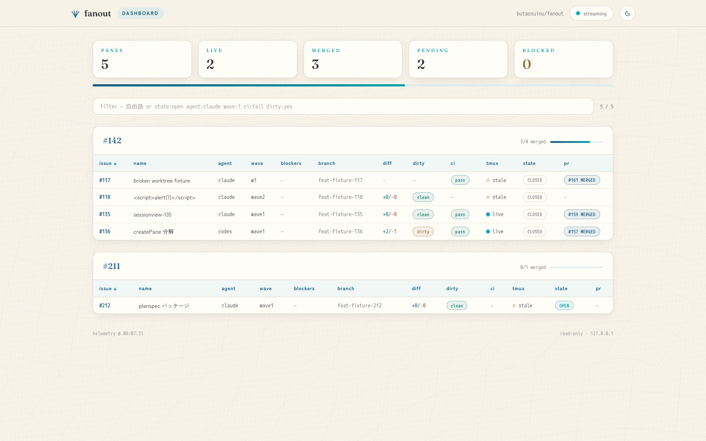

# fanout

[English](README.md) | [日本語](README.ja.md)

[](https://opensource.org/licenses/MIT)
[](https://github.com/butaosuinu/fanout/releases)
[](https://butaosuinu.github.io/fanout/ja/)

**tmux 向けの並列エージェントオーケストレーター。** GitHub の親 issue の OPEN な
サブ issue、あるいはローカルの plan spec を渡すと、子 issue / タスクごとに tmux
ペイン・git worktree・agent CLI(Claude Code / Codex)を立ち上げ、タスク単位の
briefing から起動します。再実行しても同じ対象に 2 つ目のペインは作られません
(`.fanout/state.json` が記憶します)。

📖 **ドキュメント:** <https://butaosuinu.github.io/fanout/ja/> — インストール、
クイックスタート、完全な CLI リファレンス、設定、トラブルシューティング(英語 /
日本語)。



## 機能

- **冪等なファンアウト** — `.fanout/state.json` が `(parent, issue)` ごとに
  ペインを管理するので、再実行しても作業が重複しません。
- **ペイン枠線ラベル** — 各ペインの上端枠線に親と名前を表示するので
  (例 `#123 · fix-login-bug-123`、`plan:my-feature · task-slug`)、tiled で
  並んでも見分けが付きます。
- **Wave 進行** — `--unblocked-only` がブロッカーを読み取り、unblock 済みの子
  だけをファンアウト。PR が merge されたら再実行すれば次の wave が開きます。
- **常駐 TUI コンソール** — 引数なしの `fanout` で、ペイン / issue / PR の
  ライブ表示に、コンパクトな Session ナビゲータ、focus・peek・terminal・
  lifecycle キー、消えた worktree ペインの自動復元を備えたコンソールを開き
  ます。新規 Session popup は自由記述 prompt または OPEN issue から開始でき、
  子ごとの agent 指定や `/fanout plan` による並列タスクへの分解もここで選べ
  ます。親 issue の fan-out では orchestrator ペインを project root に先に
  作ります。どのペインからでも `F11` / `prefix + T` でコンソールに戻れます。
  キー操作と popup の詳細は
  [モニタリングのドキュメント](https://butaosuinu.github.io/fanout/ja/docs/monitoring/)
  を参照してください。
- **Plan 先行の起動** — 新規 Session と issue の orchestrator は既定で agent の
  plan mode で始まり(codex の orchestrator は start gate と両立しないため、
  警告して素の codex で起動)、子は `childPlanMode` を on にしたときだけ
  plan mode になります。レーン別の 3 設定と agent ごとの挙動は
  [設定のドキュメント](https://butaosuinu.github.io/fanout/ja/docs/settings/)
  を参照してください。
- **ラベル watcher** — opt-in すると、TUI 常駐中に信頼できる `fanout:auto`
  issue を one-shot fanout session に投入します。
- **Web ダッシュボード** — localhost で動くダッシュボード(ライブ更新)。PR が
  紐付いた Session にはマージボタンが出ます。どのペインからでも `F12` または
  `prefix + D` でポップできます。記録済みペインからの同一 worktree 操作は
  `prefix + M` で開きます。
- **状態確認とレポート** — `--status` の JSON / table で PR review・CI 状態を
  確認でき、任意で親 issue にダッシュボードコメントを投稿します。
- **Lifecycle hook** — user config に書いた shell command を worktree、pane、
  merge event の前後で実行できます。
- **エージェント連携** — `/fanout` slash command と Claude Code & Codex 向けの
  skill をインストール時に同梱します。

## インストール

前提ツールは **git** と、既定 backend では **tmux 3.3+**。GitHub issue /
Project workflow と PR status / cleanup の確認には認証済みの
**GitHub CLI(`gh`)**(`gh auth status`)も必要です。子を起動する
agent CLI(**`claude`** / **`codex`** / **`opencode`**)は同梱されないため、
別途インストールしてください。

```bash
curl -fsSL https://raw.githubusercontent.com/butaosuinu/fanout/main/install.sh | sh
```

`fanout` バイナリ(既定で `~/.local/bin`。`PATH` に入れてください)と、同梱の
Claude/Codex 連携ファイルを配置します。バイナリのみのインストール、配置先の
変更、バージョン固定、アンインストール、チェックアウトからのビルド、そのほかの
前提条件(Project モードの gh スコープ)は
[インストールドキュメント](https://butaosuinu.github.io/fanout/ja/docs/installation/)
に記載しています。opt-in の
[herdr backend](https://butaosuinu.github.io/fanout/ja/docs/herdr-backend/)
は、tmux の代わりに fanout-owned な herdr session で同じファンアウトを実行します
(stable herdr 0.7.5 以上が必要で、tmux は不要)。issue / Project / plan /
watcher の launch、TUI の launch / focus / peek、`--merge` / `--close` /
`--cleanup`、`--team` のメッセージングは使えます。対話 send、restore、plan
capture は使えません。

## クイックスタート

tmux セッション内で、作業対象のリポジトリにて:

```bash
# 子の agent を一度だけ指定(各 run で --agent claude / --agent codex / --agent opencode を渡してもよい)
export FANOUT_AGENT=claude

fanout 123 --dry-run    # コマンドをプレビューし、worktree / ペイン / state / briefing は作らない
fanout 123              # issue #123 の OPEN な子をすべて個別ペインへファンアウト
fanout 123 --status     # ファンアウトした子の PR review + CI 状態を確認
```

引数なしの `fanout` で、現在のリポジトリの常駐 TUI コンソールを開きます。
再起動すると既存 state を読み、tmux 上に残っているペインへ再バインドし、消えた
worktree ペインは agent CLI を resume して作り直します。最初の実行は
[5 分クイックスタート](https://butaosuinu.github.io/fanout/ja/docs/quickstart/)
を参照してください。

## 仕組み

3 手 — **用意 → 展開 → 片づけ**:

1. **用意する。** 親 issue と OPEN な子 issue を作る(同梱の `fanout-issues`
   skill がブロッカーの wave を組み立ててくれます)か、issue を介さず plan spec
   を書いて `fanout plan` に渡します。
2. **展開する。** `fanout 123`(または `fanout plan spec.json`)を一回: 子 / タスク
   1 つ = worktree 1 つ = tmux ペイン 1 つ = agent 1 つ。
3. **片づける。** TUI または `--status` で進捗を見て、`--merge` / `--cleanup` で
   ペインを畳み、次の wave を開きます。

`fanout plan <spec>` は GitHub の子 issue ではなくローカルの plan spec を
ファンアウトし、`--team` + `fanout msg` は兄弟ペインに軽量な peer messaging を
与えます — 詳細は
[ワークフローのドキュメント](https://butaosuinu.github.io/fanout/ja/docs/workflow/)
を参照してください。

## 兄弟ペインメッセージング (fanout msg)

`--team` を付けた run は兄弟ペインメッセージングにオプトインします。各子の
briefing に協調セクションが加わり、ペインは parent ごとの SQLite バスに登録
されて、`fanout msg` の verb(`peers` / `inbox` / `board` / `send` / `post` /
`nudge`)で読み書きします。Plan Mode の Codex 子は最小の Plan briefing のまま
協調セクションが付きませんが、登録はされます。Plan Mode が優先され、Codex
team bridge は無効になります。メッセージはバスに永続化され、
各ペインが自分のチェックポイントで読みます。`claude` ペインと新規起動の非 Plan `codex`
ペインには、新着をそのまま届ける push レーンも載ります。push レーンの仕組み、
フォールバック、失敗時の回収は
[ワークフローのドキュメント](https://butaosuinu.github.io/fanout/ja/docs/workflow/)
を参照してください。

下の watcher モードとは別物です。あちらが見るのは GitHub のラベルで、
メッセージではありません。

## watcher モード

watcher は引数なしの TUI コンソールが開いている間だけ動きます。既定は off で、
有効化できるのは user config か環境変数だけです。repo config で checkout を
自動起動の対象にすることはできません。

```bash
# One shell
export FANOUT_WATCHER=1
export FANOUT_WATCHER_AGENT=codex
fanout
```

信頼できる issue に `fanout:auto` を付けると投入予約されます。次の cycle で
fanout はそのラベルを `fanout:running` に付け替え、OPEN 子が無い issue は standalone
pane として、OPEN 子がある issue は通常の parent fan-out として起動します。parent
fan-out は `--unblocked-only` を使います。watcher からの起動はすべて
`watcherMaxSessions` の対象になります。blocked child や session 上限により残りが
ある場合、fanout は `fanout:running` を `fanout:auto` に戻し、後続 cycle でその
parent を自動再試行します。

parent fan-out では、`fanout <parent> --merge <child>`、`--close`、`--cleanup` が
`fanout:running` を best-effort で外します。standalone watcher pane は TUI の
lifecycle key（`m`、`c`、`x`）で処理してください。公開 CLI の parent 引数では
予約 parent `@watch` の row を指定できません。standalone pane または完全 cleanup
済み parent を新しく投入するには、`fanout:auto` を付け直してください。label 付き
issue と、起動される OPEN child の本文は agent briefing になります。信頼できない
issue に trigger label を付けないでください。

この watcher は [#107](https://github.com/butaosuinu/fanout/issues/107) とは別レーンです。
watcher は repo 全体から label 付き issue を探し、one-shot session を起動します。
#107 は既知の親 issue 配下の子を skill 主体で継続巡回するループです。

## 日常コマンド

| コマンド | 内容 |
|---|---|
| `fanout 123 --agent claude` | 親の OPEN な子を並列ペインへファンアウト |
| `fanout 123 --unblocked-only` | ブロッカーが closed の子だけをファンアウト — 次の wave |
| `fanout 123 --dry-run` | git / tmux / state / briefing file を変更せず計画だけ表示 |
| `fanout plan spec.json --agent claude` | GitHub の子 issue でなくローカル plan spec をファンアウト |
| `fanout` | 常駐 TUI コンソールを起動(Session ジャンプ・数字ジャンプ 1-9・focus・zoom・peek・幅 80 桁未満のコンパクト switcher(`v`)・terminal・prompt / issue からの Session 起動・設定 popup (`s`)・同一 worktree への追加・復元・lifecycle キー) |
| `fanout 123 --status` | ペイン・PR review・CI 状態を JSON または table で |
| `fanout dashboard --web` | localhost で Web ダッシュボードを配信(PR のマージと、そのリモートブランチの削除以外は読み取り専用) |
| `fanout 123 --merge 4` | 子 branch を fast-forward merge(`--close` / `--cleanup` でペインを畳む) |

ファンアウト系のコマンドは子の agent が必要です — `--agent claude` / `--agent codex` /
`--agent opencode` を渡すか `FANOUT_AGENT` を設定してください(status・dashboard・lifecycle 系の
`--status` / `dashboard` / `--merge` には不要)。
すべての flag・環境変数・exit code は
[CLI リファレンス](https://butaosuinu.github.io/fanout/ja/docs/cli/)に記載しています。

## エージェント連携

`make install`(およびインストールスクリプト)は、`/fanout` slash command と
一連の skill を `~/.claude/` と `~/.codex/` に配置します。これにより Claude Code
と Codex は fanout が使える場面を認識し、`--dry-run` でプレビューしてから、確認の
あとに実行できます。fanout 自身は LLM を呼びません — skill が issue の文脈から
flag を生成します。詳しくは
[エージェント連携のドキュメント](https://butaosuinu.github.io/fanout/ja/docs/agents/)
を参照してください。

## 開発要件

チェックアウトからビルドする場合は Go 1.26.6+、Node.js 24+、pnpm 11+ が
必要です(curl インストールはビルド済みバイナリを配るのでいずれも不要)。

## 開発

```bash
make build-go   # web バンドル + ./fanout-go CLI をビルド
make check      # 正典のローカル全体ゲート: test + lint + lint-web
make test       # Go ユニットテスト + web vitest + bats ブラックボックス tier
make lint       # golangci-lint v2 + shellcheck
make lint-web   # oxlint + oxfmt --check + TypeScript 型チェック
```

リポジトリのアーキテクチャと保守メモは [CLAUDE.md](CLAUDE.md) を参照してください。

## ライセンス

本プロジェクトは [MIT License](LICENSE) の下でライセンスされています。
