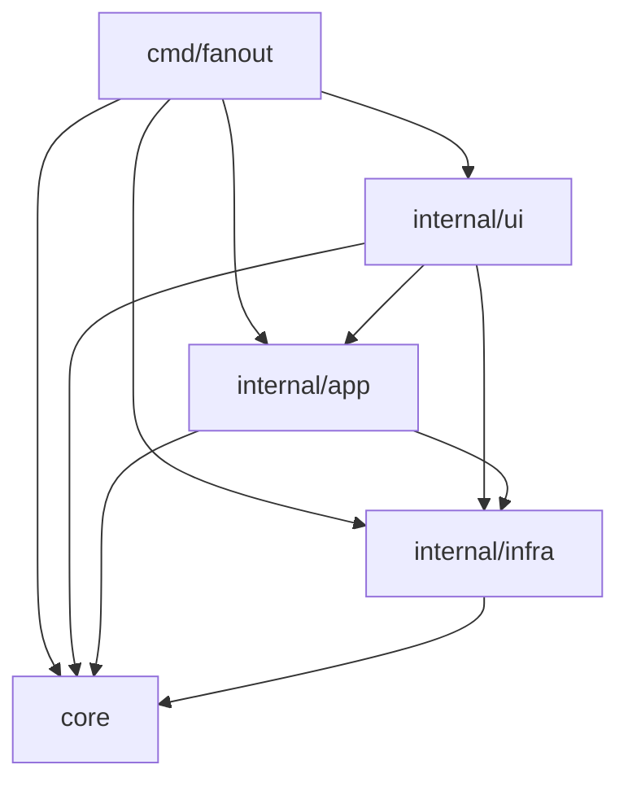

# アーキテクチャ: 4 層構成

`internal/` は `core` / `app` / `infra` / `ui` の 4 層と、層ルールを強制する
`internal/arch` からなる。`cmd/fanout` はどの層からも import されない
composition root。層ルールの正典実装は `internal/arch/arch_test.go` で、この
文書はその読み方と、PR レビューでどこまで人間が見るかの運用ルールをまとめる。

## 層の責務と依存ルール

| 層 | 責務 | import してよい層 | stdlib 純度 |
|---|---|---|---|
| `core` | 純粋ロジック。プロセス起動・ネットワーク・ファイル I/O・DB を持たない | core のみ | `os` / `os/exec` / `net` / `net/http` / `syscall` / `database/sql` / `io/ioutil` 禁止(例外: `core/agent` は `os`+`os/exec`、`core/planspec` は `os` を許可) |
| `app` | ユースケースのオーケストレーション | core / app / infra | 制約なし |
| `infra` | 外部プロセス・ファイルシステム・DB | core / infra | 制約なし |
| `ui` | TUI・web ダッシュボード | core / app / infra / ui | 制約なし |
| `cmd` | composition root(`cmd/fanout`) | core / app / infra / ui | import される側になってはならない — 他パッケージからの `cmd/...` import は全面禁止 |

依存の向きは一方向で、`ui -> app -> core` が主経路、`app` と `ui` はどちらも
`infra` に直接手を伸ばせる。強制するのは `internal/arch` の Go テスト
(`TestLayerImportDirection` ほか)。`.golangci.yml` は depguard をノイズが
多いとして無効化しているため、層制約の CI ガードはこのテストだけである。

## 依存図

## パッケージ表

Review クラスは PR レビューの重さを決める。**H を触る PR は人間レビュー必須。
A のみの PR は AI レビューで可**。M はどちらも変更内容次第で判断する。

| 層 | パッケージ | 責務 | Class |
|---|---|---|---|
| meta | `arch` | 層ルールの CI 強制(唯一のガード)。緩和・allowlist 追加は要精査 | H |
| infra | `state` | `.fanout/state.json` と lock の読み書き | H |
| infra | `worktree` | base branch 解決・refresh・`git worktree add` | H |
| infra | `hooks` | ライフサイクルフック実行 | H |
| infra | `selfupdate` | 自己アップデート | H |
| infra | `team` | `--team` / `fanout msg` の SQLite バス | H |
| infra | `settings` | 設定解決。repo config からの watcher 有効化・通知先設定を遮断する安全ゲート | H |
| app | `watch` | ラベル watcher の 1 サイクル | H |
| app | `briefing` | エージェントに注入するプロンプト本文の生成 | H |
| app | `lifecycle` | `--close` / `--merge` / `--cleanup` | H |
| app | `panelaunch` | pane 生成オーケストレーション | H |
| ui | `dashboard`(`server.go`) | localhost web サーバの mux・token 検証 | H |
| ui | `dashboard`(`runfile.go`) | token を含む `.fanout/dashboard.json`・reuse/trust ゲート | H |
| ui | `dashboard`(`peek.go` / `plan.go`) | capture-pane 前の検証チェーン(記録済み pane 以外の端末出力を読まない境界) | H |
| ui | `tui`(`actions.go`) | lifecycle(close/merge/cleanup)実行の配線と確認フロー | H |
| cmd | `main.go` / `tui_popup.go` / `tui_launch.go` / `worktree_action.go` / `codex_plan_tui.go` / `tui_restore.go` / `tui_watch.go` | dispatch・self-exec・launch 配線・pane identity 検証・state 書き換えを伴う復元/watch 起動 | H |
| cmd | 上記以外(`plancmd.go` / `status.go` / `lifecycle.go` / `msg.go` / `dashboard.go` / `tui_issue.go` / `deps.go` ほか) | フラグ検証と app 層への薄い dispatch | M |
| infra | `ghissue` | GitHub issue/PR の読み書き(label swap・dashboard comment 投稿などの mutation を含む) | M |
| infra | `gitstat` | git 差分・状態取得 | M |
| infra | `tmuxrun` | tmux 直接操作 | M |
| infra | `msgstore` | send/post/inbox/board/mark-read | M |
| infra | `notify` | 通知送出 | M |
| infra | `runtime` | git root・tmux ターゲット解決 | M |
| infra | `displayname` | 表示名生成 | M |
| infra | `codexapp` | Codex app-server クライアント | M |
| infra | `atomicfs` | 原子的ファイル書き込み(state.json / token 入り dashboard.json の共通経路) | M |
| infra | `gitroot` | git root 探索(project root・state root・親 repo 判定の入力) | M |
| app | `panelayout` | ペインレイアウト計算 | M |
| app | `sessionview` | state + tmux + gh を集約する Snapshot | M |
| app | `run` | `executePlan` の実行ロジック | M |
| app | `statusreport` | `--status` のレポート生成 | M |
| app | `peermsg` | `fanout msg` の実行層 | M |
| app | `cliflags` | フラグ検証(lifecycle 相互排他・親正規化など main の分岐を決める) | M |
| core | `agent` | エージェント名の解決・CLI 検証 | M |
| core | `planspec` | `fanout plan` の JSON スキーマ | M |
| core | `naming` | slug・branch 名生成(worktree/branch identity を決める) | M |
| core | `parentref` | 親参照の正規化(state/sessionview の parent key) | M |
| core | `fanset` | fan-out 対象集合の計算(launch 対象の選別) | M |
| core | `blockers` | ブロッカー判定(--unblocked-only の起動対象選別・wave 計算の入力) | M |
| ui | `dashboard`(`poller.go` / `sse.go` / `embed.go`) | state/tmux ポーリング・SSE・embed | M |
| ui | `tui`(描画・整形以外: `update.go` / `keyboard.go` / `newpane*.go` / `issues.go` / `watch.go` / `paneview.go` ほか) | キー処理・フォーム・ポーリングの配線。`paneview.go` は lifecycle 対象 state root の選択入力(`sourceProjectRoot`)を含む | M |
| core | `exitcode` | 終了コード定義 | A |
| core | `cliview` | CLI 出力の整形 | A |
| ui | `tui`(描画・整形: `view.go` / `compact.go` / `styles.go` ほか) | TUI の View 層 | A |
| infra | `log` | ロギング | A |
| infra | `tty` | 端末判定 | A |
| infra | `execx` | コマンド実行の薄いラッパ | A |
| infra | `browser` | ブラウザ起動 | A |
| web | `web/index.html` | no-referrer・外部 fetch 方針(token 漏洩境界) | H |
| web | `web/src/hooks` / `web/src/lib` | SSE/polling transport・token 付き `/api/*` 呼び出し | M |
| web | 上記以外の `web/src`(components / styles / tests) | 表示 | A |

## 人間必見の不変条件カタログ

- **state lock の順序と原子性**: `.fanout/state.json.lock` はプランニングと
  起動の両方をカバーする。ロック区間を狭めると `(parent, issueNum)` の
  idempotency が壊れる。
- **worktree refresh は user work を壊さない**: base branch が dirty / ahead /
  diverged なら強制更新せず fail する。
- **watch のトリガーラベルはプロンプトインジェクション境界**: issue 本文が
  そのまま子 briefing になるため、`watcherTriggerLabel` の対象を広げる変更は
  攻撃面を広げる。
- **dashboard は read-only・GET-only・localhost**: `127.0.0.1` バインドと
  mutation エンドポイント禁止は全経路。token 必須は `/api/*` のみ
  (`requireToken`)で、`/healthz` と SPA 配信は token-free(HTML shell が
  `?token=` を読むため)。この token-free 範囲を広げる変更も狭める変更も
  人間レビュー対象。
- **briefing はエージェントに注入されるプロンプト本文**: `briefing.Render` /
  `RenderTask` の出力はそのままエージェントの入力になる。
- **self-exec サブコマンド名の固定**: `__tui-new-pane-popup` /
  `__tui-help-popup` / `__codex-plan-tui` は `TestSelfExecSubcommandNames` が
  文字列を固定する。dispatch と popup 起動は単一定数を参照するが、
  `infra/codexapp/launch.go` の起動コマンド生成はリテラル埋め込みが残る
  (burn-down 参照)。名前を変えると実行中バイナリの popup / Plan Mode
  連携が壊れるため、変更時は 3 参照元すべての追随が要る。
- **ldflags は `-X main.version` 名指し**: バージョン注入変数は
  `cmd/fanout/main.go` の変数名に固定されており、リネームするとリリース
  ビルドが壊れる。
- **`FANOUT_*` env 名は Go 外から文字列参照される**: シェルスクリプト・CI・
  ドキュメントが env 変数名を直接引用するため、リネームは全参照箇所の同時
  更新が要る。

## 既知の残課題(burn-down リスト)

- `internal/infra/team/path_test.go` が `internal/app/briefing` を import
  している(infra -> app)。DB パスと `briefing.Path` が同じ親 slug を導出する
  ことを固定した副作用で、`internal/arch` の `legacyDirectionAllowlist` に
  登録済み。フィクスチャを decouple すれば解消できる。
- `state` パッケージは `Store` 型と `Load`/`Save` の IO が同居している。
- `sessionview` は純粋な集約ロジックと `Collectors` の IO 束が同じパッケージ
  にある。
- `shellQuote` の実装が `app/run` / `app/panelaunch` / `infra/tmuxrun` の
  3 箇所にある。
- `infra/codexapp/launch.go` の起動コマンド生成が `__codex-plan-tui` を
  リテラル埋め込みしている(`PlanTUICommand` 定数への統一が未了)。
- `app` から `infra` への直接 import は既存分を容認するが、新規コードは
  `watch.IO` のような port 経由を優先する。

## 新規パッケージの追加手順

1. `internal/<layer>/` 配下に置く。`internal/` 直下への追加は
   `TestInternalTreeShape` が拒否する。
2. 層ルールに合わない import は `internal/arch` の CI が落とす。
3. この文書の「パッケージ表」に層・責務・Review クラスを追記する。
