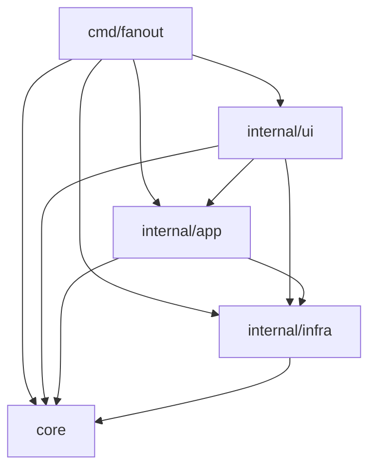

# アーキテクチャ: 4 層構成

`internal/` は `core` / `app` / `infra` / `ui` の 4 層と、層ルールを強制する
`internal/arch` からなる。`cmd/fanout` はどの層からも import されない
composition root。層ルールの正典は `internal/arch/godep-cruiser.json`
(godep-cruiser のルール定義。runner と実ディレクトリ検査は
`internal/arch/arch_test.go`)で、この文書はその読み方と、PR レビューで
どこまで人間が見るかの運用ルールをまとめる。

## 層の責務と依存ルール

| 層 | 責務 | import してよい層 | stdlib 純度 |
|---|---|---|---|
| `core` | 純粋ロジック。プロセス起動・ネットワーク・ファイル I/O・DB を持たない | core のみ | `os` / `os/exec` / `net` / `net/http` / `syscall` / `database/sql` / `io/ioutil` 禁止(例外: `core/agent` は `os`+`os/exec`、`core/planspec` は `os` を許可) |
| `app` | ユースケースのオーケストレーション | core / app / infra | 制約なし |
| `infra` | 外部プロセス・ファイルシステム・DB | core / infra | 制約なし |
| `ui` | TUI・web ダッシュボード | core / app / infra / ui | 制約なし |
| `cmd` | composition root(`cmd/fanout`) | core / app / infra / ui | import される側になってはならない — 他パッケージからの `cmd/...` import は全面禁止 |
| `tools` | repo 支援メタツール(PR review risk 判定など製品コード外) | tools のみ(本体層は import 不可・被 import も不可) | stdlib のみ(arch ガードが強制) |

依存の向きは一方向で、`ui -> app -> core` が主経路、`app` と `ui` はどちらも
`infra` に直接手を伸ばせる。強制するのは `internal/arch` の Go テスト
(`TestArchitecture` が `internal/arch/godep-cruiser.json` のルールを
[godep-cruiser](https://github.com/butaosuinu/godep-cruiser) の archtest で
実行する。方向マトリクスは allowed ルールで fail-closed、既知の例外は
`godep-cruiser-baseline.json` に隔離され、違反が消えると stale エラーで
強制削除される)。`.golangci.yml` は depguard をノイズが多いとして無効化して
いるため、層制約の CI ガードはこのテストだけである。2026-07 の初回調査では
外部ツール(go-arch-lint / arch-go など)を不採用にしたが、再評価条件を
godep-cruiser v0.3.0 が満たしたため同月に採用へ改訂した。経緯は
`docs/arch-test-tools.ja.md`。

## 依存図

## パッケージ表

Review クラスは PR レビューの重さを決める。**H を触る PR は人間レビュー必須。
A のみの PR は AI レビューで可**。M はどちらも変更内容次第で判断する。

| 層 | パッケージ | 責務 | Class |
|---|---|---|---|
| meta | `arch` | 層ルールの CI 強制(唯一のガード)。緩和・allowlist 追加は要精査 | H |
| infra | `state` | `.fanout/state.json` と git common directory の Herdr intent journal、各 lock の読み書き | H |
| infra | `worktree` | base branch 解決・refresh・`git worktree add`、branch ref の atomic 予約 (compare-and-delete) と checkout 観測 | H |
| infra | `hooks` | ライフサイクルフック実行 | H |
| infra | `selfupdate` | 自己アップデート | H |
| infra | `team` | `--team` / `fanout msg` の SQLite バス | H |
| infra | `settings` | 設定解決。repo config からの watcher・runtime backend 有効化と通知先設定を遮断する安全ゲート | H |
| infra | `herdrrun` | herdr stable 0.7.5 以上の version gate、fanout-owned session lifecycle、non-shell agent launcher、workspace/worktree mutation・表示専用 metadata 報告・snapshot 投影の実装 (契約 DTO は `core/backend` 所在) | H |
| infra | `paneruntime` | runtime backend の選択入力収集・解決・具象構築・self-exec registry・telemetry observer。具象 backend 構築の集約点(型参照の残債は invariant 参照) | H |
| core | `backend` | runtime backend 契約(mutation が局所原子か journaled かを宣言する MutationModel を含む)と中立 DTO 語彙 (launch route / workspace・worktree mutation / process・wait / metadata / nudge / owned pane identity と sentinel error 群)・親 stickiness・選択優先順位・矛盾時の fail-closed 判定 | H |
| app | `watch` | ラベル watcher の 1 サイクル | H |
| app | `briefing` | エージェントに注入するプロンプト本文の生成 | H |
| app | `lifecycle` | `--close` / `--merge` / `--cleanup` | H |
| app | `panelaunch` | pane 生成のオーケストレーション。backend の MutationModel で atomic lane と journaled lane(coordinator/worktree/agent launch)を選ぶ | H |
| app | `agentprocess` | 保存済み launch と現在の agent process identity の照合 | H |
| app | `stateemitter` | launch に束縛した telemetry の検証と state lock 下の更新 | H |
| app | `sessionbinding` | 遅延 Herdr agent session の初回束縛と state lock 下の保存 | H |
| core | `telemetry` | emitter command と環境変数の wire contract | H |
| ui | `dashboard`(`server.go`) | localhost web サーバの mux・token 検証 | H |
| ui | `dashboard`(`runfile.go`) | token を含む `.fanout/dashboard.json`・reuse/trust ゲート | H |
| ui | `dashboard`(`diff.go`) | snapshot の安定 row identity で選んだ worktree diff の read-only 配信・request-wide 上限 | H |
| ui | `dashboard`(`peek.go` / `plan.go`) | capture-pane 前の検証チェーン(記録済み pane のみ。`plan.go` は plan mode かつ codex に限定) | H |
| ui | `tui`(`actions.go`) | lifecycle(close/merge/cleanup)実行の配線と確認フロー | H |
| cmd | `main.go` / `runtime_backend.go` / `tui_popup.go` / `tui_launch.go` / `worktree_action.go` / `codex_plan_tui.go` / `codex_team_tui.go` / `tui_restore.go` / `tui_watch.go` | dispatch・runtime backend 選択・self-exec・launch 配線・pane identity 検証・state 書き換えを伴う復元/watch 起動 | H |
| cmd | 上記以外(`plancmd.go` / `status.go` / `lifecycle.go` / `msg.go` / `dashboard.go` / `tui_issue.go` / `deps.go` ほか) | フラグ検証と app 層への薄い dispatch | M |
| infra | `ghissue` | GitHub issue/PR の読み書き(label swap・dashboard comment 投稿などの mutation を含む) | M |
| infra | `gitstat` | git 差分・状態取得 | M |
| infra | `tmuxrun` | tmux 直接操作 | M |
| infra | `tmuxbackend` | backend 契約から `tmuxrun` への adapter(window レイアウトの grid 方針と tmux custom layout 文字列、popup / global shortcut / viewer focus の host capability、console の session 入場 ConsoleHost、pane の中から自分の state を申告する AgentStateReporter と描画テキストを返す PlanCapture も担当) | M |
| infra | `msgstore` | send/post/inbox/board/mark-read | M |
| infra | `notify` | 通知送出 | M |
| infra | `runtime` | git root・選択済み backend の起動コンテキスト解決。具象 backend を持たない(env と `tmux` の探索だけ)ので `paneruntime` には畳まない — `Info` は `app/run` と `app/panelaunch` の型で、畳むと app が具象 backend を推移的に抱える | M |
| infra | `displayname` | 表示名生成 | M |
| infra | `codexapp` | Codex app-server クライアント(Plan Mode 制御・team メッセージブリッジ) | M |
| infra | `atomicfs` | 原子的ファイル書き込み(state.json / token 入り dashboard.json の共通経路) | M |
| infra | `gitroot` | git root 探索(project root・state root・親 repo 判定の入力) | M |
| app | `sessionview` | state + runtime backend + gh を集約する Snapshot | M |
| app | `run` | `executePlan` の実行ロジック | M |
| app | `statusreport` | `--status` のレポート生成 | M |
| app | `peermsg` | `fanout msg` の実行層 | M |
| app | `cliflags` | フラグ検証(lifecycle 相互排他・親正規化など main の分岐を決める) | M |
| core | `agent` | エージェント名の解決・CLI 検証 | M |
| core | `planspec` | `fanout plan` の JSON スキーマ | M |
| core | `naming` | slug・branch 名生成(worktree/branch identity を決める) | M |
| core | `parentref` | 親参照の正規化(state/sessionview の parent key) | M |
| core | `fanset` | fan-out 対象集合の計算(launch 対象の選別) | M |
| core | `blockers` | ブロッカー判定(--unblocked-only の起動対象選別・wave 計算の入力) | M |
| ui | `dashboard`(`poller.go` / `sse.go` / `embed.go`) | state/runtime ポーリング・SSE・embed | M |
| ui | `tui`(描画・整形以外: `update.go` / `keyboard.go` / `newpane*.go` / `issues.go` / `watch.go` / `paneview.go` ほか) | キー処理・フォーム・ポーリングの配線。`paneview.go` は lifecycle 対象 state root の選択入力(`sourceProjectRoot`)を含む | M |
| core | `exitcode` | 終了コード定義 | A |
| core | `cliview` | CLI 出力の整形 | A |
| core | `errs` | エラーラップの共有ヘルパ(`docs/error-handling.ja.md`) | A |
| ui | `tui`(描画・整形: `view.go` / `compact.go` / `styles.go` ほか) | TUI の View 層 | A |
| infra | `log` | ロギング | A |
| infra | `tty` | 端末判定 | A |
| infra | `execx` | コマンド実行の薄いラッパ | A |
| infra | `browser` | ブラウザ起動 | A |
| infra | `backendtest` | core backend 契約の in-process fake(テスト専用・本体にはリンクされない) | A |
| tools | `tools/reviewrisk` | PR review risk 判定(物差し。ルール変更はレビュー配線を変える) | H |
| web | `web/index.html` | no-referrer・外部 fetch 方針(token 漏洩境界) | H |
| web | `web/src/transport` | SSE/polling transport・token 付き `/api/*` 呼び出し | M |
| web | `web/src/shared/github.ts` | GitHub URL の検証つき生成(href 安全性境界) | M |
| web | `web/src/features/diff/diff.ts` | patch パースと描画上限(敵性 patch のガード) | M |
| web | 上記以外の `web/src`(app / features / ui / shared / styles / tests) | 表示 | A |

## 人間必見の不変条件カタログ

- **state lock の順序と原子性**: `.fanout/state.json.lock` はプランニングと
  起動の両方をカバーする。ロック区間を狭めると `(parent, issueNum)` の
  idempotency が壊れる。
- **Herdr intent は repository 共通**: linked worktree 間の Herdr intent 行は
  git common directory の `fanout/herdr-intents.json` とその lock を使う。
  ファイルは `.fanout/state.json` と同水準の atomic replace で書き、読取時の
  owner / mode / identity 検査は持たない。
  agent launch の final row は owning worktree の `state.json` pane row として
  確定する(tmux backend と同じ所在)。intent 保存から branch 予約、socket
  mutation、launcher の marker/token handshake、agent identity の事後確認、
  final row の保存と intent の消費まで lock を保持する。tmux agent launch も
  state 更新が終わるまで同じ lock を保持する。発行済み mutation は再発行せず、
  label nonce と Git 事後条件を一意に確認できない場合は
  `manual_cleanup_required` にする。issue-less plan の intent は physical
  owner root を ID に含め、同じ slug を使う別の linked worktree には backend
  binding として投影しない。
  launch 時に `agent_session` が nil だった final row は、`sessionbinding` が
  exact route / terminal / provider / worktree と一意な ref を state lock 下で
  再照合して初回だけ保存する。保存後は ref の完全一致を要求する。
- **worktree refresh は user work を壊さない**: base branch が dirty / ahead /
  diverged なら強制更新せず fail する。
- **watch のトリガーラベルはプロンプトインジェクション境界**: issue 本文が
  そのまま子 briefing になるため、`watcherTriggerLabel` の対象を広げる変更は
  攻撃面を広げる。
- **dashboard は read-only・GET-only・localhost**: `127.0.0.1` バインドと
  mutation エンドポイント禁止は全経路。token 必須は `/api/*` のみ
  (`requireToken`)で、`/healthz` と SPA 配信は token-free(HTML shell が
  `?token=` を読むため)。この token-free 範囲を広げる変更も狭める変更も
  人間レビュー対象。
- **briefing はエージェントに注入されるプロンプト本文**: `briefing.Render` /
  `RenderTask` の出力はそのままエージェントの入力になる。
- **具象 backend の構築は `infra/paneruntime` に集約**: 選択入力の収集・
  precedence 解決・具象構築・self-exec registry・telemetry observer をここに
  集める。`internal/app` は core の backend 型と自分の port しか名指さず、
  `cmd/fanout` は `paneruntime` 経由で組み立てる。別の層に `switch` を増やすと
  runtime 追加のたびに散らばった分岐を数える羽目になる。`internal/app` と
  `cmd` からの辺は godep-cruiser の `app-no-runtime-adapters` /
  `cmd-no-runtime-adapters` が禁じる(test は対象外 — 実 adapter の挙動を
  直接ドライブする test があるため)。infra 内で adapter を import できる
  package も `infra-no-new-adapter-importers` /
  `infra-no-new-tmuxrun-importers` で閉じている(backend 形の adapter は
  paneruntime と adapter 自身のみ、tmuxrun はさらに notify の通知送出
  `notify.go` の 1 辺だけ)ので、中立名の中継 package で具象 backend を
  app へ運ぶ迂回も新規 importer の登録なしには通らない。
  `internal/ui` はまだ辺が残るのでルール化していない(burn-down リスト参照)。
- **runtime ごとの差は capability の有無で表す**: console の入場経路
  (`ConsoleHost` があれば session を立てて端末を繋ぐ、無ければ owned session の
  attach コマンドを渡す)、restore の配線(`RestoreOps`)、popup / global
  shortcut / viewer focus、pane の中からの自己申告(`AgentStateReporter` /
  `PlanCapture`)はいずれも backend 名の判定ではなく capability の有無で選ぶ。
  launch lane そのものは名前でも capability でもなく backend が宣言する
  `MutationModel` が選ぶ — liveness key・start gate・workspace close はどれも
  lane の identity 契約であって runtime の表示名ではない。`backend.Tmux` /
  `backend.Herdr` の比較が残ってよいのは、保存済み行や launch 環境が記録した
  runtime 名を読む場所だけ。
- **self-exec サブコマンド名の固定**: `__tui-new-pane-popup` /
  `__tui-help-popup` / `__tui-close-popup` / `__codex-plan-tui` /
  `__codex-team-tui` は
  `TestSelfExecSubcommandNames` が文字列を固定する(`__tui-settings-popup` は
  dispatch と popup 起動に実在するがテスト未登録)。dispatch・popup 起動・
  `infra/codexapp/launch.go` の起動コマンド生成は単一定数を参照する
  (launch.go のリテラル埋め込みは #501 で解消。`codex_plan_tui.go` /
  `codex_team_tui.go` の usage 文字列にはリテラルが残る)。`__codex-plan-tui` /
  `__codex-team-tui` を変えると実行中バイナリの Plan Mode / team ブリッジ連携が
  壊れる。
- **ldflags は `-X main.version` 名指し**: バージョン注入変数は
  `cmd/fanout/main.go` の変数名に固定されており、リネームするとリリース
  ビルドが壊れる。
- **`FANOUT_*` env 名は Go 外から文字列参照される**: シェルスクリプト・CI・
  ドキュメントが env 変数名を直接引用するため、リネームは全参照箇所の同時
  更新が要る。
- **app / cmd は runtime 名を綴らない**: `cmd/fanout` と `internal/app` の
  非 test コードは、識別子・import path・ファイル名・struct tag に `tmux` /
  `herdr` を含めない(`TestRuntimeVocabulary`)。runtime の選択は
  `core/backend` の capability と `MutationModel` で表現し、具象 adapter の
  構築は `infra/paneruntime` が持つ。import の辺自体は godep-cruiser の
  `app-no-runtime-adapters` / `cmd-no-runtime-adapters` が塞ぐ。
  文字列リテラルとコメントは対象外 — 運用者に見せる文字列や runtime の
  挙動を説明するコメントは正当で、数が桁違いに多い。例外は
  `internal/arch/runtime-vocabulary-allow.json` に理由付きで登録する
  (`fanout herdr` サブコマンド、data として読む `backend.Tmux`/`Herdr`、
  `paneruntime.NewTmux`、PATH 上の実行ファイル名、凍結済みの dashboard
  JSON wire key)。マッチしないエントリは stale として落ちる。

## 既知の残課題(burn-down リスト)

- `state` パッケージは `Store` 型と `Load`/`Save` の IO が同居している。
- `sessionview` は純粋な集約ロジックと `Collectors` の IO 束が同じパッケージ
  にある。
- POSIX shell quote が同一アルゴリズムで 4 箇所にある:
  `core/backend.PreviewQuote` / `core/agent.ShellQuote` / `app/run.ShellQuote`
  / `infra/tmuxrun.shellQuote`。dry-run preview 側は解消済みで、
  `app/panelaunch.shellQuote` は `PreviewQuote` への委譲 1 行になっている。
  `infra/herdrrun.shellQuote` は常時 quote する別アルゴリズムで、これは重複
  ではない。
- `internal/ui` から `infra/tmuxrun` への直接 import が 4 本残る
  (`ui/tui/{issues,tui}.go`、`ui/dashboard/{server,peek}.go`)。app / cmd は
  capability 経由に寄せ切って godep-cruiser で塞いだが、ui は未着手のため
  `ui-no-runtime-adapters` を入れていない。辺が消えた時点でルールを足す。
- `LivePane` が `core/backend` と `infra/tmuxrun` に二重定義されている。
  tmuxrun 側は tmux 固有 field を持つが、大半は core 側と同じ形なので
  統合候補。
- close の結果型が `backend.ClosePaneStatus`(Closed/Stale/Failed)と
  `backend.CloseStatus`(Confirmed/Stale/Failed)に分かれている。
  `tmuxbackend.CloseOwned` が 1 対 1 で写しているだけなので畳める。
- `core/agent/claude_hooks.go` が `tmux set-option` のコマンド文字列を
  `infra/tmuxrun.AgentStateSetCommand` と重複して持つ。core は infra を
  import できないための意図的な重複で、両者は byte-exact テストで同期して
  いる。backend が `AgentStateCommand` を capability として渡せるように
  なれば解消できる。
- `app` から `infra` への直接 import は既存分を容認するが、新規コードは
  `watch.IO` のような port 経由を優先する。具象 runtime adapter
  (`tmuxrun` / `tmuxbackend` / `herdrrun`)への辺だけは容認をやめ、
  godep-cruiser のルールで塞いだ。
- `WorkspaceObservation` → `state.RuntimeResource` の投影が 3 箇所に
  手書きされている(`panelaunch` の stateResource と `lifecycle` の 2 変種)。
  path の `filepath.Clean` 有無が揃っておらず、共有投影を `state` 側に
  1 本置けば畳める(コード内コメントでも追跡中)。
- `PaneDecorator` は tmuxrun の setter 5 本の 1:1 転写で、呼び出し側が毎回
  5 連続 best-effort 呼びを並べる。`DecoratePane(PaneDecoration{...})` の
  構造体 1 発に畳む余地がある(tmux 側のみの整理で可)。
- `PaneProcess` / `PaneProcessInfo` の JSON wire tag が core に同居している
  (唯一の (de)serializer は herdrrun)。decoder 側の非公開 wire struct へ
  移せば core から herdr のワイヤ形式が消える。
- `ManagedLaunchRuntime.MetadataReportBudget()` は定数を返すだけの getter で、
  呼び出し側は値をそのまま同じ runtime の `ReportMetadata` に返している。
  budget の適用を `ReportMetadata` 内へ移せば port からメソッドを 1 本
  減らせる。

## 新規パッケージの追加手順

1. `internal/<layer>/` 配下に置く。`internal/` 直下への追加は
   `TestInternalTreeShape` が拒否する。
2. 層ルールに合わない import は `internal/arch` の CI が落とす。
3. この文書の「パッケージ表」に層・責務・Review クラスを追記する。
4. クラスの追加・変更は `tools/reviewrisk/rules.go` のルール表を同時更新する
   (docsync テストが不一致を CI で落とす)。詳細は `docs/review-risk.ja.md`。
