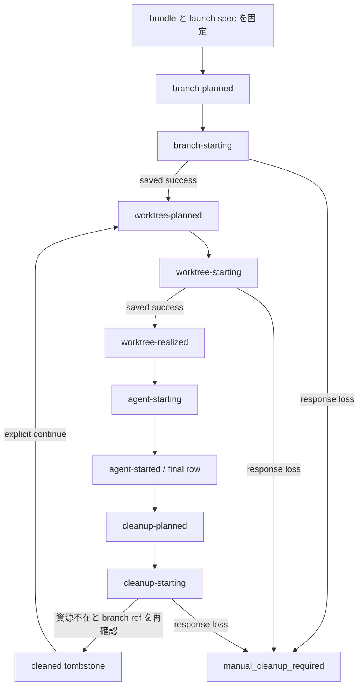

# herdr runtime backend 実機検証

ステータス: 0.7.5 wave 2 の実機検証を完了し、pane-targeted surface を使う fanout-owned herdr session の実装を解禁する。
判断主体はユーザー、floor 0.7.5 への改訂日は 2026-07-22 JST である。
この判断は後続 issue の実装条件を定めるものであり、この PR はコードを変更しない。
0.7.5 core runtime matrix と live-agent surface、0.7.4 metadata token reporting と sidebar row layout は実測済みである。
この文書の日付は日本標準時（JST、UTC+09:00）で記す。
core runtime の検証日は 2026-07-16、2026-07-21、2026-07-22、metadata token reporting と sidebar row layout の追試日は 2026-07-17 である。
0.7.3 と 0.7.4 は protocol `16`、0.7.5 は protocol `17` であり、schema version はすべて `1` である。
関連分析の「0.7.4 wave 2」は 2026-07-21 の旧判断を時系列で残した段落であり、その直後に記録された 0.7.5 breaking change と floor 改訂が優先する。
後続実装が従う current contract はこの文書である。

fanout の herdr backend wave 2 は CLI-first とし、集約読みには CLI wrapper の `herdr api snapshot` を使う。
raw Socket client は実装しない。
version / session / schema の検査後、snapshot / list / wait、targeted read、owned server の bootstrap、launch、cleanup、focus、emitter、metadata、自動 nudge を後続実装へ解禁する。
自動 mutation は provisional intent と phase machine、nonce の二重照合、branch の atomic reservation、事後条件検査、no-blind-retry を通す。
linked worktree 間の intent、console、final row、telemetry routing は canonical git common directory 配下の単一 Herdr control registry を正典とし、worktree-local `state.json` へ分散しない。
commit を持つ child の cleanup は branch lineage を tombstone として残し、明示的なユーザー操作だけが保持 tip から新しい launch 世代を作る。
owned XDG の config と plugin registry に予期しない setup hook があれば launch 前に fail closed にする。
Herdr、fanout launcher、console shell、agent の実行物は workspace mutation 前に owned content-addressed launch bundle へ固定し、exact token 後は sealed bundle だけを起動する。
provider hook の signal は agent process から偽造できる協調 telemetry とし、tmux backend と同じ nudge gate には使うが、完了判定または cleanup の根拠には使わない。
自動 nudge は current launch に束縛された fresh provider signal と送信直前の live process identity を照合した後だけ、tmux の `shouldNudge` と同じ条件で `agent prompt` を一回発行する。
`codexPlanMode` は恒久除外を撤回し、fanout-owned non-shell launcher が絶対パスの `fanout __codex-plan-tui` を root pane 内で起動する。
その実装は #528、#529、#544 の導入後の別 issue とする。
pane 消滅または 0.7.5 direct-launch row の `terminal_id` 変化は `stale` とする。
0.7.4 Codex integration v6 の resume 実測は履歴として残すが、0.7.5 direct launch の resume には流用しない。
session identity の read と mutation は別の CLI 接続になるため、直前の version / identity 検査だけでは mutation の対象を束縛できない。
0700 directory、0600 socket、fanout 側の ownership marker は別 UID を排除するが、同一 UID の agent を排除せず、mutation authority にはならない。
tmux backend も同一 UID の agent が server 停止、他 pane への `send-keys`、state signal の偽造を実行できる協調プロセス信頼を前提に launch、cleanup、nudge を提供している。
fanout-owned private socket は影響範囲を fanout 所有 session に閉じるため、tmux-parity tier ではこの残余リスクを受容する。
request-bound generation と conditional mutation、server-authenticated controller capability、server / agent の UID 分離は、herdr が primitive を提供した場合に proof-grade tier へ格上げする条件として保持する。

## 採用判断

| 対象 | wave 2 の判断 | 理由 |
|---|---|---|
| owned server | Go | private socket、0700 XDG、owner marker で別 UID と session 外への影響を封じ込める |
| server 起動 | Go | per-repo supervisor が caller routing env を fanout-owned XDG / config / socket / session で上書きし、foreground server child を bootstrap する |
| 集約読み | `herdr api snapshot` を使う | workspace、tab、pane、layout、agent、focus を 1 回で取得できる |
| content read / peek | Go | exact PaneRef と `terminal_id` を直前・直後に再照合し、不一致は結果を破棄する |
| raw Socket API | 不採用 | wave 2 で必要な操作は CLI wrapper で足りる |
| worktree | Go | intent / phase、workspace label と git-dir marker の nonce、Git 事後条件で誤採用を防ぐ |
| cleanup 後の branch 継続 | Go（ユーザー明示操作に限る） | cleaned tombstone と current branch tip を照合し、branch lineage だけを新しい launch 世代へ移す |
| console workspace | Go | dedicated console intent と exact token で sealed user-shell bundle を起動し、agent / nudge lane から分離する |
| agent 起動 | Go（admitted bundle / matcher に限る） | owned config の `terminal.default_shell` を bundled non-shell launcher に固定し、sealed provider bundle と検証済み runtime process chain を operation-bound token で起動する |
| plain shell への `pane run` | 自動 launch には不採用 | text と Enter の配送時に shell readiness と空入力を条件化できない |
| `agent start` | 自動 launch には不採用 | canonical agent executable を bare name で解決するため、fanout が選んだ絶対 executable を pin できない |
| capability gate | stable `>=0.7.5` と structural schema、接続先 status を検査する | 0.7.4 以下、prerelease、client / server 不一致を拒否する |
| attach | custom socket を選ぶ bare `herdr` command を提示する | `session attach <name>` は別 daemon を自動起動し得るため実行しない |
| focus | Go | TUI の明示操作だけが送信直前再照合後に focus する |
| nudge | Go | fresh provider signal と送信直前の live process identity が一致する許可状態だけへ no-wait の `agent prompt` を発行する |
| `codexPlanMode` | Go(実装は #528 / #529 / #544 後の別 issue) | 同じ non-shell launcher で sealed fanout controller bundle を起動し、`agent start --kind codex` の args にしない |
| live identity | Go | routing、checkout、terminal、会話、process を別々に照合する |
| 0.7.5 direct launch の cold restart resume | 保留 | real Codex の direct launch から restart / attach / resume まで未実測のため、`terminal_id` 変化時は `stale` にする |
| cleanup / rollback | Go | exact ownership と直前 snapshot を照合し、response loss では blind retry しない |
| emitter | Go | cooperative telemetry と nudge gate に限り、completion / cleanup authority にしない |
| metadata | Go | exact target を直前・直後に照合し、表示専用 token だけを報告する |
| 通知 | 手動検証だけに使う | detached 時も `shown:true` で、表示完了の応答ではなく、fanout は自動発行しない |

## 検証条件

検証用の git repository、bare remote、linked worktree、named herdr session を `/private/tmp` に作った。
2026-07-16 の v1 検証ではユーザーの default herdr session を停止も削除もしていない。
plugin event の検証では `XDG_CONFIG_HOME` と `XDG_STATE_HOME` も `/private/tmp` へ向け、plugin registry と state を隔離した。

追加検証では公式 `v0.7.3` macOS arm64 リリースバイナリ（SHA-256 `b31345392d004ec1f1b2c821e1ad601019fa8385fe1e4c6931321eb58a920773`）を `/private/tmp` に置き、named session と state を隔離した。
herdr 公式 Codex integration v6 の再開試験だけは、すでに信頼済みのこの worktree を cwd に使った。

sidebar 追試と最初の wave 2 では公式 `v0.7.4` macOS arm64 リリースバイナリ（SHA-256 `24992e1625dbdcb18354a59e299e4b263c312400b31396cdc07cd46ed57f24a7`）を使った。
インストール済みの `herdr 0.7.4` はこのリリースバイナリと byte 単位で一致した。
隔離 session の `status --json` は client / server version `0.7.4` と protocol `16`、`api snapshot` は version `0.7.4` と protocol `16`、`api schema --json` は schema version `1` を返した。

0.7.5 再検証では公式 `v0.7.5` macOS arm64 リリースバイナリを使った。
インストール済み binary の SHA-256 は `37350546b0012555943b92eaf962665de4e264395baeb44227b8015e8ff5b0d6` であり、公式 release asset の digest と byte 単位で一致した。
release tag の commit は `ef4c23f5775bb8cfec05f05d0844226ff959a07a` である。
検証資源は `/private/tmp/fanout-557-herdr-075.5AXZTV` 配下へ置き、XDG 四変数、config、server socket、client socket をすべて隔離した。
隔離 session の `status --json` は client / server version `0.7.5`、protocol `17`、`compatible:true`、`restart_needed:false` と exact session / socket を返した。
`api schema --json` は protocol `17`、schema version `1`、89 methods を返し、SHA-256 は `1ef4eb9ec655cb0c89726895f437d8654bdde13a22e591fda06a9015d03d88c7` だった。
0.7.5 の検証では default Herdr session を停止、削除、上書きしていない。

post-work review 後の launch readiness 追試は `/private/tmp/fanout-557-shell-readiness-2` 配下の別 session で実行した。
owned config の `[terminal] default_shell` を絶対 launcher path、`shell_mode` を `non_login` にすると、launcher は exact cwd、`HERDR_PANE_ID`、`HERDR_WORKSPACE_ID`、server env の nonce を受け取った。
一回だけ即時に出した marker は最初の pane の buffer に残らなかったが、capture 開始後の nonce 付き marker は `pane wait-output` が検出した。
`w3:p1` では marker 検出後に `pane run` で exact operation token だけを送り、launcher が absolute fake process へ空白を含む env / argv と exact cwd を渡した。
この probe は non-shell launcher surface の成立だけを示し、production helper は marker を bounded に再送し、token 以外の入力を拒否して intent の sealed bundle entry / env / argv を shell interpretation なしで起動する。
この追試では nonce を server env から直接渡したため、production の `awaiting-intent` と state handoff は実測していない。

同日の installed entrypoint 調査では `~/.nodebrew/current/bin/codex` は `codex.js` への symlink で、script は `#!/usr/bin/env node` から platform-native Codex child を spawn する形だった。
`~/.local/bin/claude` は versioned Mach-O executable への symlink だった。
これは source inspection であり real agent の process chain 実測ではないが、`exec.LookPath` が返す lexical path と live foreground executable の byte 完全一致を共通 matcher にできないことを示す。

current Go 1.26.5 darwin-arm64 の `syscall` と installed `x/sys/unix` surface には Darwin 用 `fexecve` / `execveat` がなく、verified FD を直接実行する経路は確認できなかった。
`/private/tmp` の 0500 copy に `UF_IMMUTABLE` を設定した追試では rename と chmod が `Operation not permitted` になり、flag 解除後にだけ変更できた。
同じ copy の実行は current sandbox で exit 137 になったため、この追試は seal の mutation 防止だけを示し、bundled provider の起動成立を証明しない。
#528 は real Claude / Codex の sealed bundle 起動と依存 closure を実機で検証してから各 provider を admit する。

wave 2 の成功経路は `XDG_CONFIG_HOME`、`XDG_STATE_HOME`、`XDG_DATA_HOME`、`XDG_CACHE_HOME`、config、socket を検証ごとの 0700 directory へ向けた。
`HERDR_CONFIG_PATH` と custom socket だけを隔離した負例では、herdr が既存の `~/.config/herdr/session.json` を復元して global log を書いた。
終了時に同ファイルの SHA-256 は `48cff490ab170d1327262076d7f3a71d336b0e2e5f4495c68d1e99133ecca0eb` から `3fbd67b380ee59c3098d125349cacab62178088bb1fd21a6aae478695ebc30ab` へ変わった。
既存の `~/.config/herdr/session-history.json`（SHA-256 `f597ddef792e7233b8035c7c2e7e6f5573523e00ad5801fc473d2eb051185445`）も削除された。
事前の byte backup がなかったため復元はしていない。
この負例は default Herdr state を変更した検証事故として扱う。
2026-07-21 JST の追加確認では `session.json` と `session-history.json` が再生成されていたが、検証前の bytes は復元も同一性検証もできない。
現在の両 file を検証前 state とみなして復旧には使わず、追加の overwrite も行わない。
この負例以降は default herdr state を操作せず、全 XDG directory を隔離した。
今後の実機検証では対象 file の存在、SHA-256、byte backup を開始前に記録し、全 XDG directory、config、socket を一時 directory へ隔離する。
default path を使う負例は実行しない。

fanout の複数行入力はインストール済みの `fanout v0.12.0` を実際の herdr pane で起動して確認した。
モックは使っていない。

## owned session lifecycle

### server lifecycle と ownership

`herdr server` は foreground process として起動でき、fanout supervisor の直接の子として監視できる。
検証では session directory を 0700、server socket と client socket を 0600 とし、log は 0700 directory 配下の 0644 file に分離した。
server log は隔離した `XDG_CONFIG_HOME/herdr/sessions/<session>/herdr-server.log` に置かれた。
同じ socket path への二重起動は `herdr server is already running` で終了した。
同じ path に non-herdr の Unix listener がいる場合も同じ error で終了し、protocol、version、owner は検査しなかった。
`status --json` の `detached_server_daemon:true` は capability 表示であり、明示的に起動した server 自体は daemonize しなかった。

この permission 境界が排除するのは別 UID だけである。
herdr が起動した agent は同じ UID で動き、`HERDR_SOCKET_PATH` を継承するため、socket が分かれば `server.stop`、`plugin.*`、`worktree.remove` を発行できる。
同じ UID の process は外部 `owner.json` の nonce、PID、bundle digest も変更でき、immutable flag も解除できるため、status、schema、snapshot の応答は marker nonce または session generation に束縛されない。
server 停止後に同じ path の server へ置換する ABA も原子的には検出できない。

owned runtime directory の `owner.json` は協調する fanout process 間の ownership、封じ込め、crash recovery、誤操作防止に使う。
canonical git common directory、owner nonce、socket path、session bundle digest / root identity、Herdr version、supervisor PID と start token、隔離 XDG path を記録し、0600 で exclusive create する。
既存 socket と marker が完全一致すれば owned session の reconciliation に使い、不一致、foreign、または検証不能なら fail closed にして server を停止しない。
この marker を mutation authority として扱わない。

Herdr control state は physical canonical git common directory 配下の `fanout/herdr-control.json` を唯一の正典とし、同じ directory の `herdr-control.json.lock` で直列化する。
`fanout` directory は 0700、registry と lock は 0600 とし、path component の symlink、所有 UID の不一致、group / other write、physical common-directory identity の不一致があれば Herdr backend を開始しない。
registry の repo-scoped header は schema version、full common-directory identity、単調増加 revision を持ち、branch lineage、cleaned tombstone、launch bundle reference を supervisor epoch を越えて保持する。
active epoch は owner nonce、session / socket identity、console、intent、final row、runtime resource を別に持ち、owner marker と完全一致する場合だけ再利用する。
active intent、final row、runtime resource がない場合だけ新しい owner epoch へ切り替え、repo-scoped lineage と tombstone は保持する。
writer は no-follow で開いた同一 inode の lock を保持し、expected revision を確認して 0600 temporary file の fsync、rename、parent directory の fsync までを一回の state save とする。
launcher の lock-free read は rename 前後どちらかの完全な JSON だけを受理し、schema / identity / revision の decode failure は intent 不在として待たず fail closed にする。
registry は owner / session / socket identity、console singleton、全 linked worktree の provisional intent と final row、branch lineage / tombstone、branch reservation、launch bundle reference、telemetry routing、resource inventory を保持する。
各 row は起動元の physical worktree root と task provenance を保持するが、mutable な Herdr row を各 checkout の `.fanout/state.json` へ複製しない。
status、lifecycle、backend stickiness、session view は worktree-local tmux state と共有 Herdr registry を backend ごとに読み分けて集約する。
この文書でいう Herdr の `state lock` と `state save` は、以後この共有 registry の lock と atomic replace を指す。

config と plugin registry は全 XDG directory の差し替えで default state から隔離できる。
owned server の bootstrap 前に admitted Herdr binary と current fanout binary を session launch bundle へ固定する。
supervisor の全 Herdr CLI call と server child は bundled Herdr path を使い、owned config は `[terminal] default_shell` を bundled fanout launcher path、`shell_mode` を `non_login` に固定する。
server env の `FANOUT_HERDR_PANE_LAUNCHER=1` は no-arg TUI より先に non-shell launcher mode へ dispatch する。
server env の `FANOUT_HERDR_LAUNCHER_MAX_WAIT_MS` も `300000` に固定する。
owner marker は session bundle digest / root identity と config bytes を保存し、bundle manifest または live launcher process が一致しなければ server 起動前または operation token 前に fail closed にする。
#427 の hook emitter も bundled fanout path を使い、launcher control env は operation child env から除く。
launcher は checkout 内 file または source installation を実行せず、config / bundle の drift または Herdr が別 root process を起動した場合は launch 前に fail closed にする。
0.7.5 の plugin registry は session 単位ではなく、同じ `XDG_CONFIG_HOME` を使う全 session で共有される per-user global state になった。
実測では session を変えても link 済み plugin が見え、同じ `HOME` でも `XDG_CONFIG_HOME` を変えると空になった。
owned XDG を repo session ごとに分ける現行方針は global registry も隔離し、cold restart 後も同じ owned XDG の registry を復元した。
しかし同一 UID の agent は空 registry の確認後に同じ socket から plugin mutation を実行できるため、standalone registry read は atomic proof にならない。
tmux-parity tier では owned registry の preflight を協調プロセス前提の誤操作防止に使い、予期しない setup hook または config drift があれば launch 前に fail closed にする。
setup hook の抑止、registry generation precondition、operation-scoped completion receipt は proof-grade tier の格上げ条件として保持する。

### attach

custom socket へ plain terminal から接続する実測済みの形は、隔離 XDG path と socket path を指定した引数なしの bare `herdr` である。

```console
XDG_CONFIG_HOME=<owned-config> XDG_STATE_HOME=<owned-state> \
XDG_DATA_HOME=<owned-data> XDG_CACHE_HOME=<owned-cache> \
HERDR_CONFIG_PATH=<owned-config-file> HERDR_SESSION=<repo-session> \
HERDR_SOCKET_PATH=<owned-server-socket> HERDR_CLIENT_SOCKET_PATH=<owned-client-socket> herdr
```

`herdr session attach <name>` と明示 `--session` は custom socket より named session を優先し、別の background daemon を起動し得るため使わない。
wave 2 の UX は上の値を安全に shell quote した command の提示に限り、fanout console を `exec` で置き換えない。
custom socket の detach と reattach では public ID と `terminal_id` は変わらなかった。

### 0.7.4 core matrix（履歴）

0.7.4 owned session で #424 と同じ core matrix を再実測した。
`worktree create/open` の branch、path、base、既存 branch の `--base` 無視、`already_open:true` は 0.7.3 と同じだった。
root workspace と child worktree workspace は sibling になった。
bare `agent start` は argv、空白を含む env、exact cwd を保持し、`pane process-info` は shell PID、process group、候補 argv と cwd を返した。
`pane run` は text と Enter を一操作で送った。

cold restart の前後で `w1:p1`、`w2:p1`、`w3:p1`、`w4:p1` の public ID は維持された。
一方、対応する `terminal_id` は `term_6570ff5b8ee0a1`、`term_6570ff5b981e62`、`term_6570ff5ba1f6c3`、`term_6570ff5ba971e4` から、`term_657100c2ce6f51`、`term_657100c2ceead2`、`term_657100c2cf6513`、`term_657100c2cffdc4` へすべて変わった。

staged entry を持つ dirty worktree の remove は `dirty_worktree_requires_force` で拒否し、`--force` は checkout を削除した。
clean worktree の remove も checkout を削除したが、どちらも local branch は残した。
`workspace close` は root repository と外部 checkout を削除せず、最終 snapshot は空になった。

### 0.7.5 core matrix

0.7.5 では workspace-level agent command が pane-targeted command へ変わったため、worktree lifecycle と live-agent lifecycle を分けて再検証した。

| 対象 | 0.7.5 実測 | wave 2 判定 |
|---|---|---|
| `workspace create --cwd --env` | root pane の cwd と env に反映された | coordinator bootstrap に使う |
| `worktree create` | child workspace と root pane を作り、branch、path、base、provenance を返した | 0.7.4 契約から非回帰 |
| child root pane の env | source workspace の明示 env を継承しなかった | launcher が intent の workload env を process へ明示する |
| `worktree open` | cold restart 後も同じ checkout を `already_open:true` で再採用した | exact ownership を満たす recovery に使う |
| `worktree remove` | clean checkout を削除し、local branch を残した | 0.7.4 契約から非回帰 |
| plain shell への `pane run` | 絶対 executable、空白を含む env / argv、exact cwd を happy path では保持した | readiness / empty-input precondition がないため自動 launch には使わない |
| owned `terminal.default_shell` | launcher が exact cwd、pane / workspace ID、nonce を受け、readiness marker 後の exact token から env / argv を保持した fake process を起動した | non-shell launcher protocol を agent と Plan Mode controller の launch vehicle に使う |
| `pane process-info` | argv0 / argv / cwd を返した | OS process 情報の実 executable / ancestry / process group と合わせて exact identity を検査する |
| cold restart | public workspace / pane ID と layout を維持し、全 `terminal_id` を更新した | public ID だけでは再束縛しない |
| cleanup | workspace / worktree cleanup 後の snapshot と unlink 後の plugin list は空だった | 既存 cleanup order を維持する |

再起動前の `w1:p1`、`w2:p1`、`w3:p1` から `w3:p4` は再起動後も同じ public ID だった。
対応する六つの `terminal_id` はすべて更新され、manual / fake agent の name と record は失われた。
`worktree open` は同じ `w3` と checkout provenance を返したが、0.7.5 direct-launch agent の resume は証明しない。

### topology、restart、teardown

wave 2 の実装では session を per-repo とする。
linked worktree は canonical git common directory を共有し、独立 clone は full common-directory identity の hash で名前を分離する。
marker の full identity が一致しなければ hash が一致しても fail closed にする。
同じ common directory から起動した supervisor、launcher、emitter、cleanup はすべて同じ `herdr-control.json` と lock を使い、呼び出し元 checkout の `.fanout/state.json` を Herdr intent の探索に使わない。
これにより linked worktree A が作った console / intent / row を linked worktree B の attach、nudge、shutdown も同じ順序で観測する。

repo root に console workspace を一つ置き、実際の親ごとに repo-root cwd の coordinator workspace を一つ置く。
coordinator の state row は `@manual` の負番号を維持するが、backend stickiness と lifecycle provenance は実際の親へ帰属させる。
child は sibling workspace とし、workspace label で親を識別する。
create は `--no-focus` とし、明示的な TUI launch だけが返却 ID を focus する。
focused child の close 後は exact live identity を再照合した同じ親の coordinator、存在しなければ idle な console shell を focus し、どちらも条件を満たさなければ focus を変更しない。

global `terminal.default_shell` は全 workspace の root process に適用されるため、console も launcher の明示 operation とする。
console intent / row の key は `(canonical git common directory, operation:console)` とし、issue / task row、backend stickiness、nudge roster に含めない。
console shell は user config、未指定なら fanout 起動時の `SHELL` から source provenance を解決し、依存 closure と startup-file policy を sealed operation bundle へ固定できない場合は fail closed にする。
no-arg TUI の attach 準備は、workspace mutation 前に canonical repo root、console ownership nonce、共有 timeout / expiry、console bundle digest / entry path、argv、workload env、marker / token を phase `console-planned` の intent へ保存する。
exact request と pre-state を `console-starting` へ保存して `workspace create --cwd <repo-root> --label <nonce> --no-focus` を一回発行し、response の workspace ID、root PaneRef / `terminal_id` / cwd を `console-realized` で同じ intent へ束縛する。
`console-starting` の再実行は request を再発行せず、request 発行済みまたは発行有無を証明できない場合は exact label / cwd の workspace が一つだけでも `manual_cleanup_required` にする。
request 未発行と pre-state の不変を証明できる場合だけ、資源を触らず fail-closed result を保存する。
launcher marker と root identity を照合した `console-ready` 後だけ exact token を一回発行し、launcher は intent の sealed user shell を interactive child として起動する。
parent は `pane process-info` と OS process 情報で shell executable / argv / cwd / ancestry / process group を照合して final console row を確定する。
console は agent detection、rename、emitter、initial operation token 以外の automatic `pane run`、`agent prompt`、nudge の対象にせず、ユーザーが明示的に focus した後の入力だけを受ける。
attach 準備は exact live console row を再利用し、console が存在しない場合だけ作成する。
explicit attach で owned stale console を見つけた場合は通常の exact cleanup で workspace 不在と row 削除を確定してから新しい console intent を作り、background では再作成しない。
cleanup の ownership または response postcondition を満たせない場合、foreign / stale console を採用せず attach を fail closed にする。
fanout-owned session は console / coordinator / child の intent-backed workspace と fanout cleanup 用の短命 workspace だけを受け入れ、TUI または外部 CLI が intent なしで作る generic workspace の root launcher は shell fallback を起動せず deadline で終了する。
ユーザーの generic Herdr workspace は別 session のまま扱い、fanout はその config / default shell を変更しない。

server process は per-repo supervisor が所有する foreground `herdr server` child とし、attached console process の子にはしない。
これにより console の detach または終了後も server を存続させる。
wave 2 は owner marker、socket、capability gate を満たす owned server の bootstrap を実行する。
server loss 後は ownership を再検査して server を再起動し、capability gate を通す。
0.7.5 direct-launch row は provider にかかわらず `terminal_id` が変われば `stale` とし、自動 resume しない。
最後の child close では server を止めず、active intent、final row、runtime resource、または foreign resource がない場合の明示的な repo-session shutdown だけを teardown とする。
cleaned tombstone と branch lineage は active runtime resource ではなく、明示 shutdown を妨げず repo-scoped registry に残る。
明示 shutdown は console shell / workspace を exact identity の通常 cleanup で先に閉じ、console row を含む全 active row / intent と foreign resource の不在を再観測してから server を停止する。

## 起動と session 境界

server 起動前の `HERDR_SESSION=fanout-spike-424 herdr status --json` は `server.status:"not_running"` を返した。
同じ状態で `herdr workspace list` を実行すると Unix socket が存在せず失敗した。
通常の headless CLI は server を自動起動しない。

wave 2 の per-repo supervisor は session 選択に使う継承値へ依存せず、attach と同じ owned XDG / config / socket / session env を `status` と `server` の各 call に明示する。

```console
XDG_CONFIG_HOME=<owned-config> XDG_STATE_HOME=<owned-state> \
XDG_DATA_HOME=<owned-data> XDG_CACHE_HOME=<owned-cache> \
HERDR_CONFIG_PATH=<owned-config-file> HERDR_SESSION=<repo-session> \
HERDR_SOCKET_PATH=<owned-server-socket> HERDR_CLIENT_SOCKET_PATH=<owned-client-socket> herdr status --json

XDG_CONFIG_HOME=<owned-config> XDG_STATE_HOME=<owned-state> \
XDG_DATA_HOME=<owned-data> XDG_CACHE_HOME=<owned-cache> \
HERDR_CONFIG_PATH=<owned-config-file> HERDR_SESSION=<repo-session> \
HERDR_SOCKET_PATH=<owned-server-socket> HERDR_CLIENT_SOCKET_PATH=<owned-client-socket> herdr server
```

herdr の session 解決順は明示 `--session`、`HERDR_SOCKET_PATH`、`HERDR_SESSION` であり、既存 herdr pane から継承した `HERDR_SOCKET_PATH` は `HERDR_SESSION` より先に評価される。
後続実装は呼び出し元の Herdr routing env を流用せず、各 call 用の env を構築して上記の全値を fanout-owned 値で設定する。
fanout は owner marker を exclusive create し、foreign socket または不一致 marker がない場合だけ server を bootstrap する。
`status --json` の `server.session` と socket path で対象 namespace は確認できるが、応答には session UUID、generation、state epoch がない。

client の detach と reattach では server と agent process が動き続け、workspace、tab、pane の public ID、cwd、agent record と status に detach 起因の変化はなかった。
status に現れる session identity は前後とも session 名と socket path だけだった。
server の cold restart でも public ID は維持されたが、全 pane の `terminal_id` は変わった。

同名 session を削除して作り直すと、最初の workspace、tab、pane は再び `w1`、`w1:t1`、`w1:p1` になった。
削除前の `w1:p1` は `terminal_id:"term_656aa954d42c11"`、fresh state の `w1:p1` は `terminal_id:"term_656aae4d0cc691"` だった。
session 名と public ID だけを state key にすると stale mapping が別 process へ一致する。

herdr から比較可能な session epoch は取得できない。
wave 2 は session 名を namespace として保存し、各 PaneRef に `terminal_id` と `agent_session` を保存する。

herdr 0.7.3 は明示 `--session` が無い場合、継承した `HERDR_SOCKET_PATH` を `HERDR_SESSION` より優先する(Pass 2 レビュー時の 0.7.3 実機確認)。
herdr pane 内で実行する fanout は常にこの変数を持つため、session 名だけの routing は custom socket や別 session の server に接続し得る。
public ID は session 間で再利用されるため、誤 routing の `send` や `close` は無関係な pane に届く。
wave 2 の CLI は検証済みの socket path を session namespace と併せて保存し、read と mutation の各呼び出しで明示的に選択する。
session identity の再確認は routing、crash recovery、誤操作防止に使い、mutation authority の証明には使わない。
targeted content read の前後で snapshot を再確認しても、read 中だけ別 session へ差し替わって戻る ABA を検出できない。
この ABA は tmux-parity tier の受容済み残余リスクとし、直前・直後の exact PaneRef、`terminal_id`、worktree provenance が一致した場合だけ content を公開する。

`terminal_id` は server が所有する terminal 実体の識別子であり、論理上の会話または agent process の識別子ではない。
同じ `terminal_id` でも、想定した agent process の生存は別に確認する。
`terminal_id` が変わった場合、保存済みの `{source, agent, kind, value}` と完全一致する一意な `agent_session` があれば、論理上の会話を新しい terminal へ再対応付けする候補にできる。
`agent_session` ref が欠落、不一致、重複した場合は再対応付けせず fail closed にする。
この ref は attach 前の再開待ちにも現れるため、process の生存を示す証拠には使わず、running への写像には provider 固有の process identity 検査も要求する。
fanout-owned epoch は owned lifecycle の reconciliation token として使うが、同一 UID に対する mutation authority の証明には使わない。

## 操作面

次の表は実測した CLI surface を示す。
wave 2 の後続実装は次の targeted read と mutation を、下記の intent / phase と送信直前再照合を通して呼べる。

| 実測操作 | CLI | 結果 | 制約 |
|---|---|---|---|
| launch | `workspace create --cwd ... --no-focus` | `workspace_created` | provisional intent を先に保存し、console / root coordinator 作成に使う |
| launch | `worktree create --workspace ... --branch ... --base ... --path ... --label <nonce> --no-focus --json` | `worktree_created` | nonce label と checkout git-dir marker を二重照合する |
| launch / recover | `worktree open --workspace ... --path ... --label <nonce> --no-focus --json` | `worktree_opened` | state / intent が所有する既存 checkout だけを採用する |
| launcher readiness | `pane wait-output <root-pane> --match <operation-bound-marker> --timeout ...` | `output_matched` | exact terminal と launcher process を同時に照合し、一回だけの早すぎる marker に依存しない |
| launch | `pane run <operation-root-pane> <operation-bound-token>` | `ok` | fanout-owned non-shell launcher だけを target にし、launcher が intent の console shell または agent env / executable / argv を直接起動する |
| launch identity | `agent rename <pane-id> <name>` | AgentInfo | agent 検出後に pane ID を deterministic name へ束縛する |
| live-agent probe | `agent start <name> --kind <kind> --pane <pane-id> -- <args...>` | AgentInfo と argv | binary pin ができないため自動 launch には使わない |
| list | `api snapshot` | `session_snapshot` | `session.snapshot` の CLI wrapper。identity / status 観測に使う |
| list | `worktree list --workspace ... --json`、`agent list` | `worktree_list`、`agent_list` | `worktree list` は基準 workspace を明示する |
| content read | `pane read`、`agent read` | text または `pane_read` | target を直前・直後に再照合し、不一致なら content を破棄する |
| structured read | `pane get` | `pane_info` | exact PaneRef と worktree provenance の identity 検査に使う |
| structured read | `pane process-info --pane ...` | `pane_process_info` | launcher と live agent の process identity 検査に使う |
| focus | `agent focus <name>`、`workspace focus <id>` | 対象 agent または workspace を focus | TUI の明示操作だけが target の直前再照合後に発行する |
| send | `agent prompt <pane-id> <text>` | `agent_prompted` | `shouldNudge` と送信直前再照合を通した no-wait 自動 nudge に使う |
| close | `worktree remove --workspace ... [--force] --json` | `worktree_removed` | exact ownership と dirty / force 条件を直前に再照合する |
| close | `workspace close`、`pane close` | `ok` | checkout は `workspace close` では消えないため cleanup order を固定する |
| wait | `agent wait <name> --until ... --timeout ...` | `wait_matched` と event | current state が一致すれば即時に成功し、明示的な settled-state workflow に使う |
| wait | `pane wait-output <pane> --match ... --timeout ...` | `output_matched` | current buffer に一致済みでも即時に成功し、nonce 付き launcher readiness と controller bootstrap の出力確認に使う |

generic pane の exact focus が必要になった場合、Socket API の `pane.focus` を同じ直前再照合を持つ追加候補にする。

`worktree remove`、`workspace close`、`pane close` は snapshot 照合と mutation が別 CLI 接続になり、照合済み nonce、`terminal_id`、session epoch を request の precondition として渡す手段が 0.7.3 にない。
同名 session の再作成で session 名、socket、public ID は再利用されるため、照合と mutation の間の TOCTOU は CLI では閉じられない。
wave 2 は保存済み ownership、current snapshot、git-dir marker を送信直前に再照合して cleanup と既知の rollback を実行する。
照合と mutation の間の race は tmux-parity tier の受容済み残余リスクとし、response loss または mutation の有無が不明な場合は blind retry せず fail closed にする。

herdr backend は root coordinator の intent を保存してから `workspace create` を実行する。
version / session identity の precheck、provisional intent、nonce label は response loss と重複作成の検出には使えるが、precheck 後に同名 session が置き換わる TOCTOU を閉じない。

root coordinator の `workspace create` も副作用を持つ launch 操作として provisional intent の対象にする。
最初の mutation 前に、owner row key、backend / session identity、root cwd、intent 固有の coordinator nonce、共有 timeout / expiry、agent / emitter の完全な launch spec を phase `workspace-planned` の intent へ保存する。
そのうえで `workspace create --label <nonce>` を発行し、成功応答の workspace ID、root PaneRef / `terminal_id` / cwd を同じ intent へ束縛して phase `workspace-realized` へ進める。
request 発行直前には exact request と pre-state を phase `workspace-starting` として保存し、この phase の再実行では request を再発行しない。
coordinator root の launcher も `workspace-planned` から `workspace-realized` への遷移を bounded に再読し、worktree root と同じ readiness / token / agent detection 契約を通してから通常 state へ確定する。
herdr pane 内から fanout を起動する通常ケースでは同じ root cwd のユーザー workspace が既にあるため、root cwd / provenance の一致だけでは coordinator を識別しない。
応答喪失または request 発行後の crash は、pre-state 後に intent nonce と同じ label の workspace が一つだけ現れても `manual_cleanup_required` とし、自動採用も重複作成もしない。

## worktree の配置と lifecycle

### branch、path、base

新規 branch の `worktree create` は指定した `--branch` と `--path` を使い、`--base ae24789` から作った branch の HEAD も `ae24789` と一致した。
この経路は fanout の決定済み slug、branch、checkout path、base commit SHA をそのまま渡せる。

既存 local branch `fanout/existing` の HEAD は `2f40ae8` だった。
この branch に異なる `--base ae24789` を指定しても、作成した worktree の HEAD は既存 branch の `2f40ae8` になった。
既存 branch では `--base` が branch の現在位置を上書きしない。

同じ branch と path で `worktree create` を繰り返すと `worktree_create_failed` になった。
`worktree create` 自体は idempotent ではない。
既存 checkout は `worktree open --path ...` または `worktree open --branch ...` で採用でき、すでに開いている場合は `already_open:true` が返った。

fanout は branch の所有履歴を repo-scoped な branch lineage として保持する。
lineage は `lineage_id`、owner row key、canonical repo identity、full branch ref、deterministic checkout path、初回予約時から不変の `lineage_base_sha`、最後に所有を確認した `last_owned_head_sha`、`active` / `cleaned` state を持つ。
各 launch 世代は開始時の branch tip を別の `launch_head_sha` として持ち、cleanup 時の commit または rebase 後 tip と混同しない。
fresh launch は `lineage_base_sha` と `launch_head_sha` を同じ resolved base SHA にする。
既存 branch を自動採用せず、後述する cleaned tombstone からの明示 continue だけが保存済み lineage を再利用できる。

child の branch reservation、launch、cleanup は次の phase を通る。



### safety gate

source checkout に untracked file があっても `worktree create` は成功した。
local `main` と `origin/main` を 1 commit ずつ diverge させた場合も、`--base main` は local の `6af20aa`、`--base origin/main` は remote-tracking ref の `b05fa51` をそのまま使った。
herdr は fetch、dirty gate、divergence gate を実行しない。

herdr backend は tmux-parity trust、owned session、capability gate を確認してから次の child launch state machine へ入る。
以下は wave 2 の自動 launch に必須の crash safety と誤操作防止の契約である。

- base ref を immutable commit SHA へ解決する。
- source checkout の dirty と divergence を検査し、既存の fail-closed 契約を保つ。
- fresh launch は branch が存在しないことを要求し、resolved base SHA への atomic ref reservation を intent に先行記録してから新しい lineage を作る。
- cleaned tombstone からの明示 continue は full branch ref の tip が `last_owned_head_sha` と一致し、同じ branch が他の checkout にない場合だけ、新しい `launch_head_sha` で lineage を `active` に戻す。
- tombstone がない既存 branch、tip が動いた tombstone、task / repo / branch / path が一致しない lineage は、現在の tip が resolved base SHA と同じでも採用しない。
- 既存 checkout への `worktree open` は同じ active intent の recovery または cleanup 用の再登録に限り、cleanup 後の continue には新しい workspace、checkout、nonce、marker を作る。
- branch ref reservation、tombstone reservation、`worktree create`、既存 checkout の `worktree open` のいずれより前に 3 秒以上 300 秒以下の `total_timeout` を確定し、parent の monotonic deadline、`launch_started_unix_ms`、`launch_expires_unix_ms` を同じ起点から作る。
  `launch_expires_unix_ms` は wall clock 上の `launch_started_unix_ms + total_timeout` とし、retry で延長または再計算しない。
  agent launch nonce と emitter nonce を生成し、provider、deterministic agent name、source provenance の `entrypoint_spec`、`launch_bundle_spec`、bundle digest に束縛した `runtime_matcher_spec`、正規化済み exec argv、workload env / fingerprint、launcher protocol version、marker、token も mutation 前に確定する。
  fresh launch は state lock 下で branch 不在の pre-state、exact compare-and-create request、予定 `lineage_id` を phase `branch-planned` の provisional launch intent へ保存する。
  request 発行直前に phase `branch-starting` を保存し、old OID を空とする `update-ref` 相当を一回だけ発行する。
  保存済み成功応答がある場合だけ reservation receipt と active lineage を同じ state save へ記録し、phase `worktree-planned` へ進む。
  `branch-starting` の再実行、response loss、または ref mutation の有無が不明な場合は request を再発行せず、intent と観測 ref を残して `manual_cleanup_required` にする。
  明示 continue は shared lock 下で cleaned tombstone の reservation と phase `worktree-planned` の intent 保存を一回の state save にする。
  intent は owner row key、起動元の physical worktree root、backend、検証済み herdr session / socket identity、operation、worktree ownership nonce、slug、branch、path、`lineage_id`、`lineage_base_sha`、`launch_head_sha`、mutation 前の runtime / git snapshot、`total_timeout_ms`、二つの wall-clock timestamp、agent / emitter の launch spec を持つ。
  新規 create では nonce を mutation 前に生成し、既存 checkout の採用では state row と checkout git dir で一致済みの作成時 nonce を使う。
  同じ launch の再実行では intent の backend / session identity が env / default の backend 選択より優先され、明示指定(`--backend` / env)が intent と矛盾する場合は fail closed にする。
  これにより workspace mutation 後かつ row 確定前に crash した launch を、別 backend の再実行が intent recovery より先に拾う事故を防ぐ。
  `worktree create` と `worktree open` は intent の nonce を `--label` に渡す。
  open 前の pre-state で対象 checkout を指す workspace がない場合は `already_open:false` だけを受理する。
  `already_open:true` は、pre-state の時点で同じ workspace ID と label が task の state / intent に束縛済みで、全所有条件が一致する場合だけ受理する。
  create 応答後は、workspace ID が pre-state にないこと、応答 checkout path が intent path と一致して pre-state にはないこと、label が nonce と一致すること、repo provenance が source request と一致することを先に確認し、応答 checkout の git dir marker を exclusive create で書く。
  marker の書き込み後に label と marker を再読し、branch と `HEAD == launch_head_sha` を含む残りの事後条件を検査する。
  create / open 成功後は応答または snapshot の `workspace.label` と checkout git dir marker の両方が intent nonce と一致することを要求し、workspace ID、root PaneRef / `terminal_id` / cwd、nonce、provenance と phase `worktree-realized` を同じ intent へ保存する。
  label は workspace object の所有しか示さないため、git dir marker の代用にしない。
  各 worktree mutation の直前に step、exact request、per-step pre-state を intent へ加え、phase `worktree-starting` を同じ state lock 下で保存してから呼び出す。
  phase `worktree-planned` の再実行は、記録済み pre-state と現在値が一致する場合だけ `worktree-starting` へ遷移して request を一回発行できる。
  phase `worktree-starting` の再実行は、対象資源が見つからない場合も request を再発行しない。
  request 発行後は一意な workspace と checkout があり、label、git dir marker、branch、path、`HEAD == launch_head_sha`、provenance が intent と一致しても、保存済み成功応答がなければ `manual_cleanup_required` として自動確定しない。
  create 成功から git dir marker 書き込みまでの crash を含め、nonce の両側を証明できない crash window は自動採用せず fail closed にする。
  mutation request を発行しておらず pre-state の不変を証明できる失敗、またはユーザーの手動 cleanup 後に資源の不在を再観測できた場合だけ、intent の整理を同じ state save で確定する。
  request 発行後に mutation の非発生を証明できない場合は intent、観測資源、branch reservation を残し、`manual_cleanup_required` として fail closed にする。
  mutation 前に保存した agent launch nonce、emitter nonce、telemetry routing binding、provider、deterministic agent name、`entrypoint_spec`、`launch_bundle_spec`、`runtime_matcher_spec`、exec argv、workload env / fingerprint、launcher protocol version は再生成せず、`worktree-realized` の root identity へ束縛する。
  deterministic agent name は `fanout-` と SHA-256 の先頭 24 lowercase hex を連結した 31 byte とする。
  hash の入力 field は canonical git common directory、保存済み `ParentRef`、`TaskID` が非空なら `task:<TaskID>`、それ以外は `issue:<IssueNum>`、intent に保存した agent launch nonce の順とする。
  各 field は byte length の先頭ゼロなし ASCII 十進表記、`:`、raw bytes を連結した `<len>:<value>` で frame 化し、四 frame を separator なしで連結して SHA-256 へ渡す。
  この形は 0.7.5 の `[a-z][a-z0-9_-]{0,31}` を満たし、同じ intent では安定し、別 intent では session 全体で一意になる。
  hash 衝突または同名 agent が別 pane にある場合は nonce を作り直さず fail closed にする。
  env fingerprint は発行内容の監査にだけ使い、lost-response recovery の照合条件には使わない。
  operation-bound marker と token はそれぞれ `FANOUT_READY:<agent-launch-nonce>` と `FANOUT_EXEC:<agent-launch-nonce>` の exact ASCII line とし、intent に保存する。
  plugin registry read は create / open request に registry generation を渡せず、read 後の plugin 変更を拒否できないため、setup hook 不在の proof には使わない。
  wave 2 は fanout-owned XDG の registry と config を直前に照合し、setup hook が空の場合だけ tmux-parity tier の操作 gate を通す。
  setup hook を許可する経路は、request による原子的な hook 抑止、registry generation precondition、または operation-scoped completion receipt が使える proof-grade tier まで fail closed にする。
  Git HEAD、index、tracked / untracked set の連続一致や一定時間の静止は、hook がまだ開始していない window と区別できないため completion proof に使わない。
  setup plugin を許可する proof-grade tier は、event type、workspace ID、checkout path、worktree ownership nonce、terminal `succeeded`、`exit_code:0` を一つの mutation に束縛した operation-scoped completion receipt を検証する。
  receipt 後の baseline 再照合は race 検出に使うが、completion proof にはしない。
  phase `worktree-realized` からは、owned registry に setup hook がなく、session / operation bundle と checkout baseline を保存した場合だけ launcher readiness の検査へ進める。
  root pane の `cwd`、operation 固有の provenance（console / coordinator は canonical repo root、child は worktree）、`terminal_id`、`HERDR_PANE_ID`、`HERDR_WORKSPACE_ID` が intent と一致し、foreground process が owned config に pin した exact bundled fanout launcher で、agent が未検出であることを要求する。
  launcher は process start 時に local phase `awaiting-intent` へ入り、入力を解釈せず、server env の絶対 `FANOUT_HERDR_CONTROL_PATH` から shared registry の atomic snapshot を 100 ms 間隔で lock-free read する。
  server startup spec では `FANOUT_HERDR_LAUNCHER_MAX_WAIT_MS` を `300000` に固定し、launcher は intent が一件もなくても process start から 300 秒を越えて待たない。
  operation 固有の phase `console-planned`、`workspace-planned`、`worktree-planned` 以降で backend / session / exact cwd が一致する未失効 intent を候補として再読するが、planned phase では採用しない。
  対応する phase `console-realized`、`workspace-realized`、`worktree-realized` 以降で `HERDR_WORKSPACE_ID`、`HERDR_PANE_ID` が一致し、保存済み nonce から marker / token を再導出でき、launcher protocol も一致する未失効 intent が一つだけになった場合に採用する。
  採用後にその persisted expiry と actual `total_timeout_ms` を読み取る。
  launcher の bootstrap deadline は hard 300 秒、process start の monotonic time に intent の `total_timeout_ms` を足した値、persisted `launch_expires_unix_ms` の最も早い値にする。
  wall clock が後退しても local monotonic limit を越えて待たず、前進して persisted expiry を過ぎた場合は安全側に早期終了する。
  launcher は shell、line editor、checkout 内 code を起動せず、完全な intent を採用した後に marker を直ちに一回、その後は token または bootstrap deadline まで一秒ごとに出す。
  parent は共有 launch budget の残時間を上限 5 秒へ切った `pane wait-output` で exact marker を検出し、同じ PaneRef / `terminal_id` と launcher process identity を再照合してから operation 固有の phase `console-ready`、`workspace-ready`、`worktree-ready` のいずれかを保存する。
  matching intent がないまま bootstrap deadline へ達した場合、launcher は入力を受理せず非ゼロで終了する。
  parent は workspace / worktree mutation 後の launcher timeout / exit を `manual_cleanup_required` として保存し、token、再 launch、automatic rollback を実行しない。
  marker は operation launch nonce を含むため stale buffer と区別できるが、一回だけの即時出力は capture 前に失われた実測があるため readiness proof に使わない。
  operation 固有の ready phase で root provenance、launcher identity、marker と、worktree では checkout baseline / `launch_head_sha` も一致する場合だけ substep `launch-token-issuing` と exact token を保存する。
  console は phase `console-starting-child`、coordinator / worktree agent は共通 phase `agent-starting` を state lock 下で確定してから `pane run <pane> <token>` を一回だけ発行する。
  launcher は marker 後の一行が exact token と byte-for-byte で一致する場合だけ intent の workload env、cwd、sealed bundle entry path、正規化済み argv を shell interpretation なしで child process へ渡す。
  console intent は fanout 起動時に選んだ user shell の source provenance と sealed operation bundle を持ち、agent / emitter field を持たない。
  token より前の入力、先頭 / 末尾 byte、別 nonce、二行目はすべて拒否し、operation child を起動せず非ゼロで停止する。
  launcher の bootstrap deadline は exact token の受理までに限り、起動済み operation child の実行時間を制限しない。
  launcher は console shell または agent child の foreground process group と controlling terminal を管理し、child 終了後は別の shell へ落ちず、次の intent または入力を受理せずに終了する。
  pane 消滅後は operation final row を `stale` にし、同じ checkout の自動再 launch も console の暗黙再作成も行わない。
  明示 cleanup は console / coordinator では旧 workspace の不在を再観測して旧 row を削除し、child では旧 workspace と checkout の不在を再観測して active row を cleaned tombstone へ置き換える。
  cleaned tombstone は watcher、background fanout、通常 fanout の idempotency hit とし、自動 launch を行わない。
  後続の明示 continue は branch lineage だけを引き継ぐ新規 launch 世代であり、旧 workspace、checkout、nonce、marker、row、launcher を再利用する runtime relaunch または cold resume ではない。
  source workspace の env は新しい root pane へ継承されないため、launcher は intent の workload env を毎回明示し、PATH 上の bare shell / agent 名を実行しない。
  `pane run` の応答を保存できなかった場合は token を再発行せず、child の有無にかかわらず `manual_cleanup_required` にする。
  console は保存済み `pane run` 成功応答があり、bounded polling で同じ PaneRef / `terminal_id` の shell process identity を照合した場合だけ phase `console-started` と final console row を保存する。
  console shell の欠落、重複、identity 変化、process 不一致も `manual_cleanup_required` として fail closed にする。
  coordinator / worktree agent は bounded snapshot polling で同じ PaneRef と `terminal_id` に expected provider の agent を一つだけ検出し、`process-info` と OS process 情報から得た launcher descendant chain が intent の `runtime_matcher_spec` と完全一致する場合だけ substep `agent-observed` を保存する。
  保存済み token 成功応答がない launch は exact observation が一致しても自動回復しない。
  agent の欠落、重複、別 provider、identity 変化、process 不一致は `manual_cleanup_required` として fail closed にする。
  検出後は substep `agent-rename-issuing` と exact request を保存し、`agent rename <pane-id> <deterministic-name>` を一回だけ発行する。
  rename 応答を保存できなかった場合は、同じ target がすでに exact name を持つ場合も `manual_cleanup_required` とし、request を再発行しない。
  成功応答も exact name を再読してから substep `agent-renamed` を保存する。
  rename 後は AgentInfo の PaneRef、`terminal_id`、agent name / kind と exact process identity を再照合する。
  `interactive_ready` と `launch_pending` は live-agent telemetry として保存できるが、direct launch では常に返らないため finalization 条件にしない。
  `agent wait` は launch finalization に使わず、明示的に settled state を待つ後続 workflow だけが bounded timeout 付きで使う。
  provider が `agent_session` ref を返した場合は exact ref も intent と final row に保存する。
  すべての照合後に phase `agent-started` を保存する。
  phase `agent-started` の再実行は、pane が生存し、保存済み PaneRef と `terminal_id` が現在値と一致し、live `observed_process_chain` も intent の matcher と一致する場合だけ final row へ進める。
  保存済み `terminal_id` が変わった場合は 0.7.5 direct-launch row を `stale` とし、provider 固有 matcher を使わない。
  保存済み agent identity があり pane がすでに消滅している場合は、保存済み PaneRef を束縛した `stale` row を確定する。
  同じ emitter nonce の pending `done` があっても agent-reported telemetry として保存するだけで、`stale` を `done` に変えない。
  `agent-starting` 後に agent が存在しない場合も launch の非発生を証明できないため自動で再発行せず fail closed にする。
  worktree、agent、process の照合失敗、欠落、重複は自動では触らず fail closed にする。
  final row の確定時は row key、operation kind、backend / herdr session identity（検証済み socket path を含む）、canonical repo identity、workspace ID / label、operation 固有の ownership nonce を intent から移す。
  root PaneRef / `terminal_id` / cwd / provenance、`entrypoint_spec`、bundle digest / root identity / entry path、matcher ID / version、正規化済み exec argv、workload env fingerprint、launcher protocol / identity、`observed_process_chain` も全 operation で移す。
  child worktree では slug、branch、path、`lineage_id`、`lineage_base_sha`、`launch_head_sha`、checkout git-dir marker identity / baseline、agent operation では agent name / kind / provider、agent launch nonce、emitter nonce / telemetry routing binding、取得済みの `agent_session` ref を追加する。
  console row は user shell identity を持つが agent / emitter field を持たない。
  final row の確定、agent operation の pending emitter telemetry の反映、intent の削除は state lock 下の同じ state save で実行する。
- `worktree create` 後は、応答、workspace の worktree provenance、git の branch、path、HEAD と `launch_head_sha` を照合する。
- `worktree create` の事後条件違反、応答喪失、または mutation の有無を証明できない失敗では、intent を残し、資源へ自動では触れずに fail closed とする。
  応答 checkout path が intent path と違う場合は marker を書かない。
  0.7.5 の remove request も ownership nonce または session epoch を precondition として受け取らないため、検査後に同名 session が再作成される TOCTOU を自動 rollback では閉じられない。
  成功応答と exact ownership を保存済みの資源は、送信直前再照合後の `worktree remove` で自動 rollback できる。
  response loss または mutation の有無が不明な資源には触れず、rollback 後の git fallback も実行しない。
  新規 branch は herdr に作らせず、fanout が phase `branch-planned` / `branch-starting` を通して `worktree create` の前に atomic な ref 予約で resolved base SHA に作成する。
  この予約は old OID を空とする `update-ref` 相当であり、既存なら失敗する。
  保存済み成功応答がある場合だけ予約成功を intent と lineage へ記録する。
  preflight と create の間に別 process が同名 branch を作った場合は予約が失敗し、「branch、path、base」で記録した既存 branch 採用による他者 branch の巻き込みを防ぐ。
  branch reservation は保存済み成功応答で reservation ownership を確定し、worktree mutation が起きていないことも証明できる場合だけ、予約時 OID を old OID とする compare-and-delete で解放する。
  worktree mutation の可能性がある場合、branch ref が変わっている場合、または予約の所有を証明できない場合は branch も残して fail closed にする。

### workspace 配置

`worktree create --workspace w1` は w1 内の pane を作らず、独立した child workspace w2 を作った。
親と子は同じ `repo_key` と worktree provenance で repository group に並ぶ。
`session.snapshot` には child から parent workspace を指す ID がない。

wave 2 の自動 launch は「親 workspace の内部に child pane」ではない。
project root の coordinator workspace を一つ作り、各 child worktree を sibling workspace として開く。
herdr backend はこの coordinator を作る。
fanout の state が parent issue と child workspace の対応を保持する。
pane split は同じ checkout 内に補助 process を追加する場合だけ使う。

### cleanup

dirty な child worktree を force なしで削除すると、`dirty_worktree_requires_force` で拒否された。
`--force` では checkout と workspace が消え、branch は残った。
clean な focused child を削除すると、focus は repository root workspace へ戻った。

state row 起点の cleanup でも、0.7.5 CLI は nonce、`terminal_id`、session epoch を `worktree remove` / `workspace close` / `pane close` の precondition として受け取らない。
fanout が state、snapshot、checkout git dir を照合してから別接続で mutation を発行するまでに、同名 session と public ID が別資源へ再利用され得る。
この TOCTOU は `--force` の有無にかかわらず残り、tmux-parity tier では tmux cleanup と同種の受容済み残余リスクとする。
fanout は state lock 下で exact request と pre-state を phase `cleanup-planned` へ保存し、送信直前の再照合後に phase `cleanup-starting` を保存してから mutation を一回だけ発行する。
保存済み backend / session、workspace ID / label、canonical repo identity、operation 固有の root provenance、作成時 ownership nonce と現在値を再照合する。
child worktree は full branch ref、deterministic path、checkout git-dir marker、workspace label、worktree ownership nonce が lineage と一致し、checkout HEAD と branch ref が同じ current commit を指すことを要求する。
この current commit を `cleanup_head_sha` として保存し、`launch_head_sha` との差は commit または rebase の結果として許可する。
ancestry だけでは ownership を証明せず、nonce、marker、path、full ref の不一致を ancestry で救済しない。
force なしでは clean checkout を要求し、`--force` は明示的なユーザー確認と保存済み dirty fingerprint の送信直前再照合を要求する。
成功応答後は workspace、checkout、worktree registration、旧 git-dir marker の不在と、branch ref が引き続き `cleanup_head_sha` を指すことを再観測する。
全条件を満たした同じ state save で active final row を `cleaned` branch tombstone へ置き換え、lineage の `last_owned_head_sha` を `cleanup_head_sha`、state を `cleaned` にする。
tombstone は row key、backend、lineage identity、repo / branch / path、`lineage_base_sha`、`last_owned_head_sha`、cleanup receipt、旧 marker identity を履歴として保持し、workspace、pane、checkout、active bundle reference を持たない。
不一致、重複、response loss、mutation の有無が不明な場合、または postcondition 中に branch ref が動いた場合は final row と intent を残し、tombstone を作らず fail closed にする。

`workspace close` を先に実行すると checkout は残る。
続く `worktree remove --workspace <closed-id>` は `workspace_not_found` になる。
`worktree open` で checkout を削除用 workspace へ再登録する経路は、owned checkout、nonce、branch、path、checkout HEAD と branch ref が一致し、owned registry に setup hook がない場合だけ自動実行する。
削除用 workspace の root launcher は `awaiting-intent` のまま token を受けず、cleanup の有限 deadline 内に `worktree remove` で workspace ごと閉じる。
remove 前に launcher timeout / exit または workspace identity 変化を観測した場合は blind retry せず row を残して fail closed にする。
0.7.3 の `worktree open` は `worktree.opened` setup hook を発火し、hook の完了を operation-scoped receipt で待つ手段がないため、cleanup 中の再登録と直後の remove を安全に直列化できない。
setup hook がある場合の削除用再登録は proof-grade tier まで fail closed にし、`--force` は明示的なユーザー確認と dirty state の再照合を要求する。

cleaned tombstone からの continue は、同じ task と `lineage_id` を指定したユーザーの明示操作だけが開始できる。
shared registry lock 下で tombstone、full branch ref、current tip、deterministic path と他 checkout の不在を再照合し、tip が `last_owned_head_sha` と一致する場合だけ tombstone を新しい launch intent に予約する。
予約後は既存 branch tip を `launch_head_sha` にして新しい workspace、checkout、worktree ownership nonce、git-dir marker、agent launch nonce、launcher process を作り、lineage だけを継続する。
watcher、background fanout、通常 fanout は cleaned tombstone を idempotency hit として扱い、continue を暗黙に開始しない。
tip が変わった branch、tombstone のない branch、別 checkout にある branch は自動採用せず、手動の branch reconciliation を要求する。
wave 2 は branch tip の compare-and-delete と linked worktree の checkout 保護を一操作へ束縛できないため、cleaned branch を自動削除しない。
branch を破棄するユーザーは fanout 外の Git 操作で全 linked worktree を確認して ref を削除する。
その後の明示 tombstone forget は shared registry lock 下で branch ref、deterministic path、同じ full branch ref を指す linked worktree、active intent / final row / reservation がすべてないことを再照合した場合だけ tombstone を削除する。
ref または checkout が残る場合、active state がある場合、Git worktree inventory を完全に取得できない場合は tombstone を残して fail closed にする。

### plugin event

隔離した local plugin を `plugin link` し、`worktree.created` と `worktree.removed` の hook を登録した。
CLI 経由の create と remove で両 hook が各一回実行され、plugin log は `status:"succeeded"`、`exit_code:0` を返した。

作成 event は `workspace` と `worktree`、削除 event は `workspace_id`、最終 `workspace`、`worktree`、`forced` を含んだ。
fanout が worktree 実体化を herdr へ委譲したときに plugin event が発火することは確認したが、setup hook の完了を待って agent を自動起動できることは確認していない。
追加検証では公式 herdr 0.7.3 の `worktree open` が `worktree.opened` hook を一回だけ実行し、plugin log は `status:"succeeded"`、`exit_code:0` を返した。
payload は workspace、active tab、checkout path、branch、`already_open:false` を含んだ。
公式 Socket API と hook 実測の両方で、`worktree.opened` は open 経路、`worktree.created` は create 経路の event だった。
`plugin log list` の terminal record と mutation 応答を一意に対応付ける receipt はこの spike で確認していないため、wave 2 は plugin log を completion fence に使わない。

## pane と agent の lifecycle

### 0.7.5 live-agent と exact launch

0.7.5 の live-agent 起動面は `agent start <name> --kind <kind> --pane <pane-id> -- <args...>` である。
`AgentStartParams` は `name`、`kind`、`pane_id` を必須とし、`args` と `timeout_ms` だけを optional にする。
0.7.4 の `argv`、`cwd`、`env`、`workspace_id`、`tab_id`、`split`、`focus` は廃止された。

実機の `agent start probe_codex_b --kind codex --pane w3:p2 -- -c 'model_reasoning_effort = "low"' --no-alt-screen` は成功した。
応答は AgentInfo の workspace / tab / pane / `terminal_id` / name / status / `interactive_ready` / `launch_pending` と、canonical `codex` に続く argv を返した。
指定した `model_reasoning_effort = "low"` は空白を含む一要素のまま応答と `process-info` で保持された。

`agent start` は kind ごとの canonical executable を bare name で選び、`--` 以降をその executable の args に追加する。
`server agent-manifests --json` は manifest の source、version、更新情報を返すが、解決済み executable path または launch argv を返さない。
検証 server は起動時に remote manifest を取得し、owned XDG の cache へ保存した。
manifest は mutable な agent detection data として隔離するが、executable pin または admission proof には使わない。
PATH を一時 directory で prefix しても pane の shell startup が PATH を変更し、実機では別の user-installed `codex` が選ばれた。
したがって fanout が解決した絶対 executable を `agent start` または manifest 検査で pin することはできない。
`agent start --kind codex --pane ... -- /abs/fanout __codex-plan-tui` も `/abs/fanout` を Codex の引数にしたため、Plan Mode controller の起動には使えない。
一方、root pane へ absolute `fanout-go __codex-plan-tui --help` を `pane run` すると、`pane wait-output` が controller の usage を検出した。
これは clean prompt の happy path であり、plain shell の readiness / empty-input proof にはならない。
Plan Mode は後述する owned launcher protocol を使い、controller が起動する Codex child と restore の end-to-end は #554 の実装検証に残す。

#### launch bundle と provider runtime matcher

wave 2 は source pathname の hash を検査してから同じ pathname を実行しない。
current Go / Darwin には検証済み FD をそのまま実行する portable な経路を確認できなかったため、最初の Herdr mutation 前に必要な実行 byte を owned content-addressed launch bundle へ複製して seal する。
`entrypoint_spec` は source provenance と監査情報だけを持ち、実行 authority には使わない。

- `entrypoint_spec` は provider、requested command、lexical absolute path、全 symlink hop の path / raw target / lstat identity、physical terminal target の device / inode / owner / mode / size / SHA-256、workload `PATH` fingerprint を持つ。
- `launch_bundle_spec` は schema version、operation kind、provider、matcher ID / version、platform、architecture、bundle digest、bundle root device / inode、entry relative path、正規化済み argv、全 file record、platform runtime binding を持つ。
  file record は relative path、type、mode、size、SHA-256、実行に影響する xattr を持つ。
  manifest payload は publish 後に決まる bundle digest と root device / inode を含めず、残る各 field を length-prefix した canonical bytes にする。
  payload の SHA-256 を `launch_bundle_spec.bundle_digest` と directory 名 `sha256-<digest>` に使い、publish 後の root device / inode は同じ spec の runtime identity として別に保存する。
- closure は launcher から provider-native foreground process までに実行または load する全 user-mutable byte を含む。
  native executable、helper、provider child、非 system dynamic library、script interpreter、script、package tree、module、native child を同じ bundle に入れる。
  Codex の Node wrapper は pinned Node、package-relative layout、native Codex child を含め、Claude の symlink entrypoint は terminal Mach-O と非 system dependency を含める。
  external symlink、runtime download、unlisted plugin / module、PATH からの child、未固定の dynamic load が必要な adapter は admit しない。
  console は user shell binary と依存を bundle に入れ、user rc の読込みを抑止する adapter または読込対象を closure に含める adapter だけを admit する。
- Apple sealed system volume または dyld shared cache の dependency は bundle 外に置けるが、install name、OS build、architecture、code-signing identity を `platform_runtime_binding` へ保存する。
  `DYLD_*`、`NODE_OPTIONS`、`NODE_PATH` など executable resolution を変える env は matcher の明示 allowlist にない限り child env から除く。

bundle builder は source を no-follow FD で開き、同じ FD から hash と copy を行う。
staging directory は physical git common directory 配下の `fanout/launch-bundles/.staging-<nonce>` とし、directory を 0700、各 file を `O_EXCL` / `O_NOFOLLOW` で作る。
executable は 0500、data / script / manifest は 0400、directory は 0500 とし、setuid、setgid、ACL、group / other write を拒否する。
package-relative layout と必要な xattr を保存し、destination FD の bytes を再 hash して各 file と directory を fsync する。
store lock 下の exclusive rename で digest path を publish し、既存 digest は manifest、全 file、root identity、seal の完全一致後だけ再利用する。
publish 後は tree 全体へ `UF_IMMUTABLE` を設定し、flag、mode、owner、manifest、bundle digest を no-follow FD で再読する。
exclusive publish、immutable flag、bundle filesystem 上の executable 起動のいずれかを platform が提供しない場合は workspace mutation 前に fail closed にする。

session bundle は Herdr binary、fanout launcher、hook emitter を含み、operation bundle は console shell、agent provider、controller とその dependency closure を含む。
launcher は exact token の前に保存済み bundle digest、root identity、manifest、immutable flag を再検査し、source installation へ戻らず bundle entry path だけを実行する。
source installation が更新されても current launch は bundle bytes を使い続ける。
workspace mutation 後に bundle drift を検出した場合は token を発行せず `manual_cleanup_required` とし、同じ intent で再構築または fallback しない。

token 後の agent 検出は `pane process-info` と OS process table から launcher descendant の候補を作り、各 node の PID / process start identity / PPID、bundle executable identity / SHA-256、argv、cwd、process group を bundle digest に束縛した `runtime_matcher_spec` と照合する。
runtime matcher は bundle から expected provider chain が起動したことを確かめる事後検査であり、source path または別 executable を起動する authority には使わない。
foreground native child と source entrypoint が異なること自体は失敗ではなく、保存済み matcher が許可する一意な bundle chain だけを成功とする。
intent と final row は `entrypoint_spec`、`launch_bundle_spec`、matcher ID / version、実測した `observed_process_chain` を別々に保持し、resume、emitter、nudge も bundle digest と同じ chain identity を再観測する。

active intent、final row、session owner marker が bundle reference を保持し、GC は active reference と live process がない digest だけを処理する。
GC は store lock 下で digest を `gc-planned` にして新しい reference を拒否し、published root の immutable flag だけを解除してから exact root identity の directory を private staging name へ移す。
移動後は bundle store parent を fsync し、digest、private path、root identity を state `gc-detached` へ保存する。
detached tree の root identity と manifest を再照合し、全 directory を pre-order で immutable flag 解除後に 0700 へ戻し、file の immutable flag も解除する。
その後に child を bottom-up で unlink して各 parent directory を fsync し、最後に detached root を削除して private staging parent を fsync する。
crash 後は `gc-detached` と exact root identity が一致する tree だけを同じ手順で再開する。
session launcher bundle は server stop が完了するまで保持する。
同じ UID の悪意ある process は immutable flag を解除できるため、この seal は tmux-parity tier の同一ユーザー信頼を越えない。
proof-grade tier は別 UID の bundle owner または server が保持する verified FD からの spawn を必要とする。
0.7.5 の fake process probe と今回の immutable-copy probe は real provider の bundle 起動を実証しないため、#528 は supported provider ごとに dependency closure、admitted bundle fingerprint、real process chain の fixture / live test を追加してから自動 launch を有効にする。

name は session 全体で一意であり、0.7.5 は `[a-z][a-z0-9_-]{0,31}` を要求する。
先頭が大文字または数字、`.` を含む名前、33 byte の名前は `invalid_agent_name` で失敗し、32 byte の名前は成功した。
同名を再利用すると `agent_name_taken` になった。
wave 2 の 31 byte deterministic name は前節の hash 契約に従う。

自動 launch は `worktree create` が返す root pane を再利用するが、root process は owned config で fanout-owned non-shell launcher に固定する。
child root pane の cwd は checkout path と一致したが、source workspace の `workspace create --env` で設定した値は child root pane に届かなかった。
`pane split --cwd <checkout> --env 'FANOUT_AGENT_PROBE=value with spaces'` では値が届いたものの、shell startup による PATH の変更は同じだった。
この pane を target にした `agent start` の wrapper probe は cwd に child checkout、env に `FANOUT_AGENT_PROBE=value with spaces`、argv に空白を含む指定値を記録した。
したがって 0.7.5 の `agent start` へ cwd / env は target pane の継承値として届くが、request ごとに指定または検証する field はない。
さらに worktree root pane は source workspace の明示 env を継承しないため、この到達経路だけでは fanout の exact workload env 契約を満たさない。

実機では root pane へ次の形を `pane run` し、fake executable が exact env、空白を含む argv、child checkout cwd を受け取った。

```console
pane run <root-pane> '/usr/bin/env "FANOUT_AGENT_PROBE=value with spaces" "/absolute/path/to/codex" "arg with spaces" --flag'
```

Herdr はこの process を Codex として検出し、`process-info` は absolute argv0、`["arg with spaces","--flag"]`、exact cwd を返した。
OS process 情報から解決した実 executable も発行した absolute path と一致した。
続く `agent rename <pane-id> <name>` と current-state の `agent wait <name> --until idle --timeout 5000` は成功し、wait は約 2 ms で返った。
ただし `pane run` と backing `pane.send_input` は expected `terminal_id`、foreground shell、空入力の precondition を持たず、text と Enter を一操作で送るだけである。
したがって plain shell への command 送信は diagnostic probe に限り、自動 launch には使わない。

追加の隔離 probe では owned config の `terminal.default_shell` を absolute launcher、`shell_mode` を `non_login` に固定した。
launcher は exact checkout cwd、`HERDR_PANE_ID=w3:p1`、`HERDR_WORKSPACE_ID=w3`、operation nonce を受け、`pane wait-output` は `FANOUT_READY:<nonce>` を検出した。
続いて `pane run w3:p1 FANOUT_EXEC:<nonce>` を一回送ると、launcher が absolute fake process へ `FANOUT_AGENT_PROBE=value with spaces`、一要素の `arg with spaces`、exact cwd を渡した。
最初の pane で process 起動直後に一回だけ出した marker は buffer に残らなかったため、production launcher は有限 budget 内で marker を再送する。
この結果から、owned launcher readiness、operation-bound token、agent 検出、rename、admitted provider matcher による process chain 照合を 0.7.5 の launch contract にする。
`agent wait` は current-state 即時評価を確認した server-owned wait として後続 workflow に使い、agent の初回 turn を待つ launch fence にはしない。

wave 2 は Herdr control-plane env と agent workload env を分離する。
fanout は owned XDG で supervisor を起動する前に、呼び出し元の `HOME`、`PATH` と effective `XDG_CONFIG_HOME`、`XDG_STATE_HOME`、`XDG_DATA_HOME`、`XDG_CACHE_HOME` を workload env として保存する。
未設定の XDG 変数はそれぞれ `$HOME/.config`、`$HOME/.local/state`、`$HOME/.local/share`、`$HOME/.cache` に解決し、owned XDG を agent へ漏らさない。
wave 2 の自動 launch は fanout 固有値、保存した `HOME` / `PATH`、workload XDG を intent に保存し、launcher が child process の env へ明示する。
agent は admitted operation bundle の entry path を使い、#427 の lifecycle hook が呼ぶ fanout executable も session bundle へ固定する。
保存した workload env を明示し、agent と hook の実行を herdr server または launcher の ambient PATH に依存させない。
呼び出し元の `HERDR_CONFIG_PATH`、`HERDR_SESSION`、`HERDR_SOCKET_PATH`、`HERDR_CLIENT_SOCKET_PATH` は workload env へ復元しない。
agent workload 内から利用する Herdr CLI も control-plane runner を唯一の入口とし、owned XDG / config / socket / session env を call ごとに再構築する。

### 0.7.4 から 0.7.5 への契約写像

workspace-level `agent start` の各条項は次のように移す。

| 0.7.4 の条項 | 0.7.5 の判定 | 実装 owner |
|---|---|---|
| `argv` | `AgentStartParams` から廃止し、intent の sealed bundle entry path / 正規化済み argv を non-shell launcher が直接起動する | #528 |
| `cwd` | `AgentStartParams` から廃止し、worktree root PaneRef / cwd の precondition と process cwd の事後照合へ分ける | #527 / #528 |
| `env` | `AgentStartParams` から廃止し、worktree env 非継承を前提に intent から child process へ渡す | #527 / #528 |
| `workspace_id` / `tab_id` / `split` | 廃止し、`worktree create` / `open` が返す既存 root pane を使う | #527 |
| `focus` | agent launch から廃止し、worktree の `--no-focus` と明示 TUI focus に分離する | #527 |
| `name` | start request の長い slug を使わず、検出後に 31 byte deterministic name を `agent rename` する | #528 |
| start response の PaneRef | 新規 pane は返らないため、保存済み root PaneRef と検出後の AgentInfo / `terminal_id` / `observed_process_chain` を束縛する | #527 / #528 |
| manifest / binary resolution | Herdr manifest は executable path を返さないため admission に使わず、fanout が dependency closure を sealed bundle に固定し、source provenance と bundle-bound matcher を intent に入れる | #526 / #528 |

後続 issue の担当境界は次に固定する。

| issue | 担当契約 |
|---|---|
| #526 | owned 0.7.5 XDG / socket、24-method capability gate、physical common directory 配下の shared Herdr registry / lock、global plugin preflight、session / operation bundle store、Herdr / fanout session bundle、bundle reference と GC |
| #527 | shared registry 上の console の `console-planned` から `console-ready`、coordinator の `workspace-*`、child の `branch-planned` から `worktree-ready`、branch lineage / cleaned tombstone / explicit continue / tombstone forget、operation 固有の root identity の保存 |
| #528 | non-shell launcher、console / provider operation bundle、exact token、bundle-bound provider matcher、agent detection / rename、`observed_process_chain`、final row |
| #529 | provider hook adapter、fresh signal、pending emitter telemetry、`state_refinement` |
| #532 | 0.7.5 direct launch の cold restart resume 再実測。解禁までは `terminal_id` 変化を `stale` にする |
| #552 | live `pane process-info` / OS process identity と final state を送信直前に再照合した exact pane ID への no-wait `agent prompt` nudge |
| #554 | session / operation bundle 経由の `fanout __codex-plan-tui` と controller / Codex child matcher |

### process exit

次の bare process の結果は 0.7.3 workspace-level `agent start` の履歴であり、0.7.5 の launch vehicle には使わない。
bare `/usr/bin/false` は `agent_started` を返した後に終了し、pane と agent record は消えた。
public snapshot と `pane_exited` event には exit status と終了後 shell が残らなかった。
server log は exit status を記録するが public API 契約ではないため、fanout は判定に使わない。
`events.subscribe` では child process の exit 0 と exit 7 がどちらも `pane_exited`、明示 `pane close` が `pane_closed` になった。
`pane_exited` の payload は pane ID と workspace ID だけで、exit code を含まない。
同じ server process 内では終了後の subscription に `pane_exited` が replay されたが、server の cold restart 後は replay されなかった。
`events.wait` の `pane_exited` match は schema にあるものの、0.7.3 の runtime は `unsupported_event_wait_match` を返した。
`agent start` の flag、`AgentStartParams`、default config に process 終了後も pane を残す設定はなかった。

次の wrapper は exit status を表示して shell を残せた。

```console
/bin/sh -lc '/usr/bin/false; rc=$?; printf "WRAPPED_EXIT=%s\n" "$rc"; exec /bin/sh'
```

ただし herdr が追跡する process は wrapper になり、agent record は `unknown` のまま残った。
0.7.5 の direct launch probe へ `agent send-keys <name> ctrl+c` を送ると agent record が消え、同じ root pane は shell に戻った。
wave 2 の production launcher は single-shot の operation child parent として pane に残り、console shell または agent child の終了後は別の shell を起動せず、次の intent または入力を受理せずに終了する。
pane 消滅後は final row を `stale` にし、同じ launcher process または同じ final row key を自動再利用しない。
明示 cleanup は旧 workspace と checkout の不在を再観測して child row を cleaned tombstone へ置き換え、自動再 launch は行わない。
launcher が得た child exit status は診断に使えるが、fanout task の完了または cleanup authority にはしない。
#427 は fanout CLI を呼ぶ runtime 非依存の telemetry emitter として agent の報告状態を backend 固有 state へ記録する。
Claude は direct launch の argv へ `--settings` lifecycle hook を注入する。
Codex は launch-scoped の provider hook adapter から同じ emitter command を呼ぶ。
Codex adapter が未実装、注入不能、または検証不能なら `reported_state` を未設定のままにして nudge を no-op とする。
provider hook adapter と event-to-state mapping の検証成功だけでは `state_refinement:true` にしない。
tmux pane option は使わない。
hook 環境には絶対 `FANOUT_EMITTER_STATE_PATH`、state row key、launch ごとの opaque emitter nonce、backend、session / workspace / agent identity を注入する。
`FANOUT_EMITTER_STATE_PATH` は Herdr では shared registry、tmux では owning worktree の `FANOUT_STATE_PATH` と同じ file を指し、emitter は backend と path の組を検証してから更新する。
row key は `TaskID` が非空なら `(parent, taskId)`、それ以外は `(parent, issueNum)` とする。
emitter nonce は state row にも保存し、再 launch ごとに更新する。
final row は synthetic launch telemetry として `reported_state:"running"` を保存できるが、current launch に束縛された fresh provider signal を受理するまでは `state_refinement:false` とする。
その後は provider hook の `working` / `plan` / `blocked` / `idle` / `done` だけで更新する。
これらの値は agent が起動する tool と checkout 内 script に継承されるため、secret、capability、event provenance の証明にはならない。
agent process は正規 hook と同じ emitter call を偽造できる。
emitter signal は協調プロセスの `reported_state` telemetry に保存し、tmux と同じ `shouldNudge` gate の入力には使うが、完了判定または cleanup の根拠には使わない。
launch は planning から final row の確定、intent の削除、または fail-closed 状態の保存まで同じ state lock を保持し、signal が生成されたことを理由に lock を解放しない。
同期 hook の emitter command は lock を待ち、その間も agent process と pane を生存させる。
launcher は hook の完了を待たずに agent 検出、rename、process-info 照合を進める。
emitter は同じ lock を取得した後の state で分岐し、final row があれば `reported_state` update、matching intent だけがあれば pending 保存を実行する。
final row の確定前に届いた signal は authoritative state を更新せず、key、nonce、backend、session / workspace / agent identity が provisional intent と完全一致する場合だけ state lock 下で pending telemetry として保存する。
pending `done` は同じ nonce の先行 telemetry より優先するが、final row 確定前は query 結果へ出さない。
agent 検出後、保存済み root PaneRef、`terminal_id`、bundle digest、matcher ID / version、検証済み `observed_process_chain` を同じ nonce に束縛する。
pending fresh signal もこれらと完全一致する場合だけ、その signal の `reported_state` と `state_refinement:true` を final row の同じ save で確定する。
応答を回復できない intent の pending telemetry は final row へ移さない。
final row 確定後も、emitter は state lock 下で key、nonce、backend、PaneRef、`terminal_id`、bundle digest、matcher ID / version、`observed_process_chain` が current launch と完全一致する fresh signal だけを受理し、その state と `state_refinement:true` を同じ save で確定する。
0 件、複数件、世代不一致、PaneRef 不一致は fail closed にする。
`terminal_id` の変化を検出した時点で state lock 下で `reported_state` を未設定、`state_refinement:false` にし、emitter nonce を回転して row を `stale` にする。
旧 nonce または旧 `terminal_id` に束縛された signal は拒否する。
cwd や slug から更新先を再解決しない。
Claude の `SessionEnd` 由来の `done` も診断用 telemetry に留める。
Claude と Codex は pane 消滅時に正常終了と外部からの kill を区別できないため、state row の有無にかかわらず `stale` とする。
identity 不一致も `stale` とする。

### 0.7.4 cold restart（履歴）

以下は 0.7.4 で Codex integration v6 を実測した履歴であり、0.7.5 direct launch の resume authority には使わない。
公式 session ref を持たない shell と wrapper の cold restart 前後は次のとおりだった。

| 項目 | restart 前 | restart 後 |
|---|---|---|
| workspace、tab、pane public ID | `w1` から `w7` | 同じ ID |
| cwd、layout、worktree provenance | 記録あり | 維持 |
| `terminal_id` | 各 pane の元 ID | 全 pane で新しい ID |
| live process | shell、wrapper | restore shell に置換 |
| `agent list` の name | `shell-agent`、`wrapped-shell` | name は残る |
| agent status | `idle` または `unknown` | `unknown` |
| `report-metadata` | title、display agent、state label あり | 消失 |

`idle` を記録した shell pane は restart 前の snapshot で focus 中だった。
focus されていない agent の `idle` が public `done` へ変わる遷移とは別の観測である。

次に `resume_agents_on_restore=true` と herdr 公式 Codex integration v6 を使い、Codex session `019f6908-3bc1-7c83-98df-d8ea91694d2c` を実際に resume した。

| 項目 | restart 前 | attach 前 | attach 後 |
|---|---|---|---|
| public pane ID | `w4:p2` | `w4:p2` | `w4:p2` |
| cwd | この worktree | 同じ | 同じ |
| `agent_session` | `herdr:codex`、`codex`、`id`、上記 ID | 完全一致 | 完全一致 |
| `terminal_id` | `term_656b2482088076` | `term_656b25521cdc25` | attach 前と同じ |
| agent status | `done` | `idle` | `working` |
| process | `codex` | resume 待ち | `codex resume <id>` |

attach 前の `idle` は公式 integration の resume placeholder であり、live agent が focus されていない状態で `idle` を報告した値ではない。
通常の「focus されていない idle は public `done`」という状態遷移には含めない。
この placeholder は process の生存証拠にも `shouldNudge` の入力にも使わず、`reported_state` が未設定なら nudge は no-op とする。

attach 後の pane には restart 前の prompt と `PROBE_OK` の応答履歴が復元された。
`pane process-info --pane w4:p2` は foreground process の argv が `codex resume 019f6908-3bc1-7c83-98df-d8ea91694d2c` であることも返した。
この実測から、`terminal_id` の変化だけでは論理上の会話の喪失を判定できない。
一方、attach 前の `agent_session` ref と `idle` だけでは process の生存を判定できない。

この実測は 0.7.4 の workspace-level `agent start` と公式 integration の経路である。
0.7.5 の owned launcher で direct launch した real Codex が同じ `agent_session` を登録し、cold restart 後に placeholder と `codex resume <id>` を復元することは確認していない。
したがって current contract は 0.7.5 direct-launch row の `terminal_id` が変わった時点で `stale` とし、0.7.4 matcher を実行しない。

#532 が resume を再解禁するには、同じ direct-launched Codex について restart 前の session ref、restart 後の exact placeholder、attach 後の resume process を一続きの隔離実機試験で確認する。
最低受入条件は、保存済み `agent_session` が `{source:"herdr:codex", agent:"codex", kind:"id", value:<session-id>}` と完全一致し、現在の pane に同じ ref が一つだけ存在することである。
attach 後は保存済み Codex bundle digest / root identity / entry path と resume 用 provider matcher を current platform runtime binding に対して再 admission し、`pane process-info` と OS process 情報から同じ bundle に由来する chain を一つだけ得なければならない。
matcher は bundled wrapper / interpreter / native child の許可 ancestry と identity を検査し、resume process の provider args が `["resume", "<session-id>"]` と完全一致することを要求して追加引数を許可しない。
`<session-id>` は保存済み `agent_session.value` と byte-for-byte で一致させる。
候補の `process-info.foreground_processes[].cwd` は final row に保存した root pane cwd と完全一致させ、`pane get.cwd` または snapshot の `foreground_cwd` で代用しない。
候補 PID が保存済み launcher process の子孫であり、現在の foreground process group に属することを OS process 情報で確認する。
OS ancestry または process group を取得できない場合は再束縛しない。
この実機連鎖と全条件が成立した場合だけ、新しい terminal / process identity を一回の state save で束縛する設計を別 PR で解禁できる。
その場合も `reported_state` は未設定、`state_refinement:false` から始め、新しい `terminal_id` と回転後の emitter nonce に束縛された fresh provider signal まで nudge を no-op にする。
ref、placeholder、候補 chain の欠落または重複、bundle / matcher / argv / process cwd / ancestry / process group の不一致では緩い process 名一致へ fallback しない。

「agent record がないなら done」だけでは restart 後を判定できない。
name が残った `unknown` record も、一致する ref を持つ再開待ちの record も、現在の agent process の生存を単独では示さない。
#427 は `unknown` を無条件に `running` へ写像せず、terminal 実体、会話の識別、process の生存を別々に判定する。

## read、入力、focus、wait

### read source

| source | 実測 |
|---|---|
| `visible` | 現在の viewport 全体を返した |
| `detection` | agent 検出に使う bottom-buffer snapshot を返した。CLI help には未掲載だが 0.7.3 で受理された |
| `recent` | scrollback の末尾を表示上の soft wrap のまま返した |
| `recent-unwrapped` | soft wrap を論理行へ戻した。取得境界が行途中の場合は先頭断片が残る |

手動実測ではログと agent 出力の読み取りに `recent-unwrapped`、TUI の視覚確認に `visible` を使った。
`pane read` は raw text を出力し、`agent read` は `pane_read` result に text、source、revision、truncated を入れる。

これらの response は content と expected immutable session generation / target `terminal_id` を一つの応答へ束縛しない。
wave 2 は `pane read` / `agent read` の直前・直後に exact PaneRef、`terminal_id`、worktree provenance を再照合し、両方が一致した場合だけ取得結果を UI、ログ、state、agent / LLM input へ公開する。
別接続の post-read snapshot が一致しても、read 中だけ session が差し替わる ABA を排除できないため authority にはしない。
この ABA は tmux-parity tier の受容済み残余リスクとする。
request / response が authoritative server generation と target terminal identity を原子的に束縛できる場合は proof-grade tier へ格上げする。

手動実測した `pane get` の `cwd` は label、follow-cwd、session restore に使われる pane または workspace の cwd を表す。
`foreground_cwd` は現在 PTY を制御する foreground process の cwd を表す。
実際、foreground で `(cd /; sleep 15)` を実行している間も `cwd` は元 repository のままで、`foreground_cwd` は `/` になった。
`process-info.foreground_processes[].cwd` は候補 PID に結び付いた process cwd であり、live identity と将来の resume 受入条件はこの値だけを使う。
`pane get.cwd` と snapshot の `foreground_cwd` は process cwd の照合を代替しない。

`foreground_cwd` は表示と診断の telemetry とし、PaneRef の識別または生存判定には使わない。
wave 2 の targeted structured read は、PaneRef の routing を backend、session namespace、workspace ID、pane ID で行う。
記録した launch との一致は `terminal_id`、task との対応は workspace の `repo_key` と `checkout_path` を含む worktree provenance で別々に検証する。
worktree provenance がない generic workspace では、fanout state に保存した checkout path と pane の `cwd` を補助照合に使う。

### send と nudge

0.7.3 / 0.7.4 の `pane send-text` は literal text だけを送り、別の `pane send-keys enter` まで shell cwd は変わらなかった。
同じ version の `agent send` も literal text を直ちに送り、agent status を working または blocked と報告した状態でも送信した。
0.7.5 は `agent send` を削除し、`agent send-keys`、`agent prompt`、`pane send-input` に分割した。

blocked 状態へ送った文字列は画面に入り、Enter は送らずに `ctrl+u` で消した。
文字列と Enter を別操作にすると、その間に permission dialog が focus される事故を防げない。

`pane run` は text と Enter を一操作で送り、command を実行したが、0.7.5 の自動 nudge には agent-aware な `agent prompt` を使う。
no-wait の `agent prompt <pane-id> <text>` は text と Enter を一操作で送り、`agent_prompted` を直ちに返した。
status read と submit の間の race はどちらにも残る。

fake Codex の state を変えないまま `agent prompt ... --wait --until idle --timeout 10000` を実行すると、約 5 秒で `agent_prompt_stalled` を返した。
同じ操作の timeout を 2000 ms にすると、stall 判定より先に通常の `timeout` を返した。
fake Codex を `idle`、`working`、unfocused settled state の順に遷移させると `--until idle` は timeout し、`--until done` は約 1 秒で成功した。
`--wait` は turn を識別せず、すでに working の agent では既存 turn の完了にも一致し得る。
したがって `agent prompt --wait` は nudge、delivery proof、turn completion の判定に使わない。

実 agent の再検証では Herdr が `idle` と `interactive_ready:true` を返した pane に startup update UI が残り、prompt がその UI を操作して npm の global update を開始した。
update は `ENOTEMPTY` で失敗したが、native status だけでは permission / update UI を nudge 対象から除外できないことを確認した。

herdr の `done` は process exit ではなく、agent が処理を終えて `idle` になった後にまだ focus されていない状態である。
実際、focus されていない pane に `working`、`idle` の順で報告すると snapshot は `working`、`done` と遷移し、`terminal_id` と focus は変わらなかった。
focus 後は `done` から `idle` へ変わる。

2026-07-21 JST のユーザー決定により、herdr backend の自動 nudge を tmux-parity tier で解禁する。
対象 agent は current launch の fresh provider signal を受理して `state_refinement:true` になった Claude と Codex に限る。
provider hook adapter の注入と mapping を検証できない agent、または fresh signal が未着の agent は、名前が Claude または Codex でも no-op にする。
trim 済み `reported_state` が `running`、`working`、`plan`、`idle` の場合だけ送信候補とし、`blocked`、`done`、未設定、未知値は no-op とする。
synthetic initial `running` は `state_refinement:false` のため、値が allowlist にあっても送信候補にしない。
送信直前に live snapshot を一回取得し、保存済み backend / session / workspace / pane、`terminal_id`、`agent_session`、operation 固有の root provenance、agent を再照合する。
同じ target の `pane process-info` と OS process 情報を新たに取得し、保存済み bundle-bound matcher に一致する PID / process start identity / PPID、bundle executable identity / hash、argv、cwd、launcher ancestry、foreground process group の chain が一つだけであることを要求する。
次に state lock 下で最新 row を再読し、row key、emitter nonce、PaneRef、`terminal_id`、いま取得した live process identity、deterministic name、`state_refinement:true` が同じ launch に一致することを確認して、その row の `reported_state` を `shouldNudge` へ渡す。
Herdr snapshot の native public status を `reported_state` の代用にしない。
照合成功時だけ lock を解放して no-wait の `agent prompt <saved-pane-id> <text>` を一回発行する。
recipient の欠落、pane 消滅、identity 再利用、不一致、非許可状態、runtime failure、send failure は message bus の保存を維持した no-op success とする。
応答喪失時は prompt が送信済みか判定できないため再発行しない。
hook telemetry は agent process から偽造でき、screen detection は未知の permission UI を除外できない。
この signal は tmux の `@fanout_agent_state` と同じ協調プロセス信頼で `shouldNudge` の入力に使い、screen manifest または `agent explain --json` は送信許可に使わない。
`terminal_id`、`agent_session`、root provenance、live process identity を送信直前に再照合しても、その後の `agent prompt` までに pane の状態は変わり得る。
herdr 0.7.5 には状態条件付き prompt または CAS がなく、この check-and-send race は tmux の `ListLive` から non-transactional な `send-keys` までの race と同種の受容済み残余リスクである。
runtime の atomic conditional send または terminal permission UI を操作しない out-of-band queue のいずれかと、agent process から分離した event provenance が揃えば proof-grade tier へ格上げする。
`codexPlanMode` は `plan` state の通常 nudge と別契約であり、owned launcher が絶対 `fanout __codex-plan-tui` を root pane 内で起動する controller として対応する。
controller の working / plan は emitter lane の `reported_state` で報告し、tmux pane option には書き込まない。
peer message の bus への保存は維持するが、fanout は herdr の `notification show` を nudge に使わない。

### focus と wait

`agent focus <name>` と `workspace focus <id>` は対象を正確に focus した。
`--no-focus` は二つ目以降の workspace / worktree 作成で focus を維持し、direct agent launch は対象 pane を focus しなかった。
wave 2 は TUI の明示操作または focused child の cleanup 後だけ focus を発行し、target identity を送信直前に再照合する。
focus check と mutation の race は tmux focus と同種の受容済み残余リスクとし、background watcher は focus を奪わない。
request-bound server / target generation が使える場合は proof-grade tier へ格上げする。

0.7.3 の `wait output` と `agent wait --status idle` は後続 event だけを待ち、current state が一致済みでも即時成功しなかった。
0.7.5 の `agent wait <target> --until <status> --timeout <ms>` は request 時の current state を先に評価する。
実測では一致済みの `idle` が約 2 ms と約 99 ms で成功した。
`pane wait-output <pane> --match <text> --timeout <ms>` も current buffer を先に検索し、既存の cwd 出力へ即時に `output_matched`、read result、revision を返した。
wave 2 は agent の settled-state workflow に `agent wait`、launcher readiness と controller bootstrap の出力確認に `pane wait-output` を使い、どちらにも有限の `--timeout` を付ける。
launch finalization と nudge には使わない。

launcher readiness、console shell 検出、direct launch 後の agent 検出は次の共有 budget を使い、snapshot polling は agent 検出だけに残す。
read-only observation と副作用を持つ mutation / operation token は retry 契約を分ける。

- 一回の launch cycle は、最初の branch ref / workspace / worktree mutation より前に operation 固有の `branch-planned` / `console-planned` / `workspace-planned` / `worktree-planned` intent を保存するとき、monotonic clock で一つの deadline を確定する。
- `total_timeout` は 3 秒以上 300 秒以下の整数秒で受け取り、既定値を 300 秒として、無期限待機を許可しない。
  同じ起点の `launch_started_unix_ms` と `launch_expires_unix_ms`、`total_timeout_ms` を intent へ保存し、retry でも deadline または expiry を延長しない。
- 最初の observation は直ちに呼び、次の呼び出しは前回の開始から 2 秒以上空け、遅れた tick を追い掛けず、複数の CLI process を同時実行しない。
- snapshot、`pane wait-output`、`pane process-info`、list / get / read など read-only observation の各 herdr CLI process は、`min(5 秒, deadline までの残時間)` を timeout とする。
- snapshot または console `pane process-info` observation の最大呼出し回数は開始時に `ceil(total_timeout / 2 秒)` へ固定し、既定値は 150 回とする。
  最小値の 3 秒では初回と 2 秒時点の再取得の最大 2 回を許す。
- agent の一つの polling cycle では snapshot を一回だけ呼び、snapshot の current-state predicate だけを評価する。
  console cycle は exact pane の `pane process-info` と OS process 情報を一回ずつ取得して shell identity predicate だけを評価する。
- branch ref mutation、workspace / worktree mutation、launcher marker wait、token 発行、snapshot、補助検査、parse、interval sleep、read-only retry は同じ deadline を消費し、valid response、状態変化、retryable error を観測しても deadline と呼出し上限を更新しない。
- version / schema の不一致と malformed snapshot は retry せず、直ちに `failed` とする。
- read-only observation の CLI timeout または non-zero exit だけを同じ budget と呼出し上限の範囲で retry し、budget 終了時の直近 cycle が失敗していた場合、または compatible snapshot を一度も取得できなかった場合は `failed` とする。
- branch compare-and-create / compare-and-delete、`workspace create`、`worktree create/open`、`agent rename`、focus、cleanup mutation、launcher token の `pane run`、nudge / metadata send は、operation 固有の phase、exact request、pre-state を先に保存して一回だけ発行する。
  launch cycle 内の mutation と token は `deadline までの残時間` 全体をその一回の process timeout とし、5 秒へ切らない。
  timeout、cancellation、non-zero exit、応答 decode failure、response loss のどれでも同じ request を retry しない。
- single-shot call の構造化 error が mutation 非発生を証明し、保存済み pre-state も不変なら fail-closed terminal result を保存する。
  request 発行後の mutation 非発生を証明できない場合は intent と観測資源を残して `manual_cleanup_required` とし、token 発行後も exact postcondition だけでは回復しない。
- terminal result は `matched`、`timed_out`、`cancelled`、`failed` の四値に固定する。
- launcher readiness は exact marker、PaneRef / `terminal_id`、launcher process identity が一致した場合だけ token 発行へ進み、deadline までに揃わなければ token を送らず `timed_out` とする。
- direct launch の agent 検出は compatible snapshot と exact `process-info` が predicate を満たした場合に `matched` とする。
  直近 cycle が valid な compatible snapshot を返したまま deadline または呼出し上限へ達した場合は `timed_out` とする。
- console shell 検出は exact PaneRef / `terminal_id` と `process-info` / OS process identity が predicate を満たした場合に `matched` とする。
- caller context の cancellation または SIGINT を受けた場合は interval sleep と実行中の process tree を止めて reap し、`cancelled` を返す。
- `cancelled` または `failed` の後は別の CLI call または新しい operation の state mutation を開始しない。
  `timed_out` / `cancelled` / `failed` の caller は同じ launch の既存 intent に対する terminal state save だけを一回実行し、副作用を発行済みなら `manual_cleanup_required`、未発行を証明できる場合は記録済み pre-state に従う fail-closed result を保存する。
  この terminal save は polling result の確定に含め、mutation retry、token の再発行、再 launch、rollback を伴わない。

event 駆動へ移す後続版は raw Socket で subscription を確立してから snapshot を取得し、以後の event と再同期を処理する。

## 実行環境と UI の境界

### backend 検出

0.7.3 の workspace-level `agent start` が作った direct process には `HERDR_ENV=1` が届いた。
generic workspace shell でも `HERDR_ENV=1`、session、socket、pane、tab、workspace ID と `workspace create --env FANOUT_PROBE=v073-ok` の値が届いた。
当初の検査では `grep` の pattern が `^(FANOUT|HERDR|TMUX)=` だったため、`FANOUT_PROBE`、`HERDR_ENV`、`TMUX_PANE` をすべて落とす偽陰性になった。
公式 v0.7.3 バイナリで `^(FANOUT|HERDR|TMUX)(_|=)` を使って再測定し、この誤りを訂正した。

fanout は `HERDR_ENV=1` を tmux の env より先に判定し、generic workspace shell から backend を自動検出する。
`--backend` と `FANOUT_BACKEND` は明示的な上書きとして残す。

herdr pane 内で nested tmux server を起動すると、nested tmux の global env に `HERDR_ENV=1`、`HERDR_PANE_ID`、`HERDR_WORKSPACE_ID` と `TMUX` が同時に入った。
`HERDR_ENV` を `TMUX` より先に判定しても「最も内側の runtime」を選んだことにはならない。

`HERDR_ENV` と `TMUX` の両方がある場合は herdr を既定にしつつ、nested tmux の利用者が `--backend tmux` または `FANOUT_BACKEND=tmux` で明示的に上書きできる契約にする。
自動で内側を判定する場合は process ancestry の検査が別途必要になる。

### metadata と OSC

0.7.3 の `pane report-metadata` で presentation fields の title、display agent、state label を設定できた。
agent pane から OSC title sequence を出しても、これらの metadata field は変わらなかった。
OSC 由来の `terminal_title` / `terminal_title_stripped` は server-owned の sidebar built-in token であり、presentation field の title と区別する。

0.7.4 は pane token と workspace metadata reporting を追加した。
0.7.3 の `pane report-metadata ... --token issue=424` は `unknown option: --token` で失敗し、0.7.4 の同じ flag は成功した。

| resource | CLI | Socket method | sidebar での参照 |
|---|---|---|---|
| pane | `pane report-metadata <pane_id> --source <id> --token <name>=<value>` | `pane.report_metadata` | Agent row の `$name` |
| workspace | `workspace report-metadata <workspace_id> --source <id> --token <name>=<value>` | `workspace.report_metadata` | Space row の `$name` |

0.7.4 の `api schema --json` は両 method の `tokens`、`seq`、`ttl_ms` を返し、`tokens` は 1 report あたり最大 16 key、key は `^[A-Za-z0-9_-]{1,32}$`、`ttl_ms` は 1 から 86400000 と定義していた。
token map は patch であり、CLI の `--token` または Socket の string value で設定、CLI の `--clear-token` または Socket の `null` で削除し、未指定 key は維持する。
pane / workspace はそれぞれ最大 32 key を保持し、value は trim と control character 除去後の 80 文字までで、空になれば削除する。
同じ key は最後に受理された reporter の値が勝つため、fanout は `fanout_` prefix で衝突を避ける。
同じ source の古い `seq` は success を返しても反映されず、実測では `seq=3` の `ci=success` を後続の `seq=2` が上書きしなかった。
`--clear-token branch` は `branch` だけを削除した。

sidebar layout は次の config で設定できた。

```toml
[ui.sidebar.agents]
row_gap = 0
rows = [["state_icon", "workspace", "tab"], ["$fanout_parent", "$fanout_pr", "$fanout_ci"], ["agent"]]

[ui.sidebar.agents.rows_by_agent]
codex = [["state_icon", "workspace"], ["$fanout_parent", "$fanout_pr"], ["agent"]]

[ui.sidebar.spaces]
row_gap = 1
rows = [["state_icon", "workspace"], ["$fanout_issue", "$fanout_ci"], ["branch", "git_status"]]
```

`rows` の内側の配列が 1 表示行であり、`rows_by_agent` は canonical agent ID に一致した Agent の `rows` 全体を置換する。
`rows` は最大 16 行、各行は最大 16 token で、展開した desktop sidebar にだけ適用する。
`row_gap` は entry 間の空行数で、既定値は 0、1 にすると従来の entry 間隔へ戻る。
Space 内で連続する indented worktree child は `row_gap` にかかわらず packed のままになる。
実機では 2 つの Space entry に `#424 · success` と `#425 · pending` が描画され、`row_gap = 1` の空行も入った。
Agent entry には pane token の `#423 · #499 · success` と agent 名 `sidebar-probe` が別の row に描画された。
wave 2 の reporter は token 値だけを提供し、row と styling は herdr とユーザーが所有する。

pane / workspace token は `api snapshot` に返ったが、cold restart 後の snapshot から消えた。
wave 2 は初回の live identity 確定後に `report-metadata` を発行し、`terminal_id` 変化で `stale` になった row には再発行しない。
metadata が表示専用であることは、同名 session の差し替え後に無関係な pane / workspace へ issue、PR、CI token を書く race を安全にはしない。
report 前に exact backend / session / workspace / pane、`terminal_id`、worktree provenance を再照合し、不一致なら発行せず fail closed にする。
report 後の再照合で不一致なら結果を不明として fail closed にし、自動再送しない。
照合と report の race は tmux-parity tier の受容済み残余リスクとする。
request が authoritative server generation と target `terminal_id` / workspace generation を原子的に束縛できる場合は proof-grade tier へ格上げする。
`seq` は reporter 内の順序制御であり、cold restart で失われるため identity precondition の代用にしない。
metadata は表示専用データとし、backend state、liveness、nudge authority、完了判定には使わない。

### Shift+Enter

attach 中の herdr client に Shift+Enter の `ESC [ 13 ; 2 u` を送ると、pane 側は `ESC [ 27 ; 2 ; 13 ~` を受信した。
fanout の TUI parser は後者を Shift+Enter として処理する。

実際の `__tui-new-pane-popup` に `line-one`、Shift+Enter、`line-two` を入力した結果は次のとおり。

```json
{
  "prompt": "line-one\nline-two",
  "agents": ["codex"]
}
```

herdr pane 内でも fanout の複数行 prompt を使える。

### notification

default config の `delivery="off"` では `notification show` が `shown:false`、`reason:"disabled"` を返した。
隔離 config で `delivery="herdr"`、`delay_seconds=0` にすると、client 未 attach と attach 中の両方で `shown:true`、`reason:"shown"` を返した。
attach 中は PTY 出力に title と body の toast 描画を確認した。

detached 時の `shown:true` は server が request を受理したことを示すが、利用者の画面へ表示済みであることは示さない。
fanout notify backend は herdr の `notification show` を呼ばない。
同名 session の差し替え時に別 session へ内容を送る TOCTOU を閉じられないため、設定済み利用者が fanout の外から使う手動実測面としてだけ残す。

## 0.7.4 Socket schema（履歴）

`herdr api schema --json` は protocol `16`、schema version `1` を返した。
0.7.4 の server 停止中と起動中に取得した schema は byte 単位で一致し、SHA-256 はどちらも `4c138114dfdb8ed9ddb906fcd117967ca7fac0c10251abf238452c52b766d49c` だった。
schema は client binary に同梱された capability document であり、接続先 server の attestation ではない。
top-level は `$schema`、`protocol`、`schema_version`、`schemas`、`title` を持ち、request の `oneOf` は 85 method を列挙した。
0.7.4 設計では `session.snapshot`、`workspace.create`、`workspace.close`、`workspace.report_metadata`、`worktree.create`、`worktree.open`、`worktree.remove`、`agent.start`、`pane.process_info`、`pane.report_metadata`、`pane.send_text`、`pane.send_keys` の params と response shape を structural gate 候補にした。
CLI の `pane run` は Socket method ではなく send method を組み合わせる CLI surface なので structural gate では検査できなかった。
request は top-level の `id` を必須とし、各 `oneOf` variant がさらに `method` と `params` を必須にする。

```json
{
  "properties": {
    "id": { "type": "string" },
    "method": { "const": "agent.start", "type": "string" },
    "params": { "$ref": "#/schemas/request/$defs/AgentStartParams" }
  },
  "required": ["id", "method", "params"],
  "type": "object"
}
```

上は top-level required(`id`)と `oneOf` variant(`method`、`params`)を合成した、request 1 件の実効 shape である。
以降の一覧は request 全体ではなく各 method の params shape を、schema の `required` と optional field に分けて示す(`session.snapshot` の required が空なのは params に必須項目がないという意味で、request 自体は `id`、`method`、`params` を要する)。

```text
session.snapshot:
  required: []
  optional: []

worktree.create:
  required: []
  optional: [branch, base, path, workspace_id, cwd, label, focus=false]

worktree.open:
  required: []
  optional: [branch, cwd, focus=false, label, path, workspace_id]

worktree.remove:
  required: [workspace_id]
  optional: [force=false]

agent.start:
  required: [name, argv]
  optional: [cwd, env, focus=false, split, tab_id, workspace_id]

pane.read:
  required: [pane_id, source]
  optional: [format="text", lines, strip_ansi=true]

pane.process_info:
  required: []
  optional: [pane_id]

pane.wait_for_output:
  required: [pane_id, source, match]
  optional: [lines, timeout_ms, strip_ansi=true]
```

`worktree.remove` には expected label、path、nonce、session epoch の precondition がない。
`worktree.create` / `worktree.open` には setup hook を抑止する field も、照合済み plugin registry generation を mutation の precondition にする field もない。
`pane_process_info` result は `shell_pid`、`foreground_process_group_id`、候補ごとの PID、argv、cwd を返すが、親 PID または PPID chain を含まない。
実 executable、ancestry、process group membership は OS process 情報から検証する。

success と error の envelope は次の形だった。

```json
{"id":"...","result":{"type":"..."}}
{"id":"...","error":{"code":"...","message":"..."}}
```

`herdr api snapshot` は raw method `session.snapshot` を CLI から呼び、workspace、tab、pane、layout、agent、focused ID を一つの `session_snapshot` で返す。
worktree provenance は workspace に入るが、parent workspace ID と session UUID は入らない。
pane と agent の `agent_session` は optional で、存在する場合は `source`、`agent`、`kind`、`value` を必須にする。
`kind` は `id` または `path` である。
`pane.report_agent_session` は公式 integration が Socket method として使い、fanout は呼ばない。
fanout は snapshot の ref を読むだけにし、同じ ref を重複報告しない。
ref が欠落、不一致、重複した場合は fail closed にする。

raw Socket の `events.subscribe` は常駐 client を増やすため wave 2 では使わない。
0.7.4 schema には `agent.send`、`pane.send_input`、`pane.focus` もあり、手動検証には CLI の `pane run`、`agent focus`、`workspace focus` を使った。

## 0.7.5 Socket schema と capability 集合

0.7.5 の `herdr api schema --json` は protocol `17`、schema version `1`、89 methods を返した。
同じ artifact の SHA-256 は `1ef4eb9ec655cb0c89726895f437d8654bdde13a22e591fda06a9015d03d88c7` である。
0.7.4 の 85 methods から `agent.send` が消え、`agent.send_keys`、`agent.prompt`、`agent.wait`、`agent.view.set`、`agent.view.clear` が加わった。

wave 2 の structural gate は次の 24 raw methods と、その params / result が参照する type、enum、const を再帰的に検査する。

| 用途 | 必須 raw methods |
|---|---|
| lifecycle / snapshot | `server.stop`、`session.snapshot` |
| workspace / worktree | `workspace.create`、`workspace.focus`、`workspace.report_metadata`、`workspace.close`、`worktree.list`、`worktree.create`、`worktree.open`、`worktree.remove` |
| agent | `agent.list`、`agent.read`、`agent.rename`、`agent.focus`、`agent.prompt`、`agent.wait` |
| pane | `pane.get`、`pane.process_info`、`pane.read`、`pane.send_input`、`pane.report_metadata`、`pane.close`、`pane.wait_for_output` |
| plugin preflight | `plugin.list` |

CLI-only の `pane run` は raw method 名を持たない。
`pane.send_input` の shape に加え、`pane run` の token surface、text と Enter の一操作、`ok` response を別の fail-closed gate で検査する。
owned config の `terminal.default_shell` / `shell_mode` は Socket schema にないため、`config check`、config bytes、session bundle digest / root identity、実際の root process identity を別の fail-closed gate で検査する。
`agent.start` と `server.agent_manifests` は実機 probe の診断面であり、採用する自動 launch の必須 method 集合には入れない。

使用する request params の必須 field と optional field は次のとおりである。
各 request envelope はこれらに加えて top-level `id`、`method`、`params` を必須にする。

```text
workspace.create:
  required: []
  optional: [cwd, env, focus, label]

workspace.report_metadata:
  required: [workspace_id, source, tokens]
  optional: [seq, ttl_ms]

worktree.list:
  required: []
  optional: [cwd, workspace_id]

worktree.create:
  required: []
  optional: [base, branch, cwd, focus, label, path, workspace_id]

worktree.open:
  required: []
  optional: [branch, cwd, focus, label, path, workspace_id]

worktree.remove:
  required: [workspace_id]
  optional: [force]

agent.rename:
  required: [target]
  optional: [name]

agent.prompt:
  required: [target, text]
  optional: [wait]

agent.wait:
  required: [target]
  optional: [timeout_ms, until]

agent.read:
  required: [target, source]
  optional: [format, lines, strip_ansi]

pane.send_input:
  required: [pane_id]
  optional: [keys, text]

pane.process_info:
  required: []
  optional: [pane_id]

pane.read:
  required: [pane_id, source]
  optional: [format, lines, strip_ansi]

pane.report_metadata:
  required: [pane_id, source]
  optional used by fanout: [tokens, seq, ttl_ms]

pane.wait_for_output:
  required: [pane_id, source, match]
  optional: [lines, strip_ansi, timeout_ms]
```

`workspace.focus` / `workspace.close` は `workspace_id`、`agent.focus` は `target`、`pane.get` / `pane.close` は `pane_id` を必須にする。
`session.snapshot`、`server.stop`、`agent.list` は空 params を使う。
`plugin.list` は required field がなく、optional `plugin_id` を持つ。
`agent.read` は `target` と `source`、`pane.read` は `pane_id` と `source` を必須にする。
fanout は rename request で non-null `name`、no-wait prompt で `wait` の省略または null、launcher token 用 `pane run` の backing request で exact token の `text` と `keys:["Enter"]` を送る。
selected method ごとに fanout が送受信する field path とその type、ref、enum、const、`required` membership を検査する。
未使用の optional field、未知の追加 field、追加 method は拒否理由にしない。

受理する result variant は `ok`、`session_snapshot`、`workspace_info`、`workspace_created`、`worktree_list`、`worktree_created`、`worktree_opened`、`worktree_removed`、`agent_list`、`agent_info`、`agent_prompted`、`wait_matched`、`pane_info`、`pane_process_info`、`pane_read`、`output_matched`、`plugin_list` である。
各 variant の `type` と payload field を必須にし、unknown variant、field 欠落、type 不一致を拒否する。
`wait_matched` は `type` と `event`、`output_matched` は `type`、`pane_id`、`revision`、`read` を必須にする。
success envelope は `id` と `result`、error envelope は `id` と `error`、error body は `code` と `message` を必須にする。

`SessionSnapshot` は `version`、`protocol`、`workspaces`、`tabs`、`panes`、`layouts`、`agents` を必須にする。
`WorkspaceInfo` は `workspace_id`、`number`、`label`、`focused`、`pane_count`、`tab_count`、`active_tab_id`、`agent_status` を必須にする。
`TabInfo` は `tab_id`、`workspace_id`、`number`、`label`、`focused`、`pane_count`、`agent_status` を必須にする。
workspace の worktree provenance は `repo_key`、`repo_name`、`repo_root`、`checkout_path`、`is_linked_worktree` を必須にする。
`WorktreeInfo` は `path`、`is_bare`、`is_detached`、`is_prunable`、`is_linked_worktree`、`label` を必須にし、`branch` と `open_workspace_id` の property shape も要求する。
`PaneInfo` は `pane_id`、`terminal_id`、`workspace_id`、`tab_id`、`focused`、`agent_status`、`revision` を必須にする。
`AgentInfo` は `terminal_id`、`agent_status`、`workspace_id`、`tab_id`、`pane_id`、`focused`、`revision` を必須にする。
wave 2 が読む `agent`、`name`、`cwd`、`foreground_cwd`、`agent_session`、`interactive_ready`、`launch_pending`、`state_change_seq` は optional field として schema 上に存在することを要求するが、値の存在を全 response に要求しない。
`PaneProcessInfo` は `pane_id` を必須にし、`shell_pid`、`foreground_process_group_id`、`foreground_processes` を schema 上の optional field として要求する。
各 foreground process は `pid` と `name` を必須にし、exact matcher が使う `argv`、`argv0`、`cwd` を optional field として schema 上に要求する。
`AgentSessionInfo` は `source`、`agent`、`kind`、`value` を必須にする。
`PaneReadResult` は `pane_id`、`workspace_id`、`tab_id`、`source`、`format`、`text`、`revision`、`truncated` を必須にする。

診断用 `agent.start` は `name`、`kind`、`pane_id` を必須、`args`、`timeout_ms` を optional にする。
成功時の `agent_started` は AgentInfo と top-level argv を返すが、独立した PaneRef response は返さない。
`server.agent_manifests` の response に executable path と launch argv はないため、binary pin の根拠にしない。

## version と JSON 対応

stable public workspace、tab、pane ID の契約は 0.7.0、既存 local branch の worktree create/open は 0.7.1、`session.snapshot` と `api schema --json` は 0.7.2 で入った。
core runtime の exact version tuple allowlist は廃止し、stable SemVer `>=0.7.5`、protocol `17` / schema version `1` の structural capability、接続先 status の三段 gate へ置き換える。
0.7.4 以下は method inspection より先に floor 未満として拒否する。
version 文字列は stable SemVer として parse し、prerelease と解釈不能な値を拒否する。
schema が定義する version string には prerelease を拒否する pattern がないため、fanout が検査する。

起動前は admitted Herdr source の provenance を検査して session bundle へ固定し、bundled Herdr の SHA-256、`herdr --version`、offline `api schema --json` を取得して protocol `17`、schema version `1`、使用 method、request / response の必須 field と、それらが参照する type、enum、const を再帰的に検査する。
server 接続後は `status --json` の client / server version が同じ stable version で floor 以上、client / server protocol がともに `17` で admitted schema と一致、session と socket が admitted attach と一致、`compatible:true`、`restart_needed:false` であることを要求する。
`api snapshot` の version と protocol も同じ admitted server に一致させる。
full schema gate は admitted session bundle digest ごとに一回、connected status / snapshot gate は attach ごとに一回実行する。
各 CLI call は bundled executable identity と bundle digest、response の必須 field を再検査し、version と protocol を持つ response ではその値も再検査する。
0.7.5 は比較可能な server generation を返さないため、connection loss、restart、binary drift、`restart_needed:true`、その他の不一致を検出した場合は admission を失効させる。
owned server の restart 後は三段 gate を最初から再実行し、成功した場合だけ通常操作へ進む。
0.7.5 direct-launch row は gate の再成功にかかわらず `terminal_id` が変われば `stale` とする。
別 CLI 接続間の server continuity は証明できず、この gate を mutation authority にしない。
schema にない CLI-only surface は structural admission の対象外とし、wave 2 で使う surface は command と出力を別の fail-closed gate で検査する。

0.7.3 client から 0.7.4 server と、0.7.4 client から 0.7.3 server の両方向を実測した。
どちらも protocol `16` で `compatible:true` と snapshot success を返したが、`restart_needed:true` で client / server version は不一致だった。
0.7.4 client の `api schema --json` は 0.7.3 server 接続中も offline schema と同じ SHA-256 を返した。
したがって protocol compatibility と client schema だけでは接続先 server の capability を証明しない。

この gate は compatibility だけを証明し、mutation authority を与えない。
tmux-parity tier は同一 UID の協調プロセスを信頼するため mutation authority の証明を要求せず、intent / phase と送信直前再照合を crash safety と誤操作防止に使う。
request-bound immutable generation と conditional mutation、server-authenticated controller capability、agent と別 UID の server のいずれかが使える場合は proof-grade tier へ格上げする。
cleanup、metadata、targeted read も resource-specific generation を原子的に束縛できる場合は同 tier へ格上げする。

| 実測コマンド | 導入 / 実測 version（runtime capability gate ではない） | JSON 対応 |
|---|---:|---|
| `herdr --version` | 0.7.3 core baseline、0.7.4 / 0.7.5 core wave 2 | text のみ |
| `status --json` | 0.7.3 core baseline、0.7.4 / 0.7.5 core wave 2 | 明示 `--json` |
| `session list --json` | 0.7.3 core baseline | 明示 `--json` |
| `workspace create/list/focus/close` | 0.7.3 baseline、0.7.4 / 0.7.5 core wave 2 | JSON envelope を標準出力へ返す。`--json` は付けない |
| `worktree create/open/list/remove` | 0.7.1、0.7.4 / 0.7.5 core wave 2 | 明示 `--json` |
| `agent start --kind --pane` | 0.7.5 live-agent probe | JSON envelope を標準出力へ返す。自動 launch には使わない |
| `agent rename/prompt/wait` | 0.7.5 pane-targeted wave 2 | JSON envelope を標準出力へ返す。`prompt` nudge は `--wait` を付けない |
| `pane get/run/close` | 0.7.3 baseline、0.7.4 / 0.7.5 core wave 2 | mutation と get は JSON envelope。`--json` は付けない |
| `pane process-info` | 0.7.3 baseline、0.7.4 / 0.7.5 core wave 2 | JSON envelope を標準出力へ返す。対象は `--pane` で指定する |
| `pane wait-output` | 0.7.5 pane-targeted wave 2 | JSON envelope を標準出力へ返す。有限の `--timeout` を付ける |
| `pane read` | 0.7.3 baseline | text または ANSI を直接出力する |
| `pane report-metadata` の presentation fields / seq / TTL | 0.7.3 | 成功時は出力なし（`--json` 非対応） |
| `pane report-metadata` の token patch | 0.7.4 | 成功時は出力なし（`--json` 非対応） |
| `workspace report-metadata` の token / seq / TTL | 0.7.4 | 成功時は出力なし（`--json` 非対応） |
| `api snapshot` | 0.7.2、0.7.4 / 0.7.5 core wave 2 と token projection | JSON envelope を標準出力へ返す。`--json` は付けない |
| `api schema --json` | 0.7.2、0.7.4 / 0.7.5 structural gate | 明示 `--json` |
| `notification show` | 0.7.3 baseline | JSON envelope を標準出力へ返す。`--json` は付けない |
| `plugin link/list/log list` | 0.7.3 baseline、0.7.4 isolation、0.7.5 global registry | `list` は `--json` 対応。他は JSON envelope |

この表は機能導入時期と実測 provenance を示すだけで、floor 未満または structural gate を通らない version の互換性を認めない。

version ごとの根拠は [v0.7.0](https://github.com/ogulcancelik/herdr/releases/tag/v0.7.0)、[v0.7.1](https://github.com/ogulcancelik/herdr/releases/tag/v0.7.1)、[v0.7.2](https://github.com/ogulcancelik/herdr/releases/tag/v0.7.2)、[v0.7.3](https://github.com/ogulcancelik/herdr/releases/tag/v0.7.3)、[v0.7.4](https://github.com/ogulcancelik/herdr/releases/tag/v0.7.4)、[v0.7.5](https://github.com/ogulcancelik/herdr/releases/tag/v0.7.5) を参照する。

## 後続 issue への契約

#423、#425 から #429、#494、#526 から #529、#532、#552、#554 は次の制約を前提にする。

判断主体はユーザー、tmux-parity tier の判断日は 2026-07-21 JST、floor 0.7.5 の改訂日は 2026-07-22 JST である。
herdr backend は tmux backend と同水準の協調プロセス信頼を採用し、private socket が同一 UID の認証境界にならない実測を受容したうえで、影響範囲を fanout-owned session へ封じ込める。
各機能の wave 2 判定と proof-grade tier への格上げ条件は次のとおりである。

| 機能 | wave 2 | tmux-parity tier の条件 | proof-grade tier への格上げ条件 |
|---|---|---|---|
| owned bootstrap / launch | Go | owned XDG / socket / marker、shared Herdr registry、sealed session / operation bundle、control-plane / workload env の分離、0.7.5 capability gate、console / agent intent、non-shell launcher readiness と exact token、bundle-bound runtime matcher、agent detection / rename | request-bound direct spawn、controller capability、別 UID の bundle owner、または server / agent の UID 分離。setup hook を使う場合は suppression / registry generation / operation-scoped receipt |
| cleanup / rollback | Go | exact ownership と dirty / force 条件を送信直前に再照合し、branch lineage を cleaned tombstone として保持し、response loss では blind retry しない | remove / close が authoritative server generation と target resource generation を原子的に検査する |
| #427 emitter | Go | cooperative telemetry と `shouldNudge` gate に限り、completion / cleanup authority にしない | agent process から分離した event provenance |
| 0.7.5 direct launch の cold restart resume | 保留 | `terminal_id` 変化時は `stale`。#532 が real direct launch / restart / attach / resume の実機連鎖を証明した後に再判定する | authoritative server generation と launch provenance の原子的な束縛 |
| #494 metadata | Go | exact target の直前・直後照合、固定 source、seq / TTL、表示専用 token | `report-metadata` が authoritative server generation と target generation を原子的に検査する |
| focus | Go | TUI の明示操作だけが target を直前再照合する | request-bound server / target generation |
| peek / targeted read | Go | exact PaneRef、`terminal_id`、worktree provenance を直前・直後に再照合する | response が authoritative server generation と target terminal identity を束縛する |
| 自動 nudge | Go | fresh provider signal と送信直前の live `process-info` / OS process identity が一致する許可状態だけへ、exact pane ID を target に no-wait の `agent prompt` を一回発行する | atomic conditional send または permission UI を操作しない out-of-band queue と、agent process から分離した event provenance |
| `codexPlanMode` | Go(実装は #528 / #529 / #544 後の別 issue) | owned launcher が sealed controller bundle の `fanout __codex-plan-tui` を起動し、working / plan は emitter lane で報告する | 依存する launch / emitter lane の格上げ条件に従う |

request-bound generation / conditional mutation、controller capability、UID 分離は削除せず、herdr 上流へ別 issue で提案する proof-grade 強化として保持する。
response loss 時の no-blind-retry、provisional intent と phase machine、workspace label と git-dir marker、branch lineage / cleaned tombstone、fresh reservation rollback の compare-and-delete、sealed bundle / runtime process chain と exact pane cwd / workload env、identity の分離、bounded wait、metadata の表示専用性は維持する。
0.7.4 Codex integration v6 exact matcher は #532 の再解禁条件として残すが、current 0.7.5 row には適用しない。
emitter は telemetry のまま `shouldNudge` の協調 signal に使い、完了判定または cleanup の証明には使わない。

- backend は per-repo supervisor が owned XDG / socket / marker を exclusive create して foreground `herdr server` child を bootstrap する。
  supervisor は呼び出し元から継承した Herdr routing env の値に依存せず、`status` と bootstrap を含む各 Herdr CLI call 用の env を構築し、owned XDG、`HERDR_CONFIG_PATH`、`HERDR_SESSION`、`HERDR_SOCKET_PATH`、`HERDR_CLIENT_SOCKET_PATH` を fanout-owned 値で上書きする。
  `FANOUT_HERDR_CONTROL_PATH` も physical common directory から supervisor が導出して上書きし、repo config、呼び出し元 env、agent workload からの指定を受け付けない。
  完全一致する owned marker は restart reconciliation に使い、不一致、foreign、または検証不能な socket / marker は停止せず fail closed にする。
  console detach 後も server を存続させ、最後の child close では止めず、active intent、final row、runtime resource、foreign resource のない明示 repo-session shutdown だけを teardown とする。
  cleaned tombstone と branch lineage は repo-scoped state として残し、teardown blocker にしない。
- herdr backend wave 2 は snapshot / list / wait、targeted content read、root coordinator、worktree / agent launch、focus、nudge、metadata、cleanup を後続実装へ解禁する。
  各 operation は保存済み identity と live snapshot を直前に再照合し、operation 固有の事後条件を検査する。
  check と operation の間の race は tmux-parity tier の受容済み残余リスクとし、不一致、重複、response loss、mutation 不明では fail closed にする。
- core runtime compatibility は exact version tuple allowlist ではなく、stable CLI / server `>=0.7.5`、protocol `17` / schema version `1` の structural schema、接続先 status の gate で判定する。
  0.7.4 以下は floor 未満として拒否する。
  prerelease、解釈不能または floor 未満の version、client / server 不一致、protocol / schema 不一致、session / socket 不一致、`restart_needed:true`、使用 method、必須 field、参照される type / enum / const の欠落または不一致は fail closed にする。
  full schema gate は admitted session bundle digest ごとに一回、connected status / snapshot gate は attach ごとに一回実行する。
  各 CLI call は bundled Herdr identity と bundle digest、response の必須 field を再検査し、version と protocol を持つ response ではその値も再検査する。
  connection loss、restart、binary drift、`restart_needed:true`、その他の不一致は admission を失効させ、owned server の再起動後に gate を最初から通す。
  gate が再び成功した場合だけ通常 operation へ進み、0.7.5 direct-launch row の resume は実行しない。
  schema にない CLI-only surface は structural admission の対象外とし、wave 2 で使う surface は command と出力を別の fail-closed gate で検査する。
  この gate は compatibility だけを証明し、0.7.5 private socket または fanout 側 marker と合わせても mutation authority にはしない。
  tmux-parity tier は同一 UID の協調プロセスを信頼するため、その proof を operation の前提にしない。
- backend 選択の resolver は final state rows、provisional intents、cleaned tombstones のすべてを入力にする。
  legacy row の空 backend は tmux に正規化する。
  実際の issue / Project / plan の親では、既存 rows / intents / tombstones が一つの backend に一致する場合だけその backend を再利用し、mixed state または `--backend` / env との不一致は fail closed にする(明示的な移行はユーザー操作)。
  stickiness の単位は実際の issue / Project / plan の親に限る。
  wave 2 は親 issue の orchestrator pane を `@manual` の負番号 row として保存するが、issue / plan の provenance を実親へ帰属させて同じ stickiness 判定に含める — coordinator 作成後に child launch が失敗した再実行が coordinator の backend を見落とさないようにする。
  それ以外の `@manual` synthetic launch は互いに独立した launch の集まりであり、row identity とその intent の単位で backend を固定する。
- canonical git common directory で識別する per-repo session を使う。
  repo root の console workspace、実際の親ごとの coordinator workspace、sibling child workspace を配置し、coordinator の `@manual` 負番号 row の provenance は実際の親へ帰属させる。
  linked worktree は session を共有し、独立 clone は full common-directory identity の hash で分離する。
  physical common directory 配下の `fanout/herdr-control.json` と `herdr-control.json.lock` を全 linked worktree が共有し、directory は 0700、registry / lock は 0600 とする。
  repo-scoped header は schema / common-directory identity / revision と branch lineage、cleaned tombstone、bundle reference を保持し、supervisor epoch を越えて存続する。
  active epoch は owner nonce、session / socket identity、console、intent、final row、runtime resource を保持し、active resource がない場合だけ切り替える。
  Herdr の console、intent、final row、branch lineage / tombstone、branch reservation、bundle reference、telemetry routing、resource inventory はこの registry だけを正典とし、worktree-local `.fanout/state.json` へ複製しない。
  status / lifecycle / session view は local tmux state と共有 Herdr registry を backend ごとに集約し、Herdr の state save は共有 lock 下の atomic replace とする。
  symlink、所有 UID / mode、full common-directory identity の gate を満たせない control path は fail closed にする。
  create は `--no-focus` とし、TUI の明示 launch だけが focus を移す。
  console は `(canonical git common directory, operation:console)` の専用 intent / row を使い、issue / task row、backend stickiness、nudge roster に含めない。
  user config、未指定なら fanout 起動時の `SHELL` から source provenance を解決し、shell dependency closure と startup-file policy を sealed operation bundle へ固定できる場合だけ admit する。
  explicit attach は mutation 前に console bundle digest / entry path、argv、workload env、共有 timeout / expiry を `console-planned` へ保存し、`console-starting` の exact request を一回発行して response の workspace / root terminal identity を `console-realized` へ束縛する。
  `console-starting` は request を再発行せず、request 発行済みまたは発行有無が不明なら exact label / cwd の一意な workspace / root terminal があっても `manual_cleanup_required` とする。
  launcher marker を検証した `console-ready` 後の exact token だけが shell を起動し、live shell process identity を照合した `console-started` と final console row を確定する。
  console は agent detection / rename / emitter / nudge の対象にせず、live idle shell のときだけ明示 focus または child cleanup 後の fallback に使う。
  explicit attach は exact live console を再利用し、owned stale console は通常 cleanup 後にだけ作り直し、cleanup を証明できない場合は fail closed にする。
  coordinator の `workspace create` も mutation 前に共有 timeout / expiry と完全な launch spec を phase `workspace-planned` へ保存し、response の workspace / root terminal identity を phase `workspace-realized` で同じ intent へ束縛する。
  exact request と pre-state は発行前に phase `workspace-starting` へ保存し、この phase の再実行では request を再発行しない。
  coordinator root は worktree root と同じ launcher readiness、token、agent detection 契約を通す。
  per-repo supervisor が foreground server child を所有し、console detach 後も存続させる。
  最後の child close では停止せず、active intent、final row、runtime resource、foreign resource のない明示 repo-session shutdown だけを teardown とする。
  明示 shutdown は console shell / workspace を exact identity の通常 cleanup で閉じ、console row を含む全 active row / intent と foreign resource の不在を再観測してから server を停止する。
  repo-scoped branch lineage と cleaned tombstone は server 停止後も保持する。
- 0.7.5 wave 2 は `worktree create` / `worktree open`、owned launcher readiness、operation-bound token、agent 検出、`agent rename` を state machine から自動実行する。
  `agent start` は exact executable を pin できないため自動 launch に使わない。
  plain shell への `pane run` は shell readiness と空入力を条件化できないため自動 launch に使わない。
  最初の Herdr mutation 前に Herdr binary と current fanout binary を session bundle へ固定する。
  supervisor の全 Herdr CLI call と server child は bundled Herdr path を使う。
  owned config は `terminal.default_shell` を bundled fanout launcher path、`shell_mode` を `non_login` に固定し、server env の `FANOUT_HERDR_PANE_LAUNCHER=1` で no-arg TUI より先に launcher mode へ dispatch する。
  server env の `FANOUT_HERDR_LAUNCHER_MAX_WAIT_MS` は `300000` に固定する。
  owner marker は config bytes、session bundle digest / root identity、Herdr / fanout entry path を保持し、bundle manifest と live process identity を直前 gate で照合する。
  source installation への fallback を禁止し、launcher control env は child env から除く。
  fanout-owned session は intent-backed console / coordinator / child と fanout cleanup 用の短命 workspace だけを許可し、out-of-band workspace の launcher は shell fallback なしで deadline 終了する。
  plugin registry は session-local ではなく同じ `XDG_CONFIG_HOME` を使う全 session の global state として直前に照合する。
  fanout-owned XDG の registry と config に予期しない plugin または setup hook がない場合だけ tmux-parity tier の launch を続ける。
  setup hook がある場合は、atomic suppression、registry generation precondition、または operation-scoped completion receipt を持つ proof-grade tier まで fail closed にする。
- fanout が worktree safety gate と idempotency を所有し、herdr は checkout と workspace の実体化を担当する。
  fresh launch は branch 不在の pre-state、exact compare-and-create request、予定 lineage を phase `branch-planned` へ保存し、phase `branch-starting` の保存後に resolved base SHA への atomic ref reservation を一回だけ発行する。
  保存済み成功応答がある場合だけ repo / task / full branch ref / path、固定 `lineage_base_sha`、初回 `last_owned_head_sha` を持つ active lineage を作り、phase `worktree-planned` へ進む。
  `branch-starting` の再実行、response loss、ref mutation の不明では request を再発行せず、intent と観測 ref を残して `manual_cleanup_required` にする。
  各 launch 世代は開始時の current branch tip を `launch_head_sha` として別に保存する。
  tombstone のない既存 branch は current tip が base SHA と同じでも自動採用しない。
  明示 continue は shared lock 下で cleaned tombstone の reservation と phase `worktree-planned` の intent 保存を一回の state save にする。
  branch / tombstone reservation と create / open の mutation 前に 3 秒以上 300 秒以下の `total_timeout`、同じ起点の wall-clock timestamp、lineage identity、agent / emitter の完全な launch spec を provisional intent へ保存し、read-only retry でも expiry を延長しない。
  同じ worktree ownership nonce を workspace label と checkout git dir marker の両方で照合する。
  各 worktree mutation の直前に phase `worktree-starting`、exact request、per-step pre-state を保存し、starting の再実行では対象資源がなくても request を再発行しない。
  response loss は phase と事後条件だけで `worktree-realized` へ回復せず、intent と観測資源を残して `manual_cleanup_required` にする。
  `worktree-realized` では workspace ID、root PaneRef / `terminal_id` / cwd を mutation 前の launch spec と同じ intent へ束縛する。
  `worktree open` の `already_open:true` は pre-state で同じ workspace ID / label が task に束縛済みの場合だけ受理する。
  plugin registry の standalone read は proof ではないが、tmux-parity tier の協調プロセス前提で setup hook が空であることを確認する operation gate に使う。
  `worktree-realized` からは空 registry、session / operation bundle、checkout baseline の再確認後にだけ launcher readiness へ進み、Git 状態の連続一致や静止時間を completion proof に使わない。
  `worktree create` request の発行後に事後条件違反、応答喪失、または mutation の不明が生じた場合は intent、資源、branch reservation を残し、`manual_cleanup_required` として fail closed にする。
  成功応答と exact ownership を保存した資源は、直前再照合後の unconditioned remove で rollback できる。
  response loss または mutation 不明では rollback せず、rollback に依存する git fallback も実行しない。
  branch reservation は保存済み成功応答で ownership を確定し、worktree mutation が起きていないことも証明できる場合だけ compare-and-delete で解放する。
- launch bundle は physical common directory 配下の `fanout/launch-bundles` に置く。
  builder は source の no-follow FD から hash と copy を行い、`O_EXCL` / `O_NOFOLLOW` の staging、destination FD の再 hash、fsync、store lock 下の exclusive publish を通す。
  manifest payload は operation / provider / platform、entry path / argv、dependency closure の file record、platform runtime binding を canonical bytes へ固定する。
  bundle digest は payload の SHA-256、root identity は publish 後の runtime identity として別に保存する。
  executable は 0500、data / script / manifest は 0400、directory は 0500 とし、publish 後の tree 全体へ `UF_IMMUTABLE` を設定して再検査する。
  Herdr / fanout / hook emitter は session bundle、console / agent / controller と依存 closure は operation bundle に入れる。
  platform が exclusive publish、immutable seal、bundle filesystem 上の executable 起動を満たさない場合は mutation 前に fail closed にする。
  active intent、final row、session owner marker が bundle reference を保持し、GC は reference と live process がない exact digest だけを処理する。
  store lock 下で digest を `gc-planned` にして新しい reference を拒否し、published root の seal だけを解除して exact root identity の directory を private staging name へ移す。
  bundle store parent を fsync し、digest / private path / root identity を `gc-detached` へ保存した後、root identity / manifest を再照合して全 directory を pre-order で seal 解除後に 0700 へ戻し、file の seal も解除する。
  child を bottom-up で unlink して各 parent を fsync し、detached root の削除後に private staging parent を fsync する。
  crash recovery は `gc-detached` と exact root identity が一致する tree だけを再開する。
  同じ UID は seal を解除できるため tmux-parity tier の同一ユーザー信頼に留まり、proof-grade tier は別 UID の bundle owner または verified FD spawn を必要とする。
- Herdr control-plane env と operation child workload env を分離する。
  supervisor の owned XDG を設定する前に、呼び出し元の `HOME` / `PATH` と effective XDG 4 変数を workload env として保存し、未設定値は XDG の `$HOME` 基準の default path に解決する。
  supervisor は launcher 用の絶対 `FANOUT_HERDR_CONTROL_PATH`、mode flag、固定値 `FANOUT_HERDR_LAUNCHER_MAX_WAIT_MS=300000` を root pane へ渡す。
  `FANOUT_STATE_PATH` は worktree-local tmux state の override のままとし、Herdr launcher / emitter の routing に使わない。
  launcher は control-plane / launcher control env と matcher が許可しない executable-resolution env を child env から除き、intent に保存した fanout 固有値、`HOME` / `PATH`、workload XDG、sealed bundle entry path、正規化済み argv を shell interpretation なしで child process へ渡す。
  呼び出し元の Herdr routing env は agent へ復元せず、agent workload 内の Herdr CLI は control-plane runner を唯一の入口として owned XDG、`HERDR_CONFIG_PATH`、`HERDR_SESSION`、`HERDR_SOCKET_PATH`、`HERDR_CLIENT_SOCKET_PATH` を再構築する。
  launch 名は前述の四つの `<len>:<value>` frame の SHA-256 から `fanout-` + 24 lowercase hex の 31 byte とし、`core/naming` の 80 byte slug を直接再利用しない。
  launcher は process start 時に local `awaiting-intent` へ入り、shell / line editor / checkout 内 code を起動せず、absolute `FANOUT_HERDR_CONTROL_PATH` の registry snapshot を 100 ms 間隔で lock-free read する。
  operation 固有の phase `console-planned` / `workspace-planned` / `worktree-planned` 以降で backend / session / exact cwd が一致する未失効 intent を再読し、対応する `console-realized` / `workspace-realized` / `worktree-realized` 以降で exact workspace / pane ID、nonce 由来の marker / token、launcher protocol も一致する intent が一つだけになった場合に採用する。
  launcher bootstrap deadline は hard 300 秒、process start の monotonic time と intent の `total_timeout_ms` から得た時刻、persisted `launch_expires_unix_ms` の最も早い値とし、exact token 受理後の child 実行時間を制限しない。
  完全な intent の採用後、exact process identity を保ったまま `FANOUT_READY:<nonce>` を直ちに一回、その後は一秒ごとに bootstrap deadline まで出す。
  parent は共有 launch budget の残時間を上限 5 秒へ切った `pane wait-output`、PaneRef / `terminal_id`、launcher process identity を照合した場合だけ operation 固有の `console-ready` / `workspace-ready` / `worktree-ready` へ進む。
  matching intent がないまま bootstrap deadline へ達した launcher は入力を受理せず非ゼロで終了し、parent は workspace / worktree mutation 後なら `manual_cleanup_required` を保存して token、再 launch、automatic rollback を実行しない。
  console は `console-starting-child` / `console-started`、agent operation の `agent-starting` substep は `launch-token-issuing`、`agent-observed`、`agent-rename-issuing`、`agent-renamed` に固定する。
  `launch-token-issuing` の前に operation launch nonce、source provenance の `entrypoint_spec`、`launch_bundle_spec`、bundle-bound matcher ID / version、正規化済み exec argv / env fingerprint、exact token、launcher identity、root PaneRef / `terminal_id` / cwd、operation 固有の root provenance を保存する。
  agent operation だけは emitter nonce / telemetry routing binding、agent name、provider も保存する。
  exact `FANOUT_EXEC:<nonce>` だけを `pane run` で一回発行し、応答喪失時は再発行せず、child の有無にかかわらず `manual_cleanup_required` にする。
  launcher は token の byte 完全一致後だけ bundle digest、root identity、manifest、immutable flag を再検査し、intent の child process を起動する。
  余分な byte、別 nonce、先行入力、bundle drift を検出した場合は何も起動せず fail closed にする。
  console token は保存済み console bundle entry、agent token は保存済み provider bundle entry と正規化済み argv だけを起動する。
  source installation へ fallback せず、mutation 後の bundle drift は `manual_cleanup_required` にして同じ intent で再構築しない。
  launcher は single-shot とし、operation child 終了後は別の shell、次の intent、入力を受理せず終了する。
  pane 消滅後は operation final row を `stale` にし、同じ launcher process または row key の自動再利用を禁止する。
  明示 cleanup は console / coordinator では旧 workspace の不在を再観測して旧 row を削除し、child では旧 workspace と checkout の不在を再観測して active row を cleaned tombstone へ置き換える。
  cleaned tombstone は watcher、background fanout、通常 fanout の idempotency hit とし、自動 launch を行わない。
  後続の explicit continue は branch lineage だけを新しい launch 世代へ渡し、旧 workspace、checkout、nonce、marker、row、launcher を再利用する relaunch または cold resume として扱わない。
  console は saved PaneRef / `terminal_id` 上の shell process identity、agent operation は expected provider の一意な agent と、`process-info` / OS process table から得た launcher descendant chain が intent の `runtime_matcher_spec` と完全一致した場合だけ各 observed phase へ進む。
  rename request も発行前に保存して一回だけ実行し、応答喪失時は同じ pane の exact name を読めても `manual_cleanup_required` にする。
  `interactive_ready` と `launch_pending` は telemetry とし、direct launch の finalization 条件にしない。
  `agent wait` は launch finalization に使わず、明示的な settled-state workflow だけが finite timeout 付きで使う。
  `agent-started` の回復は保存済み `terminal_id` が現在値と一致する場合だけ live `observed_process_chain` を matcher で照合し、変わった場合は `stale` にする。
  final row の確定では row key、operation kind、backend / herdr session identity（検証済み socket path を含む）、canonical repo identity、workspace ID / label、operation 固有の ownership nonce を intent から移す。
  root PaneRef / `terminal_id` / cwd / provenance、`entrypoint_spec`、bundle digest / root identity / entry path、matcher ID / version、正規化済み exec argv、workload env fingerprint、launcher protocol / identity、`observed_process_chain` も全 operation で移す。
  child worktree は slug / branch / path、`lineage_id`、`lineage_base_sha`、`launch_head_sha`、checkout git-dir marker identity / baseline を追加する。
  agent operation は agent name / kind / provider、agent launch nonce、emitter nonce / telemetry routing binding、取得済みの `agent_session` ref も追加し、console は agent / emitter field を持たない。
  全 operation の final row と intent 削除は共有 registry の同じ state save で永続化し、agent operation では pending emitter telemetry もその save へ含める。
  保存済み identity の pane が消滅した場合は保存済み PaneRef を束縛した `stale` row を確定し、pending `done` は telemetry としてだけ保存する。
  agent 欠落、重複、別 target の同名、identity 不一致は fail closed にする。
- snapshot / list / wait の read-only CLI は保存済みの検証済み socket path を明示的に選択する(`HERDR_SOCKET_PATH` が `HERDR_SESSION` より優先されるため)。
  session identity の再確認は routing / identity / status validation、crash recovery、誤操作防止に使い、mutation authority の proof にはしない。
  `pane read` / `agent read`、`pane get` / `pane process-info` は exact PaneRef、`terminal_id`、worktree provenance を直前・直後に再照合し、不一致なら content または structured result を破棄する。
  read 中だけ session が差し替わる ABA と mutation の check-and-act race は tmux-parity tier の受容済み残余リスクとする。
  request / response が authoritative server / target generation を原子的に束縛できる場合は proof-grade tier へ格上げする。
  request-bound conditional mutation、server-authenticated controller capability、agent と別 UID の server のいずれかが使える場合も同 tier へ格上げする。
  0.7.5 private socket と fanout 側 marker はこの proof ではないが、別 UID 排除と fanout-owned session への封じ込めに使う。
  agent entrypoint は operation bundle、注入 hook が呼ぶ fanout executable は session bundle の entry path に固定し、bare command または source installation を再解決しない。
- #427 は fanout CLI 経由で backend 固有 state の `reported_state` を更新する runtime 非依存の telemetry emitter を追加する。
  Claude は direct launch の argv へ `--settings` lifecycle hook を注入する。
  Codex は launch-scoped の provider hook adapter から同じ emitter command を呼ぶ。
  Codex adapter が未実装、注入不能、または検証不能なら `reported_state` を未設定のままにして nudge を no-op とする。
  provider hook adapter と mapping の検証成功だけでは `state_refinement:true` にしない。
  tmux pane option は使わない。
  hook は child checkout を cwd として実行されるため、絶対 `FANOUT_EMITTER_STATE_PATH`、state row key、launch ごとの opaque emitter nonce、backend、session / workspace / agent identity を hook 環境へ注入する。
  `FANOUT_EMITTER_STATE_PATH` は Herdr では shared registry、tmux では owning worktree の `FANOUT_STATE_PATH` と同じ file を指し、emitter は backend と path の組を混用しない。
  launcher は inherited `FANOUT_HERDR_CONTROL_PATH` を child env から除き、intent に保存した emitter 用 path を別名で注入する。
  注入値は tool と checkout 内 script に継承されるため secret / capability / provenance ではなく、agent process は signal を偽造できる。
  signal は協調 telemetry として表示、診断、`shouldNudge` gate に使い、完了判定または cleanup に使わない。
  final row は synthetic launch telemetry として `reported_state:"running"` を持てるが、current launch の fresh provider signal を受理するまでは `state_refinement:false` とする。
  その後は provider hook の `working` / `plan` / `blocked` / `idle` / `done` だけで更新する。
  row key は `TaskID` が非空なら `(parent, taskId)`、それ以外は `(parent, issueNum)` とし、manual / watch 等の synthetic launch も後者で扱う。
  shared Herdr registry lock は final row、intent 削除、または fail-closed 状態の保存まで保持し、同期 hook は lock 待ちの間も pane を生存させ、launcher は hook 完了を待たずに agent detection / rename / process identity 照合を進める。
  emitter は同じ lock の取得後に final row なら `reported_state` update、matching intent だけなら pending 保存へ分岐する。
  final row 確定前の signal は authoritative state を更新せず、provisional intent と完全一致する場合だけ pending telemetry にする。
  保存済み PaneRef、`terminal_id`、bundle digest、matcher ID / version、`observed_process_chain` を nonce へ束縛する final state save で pending fresh signal も完全一致する場合だけ、その signal の `reported_state` と `state_refinement:true` を反映する。
  応答を回復できない intent の pending telemetry は final row へ移さない。
  final row 確定後も、emitter は state lock 下で key、nonce、backend、PaneRef、`terminal_id`、bundle digest、matcher ID / version、`observed_process_chain` が current launch と完全一致する fresh signal だけを受理し、その `reported_state` と `state_refinement:true` を同じ save で確定する。
  cwd や slug から更新先を再解決しない。
  0 件、複数件、世代不一致、PaneRef 不一致は fail closed にする。
  `terminal_id` の変化を検出した時点で `reported_state` を未設定、`state_refinement:false` にし、emitter nonce を回転して row を `stale` にする。
  旧 nonce または旧 `terminal_id` に束縛された signal は拒否する。
  `SessionEnd` の `done` も telemetry に留め、Claude / Codex とも pane 消滅時は正常終了と kill を区別できないため `stale` とする。
  identity 不一致も agent 種別にかかわらず `stale` とする。
- PaneRef の routing、worktree ownership、terminal 実体、論理上の会話、process の生存を別々に判定する。
- `unknown` record を無条件に running へ写像しない。
  public pane の存在、保存した `terminal_id` との一致、完全一致する一意な `agent_session`、workspace の worktree provenance、admitted provider matcher で検証した `observed_process_chain` を別々に判定する。
  `foreground_cwd` は識別に使わず、worktree provenance がない場合だけ保存された `cwd` を補助照合に使う。
- 0.7.5 direct-launch row は `terminal_id` が変わった時点で provider と `agent_session` の有無にかかわらず `stale` にする。
  0.7.4 で実測した herdr 公式 Codex integration v6 exact matcher は current row に使わない。
  #532 が同じ direct-launched real Codex で restart 前の exact session ref、restart 後の placeholder、attach 後の `codex resume <id>` を連続して再実測するまで resume は保留する。
  再解禁時も exact ref、一意な process、保存済み bundle digest / root identity / entry path、matcher ID / version、`observed_process_chain`、cwd、foreground process group を同じ cycle で満たすことを最低条件にする。
  条件成立後の新しい terminal / process identity は一回の state save で束縛し、`reported_state` は未設定、`state_refinement:false` から始める。
  新しい `terminal_id` と回転後の emitter nonce に束縛された fresh provider signal を受理するまで nudge は no-op にする。
- state machine は、focus されていない agent が `idle` を報告すると public status が `done` へ変わり、focus されると `idle` へ戻る遷移を扱う。
  これは herdr runtime の表示遷移であり、fanout child の terminal completion または nudge authority には使わない。
  cold restart 後の resume placeholder で観測した `idle` はこの遷移に含めず、process の生存を別に確認する。
- herdr backend の自動 nudge は current launch の fresh provider signal で `state_refinement:true` になった Claude / Codex に限り、tmux の `shouldNudge` と同じ条件で実行する。
  provider hook adapter の注入と mapping を検証できない agent、または fresh signal が未着の agent は、名前が Claude / Codex でも no-op にする。
  trim 済み `reported_state` の `running` / `working` / `plan` / `idle` は送信候補、`blocked` / `done` / 未設定 / 未知値は no-op とする。
  synthetic initial `running` は `state_refinement:false` のため `shouldNudge` へ渡さない。
  live snapshot で backend / session / workspace / pane、`terminal_id`、`agent_session`、operation 固有の root provenance、agent を送信直前に再照合する。
  同じ target の `pane process-info` と OS process 情報を新たに取得し、保存済み bundle-bound matcher に一致する PID / process start identity / PPID、bundle executable identity / hash、argv、cwd、launcher ancestry、foreground process group の chain が一つだけの場合に受理する。
  続いて state lock 下で最新 row の key、emitter nonce、PaneRef、`terminal_id`、いま取得した live process identity、deterministic name、`state_refinement:true` を再照合し、その row の `reported_state` だけを `shouldNudge` へ渡す。
  Herdr snapshot の native public status は `reported_state` の代用にせず、照合成功後に lock を解放して exact pane ID を target に no-wait の `agent prompt` を一回発行する。
  `--wait` は `agent_prompt_stalled`、既存 active turn の完了との混同、無期限 settled-state wait を nudge へ持ち込むため使わない。
  operational miss、send failure、timeout、応答喪失は message bus の保存を維持した no-op success とし、再送しない。
  check-and-send race は tmux の `ListLive` から non-transactional `send-keys` までの race と同種の受容済み残余リスクである。
  atomic conditional send または permission UI を操作しない out-of-band queue と、agent process から分離した event provenance が揃えば proof-grade tier へ格上げする。
  herdr の `notification show` は nudge に使わない。
- `codexPlanMode` は 2026-07-21 JST のユーザー決定で恒久除外を撤回し、対応する。
  `agent start --kind codex --pane ... -- /abs/fanout __codex-plan-tui` は bare `codex` に wrapper を引数として渡すため禁止する。
  #528 と同じ owned launcher が intent の workload env と controller bundle の `fanout __codex-plan-tui` を root pane 内で起動する。
  controller は pane 内プロセスであり、runtime backend の外から terminal UI を操作しない。
  in-pane controller は自動 nudge と同種の協調プロセス信頼として tmux-parity tier に置く。
  working / plan の telemetry は emitter lane の `reported_state` 経由とし、tmux pane option へは書き込まない。
  launch readiness は PaneRef / `terminal_id` / worktree、fanout controller と controller が起動した Codex child の各 bundle digest / root identity / entry path、matcher、`observed_process_chain`、cwd、foreground process group の完全一致で判定する。
  cold restart 後は旧 `terminal_id` と name を失効させ、PlanMode row も `stale` にする。
  bare `codex resume` を PlanMode controller として再採用せず、controller の cold restart resume は #554 が real controller / Codex child の restart chain を再実測するまで保留する。
  実装の解禁条件は #528(direct launch)、#529(emitter)、#544(launch matrix の plan mode 一般化)の導入後で、実装子は別 issue とする。
- `agent wait` と `pane wait-output` は server-owned current-state / current-buffer wait として有限 timeout 付きで使う。
  launcher readiness は unique nonce と exact launcher process identity を再照合し、一回だけの即時 marker に依存しない。
  launcher readiness、console shell 検出、direct launch の agent 検出は、最初の branch ref / workspace / worktree mutation 前に始める 3 秒以上 300 秒以下の整数 `total_timeout`、2 秒間隔、既定 300 秒、read-only CLI call 最大 5 秒、observation 最大 `ceil(total_timeout / 2 秒)` 回の共有 budget を使う。
  read-only observation の timeout / non-zero exit だけを同じ budget 内で retry する。
  branch ref / workspace / worktree mutation、rename、launcher token など副作用を持つ call は phase / exact request / pre-state を先に保存し、共有 deadline の残時間を一回の timeout として一回だけ発行する。
  mutation / token の timeout、cancellation、non-zero exit、response loss は retry せず、非発生を証明できなければ `manual_cleanup_required` とする。
  polling の `timed_out` / `cancelled` / `failed` 後は別の CLI call を始めず、同じ intent の terminal state だけを一回保存する。
  polling の terminal result は `matched`、`timed_out`、`cancelled`、`failed` の四値とする。
- fanout-owned session 外の generic workspace shell は `HERDR_ENV=1` から自動検出し、その external session の config / default shell は変更しない。
  nested tmux では `--backend tmux` または `FANOUT_BACKEND=tmux` で明示的に上書きできるようにする。
- herdr backend の cleanup は `worktree remove`、`workspace close`、`pane close`、必要な削除用 `worktree open` を exact ownership の送信直前再照合後に実行する。
  削除用 `worktree open` の root launcher には token を送らず、有限 cleanup deadline 内の remove で workspace ごと閉じる。
  exact request と pre-state を `cleanup-planned`、送信直前再照合の完了を `cleanup-starting` として保存し、mutation を一回だけ発行する。
  child は workspace label、worktree nonce、git-dir marker、full branch ref、path を再照合し、checkout HEAD と branch ref が一致する current tip を `cleanup_head_sha` として保存する。
  `cleanup_head_sha` は commit または rebase により `launch_head_sha` と異なってよく、ancestry を ownership proof に使わない。
  dirty worktree の `--force` は明示的なユーザー確認と dirty fingerprint の送信直前再照合を要求する。
  remove / close request に nonce または session epoch の precondition を渡せず TOCTOU は残るが、tmux-parity tier の受容済み残余リスクとする。
  成功応答後に workspace、checkout、worktree registration、旧 marker の不在と branch ref が `cleanup_head_sha` のままであることを再観測した場合だけ、active row を cleaned tombstone へ置き換える。
  tombstone は row key / backend、lineage / repo / branch / path、`lineage_base_sha`、`last_owned_head_sha=cleanup_head_sha`、cleanup receipt、旧 marker identity を保持し、active runtime resource と bundle reference を持たない。
  response loss、mutation 不明、identity 不一致、branch ref drift、setup hook のある削除用再登録は final row / intent を残して fail closed にし、tombstone を作らない。
  explicit continue は shared lock 下で同じ task / lineage の tombstone、branch tip、deterministic path と他 checkout の不在を再照合し、tip が `last_owned_head_sha` と一致する場合だけ新しい workspace / checkout / nonce / marker / launch 世代を作る。
  tombstone のない branch、tip が動いた branch、別 checkout にある branch は採用しない。
  wave 2 は branch tip の compare-and-delete と linked worktree の checkout 保護を一操作へ束縛できないため、cleaned branch を自動削除しない。
  branch を破棄するユーザーは fanout 外の Git 操作で全 linked worktree を確認して ref を削除する。
  明示 tombstone forget は shared lock 下で branch ref、deterministic path、同じ full branch ref を指す linked worktree、active intent / final row / reservation がすべてないことを再照合した場合だけ tombstone を削除する。
  ref / checkout / active state が残る場合、または Git worktree inventory を完全に取得できない場合は tombstone を残して fail closed にする。
- wave 2 は初回の live identity 確定後に `report-metadata` を発行する。
  metadata は backend state、liveness、nudge authority、完了判定に使わない。
  token の欠落自体は state transition に使わず、cold restart 後は `terminal_id` の変化で current direct-launch row を `stale` にする。
  初回報告と再送は exact target、固定 source、sequence、TTL を直前・直後に再照合し、不一致なら fail closed にする。
  0.7.3 の presentation fields と 0.7.4 の pane / workspace metadata token reporting は別の version provenance として扱う。
  #494 の `report-metadata` call は対象 `pane_id` または `workspace_id`、固定 `source`、空でない token patch、必要な `seq` / `ttl_ms` だけで構成し、title、display agent、state label を書き換えない。
  #494 は実装前に `fanout_issue`、`fanout_slug`、`fanout_parent`、`fanout_pr`、`fanout_ci` の pane / workspace 配置、固定 source、sequence の永続化、TTL、値欠落時の clear を一意に決める。
  `rows`、`rows_by_agent`、`row_gap` と styling は herdr とユーザーが所有し、fanout は config を書き換えない。
  request が authoritative server generation と target generation を原子的に束縛できる場合は proof-grade tier へ格上げする。
- in-app notification を配信保証のある channel として扱わず、fanout から自動呼び出しもしない。

## 参考

- [CLI reference](https://herdr.dev/docs/cli-reference/)
- [Socket API](https://herdr.dev/docs/socket-api/)
- [Agents](https://herdr.dev/docs/agents/)
- [Agent automation v0.7.5](https://github.com/ogulcancelik/herdr/blob/v0.7.5/website/src/content/docs/agent-automation.mdx)
- [v0.7.5 release](https://github.com/ogulcancelik/herdr/releases/tag/v0.7.5)
- [Configuration](https://herdr.dev/docs/configuration/)
- [Config reference](https://herdr.dev/docs/config-reference/)
- [Session state](https://herdr.dev/docs/session-state/)
- 関連分析: [herdr 競合分析](competitive-herdr.ja.md)
- 親設計: [#423](https://github.com/butaosuinu/fanout/issues/423)
- 親設計の承認: [#424 spike 反映](https://github.com/butaosuinu/fanout/issues/423#issuecomment-4986704437)
- 検証 issue: [#424](https://github.com/butaosuinu/fanout/issues/424)
- wave 2 検証 issue: [#525](https://github.com/butaosuinu/fanout/issues/525)
- 0.7.5 再検証 issue: [#557](https://github.com/butaosuinu/fanout/issues/557)
