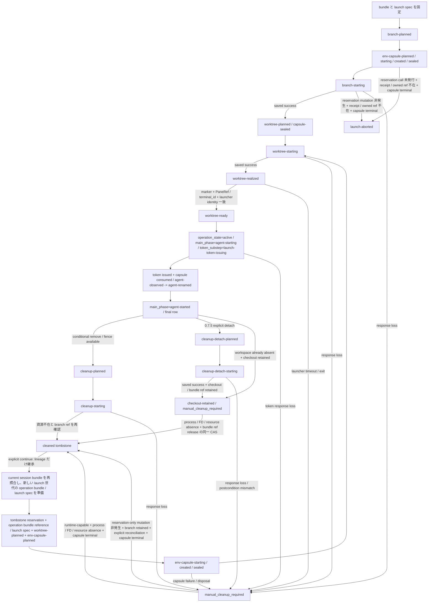

# herdr runtime backend 実機検証

ステータス: 0.7.5 wave 2 の実機検証を完了し、pane-targeted surface を使う fanout-owned herdr session の実装を解禁する。
判断主体はユーザー、floor 0.7.5 への改訂日は 2026-07-22 JST である。
この判断は後続 issue の実装条件を定めるものであり、この PR はコードを変更しない。
0.7.5 core runtime matrix と live-agent surface、0.7.4 metadata token reporting と sidebar row layout は実測済みである。
この文書の日付は日本標準時（JST、UTC+09:00）で記す。
core runtime の検証日は 2026-07-16、2026-07-21、2026-07-22、metadata token reporting と sidebar row layout の追試日は 2026-07-17 である。
0.7.3 と 0.7.4 は protocol `16`、0.7.5 は protocol `17` であり、schema version はすべて `1` である。
関連分析の「0.7.4 wave 2」は 2026-07-21 の旧判断を時系列で残した段落であり、その直後に記録された 0.7.5 breaking change と floor 改訂が優先する。
後続実装が従う current contract はこの文書である。

fanout の herdr backend wave 2 は CLI-first とし、集約読みには CLI wrapper の `herdr api snapshot` を使う。
raw Socket client は実装しない。
version / session / schema / behavior profile の検査と各操作に対応する本文の owner gate 完了後、snapshot / list / wait、targeted read、owned server の bootstrap、launch、cleanup、focus、emitter、metadata、自動 nudge の送信契約を後続実装へ解禁する。
console / coordinator / agent launch は加えて #528 の direct-launch 契約完了を要求する。
自動 mutation は provisional intent と phase machine、nonce の二重照合、branch の atomic reservation、事後条件検査、no-blind-retry を通す。
linked worktree 間の intent、console、final row、telemetry routing は canonical git common directory 配下の単一 Herdr control registry を正典とし、worktree-local `state.json` へ分散しない。
Herdr backend の `--team` は #528 の fail-closed gate で最初の mutation 前に拒否し、#568 が registry-backed peer 解決を導入した後に再評価する。
#552 の Herdr nudge 実装は #568 の完了を前提とする。
commit を持つ child の cleanup は branch lineage を tombstone として残し、明示的なユーザー操作だけが保持 tip から新しい launch 世代を作る。
owned XDG の config と plugin registry に予期しない setup hook があれば launch 前に fail closed にする。
Herdr、fanout launcher、console shell、agent の実行物は workspace mutation 前に owned content-addressed launch bundle へ固定し、exact token 後は sealed bundle だけを起動する。
provider hook の signal は agent process から偽造できる協調 telemetry とし、tmux backend と同じ nudge gate には使うが、完了判定または cleanup の根拠には使わない。
registry-backed peer 解決後の自動 nudge は current launch に束縛された fresh provider signal と送信直前の live process identity を照合した後だけ、tmux の `shouldNudge` と同じ条件で `agent prompt` を一回発行する。
`codexPlanMode` は恒久除外を撤回し、fanout-owned non-shell launcher が絶対パスの `fanout __codex-plan-tui` を root pane 内で起動する。
その実装は #528、#529、#544 の導入後の別 issue とする。
pane 消滅または 0.7.5 direct-launch row の `terminal_id` 変化は `stale` とする。
0.7.4 Codex integration v6 の resume 実測は履歴として残すが、0.7.5 direct launch の resume には流用しない。
session identity の read と mutation は別の CLI 接続になるため、直前の version / identity 検査だけでは mutation の対象を束縛できない。
0700 / 0600 と owner UID だけでは inherited ACL を検査しないため、別 UID の排除を証明しない。
後述の private namespace gate が全 path component と leaf に成功した場合だけ別 UID を排除し、同一 UID の agent は排除せず、ownership marker を mutation authority にしない。
tmux backend も同一 UID の agent が server 停止、他 pane への `send-keys`、state signal の偽造を実行できる協調プロセス信頼を前提に launch、cleanup、nudge を提供している。
private namespace gate 済みの fanout-owned private socket は影響範囲を fanout 所有 session に閉じるため、tmux-parity tier では同一 UID の残余リスクを受容する。
request-bound generation と conditional mutation、server-authenticated controller capability、server / agent の UID 分離は、herdr が primitive を提供した場合に proof-grade tier へ格上げする条件として保持する。

## 採用判断

| 対象 | wave 2 の判断 | 理由 |
|---|---|---|
| owned server | Go（#526 の未確定 gate と #527 の journal-to-epoch 移譲契約確定後） | FD-relative private namespace gate 済みの XDG / control namespace と private socket、owner marker で別 UID と session 外への影響を封じ込める |
| server 起動 | Go（#526 の behavior / log proof と #527 の journal-to-epoch 移譲契約確定後） | per-repo supervisor が caller routing env を fanout-owned XDG / config / socket / session で上書きし、foreground server child を bootstrap する |
| owned server restart | Go（#526 の旧 admission quiescence proof 完了後） | 旧 admission の active intent と `*-starting` CLI process の不在を preflight / terminal CAS で証明し、active-supervisor lease と restart journal で single spawn を直列化する。gate 失敗は exact candidate absence 後に `manifest-invalid` へ閉じる |
| 集約読み | `herdr api snapshot` を使う | workspace、tab、pane、layout、agent、focus を 1 回で取得できる |
| content read / peek | Go | exact PaneRef と `terminal_id` を直前・直後に再照合し、不一致は結果を破棄する |
| raw Socket API | 不採用 | wave 2 で必要な操作は CLI wrapper で足りる |
| worktree | Go | intent / phase、workspace label と git-dir marker の nonce、Git 事後条件で誤採用を防ぐ |
| cleanup 後の branch 継続 | Go（ユーザー明示操作に限る） | cleaned tombstone と current branch tip を照合し、branch lineage だけを新しい launch 世代へ移す |
| console workspace | Go（#526 / #527 の gate と #528 の direct-launch 契約完了後） | dedicated console intent と exact token で sealed user-shell bundle を起動し、agent / nudge lane から分離する |
| agent 起動 | Go（#526 / #527 の gate 完了後、#528 が admit した bundle / matcher に限る） | owned config の `terminal.default_shell` を bundled non-shell launcher に固定し、sealed provider bundle と検証済み runtime process chain を operation-bound token で起動する |
| workload env | Go（#526 / #527 の gate 完了後。provider operation は #528 adapter 完了後） | auth / socket / proxy / locale を維持し、provider config は sealed view へ固定する。`OPENCODE_CONFIG_CONTENT`、Herdr / tmux routing、injection env を拒否し、raw value を registry / journal / log / bundle に保存しない |
| plain shell への `pane run` | 自動 launch には不採用 | text と Enter の配送時に shell readiness と空入力を条件化できない |
| `agent start` | 自動 launch には不採用 | canonical agent executable を bare name で解決するため、fanout が選んだ絶対 executable を pin できない |
| capability gate | structural gate と code-owned behavior profile を検査する | stable `>=0.7.5`、protocol `17` / schema `1`、接続先 status に加え、公式 v0.7.5 darwin/arm64 binary、exact agent-detection fixture、no-refresh policy を同時に許可する。fixture / no-refresh proof 未確定時は fresh bootstrap を拒否し、owned server restart では cache を使わない |
| attach | custom socket を選ぶ bare `herdr` command を提示する | `session attach <name>` は別 daemon を自動起動し得るため実行しない |
| focus | Go | TUI の明示操作だけが送信直前再照合後に focus する |
| `--team` | 拒否（#568 の registry-backed peer 解決まで。暫定 gate は #528） | `--dry-run` を含む backend / flag validation で明確な invocation error を返し、tmux backend の既存経路は変更しない |
| nudge | Go（#552 は #568 完了後） | shared registry から宛先を解決し、fresh provider signal と送信直前の live process identity が一致する許可状態だけへ no-wait の `agent prompt` を発行する |
| `codexPlanMode` | Go(実装は #528 / #529 / #544 後の別 issue) | 同じ non-shell launcher で sealed fanout controller bundle を起動し、`agent start --kind codex` の args にしない |
| live identity | Go | routing、checkout、terminal、会話、process を別々に照合する |
| 0.7.5 direct launch の cold restart resume | 保留 | real Codex の direct launch から restart / attach / resume まで未実測のため、`terminal_id` 変化時は `stale` にする |
| console / coordinator close | Go | checkout を持たない exact owned workspace / pane だけを送信直前に再照合し、response loss では blind retry しない |
| child final-row cleanup | workspace-only close + manual reconciliation | automatic remove は拒否し、checkout / lineage と active bundle reference を `checkout-retained` final row に保全する。外部 cleanup 後に process / FD と resource の完全な absence を証明した tombstone CAS だけが reference を外す |
| child launch rollback | 拒否（manual reconciliation のみ） | workspace を含む観測資源、provisional intent、branch reservation を保持し、automatic close / remove を発行しない。runtime-capable phase は process / FD absence を要求し、reservation-only failure だけを例外にする |
| dirty automatic `--force` | 拒否 | child automatic remove の共通条件に加え、exact fingerprint とユーザー確認 receipt も必要になる |
| emitter | Go | cooperative telemetry と nudge gate に限り、completion / cleanup authority にしない |
| metadata | Go | exact target を直前・直後に照合し、表示専用 token だけを報告する |
| 通知 | 手動検証だけに使う | detached 時も `shown:true` で、表示完了の応答ではなく、fanout は自動発行しない |

## 検証条件

検証用の git repository、bare remote、linked worktree、named herdr session を `/private/tmp` に作った。
2026-07-16 の v1 検証ではユーザーの default herdr session を停止も削除もしていない。
plugin event の検証では `XDG_CONFIG_HOME` と `XDG_STATE_HOME` も `/private/tmp` へ向け、plugin registry と state を隔離した。

追加検証では公式 `v0.7.3` macOS arm64 リリースバイナリ（SHA-256 `b31345392d004ec1f1b2c821e1ad601019fa8385fe1e4c6931321eb58a920773`）を `/private/tmp` に置き、named session と state を隔離した。
herdr 公式 Codex integration v6 の再開試験だけは、すでに信頼済みのこの worktree を cwd に使った。

sidebar 追試と最初の wave 2 では公式 `v0.7.4` macOS arm64 リリースバイナリ（SHA-256 `24992e1625dbdcb18354a59e299e4b263c312400b31396cdc07cd46ed57f24a7`）を使った。
インストール済みの `herdr 0.7.4` はこのリリースバイナリと byte 単位で一致した。
隔離 session の `status --json` は client / server version `0.7.4` と protocol `16`、`api snapshot` は version `0.7.4` と protocol `16`、`api schema --json` は schema version `1` を返した。

0.7.5 再検証では公式 `v0.7.5` macOS arm64 リリースバイナリを使った。
インストール済み binary の SHA-256 は `37350546b0012555943b92eaf962665de4e264395baeb44227b8015e8ff5b0d6` であり、公式 release asset の digest と byte 単位で一致した。
release tag の commit は `ef4c23f5775bb8cfec05f05d0844226ff959a07a` である。
検証資源は `/private/tmp/fanout-557-herdr-075.5AXZTV` 配下へ置き、XDG 四変数、config、server socket、client socket をすべて隔離した。
隔離 session の `status --json` は client / server version `0.7.5`、protocol `17`、`compatible:true`、`restart_needed:false` と exact session / socket を返した。
`api schema --json` は protocol `17`、schema version `1`、89 methods を返し、SHA-256 は `1ef4eb9ec655cb0c89726895f437d8654bdde13a22e591fda06a9015d03d88c7` だった。
0.7.5 の検証では default Herdr session を停止、削除、上書きしていない。

post-work review 後の launch readiness 追試は `/private/tmp/fanout-557-shell-readiness-2` 配下の別 session で実行した。
owned config の `[terminal] default_shell` を絶対 launcher path、`shell_mode` を `non_login` にすると、launcher は exact cwd、`HERDR_PANE_ID`、`HERDR_WORKSPACE_ID`、server env の nonce を受け取った。
一回だけ即時に出した marker は最初の pane の buffer に残らなかったが、capture 開始後の nonce 付き marker は `pane wait-output` が検出した。
`w3:p1` では marker 検出後に `pane run` で exact operation token だけを送り、launcher が absolute fake process へ空白を含む env / argv と exact cwd を渡した。
この probe は non-shell launcher surface の成立だけを示し、production helper は marker を bounded に再送し、token 以外の入力を拒否して intent の sealed bundle entry / env / argv を shell interpretation なしで起動する。
この追試では nonce を server env から直接渡したため、production の `awaiting-intent` と state handoff は実測していない。

同日の installed entrypoint 調査では `~/.nodebrew/current/bin/codex` は `codex.js` への symlink で、script は `#!/usr/bin/env node` から platform-native Codex child を spawn する形だった。
`~/.local/bin/claude` は versioned Mach-O executable への symlink だった。
これは source inspection であり real agent の process chain 実測ではないが、`exec.LookPath` が返す lexical path と live foreground executable の byte 完全一致を共通 matcher にできないことを示す。

current Go 1.26.5 darwin-arm64 の `syscall` と installed `x/sys/unix` surface には Darwin 用 `fexecve` / `execveat` がなく、verified FD を直接実行する経路は確認できなかった。
`/private/tmp` の 0500 copy に `UF_IMMUTABLE` を設定した追試では rename と chmod が `Operation not permitted` になり、flag 解除後にだけ変更できた。
同じ copy の実行は current sandbox で exit 137 になったため、この追試は seal の mutation 防止だけを示し、bundled provider の起動成立を証明しない。
#528 は real Claude / Codex の sealed bundle 起動と依存 closure を実機で検証してから各 provider を admit する。

wave 2 の成功経路は `XDG_CONFIG_HOME`、`XDG_STATE_HOME`、`XDG_DATA_HOME`、`XDG_CACHE_HOME`、config、socket を検証ごとの 0700 directory へ向けた。
`HERDR_CONFIG_PATH` と custom socket だけを隔離した負例では、herdr が既存の `~/.config/herdr/session.json` を復元して global log を書いた。
終了時に同ファイルの SHA-256 は `48cff490ab170d1327262076d7f3a71d336b0e2e5f4495c68d1e99133ecca0eb` から `3fbd67b380ee59c3098d125349cacab62178088bb1fd21a6aae478695ebc30ab` へ変わった。
既存の `~/.config/herdr/session-history.json`（SHA-256 `f597ddef792e7233b8035c7c2e7e6f5573523e00ad5801fc473d2eb051185445`）も削除された。
事前の byte backup がなかったため復元はしていない。
この負例は default Herdr state を変更した検証事故として扱う。
2026-07-21 JST の追加確認では `session.json` と `session-history.json` が再生成されていたが、検証前の bytes は復元も同一性検証もできない。
現在の両 file を検証前 state とみなして復旧には使わず、追加の overwrite も行わない。
この負例以降は default herdr state を操作せず、全 XDG directory を隔離した。
今後の実機検証では対象 file の存在、SHA-256、byte backup を開始前に記録し、全 XDG directory、config、socket を一時 directory へ隔離する。
default path を使う負例は実行しない。

fanout の複数行入力はインストール済みの `fanout v0.12.0` を実際の herdr pane で起動して確認した。
モックは使っていない。

## owned session lifecycle

### server lifecycle と ownership

`herdr server` は foreground process として起動でき、fanout supervisor の直接の子として監視できる。
検証では session directory を 0700、server socket と client socket を 0600 とし、log は 0700 directory 配下の 0644 file に分離した。
server log は隔離した `XDG_CONFIG_HOME/herdr/sessions/<session>/herdr-server.log` に置かれた。
0644 は実測値であり、production 契約ではない。
production supervisor は private namespace gate 済みの 0600、ACL-free な log file だけを受理し、workload env の name / value、env capsule の path / key / payload、launcher token を log へ出さない。
0.7.5 でこの同一 log file を 0600、ACL-free のまま作成、維持、照合する exact protocol は「未確定事項」の #526 owner とし、確定までは read-only preflight を除く fresh bootstrap と registry / filesystem / Herdr mutation を拒否する。
同じ socket path への二重起動は `herdr server is already running` で終了した。
同じ path に non-herdr の Unix listener がいる場合も同じ error で終了し、protocol、version、owner は検査しなかった。
`status --json` の `detached_server_daemon:true` は capability 表示であり、明示的に起動した server 自体は daemonize しなかった。

実測した mode 値だけでは inherited ACL を検査していないため、別 UID の排除を証明しない。
実装は後述の private namespace gate が成功した場合だけ、この permission 境界を別 UID の排除に使う。
herdr が起動した agent は同じ UID で動き、`HERDR_SOCKET_PATH` を継承するため、socket が分かれば `server.stop`、`plugin.*`、`worktree.remove` を発行できる。
同じ UID の process は外部 `owner.json` の stable bytes と registry の PID / start token / bundle reference を変更でき、immutable flag も解除できるため、status、schema、snapshot の応答は marker nonce または session generation に束縛されない。
server 停止後に同じ path の server へ置換する ABA も原子的には検出できない。

owned runtime directory の `owner.json` は協調する fanout process 間の ownership、封じ込め、crash recovery、誤操作防止に使う。
marker bytes の決定済み範囲は schema ID `fanout.herdr-owner.v1`、UTF-8 の RFC 8785 canonical JSON、BOM と trailing LF なしの符号化とする。
#526 が確定する decoder は missing / unknown / duplicate field を拒否し、読み取った raw bytes と canonical reserialization の exact match を要求する。
logical required value は physical canonical common-directory の raw path / opened identity、bootstrap nonce、session-bundle build nonce、stable epoch owner nonce、behavior profile ID とする。
続けて `HERDR_SESSION`、server / client socket の expected raw path / opened parent identity / expected-absence receipt、session bundle digest / root identity、Herdr version、bundle 内の Herdr / fanout relative entry path / opened identity / executable digest を必須とする。
detection fixture ID / declared version / `manifest_set_digest` / no-refresh policy ID、manifest realization key / generation / final root identity、owned config の raw path / opened identity / exact bytes / SHA-256、四つの XDG raw path / opened root identity も必須とする。
socket leaf は marker create 後に作られるため marker に含めず、live socket identity、server PID / start token、可変 active-supervisor owner tuple / server tuple / admission は registry にだけ保存する。
`owner-marker-create-planned` と registry は exact marker bytes の SHA-256 を lowercase hex で保存するが、自己参照を避けるため marker 自身にその digest を含めない。
marker byte は private namespace gate が parent の inheritable ACL を拒否し、fresh file の non-owner allow ACE 不在、owner-only / deny ACL の除去、同一 FD の再検査を完了した後に書く。
marker は journal の canonical bytes / digest / opened identity、socket は registry の expected path / server tuple と別々に完全一致する場合だけ owned session の reconciliation に使う。
不一致、foreign、または検証不能なら fail closed にして server を停止しない。
この marker を mutation authority として扱わない。
`owner.json` は active epoch を外部から照合する marker であり、bundle reference、bootstrap phase、active epoch の正典ではない。
対応する registry の session-bootstrap journal または active epoch がない marker は自動採用も自動削除もしない。

### 未確定事項

次の項目はユーザー決定（2026-07-22、2026-07-23）による明示的 deferral とし、この spike では具体形を確定しない。

| 未確定事項 | 確定 owner | 確定前の fail-closed 契約 |
|---|---|---|
| `session-ready` CAS で bootstrap journal の marker canonical bytes / digest / opened identity を active epoch へ移し、shutdown terminal CAS まで保持する exact field / CAS shape | #527 の worktree / state machine 実装 | #527 が reviewed contract を確定するまで `session-ready` CAS を拒否し、bootstrap journal / operation lock / reference を保持して operation を admit しない |
| `fanout.herdr-owner.v1` の property 名、nesting、array / object shape、identity tuple の具体形、canonical golden bytes | #526 の gate 実装 | #526 が reviewed schema と golden bytes を確定するまで marker create / reuse と marker-dependent な bootstrap / restart / shutdown を拒否する |
| shared registry の exact schema / codec / canonical golden bytes、pre-bundle bootstrap writer admission、session-bundled fanout writer への journaled handoff と compatibility record の具体形 | #526 の shared registry gate 実装 | #526 が reviewed contract を確定するまで fresh bootstrap、registry save、Herdr mutation を拒否し、確定後も admitted bootstrap phase 外の writer、handoff 未完了、session bundle と不一致、未対応 schema を mutation 前に拒否する |
| `herdr-wave2-behavior-v1` の exact detection fixture bytes / digest / declared version、`manifest_set_digest`、no-refresh policy / 実機 proof / golden | #526 の capability gate 実装 | #526 が同じ reviewed profile entry を確定するまで read-only preflight を除く fresh bootstrap と、それに伴う registry / filesystem / Herdr mutation を拒否する |
| production server log を同一の 0600、ACL-free file として作成、維持、照合する exact 0.7.5 protocol | #526 の owned server bootstrap 実装 | #526 が実機検証済み protocol を確定するまで read-only preflight を除く fresh bootstrap と、それに伴う registry / filesystem / Herdr mutation を拒否し、pre-create / mode 修復を推測しない |
| 旧 admission に束縛された active intent が 0 件で、保存済み `*-starting` call に対応する Herdr CLI process が不在であることを restart preflight / recovery / terminal CAS で証明する exact record / CAS shape | #526 の owned server restart 実装 | #526 が reviewed quiescence proof を確定するまで owned server restart を拒否し、旧 intent を新しい admission へ retag しない |

これらは owner と拒否境界を固定した契約上の明示的 deferral であり、この spike では仕様を追加しない。

Herdr control state は physical canonical git common directory 配下の `fanout/herdr-control.json` を唯一の正典とし、同じ directory の `herdr-control.json.lock` で直列化する。
**private namespace gate** は physical common-directory FD を anchor とする `fanout` control namespace と、owned runtime root の create 前はその parent FD、create 後は exclusive create 済み root FD を anchor とする XDG / config / marker / socket namespace に適用する。
対象は registry、atomic-save temporary file、全 registry / operation / bundle-store / env-capsule lock、owner marker、XDG 四 root と全 Herdr-created descendant、server log、socket parent、server / client socket、bundle store、staging、quarantine、GC namespace、env-capsule store / disposal namespace とする。
anchor 自身から target leaf までの各 component は directory FD から `openat` / `fstatat` の no-follow 相当で走査し、directory entry と opened FD の identity、type、expected owner UID、mode、mount identity、ACL を照合する。
physical common directory は別 principal に add、delete、rename、write、owner / ACL 変更を許す mode または allow ACL entry を拒否し、fanout-owned component / leaf は exact mode に加えて extended ACL が空であることを要求する。
新しい fanout-owned object の parent は create 前に同じ opened FD から ACL を読み、別 principal への allow ACE が `file_inherit`、`directory_inherit`、`inherit_only` その他の child inheritance flag を持つ場合は create を発行しない。
この pre-create gate は physical common directory、owned runtime root の parent、以後の全 fanout-owned directory に適用する。
current operation は pre-create gate 済み parent の下に restrictive exact mode で directory / regular file を exclusive create し、同じ FD から ACL を読む。
fresh object に別 principal への allow ACE が一つでもあれば ACL を除去して再利用せず、secret byte の書込み、child 作成、採用、unlink を行わず fail closed にする。
別 principal へ権限を与えない owner-only / deny ACL だけが残る fresh object は、同じ FD 上で ACL をすべて除去し、`fchmod` 後に identity、mode、空の extended ACL を再読してから secret byte または child を作る。
fresh directory は空であることも同じ FD から確認する。
pre-existing object、socket、symlink、または race-free な no-follow ACL operation を提供できない leaf の ACL は自動修復しない。
ACL が残る場合は採用、接続、lock 取得、publish、実行、unlink を行わず fail closed にする。
symlink、anchor 配下の mount boundary、ACL 読取不能、entry と FD の identity 不一致、検査中の identity / ACL 変化では pathname-based retry、追跡、置換、削除を行わない。
`fanout` directory は 0700、registry と lock は 0600 とし、private namespace gate または physical common-directory identity の照合に失敗した場合は Herdr backend を開始しない。
registry の repo-scoped header は schema version、full common-directory identity、単調増加 revision を持ち、branch lineage、cleaned tombstone、launch bundle reference / build / publish / GC journal、agent-manifest override realization / retirement tombstone / build journal、session-bootstrap journal を supervisor epoch を越えて保持する。
registry / journal / final row は raw workload env、capsule MAC key、capsule payload を保持しない。
active epoch は stable epoch owner nonce、可変 active-supervisor owner tuple、session / socket / server identity、owner marker の canonical bytes / digest / opened identity record、active bundle / manifest override realization key / generation / final root identity、console、intent、final row、runtime resource、active env-capsule inventory、capsule disposal journal、admission state `ready` / `restarting` / `manifest-invalid` / `draining` を別に持つ。
owner marker record の exact field / CAS shape は「未確定事項」の #527 owner とし、確定後は marker の stable epoch-bound field と完全一致する場合だけ active epoch を再利用する。
active intent、final row、runtime resource、active env-capsule inventory、capsule disposal journal がない場合だけ新しい owner epoch へ切り替え、repo-scoped lineage と tombstone は保持する。
registry schema / codec、canonical golden bytes、pre-bundle bootstrap writer admission、session-bundled writer への journaled handoff の確定 owner は #526 とし、確定までは fresh bootstrap と shared registry を伴う Herdr mutation を開始しない。
確定後、session bundle の `ready` reference を得るまでの save は bootstrap preflight が固定した writer executable identity / SHA-256 と同じ process による session-bootstrap / bundle-build phase だけに限る。
`session-bundle-ready` 後は #526 が確定する handoff journal / CAS により exact bundled fanout entry へ re-exec して writer ownership を移すまで、handoff phase 以外の registry save と外部 mutation を拒否する。
handoff 完了後の全 registry save は session bundle の fanout entry と実行中 writer の opened executable identity / SHA-256 が完全一致する場合だけ許可する。
writer 不一致、束縛または handoff の欠落、未対応 schema version、missing / unknown / duplicate field、canonical re-encode 不一致は state save、Git / Herdr、bundle / capsule mutation より前に拒否し、自動 migration、field drop、旧 codec での再保存を行わない。
admit された writer は private namespace gate 済みの同一 inode の lock を no-follow で保持し、expected revision を確認する。
0600 temporary file は parent の inheritable ACL を拒否してから exclusive create し、fresh file の non-owner allow ACE を拒否する。
owner-only / deny ACL の除去と同一 FD の再検査を終えてから state byte を書き、fsync、rename、parent directory の fsync までを一回の state save とする。
shared registry lock の critical section は一回の snapshot / state save に限り、Git / Herdr process、polling、sleep、bundle copy / hash、filesystem mutation、外部応答待ちをまたいで保持しない。
長時間 operation は operation nonce から決めた no-follow / exclusive operation lock と owner lease を使い、global lock を解放して operation lock を取得してから shared registry lock、必要なら store lock の順に取る。
最初の intent save は exact operation lock identity、owner nonce / generation、PID / start token、lease expiry、候補 snapshot の expected revision、admission、reservation を一つの CAS で保存する。
各外部副作用の前後は operation lock を保持したまま shared registry lock を短時間取り直し、latest revision、owner identity tuple、phase、admission、resource identity を再照合して phase save を確定してから lock を解放する。
active heartbeat が同じ nonce / generation / PID / start token の expiry だけを単調増加させた場合は競合とせず、operation owner は latest expiry、unrelated row、pending telemetry を保持した新しい revision への CAS に成功した場合だけ続ける。
owner identity / generation / process、admission、phase、resource の変化または expiry の後退は fail closed にし、stale snapshot で registry field を上書きしない。
launcher の lock-free read は rename 前後どちらかの完全な JSON だけを受理し、schema / identity / revision の decode failure は intent 不在として待たず fail closed にする。
registry は owner / session / socket identity、console singleton、全 linked worktree の provisional intent と final row、branch lineage / tombstone、branch reservation、launch bundle reference / journal、session-bootstrap journal、telemetry routing、resource inventory を保持する。
通常 mutation の入口は shared registry lock 下で active-supervisor owner identity / generation / process と単調な expiry、expected revision、`admission_state:ready`、restart / shutdown journal の不在を照合し、最初の intent、reservation、journal、または phase を同じ state save へ保存してから外部副作用へ進む。
この gate は console attach / create、coordinator / child launch、continue、cleanup、focus、nudge、metadata、emitter / stale 更新、bundle build / reference / GC、tombstone forget に適用する。
`restarting` 中に許可する write は同じ restart nonce / owner / lease / lock による phase 遷移、read-only capability / active manifest re-gate の結果保存、gate 失敗後の exact candidate stop / absence reconciliation、`manifest-invalid` terminal CAS に限る。
`manifest-invalid` 中に許可する write は current active-supervisor owner の lease 更新 / dead-owner takeover、同じ invalidation receipt の idempotent 保存、外部 cleanup 後の mutation-free explicit absence reconciliation と terminal operation-lock cleanup、通常の空 inventory 条件を満たす明示 shutdown の開始とその phase 遷移に限る。
`draining` 中に許可する write は同じ shutdown nonce の owner lease 更新 / takeover、phase 遷移、terminal save に限る。
その他は registry save、Git ref、bundle filesystem、SQLite、Herdr CLI mutation より先に `server_restarting`、`runtime_admission_invalid`、または `session_shutting_down` を返す。
registry-only の status、lifecycle 集約、session view は三状態でも許可し、admission state と current journal phase / invalidation receipt を表示する。
通常 caller の wait、targeted read、attach、launch は server call、bootstrap、別 restart、retry を始めず対応する明確な error を返す。
各 row は起動元の physical worktree root と task provenance を保持するが、mutable な Herdr row を各 checkout の `.fanout/state.json` へ複製しない。
registry-backed peer 移行までは state-dependent な team 共通経路へ Herdr row を渡さず、`--team` の拒否を registry save または SQLite open より先に確定する。
status、lifecycle、backend stickiness、session view は worktree-local tmux state と共有 Herdr registry を backend ごとに読み分けて集約する。
この文書でいう Herdr の `state lock` と `state save` は、以後この共有 registry の lock と atomic replace を指す。

共有 registry の `row_key` は repo-global な kind-tagged tuple を length-prefix して canonical encoding する。
registry は tuple field と、domain-separated canonical bytes の SHA-256 を lowercase hex にした `row_key_id` を保存する。
既存の別 tuple が同じ `row_key_id` を持つ場合は fail closed にし、ID だけで tuple を上書きしない。
positive GitHub issue は `(repo_identity, "github-issue", canonical_parent_identity, positive_issue_num)` とし、source root を key に含めない。
plan task は `(repo_identity, "plan-task", source_root_identity, planspec_identity, task_id)` とする。
synthetic / manual launch は `(repo_identity, "synthetic", operation_kind, source_root_identity, launch_nonce)` とする。
coordinator は `(repo_identity, "coordinator", coordinator_owner_identity, launch_nonce)` とし、nonce を除いた owner identity の singleton reservation で同じ親の重複を防ぐ。
`canonical_parent_identity` は repo identity と type-tagged issue / Project / plan parent reference を canonical 化した値とし、保存済み `ParentRef` の表示文字列から再導出しない。
issue / Project coordinator と issue-sourced plan coordinator の owner identity は実際の `canonical_parent_identity`、issue-less plan coordinator は source root identity と planspec identity の組にし、安定した owner のない prompt coordinator は synthetic key を使う。
`source_root_identity` は symlink を除いた physical worktree root と worktree 固有 git-dir identity の組とし、linked worktree 間で共有する common directory だけを使わない。
`planspec_identity` は no-follow で一回開いた同じ FD から検証した exact planspec bytes に domain separator を付けた SHA-256 とし、slug、path、後から読み直した file を identity に使わない。
recovery に必要な task definition、source root identity、planspec identity は最初の intent に保存する。
`launch_nonce` は最初の mutation 前に生成して intent に保存し、recovery で再生成しない。
`ParentRef`、plan slug、`TaskID`、負の `IssueNum` は display / CLI selector provenance として保持するが、typed key の再導出には使わない。
issue と plan task は同じ typed key の intent、final row、tombstone を idempotency hit とし、synthetic launch は新しい invocation ごとに別 key、crash recovery だけを保存済み nonce の同じ key にする。
status、close、merge、cleanup、continue は保存済み typed key をそのまま routing し、legacy selector は canonical parent identity と、kind に応じた source root / planspec identity / launch nonce を含めて一件へ解決できる場合だけ使う。
selector が 0 件または複数件なら fail closed にし、cwd、slug、負番号だけから mutable row を選ばない。

config と plugin registry は全 XDG directory の差し替えで default state から隔離できる。
owned server の bootstrap 前に admitted Herdr binary、current fanout binary、code-owned agent-detection fixture / canonical index を session launch bundle へ固定する。
manifest realization の logical key は canonical repo identity、behavior profile ID、fixture ID、`manifest_set_digest`、no-refresh policy ID とし、record に単調増加する `realization_generation` を持たせる。
owned XDG 四 root、config、final / staging override tree、remote cache path は logical key と `realization_generation` から決め、別 fixture または retired generation の path を上書きも再使用も自動削除もしない。
supervisor の全 Herdr CLI call と server child は bundled Herdr path を使い、owned config は `[terminal] default_shell` を bundled fanout launcher path、`shell_mode` を `non_login` に固定する。
owned config は `[update] manifest_check = false` も固定し、background remote manifest check を無効にする。
fresh bootstrap は後述する journal で sealed fixture から owned config の `agent-detection` local override tree を no-follow / exclusive に実体化し、fixture 外の local override / cached remote manifest、identity / byte drift を server spawn 前に拒否する。
restart は保存済み realization を read-only に再検査し、override file を作成、更新、置換しない。
server env の `FANOUT_HERDR_PANE_LAUNCHER=1` は no-arg TUI より先に non-shell launcher mode へ dispatch する。
server env の `FANOUT_HERDR_LAUNCHER_MAX_WAIT_MS` も `300000` に固定する。
owner marker は #526 が確定した `fanout.herdr-owner.v1` canonical payload だけを保存し、その bundle / executable / fixture / realization / config / XDG field のいずれかが対応する registry、bundle manifest、detection fixture、filesystem、live launcher process と一致しなければ server 起動前または operation token 前に fail closed にする。
#427 の hook emitter も bundled fanout path を使い、launcher control env は operation child env から除く。
launcher は checkout 内 file または source installation を実行せず、config / bundle の drift または Herdr が別 root process を起動した場合は launch 前に fail closed にする。

fresh session は `owner.json` 作成前に registry へ provisional session-bootstrap owner を作る。
bootstrap record は bootstrap nonce、session bundle build nonce、将来の owner nonce、session / socket identity、marker path、owned XDG / config identity、manifest override logical key / realization generation / final root identity / build subjournal identity、operation lock identity、supervisor PID / start token、lease generation / expiry を持つ。
fresh bootstrap は active epoch、別 bootstrap owner、owner marker、socket、server process、active env-capsule inventory、capsule disposal journal がすべてない場合だけ開始する。
build lock 取得後の同じ state save で `bundle-build-planned` と phase `session-bootstrap-building` を作り、provisional owner を exact build nonce に束縛する。
digest 確定前の provisional owner は bundle reference を持たず、incomplete tree は build journal、build owner lease、build lock で保護する。
session bundle の seal 検査に成功した state save は bundle inventory を `ready` にし、同じ build nonce の bootstrap owner へ digest / root identity / manifest の正式 reference を取得させて phase `session-bundle-ready` へ進む。
同じ save は build owner tuple を session-bootstrap owner tuple へ generation increment 付き CAS で移譲し、CAS に負けた builder は marker、server、bundle namespace を操作しない。
この registry reference が session bundle の最初の reference であり、`owner.json` はまだ作らない。
`session-bundle-ready` 後は #526 が確定する journaled writer handoff を完了するまで `owner-marker-create-planned`、server spawn、その他の外部 mutation へ進まない。
build lock FD は session-bootstrap operation lock として引き継ぎ、`session-ready` または bootstrap abort の terminal save まで保持する。
CAS 後の session-bootstrap owner lease は bootstrap owner nonce、lease generation、現在の owner PID / start token、引き継いだ operation lock path / file identity、`lease_expires_unix_ms` を持つ。
bootstrap owner は expiry 前に operation lock と shared registry lock の下で lease を更新し、更新を確定できない場合は marker、server、registry の新しい mutation を止める。
bootstrap recovery は expired lease の registry snapshot を取得して global lock をすべて解放し、記録済み operation lock を non-blocking で取得して旧 PID / start token の process が存在しないことを証明する。
その lock を保持して shared registry lock、必要なら store lock の順に取り直し、owner nonce / generation / phase、lock identity、bundle / manifest override / marker / socket / server identity を再照合する。
recovery PID / start token / nonce、新しい expiry、incremented generation への owner CAS に成功した process だけが保存済み phase の recovery を続ける。
CAS 失敗、live owner、process identity の取得不能、phase または資源 identity の不一致では bootstrap mutation を行わない。

`session-bundle-ready` 後は agent-manifest override tree、marker、server を別の journal phase で作る。
phase `manifest-overrides-build-planned` は exact `XDG_CONFIG_HOME/herdr/agent-detection` path と parent identity、deterministic staging path、両 path の expected absence、behavior profile ID / fixture ID / `manifest_set_digest` / no-refresh policy ID、canonical entry set、各 target relative path / raw bytes / SHA-256 / mode、exact create / publish request を保存する。
同じ logical key の repo-scoped `manifest-overrides-realized` record がある場合は、その generation の final root / 全 entry の identity、mode、empty ACL、bytes、digest、remote cache の不在を no-follow で完全に再照合した state save だけが bootstrap journal に同じ key / generation / final root identity の realization reference を取得して phase `manifest-overrides-realized` へ進める。
retained realization が欠落または drift した場合、bootstrap owner は operation lock と shared registry lock の下で expected revision、logical key、old generation / final root identity、exact no-follow absence / drift observation receipt、old generation の build / publish journal 不在を再照合する。
同じ CAS は active epoch、marker、server / socket、別 bootstrap / restart / shutdown journal、old realization reference の不在と、current bootstrap が `session-bundle-ready` で realization reference を未取得であることを要求する。
成功する CAS は old record を reason / observed path / expected / observed identity / digest / entry set を持つ `manifest-overrides-retired` tombstone へ移し、generation を一つ増やし、new generation の XDG / config / final / staging / cache path の expected absence と phase `manifest-overrides-build-planned` を current bootstrap journal へ一度に保存する。
retirement は registry-only とし、old generation の tree を unlink、rename、chmod、repair、adopt、quarantine、GC せず、retired path を将来も再使用しない。
observation の取得不能、CAS loss、new generation path の pre-existing object、old generation の partial staging / entry subjournal / publish 結果不明は retirement と fresh build を拒否し、既存の `manual_cleanup_required` 契約に従う。
record のない pre-existing final tree、fixture / digest / identity の不一致、unknown entry、remote cache entry は自動修復、置換、削除せず fail closed にする。
fresh build は phase `manifest-overrides-build-starting` を保存してから staging directory を 0700 で no-follow / exclusive create し、opened root identity と parent / staging fsync receipt を phase `manifest-overrides-build-created` へ保存する。
`manifest-overrides-build-planned` の recovery は expected absence と owner lease が完全一致する場合だけ未発行 create request を一回発行できる。
`manifest-overrides-build-starting` の recovery は directory create を再発行せず、staging の有無にかかわらず発行結果不明を `manual_cleanup_required` として保持する。
`manifest-overrides-build-created` の recovery は exact staging root が保存済み identity / mode / empty ACL で存在し、保存済み entry subjournal と実 entry set が完全一致する場合だけ entry build を続ける。
各 fixture entry は canonical path 順の substep `manifest-override-entry-planned` / `manifest-override-entry-starting` / `manifest-override-entry-realized` を通し、planned に exact parent / target absence / bytes / digest / 0400 mode / create request、realized に opened file identity と file / parent fsync receipt を保存する。
`manifest-override-entry-starting` の recovery は exact target identity / bytes / digest / mode / empty ACL がある場合だけ `manifest-override-entry-realized` へ進み、target がない、別 identity、unknown entry、発行結果不明では create を再発行しない。
全 entry と directory entry set の完全一致を no-follow で再読して staging directory を 0500 にし、bottom-up fsync 後に phase `manifest-overrides-publish-planned` へ進む。
publish は final path の expected absence、staging root identity、exact rename request を `manifest-overrides-publish-starting` へ保存してから同じ parent 内で一回だけ rename し、parent fsync を行う。
publish recovery は保存済み root identity が staging または final の一方だけにある場合だけ未完了 step を続け、両方、どちらもない、identity / entry set 不一致では rename、adopt、delete を行わない。
final root / 全 entry の identity、mode、empty ACL、raw bytes、digest、remote cache の不在を再検査した同じ state save は logical key / generation / final root identity / canonical entry identities を持つ repo-scoped realization record と bootstrap phase `manifest-overrides-realized` を作り、old retirement tombstone を保持したまま entry / build subjournal を除去する。
marker create は `manifest-overrides-realized` と bootstrap owner / realization reference が一致する場合だけ開始する。
exact な published realization は normal shutdown と bootstrap abort 後も retained input として残し、同じ logical key / generation / final root identity の fresh bootstrap だけが read-only に再利用する。
retired generation は再利用せず、fresh bootstrap は terminal retirement CAS が予約した next generation の expected-absent namespace にだけ新しい realization を publish できる。
未完成 staging、`manifest-override-entry-starting`、publish の発行結果不明は自動 quarantine、GC、unlink、再発行の対象にせず、exact build journal / path / identity / expected entry set を bootstrap-abort fence の下で `manual_cleanup_required` として保持する。
外部の明示 cleanup 後に shared registry lock 下の read-only reconciliation が final / staging path、全 expected / unknown entry、marker / server / socket の不在と parent identity の不変を確認した場合だけ override absence receipt を保存し、bootstrap abort terminal CAS へ進める。
phase `owner-marker-create-planned` は #526 が schema を確定した後、exact marker path / parent identity、expected absence、0600 `fanout.herdr-owner.v1` canonical bytes / SHA-256、`O_EXCL` / `O_NOFOLLOW` request を保存する。
planned marker bytes の全 required field は同じ state save が照合した bootstrap / bundle / manifest realization / config / XDG record から写し、別節の field list から再構成しない。
phase `owner-marker-create-starting` を保存してから create を一回だけ発行し、file と parent directory の fsync 後に opened file identity を phase `owner-marker-created` へ保存する。
`owner-marker-create-planned` の recovery は pre-state が完全一致する場合だけ未発行 request を一回発行できる。
`owner-marker-create-starting` で exact marker がある場合は canonical bytes / journal SHA-256、UID、mode、空の extended ACL、parent / opened file identity を private namespace gate で照合して observed identity を `owner-marker-created` へ保存できる。
同 phase で marker がない場合、identity が違う場合、journal のない marker がある場合は create を再発行せず `manual_cleanup_required` にする。

phase `server-bootstrap-planned` は bundled executable identity、exact detection fixture / local override identities、manifest override realization key / generation / final root identity、no-refresh config、exact argv、versioned secret-free `control_env_spec` / fingerprint、marker identity、socket absence、exact spawn request を保存する。
phase `server-bootstrap-starting` を保存してから foreground server child を一回だけ spawn する。
spawn 成功後の PID / start token、bundle executable identity、private namespace gate 済みの socket leaf identity、connected status、capability gate、active manifest proof を phase `server-bootstrap-realized` へ保存する。
`server-bootstrap-starting` で PID / start token を保存できなかった crash は server を再起動せず、観測した process / socket を採用も停止もしない。
`server-bootstrap-realized` だけが exact PID / start token、bundle-bound process、marker、socket を再照合して recovery できる。
全照合後の phase `session-ready` は provisional bundle / manifest override realization reference、owner marker の canonical bytes / digest / opened identity record を active epoch へ移し、bootstrap owner tuple を active-supervisor owner tuple へ generation increment 付き CAS で移譲して bootstrap journal を同じ state save で除去する必要がある。
exact field / CAS shape は「未確定事項」の #527 owner とし、確定まで `session-ready` CAS は bootstrap journal / operation lock / reference を除去せず fail closed にする。
active-supervisor owner tuple は `supervisor_owner_nonce`、`owner_generation`、supervisor PID / start token、`lease_expires_unix_ms` を持つ。
active server tuple は saved server PID / start token、bundled executable identity、socket identity、fanout-local `server_instance_generation` を持つ。
capability admission は `admission_id`、state、active server tuple、behavior profile ID、Herdr source provenance、platform、executable digest、agent-detection fixture ID / declared version / `manifest_set_digest`、no-refresh policy ID、manifest realization key / generation / final root identity、session bundle digest、status / schema / snapshot / active manifest proof、optional invalidation receipt を束縛する。
active admission の invalidation receipt は `ready` / `restarting` では不在、`manifest-invalid` では必須とし、同 state から始めた `draining` は origin state と receipt を terminal save まで保持する。
`restarting` の restart journal は candidate re-gate 失敗後に限り candidate failure / absence receipt を持てるが、それを active invalidation receipt として公開するのは restart-abort terminal CAS と同時とする。
state 名 `manifest-invalid` は manifest drift だけでなく、`ready` 後に検出した binary drift、`restart_needed:true`、status / schema / behavior profile の不一致、restart candidate の re-gate 失敗を含む live admission invalidation 全体の fail-closed state とする。
`ready` 中の不一致を検出した active-supervisor owner または operation caller は shared registry lock 下で active owner / server tuple、expected revision、保存済み admission proof、fresh observed proof を再照合し、`ready -> manifest-invalid` を一回の authority-reducing CAS で確定する。
operation caller は invalidation CAS で active ownership を取得または移譲せず、CAS loss 後は latest state が同じ `ready` admission ID / server tuple の場合だけ fresh observed proof を取り直して invalidation CAS を再評価し、それ以外は current operation を中止する。
同じ CAS は admission ID を invalid として保持し、reason kind、観測時刻、reason に対応する binary / status / schema / behavior profile / active manifest / override / cache の observed identity を secret-free invalidation receipt に保存し、全 active operation intent を `operation_state:manual_cleanup_required`、全 direct-launch final row を `stale` にして新規 mutation を fence する。
`manifest-invalid` から `ready` または `restarting` へ自動遷移せず、server loss 時も自動 restart しない。
dead active-supervisor owner は保存済み owner tuple、PID / start token の不在、lease expiry、active epoch / server tuple / invalidation receipt / generation の一致を照合した既存の generation-increment takeover CAS に勝った process だけが引き継げる。
takeover owner も active manifest を再 admission せず、lease 更新、explicit absence reconciliation、明示 shutdown 以外の mutation を行わない。
manifest-invalid reconciliation は read-only の status / snapshot / list、OS process inventory、filesystem / Git inventory だけを使い、Herdr / Git / bundle / capsule の mutation を発行しない。
terminal intent は recorded launch operation lock と存在する env-capsule disposal operation lock の non-blocking 取得、各旧 PID / start token の不在、owner generation / phase / resource identity の takeover CAS、全保存済み runtime resource / process / capsule path の不在を要求する。
branch lineage を持たない terminal console / coordinator intent と stale row は workspace / pane / process の不在を要求し、同じ terminal CAS で intent / row、active capsule / disposal journal、対応する runtime / bundle reference を除去する。
terminal child intent で reservation call の未発行または構造化 error が ref mutation の非発生を証明し、reservation receipt / owned ref が不在の場合は、capsule terminal receipt と active capsule inventory / disposal journal の不在を再照合した同じ CAS だけが `launch-aborted` receipt へ移して intent / bundle reference を除去する。
terminal child intent / stale child row の reconciliation は先に同じ invalidation receipt、lineage / reservation、current branch tip を `cleanup_head_sha` へ束縛し、保存済み値がある場合は exact match を要求する。
runtime request が発行され得る terminal child intent と stale child row は、保存済み launcher / agent / descendant / process group と cwd / FD / writable mapping の完全な不在に加え、workspace / pane / checkout / Git registration / marker の不在、完全な Git worktree inventory、同じ full branch ref を checkout する linked worktree の不在、branch tip と保存済み `cleanup_head_sha` の一致を要求する。
同じ child terminal CAS は provisional intent または stale row、registry reservation、active capsule / disposal journal、対応する runtime / bundle reference を除去し、active lineage を branch-retained cleaned tombstone へ移すが、branch ref は削除しない。
各 operation lock file は対応する terminal CAS 後にだけ exact identity の unlink / parent fsync と FD close を行う。
resource 残存、identity / branch drift、inventory 取得不能、operation owner 生存では state を変更せず human reconciliation を要求する。
通常の空 inventory 条件を満たす明示 shutdown だけが `manifest-invalid -> draining` へ進め、条件を満たせない場合は active epoch、row、receipt、bundle reference を保持して human reconciliation を要求する。
lease 定数は `lease_renew_interval_ms=10000`、`lease_interval_ms=30000`、`recovery_grace_ms=30000` とする。
active-supervisor owner process だけが `admission_state:ready` または `manifest-invalid` で restart / shutdown journal がない間、10 秒以下の間隔で exact owner identity / generation / process を照合し、expiry を `max(previous_expiry, now + 340000)` へ単調増加させる。
340000 ms は最大 launch timeout 300000 ms、recovery grace 30000 ms、renew cadence 10000 ms の和であり、別の launch caller は active owner tuple を延長しない。
新しい intent CAS は active-supervisor expiry が `launch_expires_unix_ms + recovery_grace_ms` 以後であることだけを検証し、不足時は intent / reservation / external mutation を作らず `active_supervisor_lease_runway_insufficient` を返す。
各 external call の pre-call CAS は operation owner lease を `call_deadline_unix_ms + recovery_grace_ms` 以後へ延長し、active-supervisor lease も同じ時点まで有効であることを検証してから `*-starting` を保存する。
external call 中は registry lock と renew tick に依存せず、call 後は shared registry lock を取り直して 10 秒以下の renewal cadence を再開する。
owner lease の延長は保存済み launch / call deadline を延長せず、deadline 後の新しい operation または retry を許可しない。
lease expiry は live owner の authority を暗黙に奪わず、expiry 後の owner は新しい mutation を止める。
同じ PID / start token の live owner は owner generation、active epoch、admission、operation / restart / shutdown journal が保存値のままで takeover CAS がない場合だけ、shared registry lock 下の same-owner renewal CAS で authority を回復できる。
takeover は expired tuple の snapshot 後に global lock を解放して旧 supervisor PID / start token の不在を証明し、shared registry lock 下で epoch、owner tuple、marker、server、bundle reference、restart / shutdown journal を再照合して generation increment の owner CAS に勝った process だけが行う。
live owner、PID / start token の取得不能、identity 不一致、CAS loss では active ownership を引き継がない。

server loss の自動 restart は current active-supervisor owner だけが開始する。
saved server PID / start token と socket path の不在、旧 admission に束縛された `operation_state:active` intent が 0 件であること、保存済み `*-starting` call に対応する Herdr CLI process の不在、stable owner marker の bytes / opened identity、session bundle / manifest realization key / generation / final root identity / executable、保存済み active manifest proof、sealed agent-detection fixture、local override / remote cache bytes、no-refresh config、XDG の完全一致、bootstrap / restart / shutdown journal の不在を証明できる場合だけ deterministic restart operation lock を global lock の外で no-follow / exclusive に取得する。
active intent、対応 process の残存、または完全な process inventory の取得不能が一件でもあれば restart lock / spawn を拒否し、旧 intent を新しい admission へ retag しない。
server 不在の restart preflight は live active manifest を再取得したと扱わず、保存済み proof、filesystem identity、旧 admission quiescence proof だけを照合する。
lock 順序は restart operation lock、shared registry lock、必要なら store lock とし、global lock を保持したまま restart operation lock を取得しない。
同じ CAS save は active owner tuple / epoch / expected revision、旧 admission ID、quiescence proof と不在 pre-state を再照合し、`admission_state` を `ready` から `restarting` へ変えて phase `server-restart-planned` を作り、lifecycle authority を active-supervisor owner から restart owner へ移す。
`server-restart-planned` は restart nonce、restart owner lease の PID / start token / nonce / generation / lock path / file identity / expiry、旧 admission ID / server tupleと quiescence / 不在 pre-state、exact marker、bundle / manifest realization key / generation / final root identity / executable、agent-detection fixture ID / `manifest_set_digest`、no-refresh config / XDG、exact argv、versioned secret-free `control_env_spec` / fingerprint、exact spawn request、expected socket absence を保存する。
`restarting` 中は active-supervisor lease を別に更新または takeover せず、restart owner が operation lock と shared registry lock の下で lease を更新する。
expired restart recovery は global lock の外で recorded operation lock を non-blocking 取得して旧 PID / start token の不在を証明し、shared registry lock 下で restart nonce / generation / phase、active epoch、旧 owner / admission / server tuple、quiescence proof、marker、bundle reference、namespace identity を再照合した owner CAS に勝った process だけが続ける。
phase `server-restart-starting` を保存してから spawn を一回だけ発行し、成功応答の新 PID / start token / executable / private namespace gate 済み socket leaf identity を phase `server-restart-realized` へ直ちに保存するが、admission はまだ無効のままにする。
`server-restart-planned` の recovery は旧 admission quiescence proof、pre-state、restart owner lease が完全一致する場合だけ未発行 request を一回発行できる。
`server-restart-starting` の結果が不明な場合は spawn の再発行、観測 process の採用 / 自動停止、socket unlink を行わず、`restarting`、journal、bundle reference、operation lock identity を保持する。
`server-restart-realized` の recovery は保存済み process / socket だけを再照合して三段 capability gate と active manifest gate を cache なしで最初から再実行できる。
foreign / mismatched process、残存または stale socket、identity の取得不能では stop / unlink / adopt / restart を行わず `manual_cleanup_required` にする。
gate 成功後に旧 admission quiescence proof を再照合した terminal CAS だけが restart owner を新しい active-supervisor owner tuple / lease へ移し、新 server tuple、incremented `server_instance_generation`、新しい `admission_id`、`admission_state:ready` を確定して restart journal を除去する。
同じ terminal CAS は snapshot の旧 `terminal_id` と current value を比較し、変化した direct-launch row を `stale` にするが、自動 resume は行わない。
candidate re-gate が失敗した場合、restart owner は exact candidate PID / start token / executable / socket identity、restart nonce / owner generation、旧 admission ID / server tuple、gate failure proof、marker / bundle / manifest realization identity を再照合した CAS だけで phase `server-restart-admission-failed` へ進む。
この phase は candidate failure receipt を restart journal に保存し、`admission_state:restarting` と restart owner / operation lock / lease を保持したまま exact candidate の `server-stop-planned` / `server-stop-starting` / `server-stop-realized` へ進む。
candidate process / socket がすでに不在なら stop request を発行せず、保存済み candidate identity の absence と marker / bundle / manifest realization の不変を read-only に証明して `server-stop-realized` へ進む。
stop の response loss または外部 cleanup 後も同じ exact absence を証明できる場合だけ realized へ進み、process / socket 残存、foreign identity、inventory 取得不能では stop、adopt、unlink、spawn を再発行せず `manual_cleanup_required` の restart journal を保持する。
`server-stop-realized` 後の restart-abort terminal CAS は同じ restart nonce / owner / generation / lock、candidate failure / absence receipt、旧 active epoch / owner / server tuple、marker / bundle / manifest realization reference を再照合する。
成功する CAS は restart owner を active-supervisor owner tuple / lease へ戻し、旧 admission ID を invalid のまま `admission_state:manifest-invalid` へ移し、candidate tuple / gate failure / absence proof を active invalidation receipt へ移し、active intent を `manual_cleanup_required`、direct-launch row を `stale` にして restart journal を除去する。
失敗側 terminal CAS は candidate server tuple を active tuple に採用せず、`server_instance_generation` を増やず、新しい admission ID を作らず、marker、active epoch、session bundle / manifest realization reference、row を保持する。
active epoch、stable marker、final row、session bundle reference は restart で作り直しも削除もしない。旧 admission の intent を新しい admission へ retag しない。
normal operation は admission proof の server tuple が current server tuple と一致し、restart journal がないことを要求する。
success または restart-abort terminal CAS 後にだけ restart operation lock file の exact identity を再照合して unlink と parent fsync を行い、FD を閉じる。
supervisor loss後に saved server または socket が残る場合、通常 operation / restart は foreground child を暗黙に採用または停止せず、保存済み active-owner takeover 契約に勝てない process は fail closed にする。

bootstrap abort は session-bootstrap owner が正式 session bundle reference を取得した phase `session-bundle-ready` 以後、`session-ready` より前だけ開始できる。
正式 reference 前の incomplete session bundle は bootstrap abort に入れず、bundle build / quarantine / GC の recovery 契約で処理する。
current bootstrap owner、または bootstrap takeover CAS に勝った owner は引き継いだ bootstrap operation lock を保持したまま shared registry lock を取り、expected revision、active epoch の不在、exact bootstrap nonce / owner tuple / phase / lock identity、provisional bundle reference、manifest override realization / build state、marker / server / socket identity を再照合する。
成功する同じ CAS save は fresh abort nonce、`abort_origin_phase`、resource snapshot、`bootstrap_abort_state:aborting`、bootstrap-abort owner lease を session-bootstrap journal に保存し、owner generation を増やして lifecycle authority を bootstrap owner から bootstrap-abort owner へ移す。
bootstrap-abort owner lease は abort owner nonce / generation、PID / start token、引き継いだ operation lock path / file identity、expiry を持つ。
この CAS が bootstrap abort fence となり、以後は同じ abort nonce / owner / lease / lock の abort phase、lease 更新 / takeover、terminal save だけを許可し、元の bootstrap phase、`session-ready`、別 abort、fresh bootstrap を拒否する。
`session-ready` CAS が先に成功した場合は abort CAS を失敗させ、active epoch を bootstrap abort で処理せず通常 shutdown の入口から再評価する。
bootstrap-abort owner の lease 更新と dead-owner takeover は bootstrap owner と同じ operation lock、shared registry lock、必要なら store lock の順序を使い、abort nonce / generation / origin phase / current abort phase / resource identity を owner CAS で再照合する。
server stop は通常 shutdown、bootstrap abort、restart abort で phase 名、exact request、planned / starting / realized の recovery 規則だけを共有し、lifecycle owner guard と terminal effect は分ける。
marker remove は通常 shutdown と bootstrap abort だけが共有し、restart abort は stable marker を削除しない。
marker create request と server spawn request の未発行、marker / server / socket の不在、manifest override が exact retained realization、override mutation の未発行、または外部 cleanup 後の exact absence receipt のいずれかであることを保存済み `abort_origin_phase` から証明できる場合は phase `session-abort-realized` へ進む。
exact marker があり、server spawn request の未発行と server / socket の不在を証明できる場合は stop phase を省略し、phase `owner-marker-remove-planned` へ進む。
phase `server-bootstrap-realized` の saved PID / start token、socket、marker を再照合できる場合だけ phase `server-stop-planned` へ進む。
`owner-marker-create-starting` または `server-bootstrap-starting` の発行結果を既存の post-state 規則で一意に確定できない場合は stop、marker unlink、bootstrap 続行を行わず、abort fence、journal、provisional reference、operation lock identity を `manual_cleanup_required` で保持する。
manifest override build / publish の発行結果を一意に確定できない場合も final tree / staging を採用、削除、上書きせず、abort fence、build journal、provisional reference、operation lock identity を保持する。

通常 shutdown は console row を含む active row / intent、runtime resource、branch / tombstone reservation、active env capsule / disposal journal、別の operation journal、foreign resource の不在を registry snapshot で確認し、shutdown nonce と deterministic operation lock path を選ぶ。
この節の「空 inventory」は active env-capsule inventory と capsule disposal journal の不在を含む。
global lock を解放して no-follow / exclusive shutdown lock を取得し、shared registry lock を取り直して exact active epoch が `ready` または `manifest-invalid`、current active-supervisor owner generation、restart journal の不在、expected revision、owner / marker / process / socket / bundle / manifest override realization reference、空 inventory、直前の namespace 観測が候補 snapshot と同じ場合だけ shutdown を開始する。
成功する同じ CAS save は `admission_state` を保存済みの `ready` または `manifest-invalid` から `draining` へ変え、phase `session-shutdown-planned`、shutdown nonce、shutdown owner lease、operation lock identity を保存し、lifecycle authority を active-supervisor owner から shutdown owner へ移す。
空状態の確認と `draining` fence の作成を別の save にしない。
先に intent または journal を保存した operation は空状態 CAS を失敗させ、先に保存できなかった operation は `draining` を見て失敗する。
shutdown owner lease は owner nonce / generation、PID / start token、operation lock path / file identity、expiry を持ち、`draining` 中は active-supervisor lease を別に更新または takeover しない。
shutdown lease 更新と dead-owner takeover は session-bootstrap owner と同じ operation lock、shared registry lock、必要なら store lock の順序と CAS 条件を使う。
shutdown owner / recovery の snapshot と list だけは stop 判定用の read として許可する。
二つ目の shutdown request は新しい nonce を作らず、live owner がいれば in-progress を返し、expired owner の takeover 条件を満たす場合だけ同じ journal を回復する。

phase `server-stop-planned` は bundled stop executable、exact argv、versioned secret-free `control_env_spec` / fingerprint、saved server PID / start token、socket / marker identity、namespace pre-state を保存する。
`server-stop-planned` と `server-stop-starting` の各 save 前に operation lock、shared registry lock の順で lifecycle context を再照合する。
通常 shutdown は同じ `draining` epoch、shutdown nonce / owner generation、lease / lock identity、空 inventory、foreign resource 不在、marker / server PID / start token / socket / active bundle / manifest override realization reference の保存値を要求する。
bootstrap abort は active epoch の不在、同じ abort fence、abort nonce / owner generation、lease / inherited lock identity、`abort_origin_phase:server-bootstrap-realized`、foreign resource 不在、marker / server PID / start token / socket / provisional bundle / manifest override realization reference の保存値を要求する。
restart abort は `admission_state:restarting`、同じ restart nonce / owner generation / lease / lock identity、phase `server-restart-admission-failed`、exact candidate PID / start token / socket、candidate failure receipt、stable marker / active bundle / manifest realization reference の保存値を要求する。
exact process と socket の直前照合後に phase `server-stop-starting` を保存し、stop request を一回だけ発行する。
`manifest-invalid` から開始した shutdown は draining CAS 前に saved server PID / start token と socket の不在を保存し、同じ absence、server tuple、owner generation、marker / bundle / manifest override realization reference を stop phase で再照合できる場合だけ stop request を発行せず `server-stop-realized` へ進む。
saved PID / start token の process と socket の不在、marker の完全一致を保存できた場合だけ phase `server-stop-realized` へ進む。
`server-stop-planned` の recovery は pre-state と owner lease が完全一致する場合だけ未発行 request を発行できる。
`server-stop-starting` の recovery は saved process と socket の不在を証明できる場合だけ `server-stop-realized` へ進み、process または socket が残る場合は request を再発行せず、観測 process を採用も停止もしない。

phase `owner-marker-remove-planned` は exact marker path / opened file identity / bytes、parent identity、server / socket の expected absence、unlink と parent fsync の exact request を保存する。
`owner-marker-remove-starting` の save 前に対応する lifecycle owner guard を再照合する。
通常 shutdown は同じ `draining` epoch / shutdown owner、空 inventory、server / socket 不在、exact marker / active bundle / manifest override realization reference を要求する。
bootstrap abort は active epoch の不在、同じ abort fence / abort owner / inherited operation lock、provisional bundle / manifest override realization reference、server spawn request の未発行または `server-stop-realized`、server / socket 不在、exact marker を要求する。
対応する guard の直前照合後に phase `owner-marker-remove-starting` を保存して unlink と parent fsync を一回発行し、marker の不在と parent identity を phase `owner-marker-remove-realized` へ保存する。
`owner-marker-remove-planned` の recovery は pre-state が完全一致する場合だけ未発行 request を発行できる。
`owner-marker-remove-starting` の recovery は exact marker が残ることで unlink の非発生を証明できる場合だけ保存済み request を発行し、marker がない場合は parent fsync 後に realized へ進む。
marker path に別 identity がある場合、server / socket が再出現した場合、namespace の発生または非発生を証明できない場合は unlink を発行しない。

`owner-marker-remove-realized` 後の通常 shutdown terminal save は同じ `draining` epoch / shutdown owner / phase、空 inventory、server / socket / marker 不在、exact active bundle / manifest override realization reference、別 bootstrap / operation journal 不在を再照合する。
成功する一つの CAS は active epoch、active bundle / manifest override realization reference、shutdown journal、`draining` fence を同時に削除し、repo-scoped lineage / tombstone を保持する。
bootstrap abort terminal save は phase `session-abort-realized` または `owner-marker-remove-realized`、active epoch の不在、同じ abort fence / abort nonce / owner generation / lease / inherited operation lock、server / socket / marker 不在、exact provisional bundle reference、exact retained manifest override realization、override mutation 未発行、または外部 cleanup 後の exact absence / drift receipt のいずれか、live override staging / entry subjournal の不在、別 bootstrap / operation journal 不在を再照合する。
成功する一つの CAS は provisional bundle / manifest override realization reference と session-bootstrap journal 内の bootstrap-abort owner / journal / fence を同時に削除し、active epoch を作成も削除もしない。
通常 shutdown または bootstrap abort の terminal save が old realization の最後の reference を外す場合、同じ CAS は別 reference、old generation の build / publish journal、marker / server / socket の不在と exact no-follow absence / drift receipt を再照合して old record を `manifest-overrides-retired` tombstone へ移せる。
この last-reference retirement も registry-only とし、old tree に変更を発行せず next generation の予約だけを保存する。
exact realization が不変な場合は repo-scoped realization record を retained input として保持する。
対応する terminal CAS だけが mutation と fresh bootstrap を再解禁し、`server-stop-realized` または marker unlink だけでは解禁しない。
user cancel、response loss、identity 不一致、foreign resource、発行結果不明では lifecycle context の fence、journal、bundle / manifest override realization reference、operation lock identity を保持し、通常 shutdown を `ready` または `manifest-invalid` へ戻さず、bootstrap abort を元の bootstrap phase へ戻さない。
recovery は expired lease、operation lock、旧 PID / start token の不在、同じ lifecycle nonce / phase / resource identity / generation の owner CAS を通した場合だけ同じ shutdown または abort を続ける。
各 terminal CAS 後にだけ operation lock file の exact identity を再照合して unlink と parent fsync を行い、通常 shutdown は dedicated shutdown lock、bootstrap abort は引き継いだ bootstrap lock の FD を閉じる。
terminal CAS 前は bundle / manifest override realization reference と operation owner lease を落とさず、bundle GC と fresh bootstrap を許可しない。
identity 不一致、response loss、foreign socket、process identity の取得不能では stop / unlink を再発行せず、journal と bundle / manifest override realization reference を落とさない。
normal shutdown と bootstrap abort は exact published manifest override realization を future bootstrap の read-only reuse input として保持し、absence / drift receipt で retired にした generation は tombstone として保持する。
0.7.5 の plugin registry は session 単位ではなく、同じ `XDG_CONFIG_HOME` を使う全 session で共有される per-user global state になった。
実測では session を変えても link 済み plugin が見え、同じ `HOME` でも `XDG_CONFIG_HOME` を変えると空になった。
owned XDG を repo session ごとに分ける現行方針は global registry も隔離し、cold restart 後も同じ owned XDG の registry を復元した。
しかし同一 UID の agent は空 registry の確認後に同じ socket から plugin mutation を実行できるため、standalone registry read は atomic proof にならない。
tmux-parity tier では owned registry の preflight を協調プロセス前提の誤操作防止に使い、予期しない setup hook または config drift があれば launch 前に fail closed にする。
setup hook の抑止、registry generation precondition、operation-scoped completion receipt は proof-grade tier の格上げ条件として保持する。

### attach

custom socket へ plain terminal から接続する実測済みの形は、隔離 XDG path と socket path を指定した引数なしの bare `herdr` である。

```console
XDG_CONFIG_HOME=<owned-config> XDG_STATE_HOME=<owned-state> \
XDG_DATA_HOME=<owned-data> XDG_CACHE_HOME=<owned-cache> \
HERDR_CONFIG_PATH=<owned-config-file> HERDR_SESSION=<repo-session> \
HERDR_SOCKET_PATH=<owned-server-socket> HERDR_CLIENT_SOCKET_PATH=<owned-client-socket> herdr
```

`herdr session attach <name>` と明示 `--session` は custom socket より named session を優先し、別の background daemon を起動し得るため使わない。
wave 2 の UX は上の値を安全に shell quote した command の提示に限り、fanout console を `exec` で置き換えない。
custom socket の detach と reattach では public ID と `terminal_id` は変わらなかった。

### 0.7.4 core matrix（履歴）

0.7.4 owned session で #424 と同じ core matrix を再実測した。
`worktree create/open` の branch、path、base、既存 branch の `--base` 無視、`already_open:true` は 0.7.3 と同じだった。
root workspace と child worktree workspace は sibling になった。
bare `agent start` は argv、空白を含む env、exact cwd を保持し、`pane process-info` は shell PID、process group、候補 argv と cwd を返した。
`pane run` は text と Enter を一操作で送った。

cold restart の前後で `w1:p1`、`w2:p1`、`w3:p1`、`w4:p1` の public ID は維持された。
一方、対応する `terminal_id` は `term_6570ff5b8ee0a1`、`term_6570ff5b981e62`、`term_6570ff5ba1f6c3`、`term_6570ff5ba971e4` から、`term_657100c2ce6f51`、`term_657100c2ceead2`、`term_657100c2cf6513`、`term_657100c2cffdc4` へすべて変わった。

staged entry を持つ dirty worktree の remove は `dirty_worktree_requires_force` で拒否し、`--force` は checkout を削除した。
clean worktree の remove も checkout を削除したが、どちらも local branch は残した。
`workspace close` は root repository と外部 checkout を削除せず、最終 snapshot は空になった。

### 0.7.5 core matrix

0.7.5 では workspace-level agent command が pane-targeted command へ変わったため、worktree lifecycle と live-agent lifecycle を分けて再検証した。

| 対象 | 0.7.5 実測 | wave 2 判定 |
|---|---|---|
| `workspace create --cwd --env` | root pane の cwd と env に反映された | coordinator bootstrap に使う |
| `worktree create` | child workspace と root pane を作り、branch、path、base、provenance を返した | 0.7.4 契約から非回帰 |
| child root pane の env | source workspace の明示 env を継承しなかった | launcher が intent に束縛した one-shot env capsule を claim し、policy-admitted workload env を process へ一回だけ明示する |
| `worktree open` | cold restart 後も同じ checkout を `already_open:true` で再採用した | exact ownership を満たす recovery に使う |
| `worktree remove` | clean checkout を削除し、local branch を残した | CLI surface の実測に限る。0.7.5 の automatic child cleanup / rollback には使わない |
| plain shell への `pane run` | 絶対 executable、空白を含む env / argv、exact cwd を happy path では保持した | readiness / empty-input precondition がないため自動 launch には使わない |
| owned `terminal.default_shell` | launcher が exact cwd、pane / workspace ID、nonce を受け、readiness marker 後の exact token から env / argv を保持した fake process を起動した | non-shell launcher protocol を agent と Plan Mode controller の launch vehicle に使う |
| `pane process-info` | argv0 / argv / cwd を返した | OS process 情報の実 executable / ancestry / process group と合わせて exact identity を検査する |
| cold restart | public workspace / pane ID と layout を維持し、全 `terminal_id` を更新した | public ID だけでは再束縛しない |
| cleanup | workspace / worktree cleanup 後の snapshot と unlink 後の plugin list は空だった | CLI teardown の実測履歴に限り、0.7.5 production child cleanup authority には使わない |

再起動前の `w1:p1`、`w2:p1`、`w3:p1` から `w3:p4` は再起動後も同じ public ID だった。
対応する六つの `terminal_id` はすべて更新され、manual / fake agent の name と record は失われた。
`worktree open` は同じ `w3` と checkout provenance を返したが、0.7.5 direct-launch agent の resume は証明しない。

### topology、restart、teardown

wave 2 の実装では session を per-repo とする。
linked worktree は canonical git common directory を共有し、独立 clone は full common-directory identity の hash で名前を分離する。
marker の full identity が一致しなければ hash が一致しても fail closed にする。
同じ common directory から起動した supervisor、launcher、emitter、cleanup はすべて同じ `herdr-control.json` と lock を使い、呼び出し元 checkout の `.fanout/state.json` を Herdr intent の探索に使わない。
これにより linked worktree A が作った console / intent / row を linked worktree B の attach と shutdown も同じ順序で観測する。
registry-backed peer 移行後の nudge は、同じ shared registry から current recipient row を解決する場合だけこの性質を持つ。

repo root に console workspace を一つ置き、実際の親ごとに repo-root cwd の coordinator workspace を一つ置く。
coordinator の state row は `@manual` の負番号を display address として維持するが、shared registry の typed key には使わず、backend stickiness と lifecycle provenance は実際の親へ帰属させる。
child は sibling workspace とし、workspace label で親を識別する。
create は `--no-focus` とし、明示的な TUI launch だけが返却 ID を focus する。
focused child の close 後は exact live identity を再照合した同じ親の coordinator、存在しなければ idle な console shell を focus し、どちらも条件を満たさなければ focus を変更しない。

global `terminal.default_shell` は全 workspace の root process に適用されるため、console も launcher の明示 operation とする。
console intent / row の key は `(canonical git common directory, operation:console)` とし、issue / task row、backend stickiness、nudge roster に含めない。
console shell は user config、未指定なら fanout 起動時の `SHELL` から source provenance を解決し、依存 closure と startup-file policy を sealed operation bundle へ固定できない場合は fail closed にする。
no-arg TUI の attach 準備は、workspace mutation 前に canonical repo root、console ownership nonce、fresh operation launch nonce、共有 timeout / expiry、console bundle digest / entry path、argv、workload env policy ID、env capsule spec / nested subjournal / expiry / name-set digest / count / keyed fingerprint、launcher protocol version、marker / token を phase `console-planned` の intent へ保存する。
capsule の opened file identity は `env-capsule-created`、sealed identity は `env-capsule-sealed` の同じ intent update へ追加し、`console-starting` より前に確定する。
console ownership nonce と operation launch nonce は別 field とし、前者だけを workspace label に使い、後者から `FANOUT_READY:<operation-launch-nonce>` と `FANOUT_EXEC:<operation-launch-nonce>` を導出する。
recovery はどちらの nonce も再生成せず、新しい console 世代だけが fresh nonce を生成する。
exact request と pre-state を `console-starting` へ保存して `workspace create --cwd <repo-root> --label <console-ownership-nonce> --no-focus` を一回発行し、response の workspace ID、root PaneRef / `terminal_id` / cwd を `console-realized` で同じ intent へ束縛する。
`console-starting` の再実行は request を再発行せず、request 発行済みまたは発行有無を証明できない場合は exact label / cwd の workspace が一つだけでも `manual_cleanup_required` にする。
request 未発行と pre-state の不変を証明できる場合だけ、資源を触らず fail-closed result を保存する。
launcher marker と root identity を照合した `console-ready` 後だけ exact token を一回発行し、launcher は intent の sealed user shell を interactive child として起動する。
parent は `pane process-info` と OS process 情報で shell executable / argv / cwd / ancestry / process group を照合して final console row を確定する。
console は agent detection、rename、emitter、initial operation token 以外の automatic `pane run`、`agent prompt`、nudge の対象にせず、ユーザーが明示的に focus した後の入力だけを受ける。
attach 準備は exact live console row を再利用し、console が存在しない場合だけ作成する。
explicit attach で owned stale console を見つけた場合は `workspace close` / `pane close` による exact cleanup で workspace 不在と row 削除を確定してから新しい console intent を作り、background では再作成しない。
cleanup の ownership または response postcondition を満たせない場合、foreign / stale console を採用せず attach を fail closed にする。
fanout-owned session は console / coordinator / child の intent-backed workspace だけを受け入れ、TUI または外部 CLI が intent なしで作る generic workspace の root launcher は shell fallback を起動せず deadline で終了する。
ユーザーの generic Herdr workspace は別 session のまま扱い、fanout はその config / default shell を変更しない。

server process は per-repo supervisor が所有する foreground `herdr server` child とし、attached console process の子にはしない。
これにより console の detach または終了後も server を存続させる。
wave 2 は owner marker、socket、capability gate を満たす owned server の bootstrap を実行する。
server loss 後は current active-supervisor owner が saved process / socket の不在、旧 admission の active intent 0 件と `*-starting` CLI process の不在、stable marker / bundle / config の完全一致を証明した場合だけ restart journal を開始する。
`server-restart-starting` 後の spawn は一回に限り、結果不明、残存 process / socket、identity 不一致では再発行、採用、停止、unlink を行わず fail closed にする。
新 server の exact identity を保存して三段 capability gate を cache なしで通し、同じ旧 admission quiescence proof を再照合した terminal CAS だけが通常 operation を再解禁する。
re-gate 失敗は candidate failure receipt を保存し、exact candidate の stop または read-only absence reconciliation の後にだけ restart journal を閉じて `manifest-invalid` へ移す。
0.7.5 direct-launch row は provider にかかわらず `terminal_id` が変われば `stale` とし、自動 resume しない。
最後の child close では server を止めず、active intent、final row、runtime resource、active env-capsule inventory、capsule disposal journal、foreign resource がない場合の明示的な repo-session shutdown だけを teardown とする。
cleaned tombstone と branch lineage は active runtime resource ではなく、明示 shutdown を妨げず repo-scoped registry に残る。
明示 shutdown は console shell / workspace を `workspace close` / `pane close` による exact cleanup で先に閉じ、console row を含む全 active row / intent、active env-capsule inventory、capsule disposal journal、foreign resource の不在を再観測してから server を停止する。

## 起動と session 境界

server 起動前の `HERDR_SESSION=fanout-spike-424 herdr status --json` は `server.status:"not_running"` を返した。
同じ状態で `herdr workspace list` を実行すると Unix socket が存在せず失敗した。
通常の headless CLI は server を自動起動しない。

wave 2 の per-repo supervisor は session 選択に使う継承値へ依存せず、attach と同じ owned XDG / config / socket / session env を `status` と `server` の各 call に明示する。

```console
XDG_CONFIG_HOME=<owned-config> XDG_STATE_HOME=<owned-state> \
XDG_DATA_HOME=<owned-data> XDG_CACHE_HOME=<owned-cache> \
HERDR_CONFIG_PATH=<owned-config-file> HERDR_SESSION=<repo-session> \
HERDR_SOCKET_PATH=<owned-server-socket> HERDR_CLIENT_SOCKET_PATH=<owned-client-socket> herdr status --json

XDG_CONFIG_HOME=<owned-config> XDG_STATE_HOME=<owned-state> \
XDG_DATA_HOME=<owned-data> XDG_CACHE_HOME=<owned-cache> \
HERDR_CONFIG_PATH=<owned-config-file> HERDR_SESSION=<repo-session> \
HERDR_SOCKET_PATH=<owned-server-socket> HERDR_CLIENT_SOCKET_PATH=<owned-client-socket> herdr server
```

herdr の session 解決順は明示 `--session`、`HERDR_SOCKET_PATH`、`HERDR_SESSION` であり、既存 herdr pane から継承した `HERDR_SOCKET_PATH` は `HERDR_SESSION` より先に評価される。
後続実装は呼び出し元の Herdr routing env を流用せず、各 call 用の env を構築して上記の全値を fanout-owned 値で設定する。
fanout は owner marker を exclusive create し、foreign socket または不一致 marker がない場合だけ server を bootstrap する。
`status --json` の `server.session` と socket path で対象 namespace は確認できるが、応答には session UUID、generation、state epoch がない。

client の detach と reattach では server と agent process が動き続け、workspace、tab、pane の public ID、cwd、agent record と status に detach 起因の変化はなかった。
status に現れる session identity は前後とも session 名と socket path だけだった。
server の cold restart でも public ID は維持されたが、全 pane の `terminal_id` は変わった。

同名 session を削除して作り直すと、最初の workspace、tab、pane は再び `w1`、`w1:t1`、`w1:p1` になった。
削除前の `w1:p1` は `terminal_id:"term_656aa954d42c11"`、fresh state の `w1:p1` は `terminal_id:"term_656aae4d0cc691"` だった。
session 名と public ID だけを state key にすると stale mapping が別 process へ一致する。

herdr から比較可能な session epoch は取得できない。
wave 2 は session 名を namespace として保存し、各 PaneRef に `terminal_id` と `agent_session` を保存する。

herdr 0.7.3 は明示 `--session` が無い場合、継承した `HERDR_SOCKET_PATH` を `HERDR_SESSION` より優先する(Pass 2 レビュー時の 0.7.3 実機確認)。
herdr pane 内で実行する fanout は常にこの変数を持つため、session 名だけの routing は custom socket や別 session の server に接続し得る。
public ID は session 間で再利用されるため、誤 routing の `send` や `close` は無関係な pane に届く。
wave 2 の CLI は検証済みの socket path を session namespace と併せて保存し、read と mutation の各呼び出しで明示的に選択する。
session identity の再確認は routing、crash recovery、誤操作防止に使い、mutation authority の証明には使わない。
targeted content read の前後で snapshot を再確認しても、read 中だけ別 session へ差し替わって戻る ABA を検出できない。
この ABA は tmux-parity tier の受容済み残余リスクとし、直前・直後の exact PaneRef、`terminal_id`、worktree provenance が一致した場合だけ content を公開する。

`terminal_id` は server が所有する terminal 実体の識別子であり、論理上の会話または agent process の識別子ではない。
同じ `terminal_id` でも、想定した agent process の生存は別に確認する。
0.7.5 direct-launch row は `terminal_id` が変わった時点で、保存済みの `{source, agent, kind, value}` と完全一致する一意な `agent_session` があっても `stale` とし、新しい terminal へ再対応付けしない。
`agent_session` ref は current terminal 上の会話識別の補助照合と #532 の再実測入力として保存するが、#532 の実測完了と別 PR による current contract の改訂までは resume または再束縛の実装条件に使わない。
0.7.4 の attach 前に同じ ref が resume placeholder として現れた履歴から、ref は process の生存証拠にせず、同じ `terminal_id` の live row でも provider 固有の process identity を別に検査する。
fanout-owned epoch は owned lifecycle の reconciliation token として使うが、同一 UID に対する mutation authority の証明には使わない。

## 操作面

次の表は実測した CLI surface を示す。
wave 2 の後続実装は次の targeted read と mutation を、下記の intent / phase と送信直前再照合を通して呼べる。

| 実測操作 | CLI | 結果 | 制約 |
|---|---|---|---|
| launch | `workspace create --cwd ... --no-focus` | `workspace_created` | provisional intent を先に保存し、console / root coordinator 作成に使う |
| launch | `worktree create --workspace ... --branch ... --base ... --path ... --label <nonce> --no-focus --json` | `worktree_created` | nonce label と checkout git-dir marker を二重照合する |
| launch / recover | `worktree open --workspace ... --path ... --label <nonce> --no-focus --json` | `worktree_opened` | state / intent が所有する既存 checkout だけを採用する |
| launcher readiness | `pane wait-output <root-pane> --match <operation-bound-marker> --timeout ...` | `output_matched` | exact terminal と launcher process を同時に照合し、一回だけの早すぎる marker に依存しない |
| launch | `pane run <operation-root-pane> <operation-bound-token>` | `ok` | fanout-owned non-shell launcher だけを target にし、launcher が intent の console shell または agent env / executable / argv を直接起動する |
| launch identity | `agent rename <pane-id> <name>` | AgentInfo | agent 検出後に pane ID を deterministic name へ束縛する |
| live-agent probe | `agent start <name> --kind <kind> --pane <pane-id> -- <args...>` | AgentInfo と argv | binary pin ができないため自動 launch には使わない |
| list | `api snapshot` | `session_snapshot` | `session.snapshot` の CLI wrapper。identity / status 観測に使う |
| list | `worktree list --workspace ... --json`、`agent list` | `worktree_list`、`agent_list` | `worktree list` は基準 workspace を明示する |
| content read | `pane read`、`agent read` | text または `pane_read` | target を直前・直後に再照合し、不一致なら content を破棄する |
| structured read | `pane get` | `pane_info` | exact PaneRef と worktree provenance の identity 検査に使う |
| structured read | `pane process-info --pane ...` | `pane_process_info` | launcher と live agent の process identity 検査に使う |
| focus | `agent focus <name>`、`workspace focus <id>` | 対象 agent または workspace を focus | TUI の明示操作だけが target の直前再照合後に発行する |
| send | `agent prompt <pane-id> <text>` | `agent_prompted` | registry-backed peer gate、`shouldNudge`、送信直前再照合を通した no-wait 自動 nudge に使う |
| close | `worktree remove --workspace ... --json` | `worktree_removed` | CLI surface の実測に限る。0.7.5 の automatic child cleanup / rollback には force の有無を問わず使わない |
| close | `workspace close`、`pane close` | `ok` | checkout は消えない。console / coordinator close と child の workspace-only close に限り、automatic remove は追行しない |
| wait | `agent wait <name> --until ... --timeout ...` | `wait_matched` と event | current state が一致すれば即時に成功し、明示的な settled-state workflow に使う |
| wait | `pane wait-output <pane> --match ... --timeout ...` | `output_matched` | current buffer に一致済みでも即時に成功し、nonce 付き launcher readiness と controller bootstrap の出力確認に使う |

generic pane の exact focus が必要になった場合、Socket API の `pane.focus` を同じ直前再照合を持つ追加候補にする。

`worktree remove`、`workspace close`、`pane close` は snapshot 照合と mutation が別 CLI 接続になり、照合済み nonce、`terminal_id`、session epoch を request の precondition として渡す手段が 0.7.5 にない。
同名 session の再作成で session 名、socket、public ID は再利用されるため、照合と mutation の間の TOCTOU は CLI では閉じられない。
force なしの server rejection も clean 判定後から unlink 完了までの tracked / untracked / ignored write を阻止せず、automatic child removal の保全境界に使えない。
wave 2 は child checkout が存在する場合、automatic remove 用の `cleanup-planned`、process stop、cleanup 用 `worktree open`、filesystem mutation より前に `worktree_remove_requires_write_exclusion` で拒否する。
明示的な workspace-only close だけは別の detach phase として許可し、checkout / lineage と active bundle reference を `checkout-retained` final row に保全する。
console / coordinator の exact owned workspace / pane close は checkout を削除しないため維持するが、child の workspace-only close は cleanup 成功、bundle reference release、tombstone authority のいずれにも使わない。
response loss または mutation の有無が不明な場合は blind retry せず fail closed にする。

herdr backend は root coordinator の intent を保存してから `workspace create` を実行する。
version / session identity の precheck、provisional intent、nonce label は response loss と重複作成の検出には使えるが、precheck 後に同名 session が置き換わる TOCTOU を閉じない。

root coordinator の `workspace create` も副作用を持つ launch 操作として provisional intent の対象にする。
最初の mutation 前に、canonical coordinator row key、owner singleton reservation、source root / planspec identity、backend / session identity、root cwd、intent 固有の coordinator launch nonce、共有 timeout / expiry、agent / emitter の完全な launch spec を phase `workspace-planned` の intent へ保存する。
そのうえで、保存済み root cwd と nonce を使う exact request `workspace create --cwd <root-cwd> --label <nonce> --no-focus` を発行し、成功応答の workspace ID、root PaneRef / `terminal_id` / cwd を同じ intent へ束縛して phase `workspace-realized` へ進める。
request 発行直前には exact request と pre-state を phase `workspace-starting` として保存し、この phase の再実行では request を再発行しない。
coordinator root の launcher も `workspace-planned` から `workspace-realized` への遷移を bounded に再読し、worktree root と同じ readiness / token / agent detection 契約を通してから通常 state へ確定する。
herdr pane 内から fanout を起動する通常ケースでは同じ root cwd のユーザー workspace が既にあるため、root cwd / provenance の一致だけでは coordinator を識別しない。
応答喪失または request 発行後の crash は、pre-state 後に intent nonce と同じ label の workspace が一つだけ現れても `manual_cleanup_required` とし、自動採用も重複作成もしない。

## worktree の配置と lifecycle

### branch、path、base

新規 branch の `worktree create` は指定した `--branch` と `--path` を使い、`--base ae24789` から作った branch の HEAD も `ae24789` と一致した。
この経路は fanout の決定済み slug、branch、checkout path、base commit SHA をそのまま渡せる。

既存 local branch `fanout/existing` の HEAD は `2f40ae8` だった。
この branch に異なる `--base ae24789` を指定しても、作成した worktree の HEAD は既存 branch の `2f40ae8` になった。
既存 branch では `--base` が branch の現在位置を上書きしない。

同じ branch と path で `worktree create` を繰り返すと `worktree_create_failed` になった。
`worktree create` 自体は idempotent ではない。
既存 checkout は `worktree open --path ...` または `worktree open --branch ...` で採用でき、すでに開いている場合は `already_open:true` が返った。

fanout は branch の所有履歴を repo-scoped な branch lineage として保持する。
lineage は `lineage_id`、owner row key、canonical repo identity、full branch ref、deterministic checkout path、`resolved_base_ref`、`resolved_base_name`、`effective_base_branch`、optional `pr_base_name`、初回予約時から不変の `lineage_base_sha`、最後に所有を確認した `last_owned_head_sha`、`active` / `cleaned` state を持つ。
以下では `resolved_base_ref`、`resolved_base_name`、`effective_base_branch`、optional `pr_base_name` の組を base field tuple と呼ぶ。
各 launch 世代は開始時の branch tip を別の `launch_head_sha` として持ち、cleanup 時の commit または rebase 後 tip と混同しない。
fresh launch は `lineage_base_sha` と `launch_head_sha` を同じ resolved base SHA にする。
base selector は refresh と safety gate の後、branch reservation 前に canonical 化する。
local branch `release/v1` と `refs/heads/release/v1` は `resolved_base_ref=refs/heads/release/v1`、`resolved_base_name=release/v1` にする。
`origin/release/v1` と `refs/remotes/origin/release/v1` は `resolved_base_ref=refs/remotes/origin/release/v1`、`resolved_base_name=origin/release/v1` にする。
他 remote の remote-tracking ref も `refs/remotes/<remote>/<branch>` と `<remote>/<branch>` の組にし、full ref は `git rev-parse --symbolic-full-name` が一つだけ返す場合にその値を使う。
`refs/heads/*` と `refs/remotes/*` 以外の full ref は exact full ref を `resolved_base_ref` と `resolved_base_name` の両方に使う。
`effective_base_branch` は default 解決後に `worktree.BuildPlan.BaseBranch` が持つ exact spelling を保存し、canonical 化で書き換えない。
direct commit selector は commit object へ peel した lowercase 40 hex を `resolved_base_ref` と `resolved_base_name` にし、元の selector は `effective_base_branch` に保存する。
ambiguous ref、non-commit、解釈不能な selector は mutation 前に拒否する。
session view は `resolved_base_ref` を worktree 比較へ渡し、ref が解決不能なら `lineage_base_sha` を使って無言で `HEAD` へ落とさない。
lifecycle hook は `effective_base_branch` を既存 state の `BaseBranch` と `FANOUT_BASE_BRANCH` へ渡し、tmux backend と同じ public value を保つ。
local branch と `origin` remote-tracking branch だけが branch component を `pr_base_name` に保存して auto-PR を許可する。
他 remote、tag、direct commit、detached `HEAD` は `pr_base_name` を持たず、auto-PR を mutation 前に拒否する。
PR 作成は保存済み `pr_base_name` だけを使い、registry の base field を prefix 除去で書き換えない。
branch reservation は `lineage_base_sha` だけを起点にする。
既存 branch を自動採用せず、後述する cleaned tombstone からの明示 continue だけが保存済み lineage を再利用できる。

child の branch reservation、launch、cleanup は次の phase を通る。



### safety gate

source checkout に untracked file があっても `worktree create` は成功した。
local `main` と `origin/main` を 1 commit ずつ diverge させた場合も、`--base main` は local の `6af20aa`、`--base origin/main` は remote-tracking ref の `b05fa51` をそのまま使った。
herdr は fetch、dirty gate、divergence gate を実行しない。

herdr backend は tmux-parity trust、owned session、capability gate を確認してから次の child launch state machine へ入る。
以下は wave 2 の自動 launch に必須の crash safety と誤操作防止の契約である。

- base selector を canonical `resolved_base_ref` / `resolved_base_name`、exact `effective_base_branch`、optional `pr_base_name` と immutable commit SHA へ一回だけ解決する。
- source checkout の dirty と divergence を検査し、既存の fail-closed 契約を保つ。
- fresh launch は branch が存在しないことを要求し、resolved base SHA への atomic ref reservation を intent に先行記録してから新しい lineage を作る。
- cleaned tombstone からの明示 continue は full branch ref の tip が `last_owned_head_sha` と一致し、同じ branch が他の checkout にない場合だけ、新しい `launch_head_sha` で lineage を `active` に戻す。
- tombstone がない既存 branch、tip が動いた tombstone、task / repo / branch / path が一致しない lineage は、現在の tip が resolved base SHA と同じでも採用しない。
- 既存 checkout への `worktree open` は同じ active intent の launch recovery に限り、cleanup / rollback または cleanup 後の continue には使わない。
- branch ref reservation、tombstone reservation、`worktree create`、既存 checkout の `worktree open` のいずれより前に 3 秒以上 300 秒以下の `total_timeout` を確定し、parent の monotonic deadline、`launch_started_unix_ms`、`launch_expires_unix_ms` を同じ起点から作る。
  `launch_expires_unix_ms` は wall clock 上の `launch_started_unix_ms + total_timeout` とし、retry で延長または再計算しない。
  operation launch nonce と emitter nonce を生成し、provider、deterministic agent name、source provenance の `entrypoint_spec`、`launch_bundle_spec`、bundle digest に束縛した `runtime_matcher_spec`、正規化済み exec argv、workload env policy ID、env capsule spec / nested subjournal / expiry / name-set digest / count / keyed fingerprint、launcher protocol version、marker、token も最初の intent CAS で確定する。
  capsule の opened file identity と sealed identity は対応する subjournal save へ追加し、branch ref mutation より前に確定する。
  launch nonce から `fanout/operation-locks/launch-<nonce>.lock` を決め、private namespace gate 済みの 0700 parent 配下へ 0600 regular file として no-follow / exclusive create する。
  fresh lock の non-owner allow ACE は拒否し、owner-only / deny ACL だけを同一 FD 上で除去して再検査してから、global lock の外で排他 operation lock を取得する。
  operation owner lease は owner nonce / generation、PID / start token、lock path / file identity、`lease_expires_unix_ms` を持ち、lock 順序を launch operation lock、shared registry lock、必要なら store lock に固定する。
  launch operation lease は最初の intent CAS で `now + lease_interval_ms` へ設定し、external call 外では owner が 10 秒以下の間隔で `max(previous_expiry, now + lease_interval_ms)` へ単調更新する。
  fresh launch は operation lock を保持して shared registry lock を短時間取得し、branch 不在の pre-state、exact compare-and-create request、予定 `lineage_id`、base field tuple、resolved base SHA、operation owner lease を phase `branch-planned` の provisional launch intent へ同じ CAS save で保存する。
  最初の intent CAS は active-supervisor lease が `launch_expires_unix_ms + recovery_grace_ms` 以後まで有効であることを検証するが、operation lease は 30 秒後までに限る。
  active runway が不足する場合は intent または mutation を作らず `active_supervisor_lease_runway_insufficient` を返す。
  external call の pre-call CAS だけが operation lease を保存済み `call_deadline_unix_ms + recovery_grace_ms` 以後へ延ばし、call 後は 10 秒以下の idle renewal へ戻る。
  operation lock は final row / cleaned failure terminal の state save まで保持するが、shared registry lock は各 phase の snapshot / save 後に解放する。
  recovery は expired lease の snapshot 後に global lock を解放し、recorded operation lock の non-blocking 取得と旧 PID / start token の不在を証明し、latest revision の owner / generation / phase / resource / active-owner identity を再照合した generation increment CAS に勝った場合だけ authority を得る。
  takeover 後に保存済み operation を続けられるのは request 未発行の `*-planned` かつ operation deadline 内だけとし、`*-starting`、発行有無が不明な phase、deadline 超過では request を再発行せず fail-closed terminal state だけを保存する。
  live exact owner は lease expiry 後も gap 中に副作用を発行せず、operation deadline 内で operation lock、PID / start token、owner generation、phase、resource / active-owner identity が不変なら same-owner renewal CAS で runway を回復できる。
  persisted call deadline 後に得た response は成功 phase に使わず、`manual_cleanup_required` terminal state だけを保存する。
  terminal save 後にだけ operation lock file の identity を再照合して unlink と parent fsync を行い、FD を閉じる。
  branch reservation の送信直前に `resolved_base_ref^{commit} == lineage_base_sha` を再照合し、base ref が動いた場合は mutation を発行しない。
  request 発行直前に phase `branch-starting` を保存し、old OID を空とする `update-ref` 相当を一回だけ発行する。
  保存済み成功応答がある場合だけ reservation receipt と active lineage を同じ state save へ記録し、phase `worktree-planned` へ進む。
  `branch-starting` の再実行、response loss、または ref mutation の有無が不明な場合は request を再発行せず、intent と観測 ref を残して `manual_cleanup_required` にする。
  明示 continue は current session bundle を再照合し、新しい launch 世代の operation bundle と launch spec を準備する。
  そのうえで shared lock 下の cleaned tombstone reservation、operation bundle reference / launch spec、main phase `worktree-planned`、nested phase `env-capsule-planned` を同じ state save に保存し、`env-capsule-starting` / `created` / `sealed` を通った後だけ `worktree-starting` へ進む。
  intent は canonical typed row key とその構成 identity、起動元の physical worktree root、backend、検証済み herdr session / socket identity、operation、worktree ownership nonce、slug、branch、path、`lineage_id`、`resolved_base_ref`、`resolved_base_name`、`effective_base_branch`、optional `pr_base_name`、`lineage_base_sha`、`launch_head_sha`、mutation 前の runtime / git snapshot、`total_timeout_ms`、二つの wall-clock timestamp、agent / emitter の launch spec を持つ。
  recovery は intent の base field tuple を current ref から再解決せず、呼出し側が明示した base selector の canonical 値と保存値が違う場合は fail closed にする。
  新規 create では nonce を mutation 前に生成し、既存 checkout の採用では state row と checkout git dir で一致済みの作成時 nonce を使う。
  同じ launch の再実行では intent の backend / session identity が env / default の backend 選択より優先され、明示指定(`--backend` / env)が intent と矛盾する場合は fail closed にする。
  これにより workspace mutation 後かつ row 確定前に crash した launch を、別 backend の再実行が intent recovery より先に拾う事故を防ぐ。
  `worktree create` と `worktree open` は intent の nonce を `--label` に渡す。
  open 前の pre-state で対象 checkout を指す workspace がない場合は `already_open:false` だけを受理する。
  `already_open:true` は、pre-state の時点で同じ workspace ID と label が task の state / intent に束縛済みで、全所有条件が一致する場合だけ受理する。
  create 応答後は、workspace ID が pre-state にないこと、応答 checkout path が intent path と一致して pre-state にはないこと、label が nonce と一致すること、repo provenance が source request と一致することを先に確認し、応答 checkout の git dir marker を exclusive create で書く。
  marker の書き込み後に label と marker を再読し、branch と `HEAD == launch_head_sha` を含む残りの事後条件を検査する。
  create / open 成功後は応答または snapshot の `workspace.label` と checkout git dir marker の両方が intent nonce と一致することを要求し、workspace ID、root PaneRef / `terminal_id` / cwd、nonce、provenance と phase `worktree-realized` を同じ intent へ保存する。
  label は workspace object の所有しか示さないため、git dir marker の代用にしない。
  各 worktree mutation の直前に step、exact request、per-step pre-state を intent へ加え、phase `worktree-starting` を同じ state lock 下で保存してから呼び出す。
  phase `worktree-planned` の再実行は、記録済み pre-state と現在値が一致する場合だけ `worktree-starting` へ遷移して request を一回発行できる。
  phase `worktree-starting` の再実行は、対象資源が見つからない場合も request を再発行しない。
  request 発行後は一意な workspace と checkout があり、label、git dir marker、branch、path、`HEAD == launch_head_sha`、provenance が intent と一致しても、保存済み成功応答がなければ `manual_cleanup_required` として自動確定しない。
  create 成功から git dir marker 書き込みまでの crash を含め、nonce の両側を証明できない crash window は自動採用せず fail closed にする。
  branch reservation call の未発行、または構造化 error が ref mutation の非発生を証明し、reservation receipt と owned ref がない場合は、env capsule の `capsule-not-created` / disposal terminal receipt と同 operation の active capsule inventory / disposal journal 不在も再照合した場合だけ、`launch-aborted` terminal receipt と intent 削除の同じ state save で確定する。
  reservation 成功後は worktree mutation の非発生を証明できても branch ref を自動削除せず、intent、reservation receipt、active lineage、branch を `operation_state:manual_cleanup_required` で保持する。
  request 発行後のユーザー手動 cleanup は後述する provisional intent の explicit manual reconciliation だけが terminal state へ移せる。
  request 発行後に mutation の非発生を証明できない場合は intent、観測資源、branch reservation を残し、`manual_cleanup_required` として fail closed にする。
  mutation 前に保存した operation launch nonce、emitter nonce、telemetry routing binding、provider、deterministic agent name、`entrypoint_spec`、`launch_bundle_spec`、`runtime_matcher_spec`、exec argv、workload env policy ID、sealed env capsule reference / file identity / expiry / name-set digest / count / keyed fingerprint、launcher protocol version は再生成せず、`worktree-realized` の root identity へ束縛する。
  deterministic agent name は `fanout-` と SHA-256 の先頭 24 lowercase hex を連結した 31 byte とする。
  hash の入力 field は canonical git common directory、intent に保存した canonical typed row key bytes、operation launch nonce の順とする。
  各 field は byte length の先頭ゼロなし ASCII 十進表記、`:`、raw bytes を連結した `<len>:<value>` で frame 化し、三 frame を separator なしで連結して SHA-256 へ渡す。
  この形は 0.7.5 の `[a-z][a-z0-9_-]{0,31}` を満たし、同じ intent では安定し、別 intent では session 全体で一意になる。
  hash 衝突または同名 agent が別 pane にある場合は nonce を作り直さず fail closed にする。
  workload env の keyed fingerprint は raw value を保存せずに発行内容を識別する監査値であり、capsule file identity / state と独立には recovery proof に使わない。
  console / coordinator / child に共通する operation-bound marker と token は、それぞれ `FANOUT_READY:<operation-launch-nonce>` と `FANOUT_EXEC:<operation-launch-nonce>` の exact ASCII line とし、intent に保存する。
  plugin registry read は create / open request に registry generation を渡せず、read 後の plugin 変更を拒否できないため、setup hook 不在の proof には使わない。
  wave 2 は fanout-owned XDG の registry と config を直前に照合し、setup hook が空の場合だけ tmux-parity tier の操作 gate を通す。
  setup hook を許可する経路は、request による原子的な hook 抑止、registry generation precondition、または operation-scoped completion receipt が使える proof-grade tier まで fail closed にする。
  Git HEAD、index、tracked / untracked set の連続一致や一定時間の静止は、hook がまだ開始していない window と区別できないため completion proof に使わない。
  setup plugin を許可する proof-grade tier は、event type、workspace ID、checkout path、worktree ownership nonce、terminal `succeeded`、`exit_code:0` を一つの mutation に束縛した operation-scoped completion receipt を検証する。
  receipt 後の baseline 再照合は race 検出に使うが、completion proof にはしない。
  phase `worktree-realized` からは、owned registry に setup hook がなく、session / operation bundle と checkout baseline を保存した場合だけ launcher readiness の検査へ進める。
  root pane の `cwd`、operation 固有の provenance（console / coordinator は canonical repo root、child は worktree）、`terminal_id`、`HERDR_PANE_ID`、`HERDR_WORKSPACE_ID` が intent と一致し、foreground process が owned config に pin した exact bundled fanout launcher で、agent が未検出であることを要求する。
  launcher は process start 時に local phase `awaiting-intent` へ入り、入力を解釈せず、server env の絶対 `FANOUT_HERDR_CONTROL_PATH` から shared registry の atomic snapshot を 100 ms 間隔で lock-free read する。
  server startup spec では `FANOUT_HERDR_LAUNCHER_MAX_WAIT_MS` を `300000` に固定し、launcher は intent が一件もなくても process start から 300 秒を越えて待たない。
  operation 固有の phase `console-planned`、`workspace-planned`、`worktree-planned` 以降で backend / session / exact cwd が一致する未失効 intent を候補として再読するが、planned phase では採用しない。
  対応する phase `console-realized`、`workspace-realized`、`worktree-realized` 以降で `HERDR_WORKSPACE_ID`、`HERDR_PANE_ID` が一致し、保存済み operation launch nonce から marker / token を再導出でき、launcher protocol も一致する未失効 intent が一つだけになった場合に採用する。
  採用後にその persisted expiry と actual `total_timeout_ms` を読み取る。
  launcher の bootstrap deadline は hard 300 秒、process start の monotonic time に intent の `total_timeout_ms` を足した値、persisted `launch_expires_unix_ms` の最も早い値にする。
  wall clock が後退しても local monotonic limit を越えて待たず、前進して persisted expiry を過ぎた場合は安全側に早期終了する。
  launcher は shell、line editor、checkout 内 code を起動せず、完全な intent を採用した後に marker を直ちに一回、その後は token または bootstrap deadline まで一秒ごとに出す。
  parent は共有 launch budget の残時間を上限 5 秒へ切った `pane wait-output` で exact marker を検出し、同じ PaneRef / `terminal_id` と launcher process identity を再照合してから operation 固有の phase `console-ready`、`workspace-ready`、`worktree-ready` のいずれかを保存する。
  matching intent がないまま bootstrap deadline へ達した場合、launcher は入力を受理せず非ゼロで終了する。
  parent は workspace / worktree mutation 後の launcher timeout / exit を `manual_cleanup_required` として保存し、token、再 launch、automatic rollback を実行しない。
  marker は operation launch nonce を含むため stale buffer と区別できるが、一回だけの即時出力は capture 前に失われた実測があるため readiness proof に使わない。
  launch の進行は terminal 判定を持つ `operation_state`、operation 固有の `main_phase`、全 operation 共通の `token_substep`、nested `env_capsule_state`、agent operation だけが持つ `agent_substep` に分ける。
  最初の intent CAS は `operation_state:active` を保存し、token 発行、capsule claim / consume、agent 観測 / rename、launch finalization の各 CAS は同じ active state を要求する。
  fail-closed terminal save は `operation_state` だけを `manual_cleanup_required` その他の terminal value へ移し、観測済みの phase / substep / receipt を証拠として保持する。
  terminal save 後は disposal / explicit reconciliation だけを許可し、launch progression の後着 CAS を拒否する。
  `main_phase` は console では `console-ready -> console-starting-child -> console-started`、coordinator では `workspace-ready -> agent-starting -> agent-started`、worktree agent では `worktree-ready -> agent-starting -> agent-started` とする。
  `operation_state:active` と operation 固有の ready phase で root provenance、launcher identity、marker と、worktree では checkout baseline / `launch_head_sha` も一致する場合だけ、pre-call CAS が `main_phase` を対応する starting phase、`token_substep` を `launch-token-issuing` へ進め、exact `pane run <pane> <token>` request を保存する。
  この CAS は `env_capsule_state:sealed` を要求し、agent operation の `agent_substep` は未設定のままにする。
  CAS 後に保存済み request を一回だけ発行する。
  launcher は marker 後の一行が exact token と byte-for-byte で一致し、sealed env capsule の claim CAS と検証に成功した場合だけ、capsule の workload env、cwd、sealed bundle entry path、正規化済み argv を shell interpretation なしで child process へ渡す。
  console intent は fanout 起動時に選んだ user shell の source provenance と sealed operation bundle を持ち、agent / emitter field を持たない。
  token より前の入力、先頭 / 末尾 byte、別 nonce、二行目はすべて拒否し、operation child を起動せず非ゼロで停止する。
  launcher の bootstrap deadline は exact token の受理までに限り、起動済み operation child の実行時間を制限しない。
  launcher は console shell または agent child の foreground process group と controlling terminal を管理し、child 終了後は別の shell へ落ちず、次の intent または入力を受理せずに終了する。
  pane 消滅後は operation final row を `stale` にし、同じ checkout の自動再 launch も console の暗黙再作成も行わない。
  明示 cleanup は console / coordinator では旧 workspace の不在を再観測して旧 row を削除し、established child では workspace-only close 後の外部 cleanup と explicit manual reconciliation が保存済み process / process group、cwd / FD / writable mapping、旧 workspace / checkout / registration / marker の不在と branch tip を証明した場合だけ active row を cleaned tombstone へ置き換え、同じ CAS で active bundle reference を外す。
  cleaned tombstone は watcher、background fanout、通常 fanout の idempotency hit とし、自動 launch を行わない。
  後続の明示 continue は branch lineage だけを引き継ぐ新規 launch 世代であり、旧 workspace、checkout、nonce、marker、row、launcher を再利用する runtime relaunch または cold resume ではない。
  source workspace の env は新しい root pane へ継承されないため、launcher は claimed env capsule の workload env を一回だけ明示し、PATH 上の bare shell / agent 名を実行しない。
  `pane run` の `ok` 応答を保存する CAS は `operation_state:active`、同じ starting `main_phase`、live operation owner / lease / lock identity、exact request を再照合し、`token_substep` だけを `launch-token-issued` へ進めて launcher が並行して更新した `env_capsule_state` と consumed receipt を保持する。
  `pane run` の非 `ok` 応答または応答を保存できなかった場合は token を再発行せず、capsule claim や child の有無にかかわらず `operation_state:manual_cleanup_required` にする。
  console は `operation_state:active`、`main_phase:console-starting-child`、`token_substep:launch-token-issued`、保存済み `pane run` 成功応答、consumed receipt、active capsule / disposal journal の不在、同じ PaneRef / `terminal_id` 上の shell process identity を照合した場合だけ `main_phase:console-started` と final console row を保存する。
  console shell の欠落、重複、identity 変化、process 不一致も `operation_state:manual_cleanup_required` として fail closed にする。
  coordinator / worktree agent は `operation_state:active`、`main_phase:agent-starting`、`token_substep:launch-token-issued`、保存済み `pane run` 成功応答、consumed receipt、active capsule / disposal journal の不在を再照合する。
  そのうえで bounded snapshot polling により同じ PaneRef と `terminal_id` に expected provider の agent を一つだけ検出し、`process-info` と OS process 情報から得た launcher descendant chain が intent の `runtime_matcher_spec` と完全一致する場合だけ `agent_substep:agent-observed` を保存する。
  保存済み token 成功応答がない launch は exact observation が一致しても自動回復しない。
  agent の欠落、重複、別 provider、identity 変化、process 不一致は `operation_state:manual_cleanup_required` として fail closed にする。
  検出後も同じ active operation / starting main phase / issued token / saved success / consumed receipt と `agent_substep:agent-observed` を再照合し、`agent_substep:agent-rename-issuing` と exact request を保存して `agent rename <pane-id> <deterministic-name>` を一回だけ発行する。
  rename 応答を保存できなかった場合は、同じ target がすでに exact name を持つ場合も `operation_state:manual_cleanup_required` とし、request を再発行しない。
  成功応答も同じ guard を再照合し、exact name を再読してから `agent_substep:agent-renamed` を保存する。
  rename 後は AgentInfo の PaneRef、`terminal_id`、agent name / kind と exact process identity を再照合する。
  `interactive_ready` と `launch_pending` は live-agent telemetry として保存できるが、direct launch では常に返らないため finalization 条件にしない。
  `agent wait` は launch finalization に使わず、明示的に settled state を待つ後続 workflow だけが bounded timeout 付きで使う。
  provider が `agent_session` ref を返した場合は exact ref も intent と final row に保存する。
  `operation_state:active`、`main_phase:agent-starting`、`token_substep:launch-token-issued`、保存済み `pane run` 成功応答、`agent_substep:agent-renamed`、consumed receipt、active capsule / disposal journal の不在とすべての agent / process 照合が一致した場合だけ `main_phase:agent-started` を保存する。
  `operation_state:active`、`main_phase:agent-started` の再実行は、pane が生存し、保存済み PaneRef と `terminal_id` が現在値と一致し、live `observed_process_chain` も intent の matcher と一致する場合だけ final row へ進める。
  保存済み `terminal_id` が変わった場合は 0.7.5 direct-launch row を `stale` とし、provider 固有 matcher を使わない。
  保存済み agent identity があり pane がすでに消滅している場合は、保存済み PaneRef を束縛した `stale` row を確定する。
  同じ emitter nonce の pending `done` があっても agent-reported telemetry として保存するだけで、`stale` を `done` に変えない。
  `main_phase:agent-starting` 後に agent が存在しない場合も launch の非発生を証明できないため自動で再発行せず fail closed にする。
  worktree、agent、process の照合失敗、欠落、重複は自動では触らず fail closed にする。
  final row の確定時は canonical typed row key とその構成 identity、operation kind、backend / herdr session identity（検証済み socket path を含む）、admission ID / behavior profile ID / `manifest_set_digest` / no-refresh policy ID、canonical repo identity、workspace ID / label、operation 固有の ownership nonce を intent から移す。
  root PaneRef / `terminal_id` / cwd / provenance、operation launch nonce、`entrypoint_spec`、bundle digest / root identity / entry path、matcher ID / version、正規化済み exec argv、workload env policy ID / name-set digest / count / keyed fingerprint / consumed receipt、launcher protocol / identity、`observed_process_chain` も全 operation で移す。
  child worktree では slug、branch、path、`lineage_id`、`resolved_base_ref`、`resolved_base_name`、`effective_base_branch`、optional `pr_base_name`、`lineage_base_sha`、`launch_head_sha`、checkout git-dir marker identity / baseline、agent operation では agent name / kind / provider、emitter nonce / telemetry routing binding、取得済みの `agent_session` ref を追加する。
  session view は child final row の `resolved_base_ref`、fallback の `lineage_base_sha` を順に worktree 比較へ使い、lifecycle hook は `effective_base_branch` を `FANOUT_BASE_BRANCH` へ渡す。
  console row は user shell identity を持つが agent / emitter field を持たない。
  final row の確定、agent operation の pending emitter telemetry の反映、intent の削除は `operation_state:active` を要求し、state lock 下の同じ state save で実行する。
- `worktree create` 後は、応答、workspace の worktree provenance、git の branch、path、HEAD と `launch_head_sha` を照合する。
- `worktree create` の事後条件違反、応答喪失、または mutation の有無を証明できない失敗では、intent を残し、資源へ自動では触れずに fail closed とする。
  応答 checkout path が intent path と違う場合は marker を書かない。
  0.7.5 の remove request も ownership nonce または session epoch を precondition として受け取らないため、検査後に同名 session が再作成される TOCTOU を自動 rollback では閉じられない。
  成功応答と exact ownership を保存済みでも child checkout が存在する資源は自動 rollback せず、workspace、checkout、intent、branch reservation を保持して `manual_cleanup_required` にする。
  response loss または mutation の有無が不明な資源にも触れず、git fallback を実行しない。
  新規 branch は herdr に作らせず、fanout が phase `branch-planned` / `branch-starting` を通して `worktree create` の前に atomic な ref 予約で resolved base SHA に作成する。
  この予約は old OID を空とする `update-ref` 相当であり、既存なら失敗する。
  保存済み成功応答がある場合だけ予約成功を intent と lineage へ記録する。
  preflight と create の間に別 process が同名 branch を作った場合は予約が失敗し、「branch、path、base」で記録した既存 branch 採用による他者 branch の巻き込みを防ぐ。
  branch reservation は保存済み成功応答で reservation ownership を確定するが、linked-worktree checkout の不在確認と ref delete を一操作へ束縛できないため自動解放しない。
  worktree mutation の有無、branch ref の一致、reservation ownership にかかわらず、成功済み reservation と branch は explicit manual reconciliation まで残して fail closed にする。

### workspace 配置

`worktree create --workspace w1` は w1 内の pane を作らず、独立した child workspace w2 を作った。
親と子は同じ `repo_key` と worktree provenance で repository group に並ぶ。
`session.snapshot` には child から parent workspace を指す ID がない。

wave 2 の自動 launch は「親 workspace の内部に child pane」ではない。
project root の coordinator workspace を一つ作り、各 child worktree を sibling workspace として開く。
herdr backend はこの coordinator を作る。
fanout の state が parent issue と child workspace の対応を保持する。
pane split は同じ checkout 内に補助 process を追加する場合だけ使う。

### cleanup

dirty な child worktree を force なしで削除すると、`dirty_worktree_requires_force` で拒否された。
`--force` では checkout と workspace が消え、branch は残った。
clean な focused child を削除すると、focus は repository root workspace へ戻った。

state row 起点の cleanup でも、0.7.5 CLI は nonce、`terminal_id`、session epoch を `worktree remove` / `workspace close` / `pane close` の precondition として受け取らない。
fanout が state、snapshot、checkout git dir を照合してから別接続で mutation を発行するまでに、同名 session と public ID が別資源へ再利用され得る。
workspace / pane close の resource identity に残る TOCTOU は tmux cleanup と同種の残余リスクとして tmux-parity tier で受容するが、checkout filesystem の削除 race は受容しない。
force なしでも server の clean 判定後から unlink 完了までに tracked / untracked / ignored entry を追加または変更できるため、dirty rejection は automatic removal の保全境界にならない。
0.7.5 の established final-row child cleanup と provisional launch rollback は `worktree remove` を force の有無を問わず発行しない。
provisional launch rollback は workspace-only close も発行せず、workspace を含む全観測資源、intent、branch reservation を保持する。
以下の workspace-only close は established final row の explicit child cleanup にだけ適用する。
保存済み backend / session、workspace ID / label、canonical repo identity、operation 固有の root provenance、作成時 ownership nonce と現在値を再照合する。
child worktree は full branch ref、deterministic path、checkout git-dir marker、workspace label、worktree ownership nonce、base field tuple が lineage と一致し、checkout HEAD と branch ref が同じ current commit を指すことを要求する。
この current commit を `cleanup_head_sha` として保存し、`launch_head_sha` との差は commit または rebase の結果として許可する。
ancestry だけでは ownership を証明せず、nonce、marker、path、full ref の不一致を ancestry で救済しない。
exact child workspace が存在する場合は state lock 下で workspace-only close の exact request と pre-state を phase `cleanup-detach-planned` へ保存し、送信直前の再照合後に `cleanup-detach-starting` を保存してから一回だけ発行できる。
成功応答後に workspace / pane の不在、checkout path / Git worktree registration / marker の継続、branch ref と `cleanup_head_sha` の一致を再観測した場合だけ final row を `checkout-retained` / `manual_cleanup_required` にして workspace / pane の不在 receipt を記録する。
保存済み runtime identity、`observed_process_chain`、対応する active bundle reference は final row に保持し、後述の cleaned tombstone CAS まで外さない。
checkout、registration、marker のいずれかが消えた場合、branch ref が動いた場合、または close の response を失った場合は filesystem cleanup の出所を推測せず、final row / intent と全観測結果を残して request を再発行しない。
この workspace-only close は cleanup 成功、cleaned tombstone、continue authority にせず、checkout path、full branch ref、`cleanup_head_sha`、marker identity を retained resource として保持する。
workspace が存在しない child も checkout が残る限り `checkout-retained` とし、cleanup 用 `worktree open` または `worktree remove` を発行しない。
automatic child remove の再解禁には、clean / dirty 共通で exact subtree generation を remove と原子的に条件化する server-side conditional remove、または最終 scan 前から remove postcondition まで保持する kernel-enforced subtree write-exclusion fence を要求する。
dirty remove はこの共通条件に加え、fingerprint とユーザー確認 receipt を必要とし、どちらも単独では remove authority にならない。
再解禁契約の removal fingerprint は length-prefix した `fanout.removal-fingerprint.v1`、worktree root / git-dir identity、full branch ref / `HEAD` / `cleanup_head_sha`、index record、worktree entry record を raw path byte 列順で並べた canonical payload の SHA-256 とする。
index record は no-follow で開いた index と参照する shared index の identity / exact bytes SHA-256、全 stage の path / mode / object ID / flags を持ち、index lock、split-index dependency、read error を解決できない場合は fingerprint を作らない。
worktree entry record は owning worktree の administrative `.git` entry だけを除く tracked / untracked / ignored の全 directory entry を root directory FD から no-follow で列挙する。
各 entry は raw path / type、device / inode / mode / UID / GID / flags / link count、canonical ACL、xattr name / value を raw name byte 列順で持つ。
regular file は byte size / SHA-256、symlink は raw target bytes、directory は opened identity、削除済み path は explicit absent record を追加する。
gitlink は index object ID と checkout の有無を記録し、checked-out submodule は git-dir identity、`HEAD`、index、tracked / untracked / ignored tree を同じ schema で再帰的に fingerprint する。
submodule、nested repository、path component、special file、mount boundary、case collision、権限のいずれかを完全に列挙または no-follow read できない場合は automatic child remove を拒否する。
各 regular file は content / ACL / xattr の読取前後で opened FD identity / size / mode / timestamps を照合し、root / directory / index identity または entry set が scan 中に変わった場合も拒否する。
porcelain status、path list、mtime、size だけを removal fingerprint の代用にしない。
dirty remove のユーザー確認は fingerprint digest、entry count、dirty path summary を持つ receipt に束縛し、同じ receipt と canonical payload identity を `cleanup-planned` へ保存する。
automatic child remove の再解禁時は `cleanup-planned` と同じ save で target lineage を fence し、新しい launch、continue、launcher token、nudge、並行 cleanup を拒否する。
最終 scan 前に保存済み PaneRef、`terminal_id`、launcher identity、`observed_process_chain`、PID / start token、process group を再照合し、exact owned launcher / agent と全 descendant の stop request を `agent-stop-planned` / `agent-stop-starting` から一回だけ発行する。
reap と不在は Herdr snapshot と OS process inventory の両方で確認し、identity 不一致、unknown / reparented descendant、stop の response loss、reap 不成立では `manual_cleanup_required` にする。
external process は停止せず、worktree、git-dir、shared index、submodule root / git-dir に対する cwd、directory FD、writable FD、shared writable mapping を完全列挙し、一件でも存在する場合または列挙不能な場合は automatic child remove を拒否する。
server-side conditional remove 経路は tracked / untracked / ignored tree、index、submodule、worktree registration を含む authoritative subtree generation を返し、remove request の expected generation 比較と削除を server 内の一操作として原子的に実行する。
expected generation mismatch、generation の取得不能、response loss、mutation の不明では request を再発行せず、final row / intent と観測結果を残して `manual_cleanup_required` にする。
conditional remove がない経路は、最終 no-follow scan の開始前から remove の成功応答と postcondition の完了まで、全 process の namespace / content write を kernel が阻止し、remove owner / server だけへ削除 authority を渡す subtree write-exclusion fence を保持する。
fence 保持中に独立 scan で fingerprint、digest、構成 identity を再照合し、一致した場合だけ phase `cleanup-starting` から saved remove request を一回発行する。
recursive watch は scan 前から postcondition まで gap なく保持し、event、overflow、watch loss、mount change を失敗にするが、watch、process / FD inventory、advisory lock、chmod、同一 UID が解除できる immutable flag は write-exclusion fence の代用にしない。
`cleanup-starting` の保存前に差分、読取失敗、race、entry の追加 / 削除、submodule state の変化、watch event / overflow / loss、fence loss を検出した場合は mutation を発行しない。
dirty remove は新しい fingerprint へのユーザー確認からやり直し、clean remove は新しい operation として最初から再評価する。
`cleanup-starting` の保存後は request の response loss、同じ変化、watch failure、fence loss、mutation の不明で request を再発行せず、final row / intent と観測結果を残して `manual_cleanup_required` にする。
Herdr が expected generation を原子的に比較できず、platform も subtree write-exclusion fence を提供しない場合は automatic child remove を拒否する。
0.7.5 は resource generation precondition と subtree write-exclusion fence を提供しないため、wave 2 は force の有無を問わず automatic `worktree remove` を発行しない。
将来の safe automatic remove は成功応答後に workspace、checkout、worktree registration、旧 git-dir marker の不在と、branch ref が引き続き `cleanup_head_sha` を指すことを再観測する。
0.7.5 の established final-row explicit manual reconciliation は filesystem mutation を発行しない。
Herdr snapshot と OS process inventory の両方で、保存済み `observed_process_chain` の launcher / agent / 全 descendant に対応する PID / start token の process と、保存済み process group に属する process の不在を証明する。
全 process を列挙し、worktree、git-dir、shared index、submodule root / git-dir に対する cwd、directory FD、writable FD、shared writable mapping が一件もないことも要求する。
そのうえで、保存済み workspace の不在、checkout path と Git worktree registration の不在、旧 marker の不在、branch ref が保存済み `cleanup_head_sha` を指すことを read-only に再観測する。
process / FD absence、workspace / checkout / registration / marker の不在、branch tip、完全な inventory のいずれかを証明できない場合は `checkout-retained` / `manual_cleanup_required` の final row、lineage、active bundle reference を残し、cleaned tombstone を作らない。
manual reconciliation receipt は外部の明示 cleanup 後、または reservation 成功後に worktree mutation の非発生を証明した reservation-only failure で absence を観測した事実だけを記録し、fanout が remove の clean 判定または削除を証明したものとして扱わない。
safe automatic remove または manual absence reconciliation の全条件を満たした同じ state save だけが active final row を `cleaned` branch tombstone へ置き換え、対応する runtime / active bundle reference を外し、lineage の `last_owned_head_sha` を `cleanup_head_sha`、state を `cleaned` にする。
provisional launch intent の explicit manual reconciliation は filesystem mutation を発行せず、shared registry lock 下で保存済み operation / lineage / branch reservation と full branch ref を照合し、current branch tip を `cleanup_head_sha` として reconciliation receipt へ先に保存する。
checkout が残る場合は checkout HEAD と branch ref の一致も要求し、不一致または tip の取得不能では receipt を作らない。
保存済み phase が `worktree-planned` 以前、または `worktree-starting` でも request の未発行か構造化結果による `worktree create/open` mutation の非発生を証明できる場合だけ reservation-only lane とする。
reservation-only lane は workspace / checkout / marker の最終観測、branch ref と保存済み `cleanup_head_sha`、env capsule の terminal receipt と同 operation の active capsule inventory / disposal journal 不在を再照合する。
`worktree-starting` で request が発行済みまたは発行有無が不明で、mutation の非発生も証明できない場合、`worktree-realized` 以後、または phase / receipt を一意に分類できない場合は runtime-capable lane とする。
runtime-capable lane は外部 cleanup 後に、保存済み launcher / agent / 全 descendant の PID / start token / process group と、worktree / git-dir / shared index / submodule root / git-dir を参照する cwd / directory FD / writable FD / shared writable mapping の不在を完全な process inventory から証明する。
保存済み runtime identity が不足する場合、または完全な absence を証明できない場合は provisional intent / reservation / lineage / active bundle reference を残す。
各 lane の追加条件に加え、workspace、checkout path、Git worktree registration、旧 marker が不在で branch ref が `cleanup_head_sha` のままであり、env capsule の terminal receipt と同 operation の active capsule inventory / disposal journal 不在も一致する場合だけ、同じ CAS save が provisional intent、reservation、対応する runtime / active bundle reference を削除し、lineage の `last_owned_head_sha=cleanup_head_sha` を持つ `cleaned` tombstone を作る。
reservation 成功済みかつ worktree mutation の非発生を証明できる launch も、branch ref を残した explicit manual reconciliation だけが terminal 化できる。
同 reconciliation は workspace、checkout path、Git worktree registration、marker の不在、完全な Git worktree inventory と同じ full branch ref を checkout する linked worktree の不在、branch ref と保存済み `cleanup_head_sha` の一致、env capsule の terminal receipt と active inventory / disposal journal 不在を再照合し、provisional intent / registry reservation を削除して active lineage を branch-retained の cleaned tombstone へ同じ state save で移す。
この経路は `launch-aborted` を使わず、fanout 自身は branch ref を削除しない。
mutation の有無、phase lane、process / FD absence、resource absence、branch tip、reservation ownership のいずれかを証明できない場合は provisional intent / reservation / active bundle reference を保持する。
tombstone は canonical typed row key とその構成 identity、backend、lineage identity、repo / branch / path、`resolved_base_ref`、`resolved_base_name`、`effective_base_branch`、optional `pr_base_name`、`lineage_base_sha`、`last_owned_head_sha`、cleanup receipt、旧 marker identity を履歴として保持し、workspace、pane、checkout、active bundle reference を持たない。
不一致、重複、response loss、mutation の有無が不明な場合、または postcondition 中に branch ref が動いた場合は final row と intent を残し、tombstone を作らず fail closed にする。

`workspace close` を先に実行すると checkout は残る。
続く `worktree remove --workspace <closed-id>` は `workspace_not_found` になる。
wave 2 は checkout を削除用 workspace へ再登録する `worktree open` を自動実行せず、workspace-only close 後に `worktree remove` を追行しない。
0.7.3 の `worktree open` が `worktree.opened` setup hook を発火した実測は履歴として残すが、0.7.5 の child cleanup authority には使わない。

cleaned tombstone からの continue は、同じ task と `lineage_id` を指定したユーザーの明示操作だけが開始できる。
shared registry lock 下で tombstone、full branch ref、current tip、deterministic path、保存済み base field と他 checkout の不在を再照合し、tip が `last_owned_head_sha` と一致する場合だけ tombstone を新しい launch intent に予約する。
continue は base field tuple と `lineage_base_sha` をそのまま継承し、移動後の base ref または現在の default branch から置き換えない。
異なる `--base-branch` が明示された場合は lineage の base field を上書きせず fail closed にする。
予約後は既存 branch tip を `launch_head_sha` にして新しい workspace、checkout、worktree ownership nonce、git-dir marker、operation launch nonce、launcher process を作り、lineage だけを継続する。
watcher、background fanout、通常 fanout は cleaned tombstone を idempotency hit として扱い、continue を暗黙に開始しない。
tip が変わった branch、tombstone のない branch、別 checkout にある branch は自動採用せず、手動の branch reconciliation を要求する。
wave 2 は branch tip の compare-and-delete と linked worktree の checkout 保護を一操作へ束縛できないため、cleaned branch と fresh reservation branch のどちらも自動削除しない。
reservation branch を破棄する場合も先に explicit manual reconciliation で cleaned tombstone へ移し、その後は fanout 外の Git 操作と tombstone forget の契約に従う。
branch を破棄するユーザーは fanout 外の Git 操作で全 linked worktree を確認して ref を削除する。
その後の明示 tombstone forget は shared registry lock 下で branch ref、deterministic path、同じ full branch ref を指す linked worktree、active intent / final row / reservation がすべてないことを再照合した場合だけ tombstone を削除する。
ref または checkout が残る場合、active state がある場合、Git worktree inventory を完全に取得できない場合は tombstone を残して fail closed にする。

### plugin event

隔離した local plugin を `plugin link` し、`worktree.created` と `worktree.removed` の hook を登録した。
CLI 経由の create と remove で両 hook が各一回実行され、plugin log は `status:"succeeded"`、`exit_code:0` を返した。

作成 event は `workspace` と `worktree`、削除 event は `workspace_id`、最終 `workspace`、`worktree`、`forced` を含んだ。
fanout が worktree 実体化を herdr へ委譲したときに plugin event が発火することは確認したが、setup hook の完了を待って agent を自動起動できることは確認していない。
追加検証では公式 herdr 0.7.3 の `worktree open` が `worktree.opened` hook を一回だけ実行し、plugin log は `status:"succeeded"`、`exit_code:0` を返した。
payload は workspace、active tab、checkout path、branch、`already_open:false` を含んだ。
公式 Socket API と hook 実測の両方で、`worktree.opened` は open 経路、`worktree.created` は create 経路の event だった。
`plugin log list` の terminal record と mutation 応答を一意に対応付ける receipt はこの spike で確認していないため、wave 2 は plugin log を completion fence に使わない。

## pane と agent の lifecycle

### 0.7.5 live-agent と exact launch

0.7.5 の live-agent 起動面は `agent start <name> --kind <kind> --pane <pane-id> -- <args...>` である。
`AgentStartParams` は `name`、`kind`、`pane_id` を必須とし、`args` と `timeout_ms` だけを optional にする。
0.7.4 の `argv`、`cwd`、`env`、`workspace_id`、`tab_id`、`split`、`focus` は廃止された。

実機の `agent start probe_codex_b --kind codex --pane w3:p2 -- -c 'model_reasoning_effort = "low"' --no-alt-screen` は成功した。
応答は AgentInfo の workspace / tab / pane / `terminal_id` / name / status / `interactive_ready` / `launch_pending` と、canonical `codex` に続く argv を返した。
指定した `model_reasoning_effort = "low"` は空白を含む一要素のまま応答と `process-info` で保持された。

`agent start` は kind ごとの canonical executable を bare name で選び、`--` 以降をその executable の args に追加する。
`server agent-manifests --json` は manifest の source、version、更新情報を返すが、解決済み executable path または launch argv を返さない。
検証 server は起動時に remote manifest を取得し、owned XDG の cache へ保存した。
remote manifest は restart なしで in-memory detection rule を更新できるため、executable pin には使わない一方、`session.snapshot` / `agent list` の provider detection を決める server-wide admission input として固定する。
behavior profile は active manifest set の全 file について logical override path、path-independent な source kind、declared version、exact byte length、SHA-256、raw bytes を code-owned fixture として持ち、raw bytes を正規化しない。
`manifest_set_digest` の payload は domain separator `fanout.herdr-agent-manifest-set.v1`、entry count、logical path の UTF-8 byte 列順に並べた各 entry の logical path、source kind、declared version、byte length、file SHA-256、raw bytes の順とする。
domain separator、entry count、各 field はすべて length-prefix し、text は UTF-8 bytes、count と byte length は先頭ゼロなし ASCII 十進、file SHA-256 は 64 byte lowercase hex ASCII、content は exact raw bytes で符号化する。
payload の SHA-256 を 64 byte lowercase hex ASCII にした値だけを `manifest_set_digest` とし、digest 自身は payload に含めない。
duplicate path、unknown file、fixture 外の local override / remote cache entry、source kind / version / length / bytes / digest の不一致を拒否し、raw fixture bytes は registry へ複製せず sealed session bundle だけを正典にする。
fresh bootstrap は journaled realization で fixture を owned config の local override へ実体化し、restart は保存済み realization を書き換えず再検査する。
両経路は `[update] manifest_check = false` を検査して background remote check を無効にする。
server 接続後の manifest gate は `server agent-manifests --json` の entry 集合が fixture の agent / profile で固定した local-override source kind / declared version と完全一致し、concrete `source` が owned XDG root と logical override path から導出した exact path、override file の identity / bytes / digest と remote cache の不在が保存値のままであることを要求する。
concrete `source` path は `manifest_set_digest` に含めず、root 導出後の active manifest proof と admission ID に別 field として束縛する。
fanout は `server update-agent-manifests` / `reload-agent-manifests` を発行せず、agent observation と `agent rename` の発行直前、focus、nudge の各 cycle、restart admission で active manifest proof と同じ saved admission ID を再照合する。
refresh attempt、cache / override drift、active source / version / set digest の変化は admission を失効させ、進行中 launch を `operation_state:manual_cleanup_required`、既存 direct-launch row を `stale` にして新しい mutation を拒否する。
process lifetime 中の no-refresh を config と実機 probe で証明できない組、または exact fixture を持たない組は owned server spawn 前に拒否し、mutable remote manifest へ fallback しない。
0.7.5 manifest fixture の exact bytes / digest / version と no-refresh proof は「未確定事項」の #526 owner とし、同じ reviewed behavior profile entry が確定するまで read-only preflight を除く fresh bootstrap と registry / filesystem / Herdr mutation を拒否する。
PATH を一時 directory で prefix しても pane の shell startup が PATH を変更し、実機では別の user-installed `codex` が選ばれた。
したがって fanout が解決した絶対 executable を `agent start` または manifest 検査で pin することはできない。
`agent start --kind codex --pane ... -- /abs/fanout __codex-plan-tui` も `/abs/fanout` を Codex の引数にしたため、Plan Mode controller の起動には使えない。
一方、root pane へ absolute `fanout-go __codex-plan-tui --help` を `pane run` すると、`pane wait-output` が controller の usage を検出した。
これは clean prompt の happy path であり、plain shell の readiness / empty-input proof にはならない。
Plan Mode は後述する owned launcher protocol を使い、controller が起動する Codex child と restore の end-to-end は #554 の実装検証に残す。

#### launch bundle と provider runtime matcher

wave 2 は source pathname の hash を検査してから同じ pathname を実行しない。
current Go / Darwin には検証済み FD をそのまま実行する portable な経路を確認できなかったため、最初の Herdr mutation 前に必要な実行 byte を owned content-addressed launch bundle へ複製して seal する。
`entrypoint_spec` は source provenance と監査情報だけを持ち、実行 authority には使わない。

- `entrypoint_spec` は provider、requested command、lexical absolute path、全 symlink hop の path / raw target / lstat identity、physical terminal target の device / inode / owner / mode / size / SHA-256、workload `PATH` fingerprint を持つ。
- `launch_bundle_spec` は schema version、operation kind、provider、matcher ID / version、platform、architecture、bundle digest、bundle root device / inode、entry relative path、正規化済み argv、runtime entry record、platform runtime binding を持つ。
  runtime entry record は bundle root と予約 path `manifest` 以外の全 filesystem entry を一回ずつ列挙し、共通 field の relative path、type、mode と type 別 field を持つ。
  regular file record は exact byte size と SHA-256、directory record は追加 field なし、symlink record は lstat した raw target bytes を持つ。
  directory の filesystem size / hash は記録せず、record の path 集合と実 tree の完全一致で child topology を固定する。
  symlink target は non-empty relative raw bytes だけを admit し、leading `/` と absolute target を拒否する。
  target は symlink parent の列挙済み relative path から lexical に解決し、bundle root からの escape、cycle、未列挙 entry を拒否する。
  final bundle root pathname と directory digest は解決入力に使わず、他の file type と hard link も拒否する。
  wave 2 の launch bundle xattr allowlist は全 file type で空集合とする。
  source または destination の任意の entry に xattr が一つでもあれば build / verification を拒否し、copy、strip、rewrite を行わない。
  record は正規化した relative path の UTF-8 byte 列順に並べ、空 path、重複、絶対 path、`.` / `..` segment、予約 path との衝突を拒否する。
  `bundle_payload` は ASCII bytes `fanout.launch-bundle.payload.v1` を length-prefix した domain separator から始め、publish 後に決まる bundle digest、root device / inode、outer manifest の bytes と record を含めず、残る各 field と runtime entry record を length-prefix した canonical bytes にする。
  payload の SHA-256 を `launch_bundle_spec.bundle_digest` と directory 名 `sha256-<digest>` に使い、publish 後の root device / inode は同じ spec の runtime identity として別に保存する。
  bundle root の予約 path `manifest` は schema 固定 field 順の length-prefix encoding で schema version、hash algorithm、exact `bundle_payload`、bundle digest を持つ deterministic outer manifest とし、自身の size / SHA-256 を payload へ戻さない。
  parser は unknown field と duplicate key を拒否し、manifest の raw bytes が parsed value の canonical re-encode と一致することを要求する。
  builder は outer manifest の identity / size / SHA-256 を `bundle-build-realized` journal へ保存する。
  verifier は outer manifest を no-follow FD から読み、canonical encoding、payload digest、directory 名の digest、実 tree が `manifest` と runtime entry record の集合に完全一致すること、journal に保存した outer manifest identity / size / SHA-256 を順に照合する。
- closure は launcher から provider-native foreground process までに実行または load する全 user-mutable byte を含む。
  native executable、helper、provider child、非 system dynamic library、script interpreter、script、package tree、module、native child を同じ bundle に入れる。
  Codex の Node wrapper は pinned Node、package-relative layout、native Codex child を含め、Claude の symlink entrypoint は terminal Mach-O と非 system dependency を含める。
  external symlink、runtime download、unlisted plugin / module、PATH からの child、未固定の dynamic load が必要な adapter は admit しない。
  console は user shell binary と依存を bundle に入れ、user rc の読込みを抑止する adapter または読込対象を closure に含める adapter だけを admit する。
- Apple sealed system volume または dyld shared cache の dependency は bundle 外に置けるが、install name、OS build、architecture、code-signing identity を `platform_runtime_binding` へ保存する。
  `DYLD_` / `LD_` prefix、`NODE_OPTIONS`、`NODE_PATH` は non-overridable deny rule とし、matcher、provider admission、user allowlist で child env へ再許可しない。

bundle builder は source を no-follow FD で開き、同じ FD から hash と copy を行う。
bundle store、`.locks`、staging、quarantine、GC namespace は private namespace gate の対象とする。
staging directory は physical git common directory 配下の `fanout/launch-bundles/.staging-<nonce>` とし、parent の inheritable ACL を pre-create gate で拒否してから 0700 で exclusive create する。
fresh directory に non-owner allow ACE があれば再利用せず、owner-only / deny ACL だけなら同じ FD 上で除去し、mode / owner / mount / 空の ACL、空 directory を再検査してから child を作る。
各 file は同じ parent gate 後に `O_EXCL` / `O_NOFOLLOW` で作り、non-owner allow ACE を拒否し、残る owner-only / deny ACL の除去と同一 FD の再検査を完了してから source byte を copy する。
全 linked worktree は同じ common directory の 0600 regular file `fanout/launch-bundles/.store.lock` を no-follow FD で開き、private namespace gate と file identity を検査して store lock に使う。
builder は staging mutation 前に `fanout/launch-bundles/.locks/<build-nonce>.lock` を no-follow / exclusive create し、その FD の排他 build lock を取得する。
build lock を保持したまま shared registry lock、store lock の順に取得し、build nonce、deterministic staging / quarantine path、source FD identity、prefix-closed な expected relative path / parent path / type / build-time mode / source size / source hash、namespace pre-state と build owner lease を phase `bundle-build-planned` へ保存する。
fresh session bundle は同じ save で provisional owner を exact build nonce に束縛した `session-bootstrap-building` も作る。
build owner lease は owner nonce、lease generation、builder PID、OS が返す process start token、lock path / file identity、`lease_expires_unix_ms` を持つ。
builder は `lease_expires_unix_ms` 前に build lock と shared registry lock の下で lease を更新し、更新を確定できない場合は新しい filesystem mutation を止めて fail closed にする。
builder と recovery は各 filesystem mutation 前に同じ lock FD と owner nonce / lease generation / PID / start token / phase を再照合し、takeover CAS で owner tuple を失った process は再開しない。
operation bundle の build lock は `bundle-build-planned` の save 前から `ready` と最初の intent reference を同じ registry save で確定するまで、または quarantine の terminal save まで保持する。
session bundle の build lock は `ready` reference の CAS 後も session-bootstrap operation lock として `session-ready` または abort の terminal save まで保持する。
phase `bundle-build-starting` に exact root-create request を保存し、成功後の root identity を child file 作成前に同じ journal へ加える。
`bundle-build-starting` recovery は root path が absent でも create を再発行せず、保存済み parent identity / expected absence の下に owner UID、0700、同じ mount の空 directory が一つだけある場合は observed root identity を保存して `incomplete-pre-realized` cleanup へ送れる。
root が absent の場合は mutation 非発生を保存した abort terminal、空でない場合、mode / owner / mount / parent が違う場合、namespace が不明な場合は自動採用も削除も行わない。
root identity の保存後から `bundle-build-realized` の保存前までに停止した root は `incomplete-pre-realized` とし、builder は expected entry set の外へ path を作らない。
executable は 0500、data / script / manifest は 0400 とし、setuid、setgid、ACL、group / other write を拒否する。
directory は build 中だけ 0700 とし、全 child の作成と fsync 後に bottom-up で 0500 へ変える。
package-relative layout を保存し、source / destination の xattr 不在を再検査してから destination FD の bytes を再 hash し、各 file と directory を fsync する。
全 entry の identity / hash と manifest / digest を phase `bundle-build-realized` へ保存してから publish へ進む。
build crash 後の lease expiry だけでは回収できない。
recovery は `lease_expires_unix_ms` を過ぎた候補の registry snapshot を取得して全 global lock を解放し、recorded build lock を non-blocking で取得でき、recorded PID / process start token の process が存在しないか token 不一致であることを OS 情報から証明できた場合だけ takeover を試みる。
その build lock を保持して shared registry lock、store lock の順に再取得し、owner nonce、lease generation、phase、lock identity、staging / final / quarantine identity の完全一致を再照合してから、owner を recovery PID / start token / nonce、新しい `lease_expires_unix_ms`、incremented generation へ替える CAS を行う。
CAS 失敗、live owner、process identity の取得不能、lock identity 不一致では回収しない。
takeover に成功した recovery だけが reference / final path / active bootstrap resource の不在、staging root identity、unexpected entry の不在、残る entry が expected path / type の subset であることを確認し、先行保存した quarantine path から同じ GC namespace protocol で回収する。
`incomplete-pre-realized` root は copy、seal、publish を再開せず、partial child content または後から得た hash を bundle entry として採用しない。
subset 検査は exact staging root directory FD から no-follow で列挙し、各 component が expected path の leaf または intermediate directory、保存済み type / owner UID / mount identity と一致することを要求する。
symlink は target をたどらず leaf として扱い、regular file の hard link、mount boundary、socket / FIFO / device、ACL、setuid / setgid、unexpected path / type / mode、root または directory identity の変化があれば quarantine move も削除も行わない。
recovery は quarantine の terminal save まで同じ build lock を保持する。
root identity または entry set を証明できない staging は自動再開または削除を行わない。
lock 順序は build lock、shared registry lock、store lock に固定し、shared registry lock または store lock を保持したまま build lock を取得しない。
GC は incomplete build の候補 snapshot 後に global lock を解放してからこの順序で取り直す。
operation bundle の ready / quarantine terminal save、または session bootstrap の `session-ready` / abort terminal save 後は build lock の file identity を再照合して lock file を unlink し、`.locks` parent を fsync してから FD を閉じる。
crash で残った lock file は一 lease interval 以上 identity が変わらず、対応する journal / inventory がなく、path lstat と opened FD の identity が一致する lock を non-blocking で取得できる場合だけ同じ手順で削除する。
publish は shared registry lock と store lock の下で repo-scoped bundle journal を使う。
rename 前に digest、manifest、staging path / root identity、deterministic final path、両 namespace の pre-state、exact exclusive-rename request を phase `bundle-publish-starting` へ保存する。
`ready` 以外の digest は新しい intent、final row、registry の session-bootstrap owner / active epoch から参照できず、external owner marker は reference authority にならない。
recovery は staging が exact identity で final がない場合だけ rename 非発生を証明して同じ request を発行でき、staging がなく final が同じ root identity の場合は rename 済みとして続行する。
両方がある場合、両方がない場合、final identity または manifest が違う場合は自動採用しない。
rename 後は bundle store parent を fsync し、final path / root identity を phase `bundle-publish-realized` へ保存する。
続いて phase `bundle-seal-starting` を保存し、tree 全体へ `UF_IMMUTABLE` を設定する。
seal は exact outer manifest と runtime entry identity が一致する entry へ idempotent に再適用でき、crash 後は不足する flag だけを補う。
全 flag、mode、owner、空の extended ACL、outer manifest、bundle digest を no-follow FD で再読した場合だけ phase `ready` を保存する。
operation bundle は同じ state save で originating intent の最初の reference を取得する。
session bundle は同じ build nonce の provisional session-bootstrap owner へ digest / root identity / manifest の正式 reference を移し、build owner tuple を bootstrap owner tuple へ generation increment 付き CAS する。
既存 digest は private namespace gate、`ready` journal、outer manifest、全 runtime entry、root identity、seal が完全一致する場合だけ再利用する。
publish 中の exact root を完成できない場合は reference がないことを再確認し、deterministic destination を先行保存する `bundle-quarantine-planned` から後述の GC namespace protocol へ移す。
journal のない final path、unexpected entry、identity 不一致は自動 seal / quarantine / 削除を行わず fail closed にする。
exclusive publish、immutable flag、bundle filesystem 上の executable 起動のいずれかを platform が提供しない場合は workspace mutation 前に fail closed にする。

session bundle は Herdr binary、fanout launcher、hook emitter、agent-detection fixture の raw files / canonical index を含み、session bundle digest は `manifest_set_digest` を含む exact fixture bytes を束縛する。
operation bundle は console shell、agent provider、controller とその dependency closure を含む。
launcher は exact token の前に保存済み bundle digest、root identity、manifest、immutable flag を再検査し、source installation へ戻らず bundle entry path だけを実行する。
source installation が更新されても current launch は bundle bytes を使い続ける。
workspace mutation 後に bundle drift を検出した場合は token を発行せず `manual_cleanup_required` とし、同じ intent で再構築または fallback しない。

token 後の agent 検出は `pane process-info` と OS process table から launcher descendant の候補を作り、各 node の PID / process start identity / PPID、bundle executable identity / SHA-256、argv、cwd、process group を bundle digest に束縛した `runtime_matcher_spec` と照合する。
runtime matcher は bundle から expected provider chain が起動したことを確かめる事後検査であり、source path または別 executable を起動する authority には使わない。
foreground native child と source entrypoint が異なること自体は失敗ではなく、保存済み matcher が許可する一意な bundle chain だけを成功とする。
intent と final row は `entrypoint_spec`、`launch_bundle_spec`、matcher ID / version、実測した `observed_process_chain` を別々に保持し、resume、emitter、nudge も bundle digest と同じ chain identity を再観測する。

active intent、`checkout-retained` / `manual_cleanup_required` を含む final row、registry の session-bootstrap owner / active epoch が bundle reference を保持し、external owner marker は単独で reference を保持しない。
workspace-only close は reference を外さず、process / FD / resource absence を証明した cleaned tombstone CAS だけが final-row reference を除去する。
ready digest は active reference、session-bootstrap / server-restart journal、bootstrap / restart operation lock、bundle-bound live process がすべてない場合だけ GC candidate になる。
incomplete build / publish は build owner lease の takeover CAS を完了した recovery だけが GC candidate にできる。
ready digest の GC は shared registry lock と store lock 下で candidate snapshot と新しい GC nonce / deterministic lock path を選んで global lock を解放し、`fanout/launch-bundles/.locks/gc-<gc-nonce>.lock` を no-follow / exclusive create して排他 GC operation lock を取得する。
その lock を保持して shared registry lock、store lock の順に再取得し、candidate と namespace pre-state を再照合してから `gc-planned` と GC owner lease を同じ state save で作る。
incomplete build / publish の GC は takeover 済み build lock を保持したまま、build owner tuple を GC owner tuple へ替える `gc-planned` を同じ state save で作り、その lock を GC operation lock として引き継ぐ。
pre-realized root の同じ save は `cleanup_class:incomplete-pre-realized`、build nonce、exact staging root identity、expected entry set、deterministic quarantine path、source / destination pre-state を保存する。
GC owner lease は owner nonce、lease generation、GC PID / process start token、operation lock path / file identity、`lease_expires_unix_ms` を持つ。
`gc-planned` は digest または build nonce、source bundle path / root identity、得られている outer manifest または expected entry set、deterministic `.garbage/<identity>-<gc-nonce>` path、source / destination pre-state を rename 前に保存して新しい reference、旧 owner の lease renewal、builder recovery を拒否する。
GC recovery は expired lease の candidate snapshot 後に global lock を解放し、recorded operation lock を non-blocking で取得して recorded PID / start token の不在を証明し、operation lock、shared registry lock、store lock の順に取り直す。
owner nonce / generation、phase、lock identity、source / destination identity の完全一致を再照合して GC owner tuple を新しい PID / start token / nonce、deadline、incremented generation へ替える CAS に成功した場合だけ recovery を続ける。
最初の GC と recovery は operation lock を terminal state save まで保持し、shared registry lock または store lock を保持したまま operation lock を取得しない。
completed root は phase `gc-unseal-starting` を保存して source root の immutable flag があれば解除する。
`incomplete-pre-realized` root は child の mode / flag / xattr / content を変更せず、exact root identity と expected subset の再照合から phase `gc-move-starting` へ進む。
phase `gc-move-starting` に exact exclusive-rename request を保存して一回発行する。
recovery は source が exact identity で destination がない場合だけ move 非発生を証明して request を発行でき、source がなく destination が同じ root identity の場合は move 済みとして続行する。
両方がある場合、両方がない場合、identity が違う場合は自動操作を止める。
move 後は bundle store parent と `.garbage` parent を fsync する。
completed root は digest / manifest、incomplete root は build nonce / expected entry set と private path / root identity を使い、detached root を exact directory FD から no-follow で完全に列挙する。
incomplete root の detached inventory は各 remaining path / type、directory identity、regular file の identity / size / SHA-256、symlink の raw target、mode / owner / flags / ACL / xattr を持つ。
この inventory の hash は quarantine 後の race / substitution 検出に限り、bundle content または deletion ownership の authority にはしない。
各 file の hash 前後と tree 列挙前後に root / parent / entry identity と entry set を再照合し、hard link、mount boundary、special file、unexpected path / type / mode、ACL、setuid / setgid、race、read error があれば inventory を保存せず削除しない。
完全な manifest または detached inventory を phase `gc-detached` へ保存した後にだけ phase `gc-delete-starting` へ進む。
completed root は全 directory を pre-order で immutable flag 解除後に 0700 へ戻して file の immutable flag も解除する。
incomplete root は directory、regular file、symlink の mode / flag / ACL / xattr を変更せず、全 directory が保存済み identity、0700、unsealed、空の extended ACL と一致する場合だけ削除へ進む。
completed root の crash recovery は manifest、incomplete root は保存済み detached inventory に対して、同じ root identity の下の remaining tree が exact identity / hash の subset である場合だけ削除を再開する。
completed root の残る directory は保存済み identity で 0700 + unsealed、0500 + unsealed、0500 + sealed のいずれかとする。
incomplete root の残る directory は保存済み identity の 0700 + unsealed + ACL-free に限り、regular file は保存済み identity / hash で unsealed、symlink は保存済み identity / raw target の状態だけを受理する。
child は root directory FD から各 path component を no-follow で開き、unlink 直前の `fstatat(AT_SYMLINK_NOFOLLOW)` で identity / type / owner / mount を再照合して bottom-up に `unlinkat` する。
symlink は target を解決せず parent FD から link 自身だけを削除し、各 parent directory を fsync してから detached root を削除して `.garbage` parent を fsync する。
source と destination の不在を再確認した terminal state save で GC journal と bundle inventory を削除する。
incomplete session bundle では同じ terminal CAS が exact GC owner generation / build nonce、ready / provisional reference、marker、server、socket、active epoch の不在を再照合して provisional bootstrap owner / session-bootstrap journal も削除し、fresh bootstrap を再解禁する。
incomplete operation bundle では originating intent が同じ build nonce の pre-Herdr-mutation phase で runtime resource / reference を持たないことを再照合し、`bundle_build_failed` terminal state にして同じ intent の build または workspace mutation を再開しない。
terminal receipt は build nonce、root identity、GC nonce、`incomplete-pre-realized` の削除理由を保持するが bundle reference にしない。
terminal CAS 成功後にだけ operation lock の file identity を再照合して lock file を unlink し、`.locks` parent を fsync してから FD を閉じる。
terminal CAS 不一致では journal / owner / lock を保持し、fresh bootstrap または同じ intent の retry を解禁しない。
crash が detached root の削除後かつ terminal save 前に起きた場合は、両 namespace の不在を確認して parent を再 fsync してから同じ terminal save を行う。
session launcher bundle は server stop が完了するまで保持する。
同じ UID の悪意ある process は immutable flag を解除できるため、この seal は tmux-parity tier の同一ユーザー信頼を越えない。
proof-grade tier は別 UID の bundle owner または server が保持する verified FD からの spawn を必要とする。
0.7.5 の fake process probe と今回の immutable-copy probe は real provider の bundle 起動を実証しないため、#528 は supported provider ごとに dependency closure、admitted bundle fingerprint、real process chain の fixture / live test を追加してから自動 launch を有効にする。

name は session 全体で一意であり、0.7.5 は `[a-z][a-z0-9_-]{0,31}` を要求する。
先頭が大文字または数字、`.` を含む名前、33 byte の名前は `invalid_agent_name` で失敗し、32 byte の名前は成功した。
同名を再利用すると `agent_name_taken` になった。
wave 2 の 31 byte deterministic name は前節の hash 契約に従う。

自動 launch は `worktree create` が返す root pane を再利用するが、root process は owned config で fanout-owned non-shell launcher に固定する。
child root pane の cwd は checkout path と一致したが、source workspace の `workspace create --env` で設定した値は child root pane に届かなかった。
`pane split --cwd <checkout> --env 'FANOUT_AGENT_PROBE=value with spaces'` では値が届いたものの、shell startup による PATH の変更は同じだった。
この pane を target にした `agent start` の wrapper probe は cwd に child checkout、env に `FANOUT_AGENT_PROBE=value with spaces`、argv に空白を含む指定値を記録した。
したがって 0.7.5 の `agent start` へ cwd / env は target pane の継承値として届くが、request ごとに指定または検証する field はない。
さらに worktree root pane は source workspace の明示 env を継承しないため、この到達経路だけでは fanout の exact workload env 契約を満たさない。

実機では root pane へ次の形を `pane run` し、fake executable が exact env、空白を含む argv、child checkout cwd を受け取った。

```console
pane run <root-pane> '/usr/bin/env "FANOUT_AGENT_PROBE=value with spaces" "/absolute/path/to/codex" "arg with spaces" --flag'
```

Herdr はこの process を Codex として検出し、`process-info` は absolute argv0、`["arg with spaces","--flag"]`、exact cwd を返した。
OS process 情報から解決した実 executable も発行した absolute path と一致した。
続く `agent rename <pane-id> <name>` と current-state の `agent wait <name> --until idle --timeout 5000` は成功し、wait は約 2 ms で返った。
ただし `pane run` と backing `pane.send_input` は expected `terminal_id`、foreground shell、空入力の precondition を持たず、text と Enter を一操作で送るだけである。
したがって plain shell への command 送信は diagnostic probe に限り、自動 launch には使わない。

追加の隔離 probe では owned config の `terminal.default_shell` を absolute launcher、`shell_mode` を `non_login` に固定した。
launcher は exact checkout cwd、`HERDR_PANE_ID=w3:p1`、`HERDR_WORKSPACE_ID=w3`、operation nonce を受け、`pane wait-output` は `FANOUT_READY:<nonce>` を検出した。
続いて `pane run w3:p1 FANOUT_EXEC:<nonce>` を一回送ると、launcher が absolute fake process へ `FANOUT_AGENT_PROBE=value with spaces`、一要素の `arg with spaces`、exact cwd を渡した。
最初の pane で process 起動直後に一回だけ出した marker は buffer に残らなかったため、production launcher は有限 budget 内で marker を再送する。
この結果から、owned launcher readiness、operation-bound token、agent 検出、rename、admitted provider matcher による process chain 照合を 0.7.5 の launch contract にする。
`agent wait` は current-state 即時評価を確認した server-owned wait として後続 workflow に使い、agent の初回 turn を待つ launch fence にはしない。

wave 2 は Herdr control-plane env と agent workload env を分離し、`fanout.workload-env.v1` の versioned allow / deny policy で child env を確定する。
fanout は owned XDG または Herdr routing env を設定する前に呼び出し元 env を一回 snapshot し、unset と empty を区別して duplicate name、empty name、`=` / NUL を含む name、NUL を含む value、256 record、name 255 byte、value 65536 byte、canonical payload 1048576 byte の上限超過を mutation 前に拒否する。
built-in allowlist は `HOME`、`PATH`、`SHELL`、effective `XDG_CONFIG_HOME` / `XDG_STATE_HOME` / `XDG_DATA_HOME` / `XDG_CACHE_HOME`、`TERM` / `COLORTERM` / `TERM_PROGRAM` / `TERM_PROGRAM_VERSION`、`LANG`、`LC_ALL`、`LC_COLLATE`、`LC_CTYPE`、`LC_MESSAGES`、`LC_MONETARY`、`LC_NUMERIC`、`LC_TIME`、`SSH_AUTH_SOCK`、`HTTP_PROXY` / `HTTPS_PROXY` / `ALL_PROXY` / `NO_PROXY` と対応する lowercase name、`GH_TOKEN` / `GITHUB_TOKEN` / `GH_ENTERPRISE_TOKEN` / `GITHUB_ENTERPRISE_TOKEN` / `GH_HOST` とする。
未設定の workload XDG は snapshot 時の `HOME` を基準に `$HOME/.config`、`$HOME/.local/state`、`$HOME/.local/share`、`$HOME/.cache` へ解決し、owned XDG を child へ漏らさない。
`HOME` と `PATH` は全 operation で required とし、console shell を user config で指定しない場合だけ `SHELL` も required とする。
operation admission record は console shell または agent provider の auth / config に必要な env name を operation kind、optional provider、bundle digest ごとの required / optional exact-name list として保持する。
v1 の Claude list は `ANTHROPIC_API_KEY`、`ANTHROPIC_AUTH_TOKEN`、`ANTHROPIC_BASE_URL`、`CLAUDE_CODE_OAUTH_TOKEN`、`CLAUDE_CONFIG_DIR`、Codex list は `OPENAI_API_KEY`、`OPENAI_BASE_URL`、`OPENAI_ORGANIZATION`、`OPENAI_PROJECT`、`OPENAI_ORG_ID`、`OPENAI_PROJECT_ID`、`CODEX_HOME`、`CODEX_DIR`、opencode config list は `OPENCODE_CONFIG`、`OPENCODE_CONFIG_DIR` とする。
`OPENCODE_CONFIG_CONTENT` は #528 が config semantics と secret を安全に分離する reviewed contract を確定するまで allowlist に追加せず、snapshot に存在する場合は Herdr mutation と token 発行前に拒否する。
opencode の selected model provider credential は #528 の adapter policy が exact name を列挙した provider だけを admit し、prefix または glob で `ANTHROPIC_*`、`OPENAI_*`、`OPENCODE_*` 全体を許可しない。
credential / endpoint の exact name は snapshot に存在する場合に value を保持し、selected auth mode が required とした name の欠落は mutation 前に拒否する。
agent provider operation の `HOME`、effective XDG、provider config path / content は caller value の pass-through を許可しない。
#528 adapter は provider が load / execute する config、hook、plugin とその参照先を operation bundle の sealed config view に含め、path / content entry をその view へ固定する。
外部の可変 config、writable auth / session state、または closure 外の参照を必要とし、この分離と固定を証明できない auth / config mode は Herdr mutation と token 発行前に fail closed にする。
追加の user allowlist も user config の exact name に限り、repo config、prefix、glob、正規表現では拡張できない。
unknown name は child env から落とし、provider policy が必須とする name の欠落は Herdr mutation 前に fail closed にする。
non-overridable deny rule は exact-name set と prefix set に分ける。
exact-name set は `TMUX`、`TMUX_PANE`、`TMUX_TMPDIR`、`BASH_ENV`、`ENV`、`PYTHONHOME`、`PYTHONPATH`、`NODE_OPTIONS`、`NODE_PATH`、`RUBYOPT`、`RUBYLIB`、`PERL5OPT`、`PERL5LIB`、`JAVA_TOOL_OPTIONS`、`_JAVA_OPTIONS`、`CLASSPATH`、`GIT_EXEC_PATH`、`GIT_TEMPLATE_DIR`、`OPENCODE_CONFIG_CONTENT` とする。
prefix set は `HERDR_`、`FANOUT_HERDR_`、`DYLD_`、`LD_` とし、name の raw byte prefix match で判定する。
`GIT_SSH_COMMAND` と `GIT_ASKPASS` は operation admission record が exact name と executable provenance を明示した場合だけ許可し、user allowlist で denylist を上書きしない。
`PATH` は child の通常動作との parity のため保持するが、launcher、agent、hook、control-plane runner の executable resolution には使わず、admitted bundle の absolute entry path だけを起動する。
supervisor / Herdr server / control-plane runner の env は空の base から versioned secret-free `control_env_spec` として組み立て、owned XDG / config / socket / session、absolute bundle entry、必要な固定 control value だけを持つ。
raw workload env value、provider credential、socket credential を control env、process argv、registry、journal、final row、log、bundle、manifest へ複製しない。

workload env は operation launch nonce に束縛した一回限りの env capsule で launcher へ渡す。
capsule parent は private namespace gate 済みの 0700 directory とし、capsule file は deterministic path へ `O_EXCL` / `O_NOFOLLOW`、0600、ACL-free で作る。
capsule file は one-time random MAC key と、domain separator `fanout.workload-env-capsule.v1`、repo / epoch / session identity、operation kind、operation launch nonce、optional admitted provider、bundle digest、policy ID / version、expiry、name の present / unset、raw byte name 順の length-prefixed name / value record から成る canonical payload を持つ。
raw value と MAC key を永続化できる場所はこの capsule file だけとし、同一 UID からの読取りは tmux-parity tier の受容済み残余リスクに含める。
keyed fingerprint は random key を除く canonical payload の HMAC-SHA-256 とする。
registry は capsule path、opened file identity、state、expiry、policy ID、name-set digest / count、keyed fingerprint だけを保持し、raw value、MAC key、capsule bytes を保持しない。
`env-capsule-*` は main operation phase を置き換えない nested subjournal とし、最初の provisional intent CAS が main phase と `env-capsule-planned`、expected absence、metadata を同時に保存する。
同じ live operation owner は `env-capsule-starting` の保存後に empty file を一回だけ exclusive create し、parent fsync と opened identity / zero length / mode / ACL の再検査を `env-capsule-created` へ保存するまで secret byte を書かない。
同じ live owner だけが `env-capsule-created` の exact opened FD へ in-memory payload を一回書き、file fsync と identity / size / keyed fingerprint の再検査を `env-capsule-sealed` へ保存する。
capsule create / seal は既存の launch operation lock を保持し、各 state save の間だけ shared registry lock を取るため、別の capsule store lock を追加しない。
branch ref、workspace、worktree、token その他の Herdr mutation は `env-capsule-sealed` より前に発行しない。
`env-capsule-starting` の dead-owner recovery は deterministic path が不在でも create を再発行せず、exact 0600 / ACL-free / zero-length file が一つある場合だけ opened identity を `env-capsule-empty-orphan` として保存して disposal へ渡す。
`env-capsule-planned` の expected absence、または `env-capsule-starting` で file absence と request の非発生を証明できる場合は、terminal CAS が active inventory を除去して secret-free `capsule-not-created` receipt を intent へ残す。
non-empty file、別 identity、検査不能な path は unlink または adoption を行わず `manual_cleanup_required` にする。
`env-capsule-created` 以降の crash は保存済み identity の file を再開または payload として採用せず、partial / complete content を disposal へ渡す。
crash recovery は current process env を再 snapshot せず、`env-capsule-planned` / `starting` / `created` で payload を失った operation を再作成しない。
exact sealed file と未失効 intent がある takeover だけが token 発行前の同じ operation を続けられる。

launcher は exact token の受理後、capsule を no-follow で開いて file identity、binding、expiry、canonical encoding、name policy、HMAC fingerprint を再照合する。
launcher は parent が保持する launch operation lock を取得せず、shared registry lock 下で `operation_state:active`、operation kind と `main_phase`、`token_substep`、live operation owner / lease / lock identity、exact launcher PID / start token、`env_capsule_state:sealed` を再照合する。
console は `main_phase:console-starting-child`、coordinator / worktree agent は `main_phase:agent-starting` を要求し、`token_substep` は parent の応答保存と launcher の claim が前後し得るため `launch-token-issuing` または `launch-token-issued` のどちらかだけを許可する。
この claim CAS に一回だけ成功した場合に限って payload を採用し、`env_capsule_state` だけを launcher identity 付き `claimed` へ進めて `main_phase`、`token_substep`、agent operation の `agent_substep` は変更しない。
active 以外の `operation_state` と ready / started の `main_phase` は late claim を拒否する。
launcher は claim 後に exact capsule file を unlink して parent を fsync し、shared registry lock 下で同じ active operation / starting main phase / token substep / owner / launcher identity / claimed capsule を再照合した `consumed` CAS により、consumed receipt を intent へ移して active capsule inventory から同じ record を除去する。
その後にだけ空の env base へ policy-admitted workload env と intent の非 secret な fanout field を追加して child を exec する。
claim、unlink、`consumed` save、exec のどこで失敗しても capsule、token、child launch を再試行せず、観測済みの `main_phase`、`token_substep`、`env_capsule_state`、consumed / absence receipt、launcher identity を保持して `operation_state:manual_cleanup_required` にする。
`consumed` 後に launcher が死に expected child process chain を観測できない場合は consumed receipt を保持した `operation_state:manual_cleanup_required` にし、exec 成功または launch finalization へ進めない。
missing、identity drift、expiry、policy mismatch、HMAC mismatch が Herdr mutation 後に見つかった場合も current env から capsule を再生成しない。
final row は policy ID、name-set digest / count、keyed fingerprint、consumed receipt だけを持ち、capsule path / file identity / raw value / key を持たない。
created / sealed / empty-orphan capsule の expiry / terminal operation、または claimed capsule の recorded launcher PID / start token の不在を証明した disposal は、bundle GC と別の deterministic env-capsule operation lock を global lock の外で取得する。
disposal owner は operation lock、shared registry lock の順で capsule state / owner generation / file identity / namespace pre-state を再照合して `env-capsule-dispose-planned` / `starting` を保存し、exact file が残る場合だけ no-follow unlink と parent fsync を行う。
claimed capsule がすでに不在の場合は parent fsync と absence receipt を保存するが、disposal または file absence を token delivery、child exec、worktree cleanup、launch 成功の証明に使わない。
別 identity、live launcher、owner / generation mismatch、namespace の発生または非発生を証明できない場合は unlink せず disposal journal を `manual_cleanup_required` のまま保持する。
capsule file の unlink と parent fsync または保存済み expected absence を確認した `env-capsule-disposed` CAS だけが active capsule inventory を除去し、intent に secret-free disposal receipt を残す。
この CAS は disposal journal と operation lock identity を保持し、exact lock file の unlink / parent fsync と FD close 後に lock path の不在を確認する terminal CAS だけが disposal journal を削除する。
final row CAS は同じ operation の `operation_state:active`、`token_substep:launch-token-issued`、consumed receipt、active capsule inventory / disposal journal の不在を要求する。
active または disposal 中の capsule inventory が残る間は session shutdown の空 inventory 条件を満たさない。

agent は admitted operation bundle の entry path を使い、#427 の lifecycle hook が呼ぶ fanout executable も session bundle へ固定する。
agent workload 内から利用する Herdr CLI は control-plane runner を唯一の入口とし、owned XDG / config / socket / session env を call ごとに secret-free control env として再構築する。

### 0.7.4 から 0.7.5 への契約写像

workspace-level `agent start` の各条項は次のように移す。

| 0.7.4 の条項 | 0.7.5 の判定 | 実装 owner |
|---|---|---|
| `argv` | `AgentStartParams` から廃止し、intent の sealed bundle entry path / 正規化済み argv を non-shell launcher が直接起動する | #528 |
| `cwd` | `AgentStartParams` から廃止し、worktree root PaneRef / cwd の precondition と process cwd の事後照合へ分ける | #527 / #528 |
| `env` | `AgentStartParams` から廃止し、versioned allow / deny policy と one-shot env capsule を intent に束縛して child process へ一回だけ渡す | #526 / #527 / #528 |
| `workspace_id` / `tab_id` / `split` | 廃止し、`worktree create` / `open` が返す既存 root pane を使う | #527 |
| `focus` | agent launch から廃止し、worktree の `--no-focus` と明示 TUI focus に分離する | #527 |
| `name` | start request の長い slug を使わず、検出後に 31 byte deterministic name を `agent rename` する | #528 |
| start response の PaneRef | 新規 pane は返らないため、保存済み root PaneRef と検出後の AgentInfo / `terminal_id` / `observed_process_chain` を束縛する | #527 / #528 |
| manifest / binary resolution | Herdr manifest は executable pin に使わず、exact agent-detection fixture / no-refresh policy を session bundle と admission に束縛する。fanout は provider dependency closure と bundle-bound matcher を別に intent へ固定する | #526 / #528 |

後続 issue の担当境界は次に固定する。

| issue | 担当契約 |
|---|---|
| #526 | owned 0.7.5 XDG / socket、25-method structural capability gate、code-owned behavior profile / exact agent-detection fixture / `manifest_set_digest` / no-refresh policy / 実機 proof / golden の確定、production server log の 0600 / ACL-free creation / maintenance / verification protocol、`fanout.herdr-owner.v1` の property / nesting / shape / identity tuple / canonical golden bytes の確定、shared registry の exact schema / codec / canonical golden bytes、pre-bundle bootstrap writer admission、session-bundled fanout writer への journaled handoff / compatibility gate、journaled manifest override realization / read-only reuse / retirement tombstone / generation-specific republish / fail-closed absence reconciliation、physical common directory 配下の shared Herdr registry / lock、global plugin preflight、session / operation bundle store、空の launch-bundle xattr allowlist、Herdr / fanout / detection fixture の session bundle、bundle reference / GC、private env-capsule store / disposal journal、secret-free control env、`incomplete-pre-realized` bundle quarantine と bootstrap / intent abort terminal CAS、active-supervisor heartbeat / same-owner renewal / dead-owner takeover、旧 admission quiescence fence、`ready` / `restarting` / `manifest-invalid` / `draining` admission、server-restart operation lock と success / abort terminal state machine、cache なし capability / active manifest re-gate |
| #527 | short registry CAS と launch operation lock / lease、`session-ready` の owner marker canonical bytes / digest / opened identity の journal-to-epoch 移譲、shared registry 上の console の `console-planned` から `console-ready`、coordinator の `workspace-*`、child の `branch-planned` から `worktree-ready`、workload env policy snapshot と env capsule lifecycle intent、automatic child remove の fail-closed gate、workspace-only close / retained checkout / final-row bundle reference の tombstone CAS までの保持、process / FD absence fence 付き established-row と phase-split provisional manual reconciliation、branch lineage / cleaned tombstone / explicit continue / tombstone forget、operation 固有の root identity の保存 |
| #528 | non-shell launcher、console / provider operation bundle、sealed provider config view と path / content 固定、`OPENCODE_CONFIG_CONTENT` の config / secret 分離契約と再評価、closure 外の可変 auth / config mode の fail-closed gate、exact token、env capsule claim / consume / empty-base exec、bundle-bound provider matcher、agent detection / rename、`observed_process_chain`、final row |
| #529 | provider hook adapter、fresh signal、pending emitter telemetry、`state_refinement` |
| #532 | 0.7.5 direct launch の cold restart resume 再実測。解禁までは `terminal_id` 変化を `stale` にする |
| #552 | #568 の registry-backed peer 登録 / 自己識別 / 宛先解決を前提に、live `pane process-info` / OS process identity と final state を送信直前に再照合した exact pane ID へ no-wait の `agent prompt` nudge を発行し、移行前は Herdr row に `state.json` 依存経路を適用しない |
| #554 | session / operation bundle 経由の `fanout __codex-plan-tui` と controller / Codex child matcher |
| #568 | #528 の fail-closed gate を前提に、issue / plan cohort の peer 登録、plan lane の preseed / cleanup、自己識別、宛先解決、Claude / Codex push caller を shared registry の canonical Herdr row へ移行し、`--team` の再評価条件を満たす |

#568 は #528 に blocked され、#528 が実装する暫定拒否 gate を registry-backed peer 移行の完了まで維持する。
#552 の Herdr 実装は #568 の完了後に開始する。
active-supervisor lease、owned server restart、owned shutdown lifecycle の実装 owner は #526 とし、console / coordinator / child launch の operation lock / lease は #527 が実装する。

### process exit

次の bare process の結果は 0.7.3 workspace-level `agent start` の履歴であり、0.7.5 の launch vehicle には使わない。
bare `/usr/bin/false` は `agent_started` を返した後に終了し、pane と agent record は消えた。
public snapshot と `pane_exited` event には exit status と終了後 shell が残らなかった。
server log は exit status を記録するが public API 契約ではないため、fanout は判定に使わない。
`events.subscribe` では child process の exit 0 と exit 7 がどちらも `pane_exited`、明示 `pane close` が `pane_closed` になった。
`pane_exited` の payload は pane ID と workspace ID だけで、exit code を含まない。
同じ server process 内では終了後の subscription に `pane_exited` が replay されたが、server の cold restart 後は replay されなかった。
`events.wait` の `pane_exited` match は schema にあるものの、0.7.3 の runtime は `unsupported_event_wait_match` を返した。
`agent start` の flag、`AgentStartParams`、default config に process 終了後も pane を残す設定はなかった。

次の wrapper は exit status を表示して shell を残せた。

```console
/bin/sh -lc '/usr/bin/false; rc=$?; printf "WRAPPED_EXIT=%s\n" "$rc"; exec /bin/sh'
```

ただし herdr が追跡する process は wrapper になり、agent record は `unknown` のまま残った。
0.7.5 の direct launch probe へ `agent send-keys <name> ctrl+c` を送ると agent record が消え、同じ root pane は shell に戻った。
wave 2 の production launcher は single-shot の operation child parent として pane に残り、console shell または agent child の終了後は別の shell を起動せず、次の intent または入力を受理せずに終了する。
pane 消滅後は final row を `stale` にし、同じ launcher process または同じ final row key を自動再利用しない。
established child の explicit manual reconciliation は、保存済み launcher / agent / 全 descendant の PID / start token / process group と、worktree / git-dir / shared index / submodule root / git-dir を参照する cwd / directory FD / writable FD / shared writable mapping の不在を含む完全な inventory から、保存済み workspace、checkout path、Git worktree registration、旧 marker の不在を read-only に再観測し、branch ref が保存済み `cleanup_head_sha` を指し続ける場合だけ active row を cleaned tombstone へ置き換え、同じ CAS で active bundle reference を外し、自動再 launch は行わない。
launcher が得た child exit status は診断に使えるが、fanout task の完了または cleanup authority にはしない。
#427 は fanout CLI を呼ぶ runtime 非依存の telemetry emitter として agent の報告状態を backend 固有 state へ記録する。
Claude は direct launch の argv へ `--settings` lifecycle hook を注入する。
Codex は launch-scoped の provider hook adapter から同じ emitter command を呼ぶ。
Codex adapter が未実装、注入不能、または検証不能なら `reported_state` を未設定のままにして nudge を no-op とする。
provider hook adapter と event-to-state mapping の検証成功だけでは `state_refinement:true` にしない。
tmux pane option は使わない。
hook 環境には絶対 `FANOUT_EMITTER_STATE_PATH`、state row key、launch ごとの opaque emitter nonce、backend、session / workspace / agent identity を注入する。
`FANOUT_EMITTER_STATE_PATH` は Herdr では shared registry、tmux では owning worktree の `FANOUT_STATE_PATH` と同じ file を指し、emitter は backend と path の組を検証してから更新する。
row key は shared registry の kind-tagged canonical tuple を intent からコピーし、hook へ lowercase hex の `row_key_id` と launch nonce、emitter nonce を渡す。
emitter は `ParentRef`、`TaskID`、`IssueNum`、cwd、slug から key を作り直さない。
emitter nonce は state row にも保存し、再 launch ごとに更新する。
final row は synthetic launch telemetry として `reported_state:"running"` を保存できるが、current launch に束縛された fresh provider signal を受理するまでは `state_refinement:false` とする。
その後は provider hook の `working` / `plan` / `blocked` / `idle` / `done` だけで更新する。
これらの値は agent が起動する tool と checkout 内 script に継承されるため、secret、capability、event provenance の証明にはならない。
agent process は正規 hook と同じ emitter call を偽造できる。
emitter signal は協調プロセスの `reported_state` telemetry に保存し、tmux と同じ `shouldNudge` gate の入力には使うが、完了判定または cleanup の根拠には使わない。
launch は planning から final row の確定、intent の削除、または fail-closed terminal state の保存まで launch operation lock を保持するが、shared registry lock は各 phase の atomic snapshot / save 後に解放する。
同期 hook の emitter command は launch operation lock を取得せず shared registry lock だけを短時間取得するため、launch の外部 process または polling 中にも pending telemetry を保存できる。
launcher は hook の完了を待たずに agent 検出、rename、process-info 照合を進める。
emitter は shared registry lock を取得した後の state で分岐し、final row があれば `reported_state` update、matching intent だけがあれば pending 保存を実行する。
emitter save で registry revision が進んだ場合、launch owner は次の phase save 前に latest row を再読し、owner / phase / resource identity を再照合して pending telemetry を保持する CAS に成功した場合だけ続ける。
final row の確定前に届いた signal は authoritative state を更新せず、key、nonce、backend、session / workspace / agent identity が provisional intent と完全一致する場合だけ state lock 下で pending telemetry として保存する。
pending `done` は同じ nonce の先行 telemetry より優先するが、final row 確定前は query 結果へ出さない。
agent 検出後、保存済み root PaneRef、`terminal_id`、bundle digest、matcher ID / version、検証済み `observed_process_chain` を同じ nonce に束縛する。
pending fresh signal もこれらと完全一致する場合だけ、その signal の `reported_state` と `state_refinement:true` を final row の同じ save で確定する。
応答を回復できない intent の pending telemetry は final row へ移さない。
final row 確定後も、emitter は state lock 下で key、nonce、backend、PaneRef、`terminal_id`、bundle digest、matcher ID / version、`observed_process_chain` が current launch と完全一致する fresh signal だけを受理し、その state と `state_refinement:true` を同じ save で確定する。
0 件、複数件、世代不一致、PaneRef 不一致は fail closed にする。
`terminal_id` の変化を検出した時点で state lock 下で `reported_state` を未設定、`state_refinement:false` にし、emitter nonce を回転して row を `stale` にする。
旧 nonce または旧 `terminal_id` に束縛された signal は拒否する。
cwd や slug から更新先を再解決しない。
Claude の `SessionEnd` 由来の `done` も診断用 telemetry に留める。
Claude と Codex は pane 消滅時に正常終了と外部からの kill を区別できないため、state row の有無にかかわらず `stale` とする。
identity 不一致も `stale` とする。

### 0.7.4 cold restart（履歴）

以下は 0.7.4 で Codex integration v6 を実測した履歴であり、0.7.5 direct launch の resume authority には使わない。
公式 session ref を持たない shell と wrapper の cold restart 前後は次のとおりだった。

| 項目 | restart 前 | restart 後 |
|---|---|---|
| workspace、tab、pane public ID | `w1` から `w7` | 同じ ID |
| cwd、layout、worktree provenance | 記録あり | 維持 |
| `terminal_id` | 各 pane の元 ID | 全 pane で新しい ID |
| live process | shell、wrapper | restore shell に置換 |
| `agent list` の name | `shell-agent`、`wrapped-shell` | name は残る |
| agent status | `idle` または `unknown` | `unknown` |
| `report-metadata` | title、display agent、state label あり | 消失 |

`idle` を記録した shell pane は restart 前の snapshot で focus 中だった。
focus されていない agent の `idle` が public `done` へ変わる遷移とは別の観測である。

次に `resume_agents_on_restore=true` と herdr 公式 Codex integration v6 を使い、Codex session `019f6908-3bc1-7c83-98df-d8ea91694d2c` を実際に resume した。

| 項目 | restart 前 | attach 前 | attach 後 |
|---|---|---|---|
| public pane ID | `w4:p2` | `w4:p2` | `w4:p2` |
| cwd | この worktree | 同じ | 同じ |
| `agent_session` | `herdr:codex`、`codex`、`id`、上記 ID | 完全一致 | 完全一致 |
| `terminal_id` | `term_656b2482088076` | `term_656b25521cdc25` | attach 前と同じ |
| agent status | `done` | `idle` | `working` |
| process | `codex` | resume 待ち | `codex resume <id>` |

attach 前の `idle` は公式 integration の resume placeholder であり、live agent が focus されていない状態で `idle` を報告した値ではない。
通常の「focus されていない idle は public `done`」という状態遷移には含めない。
この placeholder は process の生存証拠にも `shouldNudge` の入力にも使わず、`reported_state` が未設定なら nudge は no-op とする。

attach 後の pane には restart 前の prompt と `PROBE_OK` の応答履歴が復元された。
`pane process-info --pane w4:p2` は foreground process の argv が `codex resume 019f6908-3bc1-7c83-98df-d8ea91694d2c` であることも返した。
この実測から、`terminal_id` の変化だけでは論理上の会話の喪失を判定できない。
一方、attach 前の `agent_session` ref と `idle` だけでは process の生存を判定できない。

この実測は 0.7.4 の workspace-level `agent start` と公式 integration の経路である。
0.7.5 の owned launcher で direct launch した real Codex が同じ `agent_session` を登録し、cold restart 後に placeholder と `codex resume <id>` を復元することは確認していない。
したがって current contract は 0.7.5 direct-launch row の `terminal_id` が変わった時点で `stale` とし、0.7.4 matcher を実行しない。

#532 が resume を再解禁するには、同じ direct-launched Codex について restart 前の session ref、restart 後の exact placeholder、attach 後の resume process を一続きの隔離実機試験で確認する。
最低受入条件は、保存済み `agent_session` が `{source:"herdr:codex", agent:"codex", kind:"id", value:<session-id>}` と完全一致し、現在の pane に同じ ref が一つだけ存在することである。
attach 後は保存済み Codex bundle digest / root identity / entry path と resume 用 provider matcher を current platform runtime binding に対して再 admission し、`pane process-info` と OS process 情報から同じ bundle に由来する chain を一つだけ得なければならない。
matcher は bundled wrapper / interpreter / native child の許可 ancestry と identity を検査し、resume process の provider args が `["resume", "<session-id>"]` と完全一致することを要求して追加引数を許可しない。
`<session-id>` は保存済み `agent_session.value` と byte-for-byte で一致させる。
候補の `process-info.foreground_processes[].cwd` は final row に保存した root pane cwd と完全一致させ、`pane get.cwd` または snapshot の `foreground_cwd` で代用しない。
候補 PID が保存済み launcher process の子孫であり、現在の foreground process group に属することを OS process 情報で確認する。
OS ancestry または process group を取得できない場合は再束縛しない。
この実機連鎖と全条件が成立した場合だけ、新しい terminal / process identity を一回の state save で束縛する設計を別 PR で解禁できる。
その場合も `reported_state` は未設定、`state_refinement:false` から始め、新しい `terminal_id` と回転後の emitter nonce に束縛された fresh provider signal まで nudge を no-op にする。
ref、placeholder、候補 chain の欠落または重複、bundle / matcher / argv / process cwd / ancestry / process group の不一致では緩い process 名一致へ fallback しない。

「agent record がないなら done」だけでは restart 後を判定できない。
name が残った `unknown` record も、一致する ref を持つ再開待ちの record も、現在の agent process の生存を単独では示さない。
#427 は `unknown` を無条件に `running` へ写像せず、terminal 実体、会話の識別、process の生存を別々に判定する。

## read、入力、focus、wait

### read source

| source | 実測 |
|---|---|
| `visible` | 現在の viewport 全体を返した |
| `detection` | agent 検出に使う bottom-buffer snapshot を返した。CLI help には未掲載だが 0.7.3 で受理された |
| `recent` | scrollback の末尾を表示上の soft wrap のまま返した |
| `recent-unwrapped` | soft wrap を論理行へ戻した。取得境界が行途中の場合は先頭断片が残る |

手動実測ではログと agent 出力の読み取りに `recent-unwrapped`、TUI の視覚確認に `visible` を使った。
`pane read` は raw text を出力し、`agent read` は `pane_read` result に text、source、revision、truncated を入れる。

これらの response は content と expected immutable session generation / target `terminal_id` を一つの応答へ束縛しない。
wave 2 は `pane read` / `agent read` の直前・直後に exact PaneRef、`terminal_id`、worktree provenance を再照合し、両方が一致した場合だけ取得結果を UI、ログ、state、agent / LLM input へ公開する。
別接続の post-read snapshot が一致しても、read 中だけ session が差し替わる ABA を排除できないため authority にはしない。
この ABA は tmux-parity tier の受容済み残余リスクとする。
request / response が authoritative server generation と target terminal identity を原子的に束縛できる場合は proof-grade tier へ格上げする。

手動実測した `pane get` の `cwd` は label、follow-cwd、session restore に使われる pane または workspace の cwd を表す。
`foreground_cwd` は現在 PTY を制御する foreground process の cwd を表す。
実際、foreground で `(cd /; sleep 15)` を実行している間も `cwd` は元 repository のままで、`foreground_cwd` は `/` になった。
`process-info.foreground_processes[].cwd` は候補 PID に結び付いた process cwd であり、live identity と将来の resume 受入条件はこの値だけを使う。
`pane get.cwd` と snapshot の `foreground_cwd` は process cwd の照合を代替しない。

`foreground_cwd` は表示と診断の telemetry とし、PaneRef の識別または生存判定には使わない。
wave 2 の targeted structured read は、PaneRef の routing を backend、session namespace、workspace ID、pane ID で行う。
記録した launch との一致は `terminal_id`、task との対応は workspace の `repo_key` と `checkout_path` を含む worktree provenance で別々に検証する。
worktree provenance がない generic workspace では、fanout state に保存した checkout path と pane の `cwd` を補助照合に使う。

### send と nudge

wave 2 の Herdr backend は registry-backed peer 解決が実装されるまで `--team` を受理しない。
backend / flag validation は最初の state、filesystem、git、Herdr mutation より前に `herdr backend: --team requires registry-backed peer resolution` を返して終了する。
`--dry-run` も同じ error で終了し、移行前の Herdr `--team` を部分的に計画または seed しない。
この gate は Herdr backend だけに適用し、tmux backend の `--team` と既存 message bus を変更しない。
#528 はこの fail-closed gate を実装し、#568 が registry-backed peer 移行を完了するまで解除しない。
Herdr `--team` の再評価には、`internal/app/run/team.go` の peer 登録が shared registry の issue / plan task row から cohort と `TaskID` を作れることを要求する。
`internal/app/run/task_team_registry.go` の `preseedTaskTeamRegistry` / `cleanupUncreatedTaskPeers` は、最初の Codex pane より前の provisional plan cohort と fail-fast 後の未作成 peer cleanup を shared registry の canonical plan-task row で処理しなければならない。
`internal/infra/team/detect.go` の自己識別は shared registry の canonical typed row key、pane / worktree identity、issue number または `TaskID` を一意に解決しなければならない。
`internal/app/peermsg/nudge.go` の宛先解決は shared registry から current Herdr row と exact pane identity を取得し、後述の nudge gate へ渡さなければならない。
四経路とその Claude / Codex push caller が registry-backed になるまで、`state.json` を読む共通経路を Herdr row へ適用せず、prompt fallback や worktree-local row の複製で補わない。
この移行実装は本 PR のスコープ外とし、#568 が担当する。

0.7.3 / 0.7.4 の `pane send-text` は literal text だけを送り、別の `pane send-keys enter` まで shell cwd は変わらなかった。
同じ version の `agent send` も literal text を直ちに送り、agent status を working または blocked と報告した状態でも送信した。
0.7.5 は `agent send` を削除し、`agent send-keys`、`agent prompt`、`pane send-input` に分割した。

blocked 状態へ送った文字列は画面に入り、Enter は送らずに `ctrl+u` で消した。
文字列と Enter を別操作にすると、その間に permission dialog が focus される事故を防げない。

`pane run` は text と Enter を一操作で送り、command を実行したが、0.7.5 の自動 nudge には agent-aware な `agent prompt` を使う。
no-wait の `agent prompt <pane-id> <text>` は text と Enter を一操作で送り、`agent_prompted` を直ちに返した。
status read と submit の間の race はどちらにも残る。

fake Codex の state を変えないまま `agent prompt ... --wait --until idle --timeout 10000` を実行すると、約 5 秒で `agent_prompt_stalled` を返した。
同じ操作の timeout を 2000 ms にすると、stall 判定より先に通常の `timeout` を返した。
fake Codex を `idle`、`working`、unfocused settled state の順に遷移させると `--until idle` は timeout し、`--until done` は約 1 秒で成功した。
`--wait` は turn を識別せず、すでに working の agent では既存 turn の完了にも一致し得る。
したがって `agent prompt --wait` は nudge、delivery proof、turn completion の判定に使わない。

実 agent の再検証では Herdr が `idle` と `interactive_ready:true` を返した pane に startup update UI が残り、prompt がその UI を操作して npm の global update を開始した。
update は `ENOTEMPTY` で失敗したが、native status だけでは permission / update UI を nudge 対象から除外できないことを確認した。

herdr の `done` は process exit ではなく、agent が処理を終えて `idle` になった後にまだ focus されていない状態である。
実際、focus されていない pane に `working`、`idle` の順で報告すると snapshot は `working`、`done` と遷移し、`terminal_id` と focus は変わらなかった。
focus 後は `done` から `idle` へ変わる。

2026-07-21 JST のユーザー決定により、herdr backend の自動 nudge の送信契約を tmux-parity tier で解禁する。
#552 の Herdr 実装は前述の registry-backed peer 解決が完了した後に開始し、それまでは `--team` の fail-closed gate により到達不能にする。
対象 agent は current launch の fresh provider signal を受理して `state_refinement:true` になった Claude と Codex に限る。
provider hook adapter の注入と mapping を検証できない agent、または fresh signal が未着の agent は、名前が Claude または Codex でも no-op にする。
trim 済み `reported_state` が `running`、`working`、`plan`、`idle` の場合だけ送信候補とし、`blocked`、`done`、未設定、未知値は no-op とする。
synthetic initial `running` は `state_refinement:false` のため、値が allowlist にあっても送信候補にしない。
送信直前に live snapshot を一回取得し、保存済み backend / session / workspace / pane、`terminal_id`、`agent_session`、operation 固有の root provenance、agent を再照合する。
同じ target の `pane process-info` と OS process 情報を新たに取得し、保存済み bundle-bound matcher に一致する PID / process start identity / PPID、bundle executable identity / hash、argv、cwd、launcher ancestry、foreground process group の chain が一つだけであることを要求する。
次に state lock 下で最新 row を再読し、row key、emitter nonce、PaneRef、`terminal_id`、いま取得した live process identity、deterministic name、`state_refinement:true` が同じ launch に一致することを確認して、その row の `reported_state` を `shouldNudge` へ渡す。
Herdr snapshot の native public status を `reported_state` の代用にしない。
照合成功時だけ lock を解放して no-wait の `agent prompt <saved-pane-id> <text>` を一回発行する。
移行後の recipient 欠落、pane 消滅、identity 再利用、不一致、非許可状態、runtime failure、send failure は message bus の保存を維持した no-op success とする。
応答喪失時は prompt が送信済みか判定できないため再発行しない。
hook telemetry は agent process から偽造でき、screen detection は未知の permission UI を除外できない。
この signal は tmux の `@fanout_agent_state` と同じ協調プロセス信頼で `shouldNudge` の入力に使い、screen manifest または `agent explain --json` は送信許可に使わない。
`terminal_id`、`agent_session`、root provenance、live process identity を送信直前に再照合しても、その後の `agent prompt` までに pane の状態は変わり得る。
herdr 0.7.5 には状態条件付き prompt または CAS がなく、この check-and-send race は tmux の `ListLive` から non-transactional な `send-keys` までの race と同種の受容済み残余リスクである。
runtime の atomic conditional send または terminal permission UI を操作しない out-of-band queue のいずれかと、agent process から分離した event provenance が揃えば proof-grade tier へ格上げする。
`codexPlanMode` は `plan` state の通常 nudge と別契約であり、owned launcher が絶対 `fanout __codex-plan-tui` を root pane 内で起動する controller として対応する。
controller の working / plan は emitter lane の `reported_state` で報告し、tmux pane option には書き込まない。
tmux backend の peer message bus への保存は維持する。
Herdr backend は registry-backed peer 解決まで message bus / nudge lane を開始せず、herdr の `notification show` も nudge に使わない。

### focus と wait

`agent focus <name>` と `workspace focus <id>` は対象を正確に focus した。
`--no-focus` は二つ目以降の workspace / worktree 作成で focus を維持し、direct agent launch は対象 pane を focus しなかった。
wave 2 は TUI の明示操作または focused child の cleanup 後だけ focus を発行し、target identity を送信直前に再照合する。
focus check と mutation の race は tmux focus と同種の受容済み残余リスクとし、background watcher は focus を奪わない。
request-bound server / target generation が使える場合は proof-grade tier へ格上げする。

0.7.3 の `wait output` と `agent wait --status idle` は後続 event だけを待ち、current state が一致済みでも即時成功しなかった。
0.7.5 の `agent wait <target> --until <status> --timeout <ms>` は request 時の current state を先に評価する。
実測では一致済みの `idle` が約 2 ms と約 99 ms で成功した。
`pane wait-output <pane> --match <text> --timeout <ms>` も current buffer を先に検索し、既存の cwd 出力へ即時に `output_matched`、read result、revision を返した。
wave 2 は agent の settled-state workflow に `agent wait`、launcher readiness と controller bootstrap の出力確認に `pane wait-output` を使い、どちらにも有限の `--timeout` を付ける。
launch finalization と nudge には使わない。

launcher readiness、console shell 検出、direct launch 後の agent 検出は次の共有 budget を使い、snapshot polling は agent 検出だけに残す。
read-only observation と副作用を持つ mutation / operation token は retry 契約を分ける。

- 一回の launch cycle は、最初の branch ref / workspace / worktree mutation より前に operation 固有の `branch-planned` / `console-planned` / `workspace-planned` / `worktree-planned` intent を保存するとき、monotonic clock で一つの deadline を確定する。
- `total_timeout` は 3 秒以上 300 秒以下の整数秒で受け取り、既定値を 300 秒として、無期限待機を許可しない。
  同じ起点の `launch_started_unix_ms` と `launch_expires_unix_ms`、`total_timeout_ms` を intent へ保存し、retry でも deadline または expiry を延長しない。
- 最初の observation は直ちに呼び、次の呼び出しは前回の開始から 2 秒以上空け、遅れた tick を追い掛けず、複数の CLI process を同時実行しない。
- snapshot、`pane wait-output`、`pane process-info`、list / get / read など read-only observation の各 herdr CLI process は、`min(5 秒, deadline までの残時間)` を timeout とする。
- snapshot または console `pane process-info` observation の最大呼出し回数は開始時に `ceil(total_timeout / 2 秒)` へ固定し、既定値は 150 回とする。
  最小値の 3 秒では初回と 2 秒時点の再取得の最大 2 回を許す。
- agent の一つの polling cycle では snapshot を一回だけ呼び、snapshot の current-state predicate だけを評価する。
  console cycle は exact pane の `pane process-info` と OS process 情報を一回ずつ取得して shell identity predicate だけを評価する。
- branch ref mutation、workspace / worktree mutation、launcher marker wait、token 発行、snapshot、補助検査、parse、interval sleep、read-only retry は同じ deadline を消費し、valid response、状態変化、retryable error を観測しても deadline と呼出し上限を更新しない。
- version / schema の不一致と malformed snapshot は retry せず、直ちに `failed` とする。
- read-only observation の CLI timeout または non-zero exit だけを同じ budget と呼出し上限の範囲で retry し、budget 終了時の直近 cycle が失敗していた場合、または compatible snapshot を一度も取得できなかった場合は `failed` とする。
- branch compare-and-create、`workspace create`、`worktree create/open`、`agent rename`、focus、cleanup mutation、launcher token の `pane run`、nudge / metadata send は、operation 固有の phase、exact request、pre-state を先に保存して一回だけ発行する。
  launch cycle 内の mutation と token は `deadline までの残時間` 全体をその一回の process timeout とし、5 秒へ切らない。
  timeout、cancellation、non-zero exit、応答 decode failure、response loss のどれでも同じ request を retry しない。
- single-shot call の構造化 error が mutation 非発生を証明し、保存済み pre-state も不変なら fail-closed terminal result を保存する。
  request 発行後の mutation 非発生を証明できない場合は intent と観測資源を残して `manual_cleanup_required` とし、token 発行後も exact postcondition だけでは回復しない。
- terminal result は `matched`、`timed_out`、`cancelled`、`failed` の四値に固定する。
- launcher readiness は exact marker、PaneRef / `terminal_id`、launcher process identity が一致した場合だけ token 発行へ進み、deadline までに揃わなければ token を送らず `timed_out` とする。
- direct launch の agent 検出は compatible snapshot と exact `process-info` が predicate を満たした場合に `matched` とする。
  直近 cycle が valid な compatible snapshot を返したまま deadline または呼出し上限へ達した場合は `timed_out` とする。
- console shell 検出は exact PaneRef / `terminal_id` と `process-info` / OS process identity が predicate を満たした場合に `matched` とする。
- caller context の cancellation または SIGINT を受けた場合は interval sleep と実行中の process tree を止めて reap し、`cancelled` を返す。
- `cancelled` または `failed` の後は別の CLI call または新しい operation の state mutation を開始しない。
  `timed_out` / `cancelled` / `failed` の caller は同じ launch の既存 intent に対する terminal state save だけを一回実行し、副作用を発行済みなら `manual_cleanup_required`、未発行を証明できる場合は記録済み pre-state に従う fail-closed result を保存する。
  この terminal save は polling result の確定に含め、mutation retry、token の再発行、再 launch、rollback を伴わない。

event 駆動へ移す後続版は raw Socket で subscription を確立してから snapshot を取得し、以後の event と再同期を処理する。

## 実行環境と UI の境界

### backend 検出

0.7.3 の workspace-level `agent start` が作った direct process には `HERDR_ENV=1` が届いた。
generic workspace shell でも `HERDR_ENV=1`、session、socket、pane、tab、workspace ID と `workspace create --env FANOUT_PROBE=v073-ok` の値が届いた。
当初の検査では `grep` の pattern が `^(FANOUT|HERDR|TMUX)=` だったため、`FANOUT_PROBE`、`HERDR_ENV`、`TMUX_PANE` をすべて落とす偽陰性になった。
公式 v0.7.3 バイナリで `^(FANOUT|HERDR|TMUX)(_|=)` を使って再測定し、この誤りを訂正した。

fanout は `HERDR_ENV=1` を tmux の env より先に判定し、generic workspace shell から backend を自動検出する。
`--backend` と `FANOUT_BACKEND` は明示的な上書きとして残す。

herdr pane 内で nested tmux server を起動すると、nested tmux の global env に `HERDR_ENV=1`、`HERDR_PANE_ID`、`HERDR_WORKSPACE_ID` と `TMUX` が同時に入った。
`HERDR_ENV` を `TMUX` より先に判定しても「最も内側の runtime」を選んだことにはならない。

`HERDR_ENV` と `TMUX` の両方がある場合は herdr を既定にしつつ、nested tmux の利用者が `--backend tmux` または `FANOUT_BACKEND=tmux` で明示的に上書きできる契約にする。
自動で内側を判定する場合は process ancestry の検査が別途必要になる。

### metadata と OSC

0.7.3 の `pane report-metadata` で presentation fields の title、display agent、state label を設定できた。
agent pane から OSC title sequence を出しても、これらの metadata field は変わらなかった。
OSC 由来の `terminal_title` / `terminal_title_stripped` は server-owned の sidebar built-in token であり、presentation field の title と区別する。

0.7.4 は pane token と workspace metadata reporting を追加した。
0.7.3 の `pane report-metadata ... --token issue=424` は `unknown option: --token` で失敗し、0.7.4 の同じ flag は成功した。

| resource | CLI | Socket method | sidebar での参照 |
|---|---|---|---|
| pane | `pane report-metadata <pane_id> --source <id> --token <name>=<value>` | `pane.report_metadata` | Agent row の `$name` |
| workspace | `workspace report-metadata <workspace_id> --source <id> --token <name>=<value>` | `workspace.report_metadata` | Space row の `$name` |

0.7.4 の `api schema --json` は両 method の `tokens`、`seq`、`ttl_ms` を返し、`tokens` は 1 report あたり最大 16 key、key は `^[A-Za-z0-9_-]{1,32}$`、`ttl_ms` は 1 から 86400000 と定義していた。
token map は patch であり、CLI の `--token` または Socket の string value で設定、CLI の `--clear-token` または Socket の `null` で削除し、未指定 key は維持する。
pane / workspace はそれぞれ最大 32 key を保持し、value は trim と control character 除去後の 80 文字までで、空になれば削除する。
同じ key は最後に受理された reporter の値が勝つため、fanout は `fanout_` prefix で衝突を避ける。
同じ source の古い `seq` は success を返しても反映されず、実測では `seq=3` の `ci=success` を後続の `seq=2` が上書きしなかった。
`--clear-token branch` は `branch` だけを削除した。

sidebar layout は次の config で設定できた。

```toml
[ui.sidebar.agents]
row_gap = 0
rows = [["state_icon", "workspace", "tab"], ["$fanout_parent", "$fanout_pr", "$fanout_ci"], ["agent"]]

[ui.sidebar.agents.rows_by_agent]
codex = [["state_icon", "workspace"], ["$fanout_parent", "$fanout_pr"], ["agent"]]

[ui.sidebar.spaces]
row_gap = 1
rows = [["state_icon", "workspace"], ["$fanout_issue", "$fanout_ci"], ["branch", "git_status"]]
```

`rows` の内側の配列が 1 表示行であり、`rows_by_agent` は canonical agent ID に一致した Agent の `rows` 全体を置換する。
`rows` は最大 16 行、各行は最大 16 token で、展開した desktop sidebar にだけ適用する。
`row_gap` は entry 間の空行数で、既定値は 0、1 にすると従来の entry 間隔へ戻る。
Space 内で連続する indented worktree child は `row_gap` にかかわらず packed のままになる。
実機では 2 つの Space entry に `#424 · success` と `#425 · pending` が描画され、`row_gap = 1` の空行も入った。
Agent entry には pane token の `#423 · #499 · success` と agent 名 `sidebar-probe` が別の row に描画された。
wave 2 の reporter は token 値だけを提供し、row と styling は herdr とユーザーが所有する。

pane / workspace token は `api snapshot` に返ったが、cold restart 後の snapshot から消えた。
wave 2 は初回の live identity 確定後に `report-metadata` を発行し、`terminal_id` 変化で `stale` になった row には再発行しない。
metadata が表示専用であることは、同名 session の差し替え後に無関係な pane / workspace へ issue、PR、CI token を書く race を安全にはしない。
report 前に exact backend / session / workspace / pane、`terminal_id`、worktree provenance を再照合し、不一致なら発行せず fail closed にする。
report 後の再照合で不一致なら結果を不明として fail closed にし、自動再送しない。
照合と report の race は tmux-parity tier の受容済み残余リスクとする。
request が authoritative server generation と target `terminal_id` / workspace generation を原子的に束縛できる場合は proof-grade tier へ格上げする。
`seq` は reporter 内の順序制御であり、cold restart で失われるため identity precondition の代用にしない。
metadata は表示専用データとし、backend state、liveness、nudge authority、完了判定には使わない。

### Shift+Enter

attach 中の herdr client に Shift+Enter の `ESC [ 13 ; 2 u` を送ると、pane 側は `ESC [ 27 ; 2 ; 13 ~` を受信した。
fanout の TUI parser は後者を Shift+Enter として処理する。

実際の `__tui-new-pane-popup` に `line-one`、Shift+Enter、`line-two` を入力した結果は次のとおり。

```json
{
  "prompt": "line-one\nline-two",
  "agents": ["codex"]
}
```

herdr pane 内でも fanout の複数行 prompt を使える。

### notification

default config の `delivery="off"` では `notification show` が `shown:false`、`reason:"disabled"` を返した。
隔離 config で `delivery="herdr"`、`delay_seconds=0` にすると、client 未 attach と attach 中の両方で `shown:true`、`reason:"shown"` を返した。
attach 中は PTY 出力に title と body の toast 描画を確認した。

detached 時の `shown:true` は server が request を受理したことを示すが、利用者の画面へ表示済みであることは示さない。
fanout notify backend は herdr の `notification show` を呼ばない。
同名 session の差し替え時に別 session へ内容を送る TOCTOU を閉じられないため、設定済み利用者が fanout の外から使う手動実測面としてだけ残す。

## 0.7.4 Socket schema（履歴）

`herdr api schema --json` は protocol `16`、schema version `1` を返した。
0.7.4 の server 停止中と起動中に取得した schema は byte 単位で一致し、SHA-256 はどちらも `4c138114dfdb8ed9ddb906fcd117967ca7fac0c10251abf238452c52b766d49c` だった。
schema は client binary に同梱された capability document であり、接続先 server の attestation ではない。
top-level は `$schema`、`protocol`、`schema_version`、`schemas`、`title` を持ち、request の `oneOf` は 85 method を列挙した。
0.7.4 設計では `session.snapshot`、`workspace.create`、`workspace.close`、`workspace.report_metadata`、`worktree.create`、`worktree.open`、`worktree.remove`、`agent.start`、`pane.process_info`、`pane.report_metadata`、`pane.send_text`、`pane.send_keys` の params と response shape を structural gate 候補にした。
CLI の `pane run` は Socket method ではなく send method を組み合わせる CLI surface なので structural gate では検査できなかった。
request は top-level の `id` を必須とし、各 `oneOf` variant がさらに `method` と `params` を必須にする。

```json
{
  "properties": {
    "id": { "type": "string" },
    "method": { "const": "agent.start", "type": "string" },
    "params": { "$ref": "#/schemas/request/$defs/AgentStartParams" }
  },
  "required": ["id", "method", "params"],
  "type": "object"
}
```

上は top-level required(`id`)と `oneOf` variant(`method`、`params`)を合成した、request 1 件の実効 shape である。
以降の一覧は request 全体ではなく各 method の params shape を、schema の `required` と optional field に分けて示す(`session.snapshot` の required が空なのは params に必須項目がないという意味で、request 自体は `id`、`method`、`params` を要する)。

```text
session.snapshot:
  required: []
  optional: []

worktree.create:
  required: []
  optional: [branch, base, path, workspace_id, cwd, label, focus=false]

worktree.open:
  required: []
  optional: [branch, cwd, focus=false, label, path, workspace_id]

worktree.remove:
  required: [workspace_id]
  optional: [force=false]

agent.start:
  required: [name, argv]
  optional: [cwd, env, focus=false, split, tab_id, workspace_id]

pane.read:
  required: [pane_id, source]
  optional: [format="text", lines, strip_ansi=true]

pane.process_info:
  required: []
  optional: [pane_id]

pane.wait_for_output:
  required: [pane_id, source, match]
  optional: [lines, timeout_ms, strip_ansi=true]
```

`worktree.remove` には expected label、path、nonce、session epoch の precondition がない。
`worktree.create` / `worktree.open` には setup hook を抑止する field も、照合済み plugin registry generation を mutation の precondition にする field もない。
`pane_process_info` result は `shell_pid`、`foreground_process_group_id`、候補ごとの PID、argv、cwd を返すが、親 PID または PPID chain を含まない。
実 executable、ancestry、process group membership は OS process 情報から検証する。

success と error の envelope は次の形だった。

```json
{"id":"...","result":{"type":"..."}}
{"id":"...","error":{"code":"...","message":"..."}}
```

`herdr api snapshot` は raw method `session.snapshot` を CLI から呼び、workspace、tab、pane、layout、agent、focused ID を一つの `session_snapshot` で返す。
worktree provenance は workspace に入るが、parent workspace ID と session UUID は入らない。
pane と agent の `agent_session` は optional で、存在する場合は `source`、`agent`、`kind`、`value` を必須にする。
`kind` は `id` または `path` である。
`pane.report_agent_session` は公式 integration が Socket method として使い、fanout は呼ばない。
fanout は snapshot の ref を読むだけにし、同じ ref を重複報告しない。
ref が欠落、不一致、重複した場合は fail closed にする。

raw Socket の `events.subscribe` は常駐 client を増やすため wave 2 では使わない。
0.7.4 schema には `agent.send`、`pane.send_input`、`pane.focus` もあり、手動検証には CLI の `pane run`、`agent focus`、`workspace focus` を使った。

## 0.7.5 Socket schema と capability 集合

0.7.5 の `herdr api schema --json` は protocol `17`、schema version `1`、89 methods を返した。
同じ artifact の SHA-256 は `1ef4eb9ec655cb0c89726895f437d8654bdde13a22e591fda06a9015d03d88c7` である。
0.7.4 の 85 methods から `agent.send` が消え、`agent.send_keys`、`agent.prompt`、`agent.wait`、`agent.view.set`、`agent.view.clear` が加わった。

wave 2 の structural gate は次の 25 raw methods と、その params / result が参照する type、enum、const を再帰的に検査する。

| 用途 | 必須 raw methods |
|---|---|
| lifecycle / snapshot / detection admission | `server.stop`、`server.agent_manifests`、`session.snapshot` |
| workspace / worktree | `workspace.create`、`workspace.focus`、`workspace.report_metadata`、`workspace.close`、`worktree.list`、`worktree.create`、`worktree.open`、`worktree.remove` |
| agent | `agent.list`、`agent.read`、`agent.rename`、`agent.focus`、`agent.prompt`、`agent.wait` |
| pane | `pane.get`、`pane.process_info`、`pane.read`、`pane.send_input`、`pane.report_metadata`、`pane.close`、`pane.wait_for_output` |
| plugin preflight | `plugin.list` |

CLI-only の `pane run` は raw method 名を持たない。
`pane.send_input` の shape に加え、`pane run` の token surface、text と Enter の一操作、`ok` response を別の fail-closed gate で検査する。
owned config の `terminal.default_shell` / `shell_mode` / `update.manifest_check` は Socket schema にないため、`config check`、config bytes、session bundle digest / root identity、実際の root process identity を別の fail-closed gate で検査する。
`agent.start` は実機 probe の診断面であり、採用する自動 launch の必須 method 集合には入れない。
`server.agent_manifests` は executable pin には使わないが、active detection fixture の source / version を照合する admission read として必須にする。

使用する request params の必須 field と optional field は次のとおりである。
各 request envelope はこれらに加えて top-level `id`、`method`、`params` を必須にする。

```text
workspace.create:
  required: []
  optional: [cwd, env, focus, label]

workspace.report_metadata:
  required: [workspace_id, source, tokens]
  optional: [seq, ttl_ms]

worktree.list:
  required: []
  optional: [cwd, workspace_id]

worktree.create:
  required: []
  optional: [base, branch, cwd, focus, label, path, workspace_id]

worktree.open:
  required: []
  optional: [branch, cwd, focus, label, path, workspace_id]

worktree.remove:
  required: [workspace_id]
  optional: [force]

agent.rename:
  required: [target]
  optional: [name]

agent.prompt:
  required: [target, text]
  optional: [wait]

agent.wait:
  required: [target]
  optional: [timeout_ms, until]

agent.read:
  required: [target, source]
  optional: [format, lines, strip_ansi]

pane.send_input:
  required: [pane_id]
  optional: [keys, text]

pane.process_info:
  required: []
  optional: [pane_id]

pane.read:
  required: [pane_id, source]
  optional: [format, lines, strip_ansi]

pane.report_metadata:
  required: [pane_id, source]
  optional used by fanout: [tokens, seq, ttl_ms]

pane.wait_for_output:
  required: [pane_id, source, match]
  optional: [lines, strip_ansi, timeout_ms]
```

`workspace.focus` / `workspace.close` は `workspace_id`、`agent.focus` は `target`、`pane.get` / `pane.close` は `pane_id` を必須にする。
`session.snapshot`、`server.stop`、`server.agent_manifests`、`agent.list` は空 params を使う。
`plugin.list` は required field がなく、optional `plugin_id` を持つ。
`agent.read` は `target` と `source`、`pane.read` は `pane_id` と `source` を必須にする。
fanout は rename request で non-null `name`、no-wait prompt で `wait` を省略し、launcher token 用 `pane run` の backing request で exact token の `text` と `keys:["enter"]` を送る。
selected method ごとに fanout が送受信する field path とその type、ref、enum、const、`required` membership を検査する。
未使用の optional field、未知の追加 field、追加 method は拒否理由にしない。

受理する result variant は `ok`、`session_snapshot`、`workspace_info`、`workspace_created`、`worktree_list`、`worktree_created`、`worktree_opened`、`worktree_removed`、`agent_list`、`agent_info`、`agent_prompted`、`wait_matched`、`pane_info`、`pane_process_info`、`pane_read`、`output_matched`、`agent_manifest_status`、`plugin_list` である。
各 variant の `type` と payload field を必須にし、unknown variant、field 欠落、type 不一致を拒否する。
`wait_matched` は `type` と `event`、`output_matched` は `type`、`pane_id`、`revision`、`read` を必須にする。
success envelope は `id` と `result`、error envelope は `id` と `error`、error body は `code` と `message` を必須にする。

`SessionSnapshot` は `version`、`protocol`、`workspaces`、`tabs`、`panes`、`layouts`、`agents` を必須にする。
`WorkspaceInfo` は `workspace_id`、`number`、`label`、`focused`、`pane_count`、`tab_count`、`active_tab_id`、`agent_status` を必須にする。
`TabInfo` は `tab_id`、`workspace_id`、`number`、`label`、`focused`、`pane_count`、`agent_status` を必須にする。
workspace の worktree provenance は `repo_key`、`repo_name`、`repo_root`、`checkout_path`、`is_linked_worktree` を必須にする。
`WorktreeInfo` は `path`、`is_bare`、`is_detached`、`is_prunable`、`is_linked_worktree`、`label` を必須にし、`branch` と `open_workspace_id` の property shape も要求する。
`PaneInfo` は `pane_id`、`terminal_id`、`workspace_id`、`tab_id`、`focused`、`agent_status`、`revision` を必須にする。
`AgentInfo` は `terminal_id`、`agent_status`、`workspace_id`、`tab_id`、`pane_id`、`focused`、`revision` を必須にする。
wave 2 が読む `agent`、`name`、`cwd`、`foreground_cwd`、`agent_session`、`interactive_ready`、`launch_pending`、`state_change_seq` は optional field として schema 上に存在することを要求するが、値の存在を全 response に要求しない。
`PaneProcessInfo` は `pane_id` を必須にし、`shell_pid`、`foreground_process_group_id`、`foreground_processes` を schema 上の optional field として要求する。
各 foreground process は `pid` と `name` を必須にし、exact matcher が使う `argv`、`argv0`、`cwd` を optional field として schema 上に要求する。
`AgentSessionInfo` は `source`、`agent`、`kind`、`value` を必須にする。
`PaneReadResult` は `pane_id`、`workspace_id`、`tab_id`、`source`、`format`、`text`、`revision`、`truncated` を必須にする。
`agent_manifest_status` は `type` と `manifests` を必須にし、`last_check_unix` は null または non-negative uint64、`last_result` は null または string の optional property shape を要求する。
各 `AgentManifestInfo` は string の `agent` / `source` / `source_kind` と boolean の `local_override_shadowing_remote` を必須にする。
`active_version`、`cached_remote_version`、`remote_update_error`、`remote_update_result`、`warning` は null または string、`remote_last_checked_unix` は null または non-negative uint64 の optional property shape を要求する。
active manifest gate は `active_version` の non-null exact fixture version、profile で固定した local-override `source_kind`、exact agent / source と manifest 集合の完全一致を追加で要求し、nullable update metadata を active rule の proof に使わない。

診断用 `agent.start` は `name`、`kind`、`pane_id` を必須、`args`、`timeout_ms` を optional にする。
成功時の `agent_started` は AgentInfo と top-level argv を返すが、独立した PaneRef response は返さない。
`server.agent_manifests` の response に executable path と launch argv はないため binary pin の根拠にはしないが、active detection manifest の source / version gate に使う。

## version と JSON 対応

stable public workspace、tab、pane ID の契約は 0.7.0、既存 local branch の worktree create/open は 0.7.1、`session.snapshot` と `api schema --json` は 0.7.2 で入った。
core runtime の exact client / server / protocol / schema version tuple allowlist は廃止し、structural compatibility は stable SemVer `>=0.7.5`、protocol `17` / schema version `1`、接続先 status の三段 gate で判定する。
この structural gate は schema 外の CLI / mutation 挙動を証明しないため、wave 2 の mutation admission は fanout binary に固定した code-owned behavior profile allowlist も必須とする。
初期 profile `herdr-wave2-behavior-v1` は source provenance が公式 release asset、stable SemVer `>=0.7.5,<0.7.6`、platform が `darwin/arm64`、executable SHA-256 が `37350546b0012555943b92eaf962665de4e264395baeb44227b8015e8ff5b0d6`、reviewed agent-detection fixture ID / declared versions / `manifest_set_digest`、no-refresh policy ID の組だけを許可する。
この文書で未確定の fixture constants、`manifest_set_digest`、no-refresh policy / 実機 proof / golden を #526 が同じ reviewed profile entry へ追加するまでは、この ID を operational admission に使わず、read-only preflight を除く fresh bootstrap と registry / filesystem / Herdr mutation を拒否する。
未登録の version、platform、executable digest、source、detection fixture、no-refresh policy は owned server spawn と最初の Herdr mutation より前に拒否し、repo config、user config、接続先 status は allowlist を拡張できない。
0.7.4 以下は method inspection より先に floor 未満として拒否する。
version 文字列は stable SemVer として parse し、prerelease と解釈不能な値を拒否する。
schema が定義する version string には prerelease を拒否する pattern がないため、fanout が検査する。

起動前は admitted Herdr source の provenance、platform、executable digest、detection fixture / `manifest_set_digest`、no-refresh policy を behavior profile に照合してから session bundle へ固定し、bundled Herdr の SHA-256、`herdr --version`、offline `api schema --json` を取得して protocol `17`、schema version `1`、使用 method、request / response の必須 field と、それらが参照する type、enum、const を再帰的に検査する。
server 接続後は `status --json` の client / server version が同じ admitted release identity に一致して floor 以上、client / server protocol がともに `17` で admitted schema と一致、session と socket が admitted attach と一致、`compatible:true`、`restart_needed:false` であることを要求する。
同じ attach gate で active manifest の source / version / exact fixture bytes / `manifest_set_digest` と no-refresh config / cache absence も検査する。
`api snapshot` の version と protocol も同じ admitted server に一致させる。
full schema gate は behavior profile ID、Herdr executable digest、agent-detection fixture ID / `manifest_set_digest`、no-refresh policy ID、admitted session bundle digest の組ごとに一回 cache でき、connected status / snapshot / active manifest gate は attach ごとに一回実行する。
owned server restart は同じ bundle digest でも cached proof を使わず、full schema、connected status、snapshot、active manifest の gate を新 server tuple に対して最初から再実行する。
各 CLI call は behavior profile ID、bundled executable identity / digest、agent-detection fixture / `manifest_set_digest`、no-refresh config、session bundle digest、response の必須 field を再検査し、version と protocol を持つ response ではその値も再検査する。
manifest-dependent な agent observation、rename、focus、nudge はその call の直前に fresh active manifest proof と同じ saved admission ID を追加で要求する。
session bundle digest は admitted executable の continuity key であり、未登録 binary の behavior proof ではない。
将来 release は `(source provenance, stable version, platform, executable digest, detection fixture ID, manifest_set_digest, no-refresh policy ID)` ごとに隔離 XDG と disposable repository を使い、owned server bootstrap / stop / restart と restart 後の public ID / `terminal_id`、routing / status を実機再検証する。
mutation matrix は `workspace.create` / `workspace.focus` / `workspace.report_metadata` / `workspace.close`、`worktree.create` / `worktree.open` / `worktree.remove` と branch / checkout 残存、`agent.rename` / `agent.focus` / `agent.prompt`、`pane.send_input` を使う CLI `pane run`、`pane.report_metadata` / `pane.close` の全解禁操作を含める。
各操作は exact CLI argv、backing raw method / params、response、operation 固有の事後条件、response loss 時の no-blind-retry を確認し、`pane run` は lowercase `enter` の token 配送、`agent prompt` は `wait` を省略した no-wait 配送として検証する。
non-shell launcher の readiness / env / process-info、plugin / setup-hook、fresh bootstrap と遅延後 / restart 後の active manifest source / version / digest、remote refresh 拒否、override / cache drift 検出も同じ profile の必須 probe とし、matrix の一部だけに成功した release を wave 2 profile へ追加しない。
再検証が成功した platform だけを behavior profile entry、fixture、この契約の同じ reviewed change で追加し、挙動が変わる release は state machine を先に改訂する。
0.7.5 は比較可能な server generation を返さないため、connection loss、restart、binary / active manifest drift、refresh attempt、`restart_needed:true`、その他の不一致を検出した場合は admission を失効させる。
`ready` 中の connection loss で server / socket の不在と旧 admission quiescence proof を証明した経路だけが owned server restart へ進み、三段 capability gate と active manifest gate を最初から再実行する。
restart candidate の re-gate 失敗は candidate の exact absence を証明した terminal CAS で `manifest-invalid` へ移し、spawn を再発行しない。
binary / active manifest / override / cache drift、refresh attempt、`restart_needed:true`、restart re-gate 失敗、その他の live admission 不一致は `manifest-invalid` へ移し、mutation-free reconciliation、明示 shutdown、fresh bootstrap を通すまで通常操作へ戻さない。
shutdown 後に retained manifest realization が欠落または drift している場合、fresh bootstrap は registry-only retirement CAS 後の next generation namespace にだけ新しい realization を publish する。
0.7.5 direct-launch row は gate の再成功にかかわらず `terminal_id` が変われば `stale` とする。
別 CLI 接続間の server continuity は証明できず、この gate を mutation authority にしない。
schema にない CLI-only surface は structural admission の対象外とし、wave 2 で使う surface は command と出力を別の fail-closed gate で検査する。

0.7.3 client から 0.7.4 server と、0.7.4 client から 0.7.3 server の両方向を実測した。
どちらも protocol `16` で `compatible:true` と snapshot success を返したが、`restart_needed:true` で client / server version は不一致だった。
0.7.4 client の `api schema --json` は 0.7.3 server 接続中も offline schema と同じ SHA-256 を返した。
したがって protocol compatibility と client schema だけでは接続先 server の capability を証明しない。

この gate は compatibility だけを証明し、mutation authority を与えない。
tmux-parity tier は同一 UID の協調プロセスを信頼するため mutation authority の証明を要求せず、intent / phase と送信直前再照合を crash safety と誤操作防止に使う。
request-bound immutable generation と conditional mutation、server-authenticated controller capability、agent と別 UID の server のいずれかが使える場合は proof-grade tier へ格上げする。
cleanup、metadata、targeted read も resource-specific generation を原子的に束縛できる場合は同 tier へ格上げする。

| 実測コマンド | 導入 / 実測 version（runtime capability gate ではない） | JSON 対応 |
|---|---:|---|
| `herdr --version` | 0.7.3 core baseline、0.7.4 / 0.7.5 core wave 2 | text のみ |
| `status --json` | 0.7.3 core baseline、0.7.4 / 0.7.5 core wave 2 | 明示 `--json` |
| `session list --json` | 0.7.3 core baseline | 明示 `--json` |
| `workspace create/list/focus/close` | 0.7.3 baseline、0.7.4 / 0.7.5 core wave 2 | JSON envelope を標準出力へ返す。`--json` は付けない |
| `worktree create/open/list/remove` | 0.7.1、0.7.4 / 0.7.5 core wave 2 | 明示 `--json` |
| `agent start --kind --pane` | 0.7.5 live-agent probe | JSON envelope を標準出力へ返す。自動 launch には使わない |
| `agent rename/prompt/wait` | 0.7.5 pane-targeted wave 2 | JSON envelope を標準出力へ返す。`prompt` nudge は `--wait` を付けない |
| `pane get/run/close` | 0.7.3 baseline、0.7.4 / 0.7.5 core wave 2 | mutation と get は JSON envelope。`--json` は付けない |
| `pane process-info` | 0.7.3 baseline、0.7.4 / 0.7.5 core wave 2 | JSON envelope を標準出力へ返す。対象は `--pane` で指定する |
| `pane wait-output` | 0.7.5 pane-targeted wave 2 | JSON envelope を標準出力へ返す。有限の `--timeout` を付ける |
| `pane read` | 0.7.3 baseline | text または ANSI を直接出力する |
| `pane report-metadata` の presentation fields / seq / TTL | 0.7.3 | 成功時は出力なし（`--json` 非対応） |
| `pane report-metadata` の token patch | 0.7.4 | 成功時は出力なし（`--json` 非対応） |
| `workspace report-metadata` の token / seq / TTL | 0.7.4 | 成功時は出力なし（`--json` 非対応） |
| `api snapshot` | 0.7.2、0.7.4 / 0.7.5 core wave 2 と token projection | JSON envelope を標準出力へ返す。`--json` は付けない |
| `api schema --json` | 0.7.2、0.7.4 / 0.7.5 structural gate | 明示 `--json` |
| `notification show` | 0.7.3 baseline | JSON envelope を標準出力へ返す。`--json` は付けない |
| `plugin link/list/log list` | 0.7.3 baseline、0.7.4 isolation、0.7.5 global registry | `list` は `--json` 対応。他は JSON envelope |

この表は機能導入時期と実測 provenance を示すだけで、floor 未満または structural gate を通らない version の互換性を認めない。

version ごとの根拠は [v0.7.0](https://github.com/ogulcancelik/herdr/releases/tag/v0.7.0)、[v0.7.1](https://github.com/ogulcancelik/herdr/releases/tag/v0.7.1)、[v0.7.2](https://github.com/ogulcancelik/herdr/releases/tag/v0.7.2)、[v0.7.3](https://github.com/ogulcancelik/herdr/releases/tag/v0.7.3)、[v0.7.4](https://github.com/ogulcancelik/herdr/releases/tag/v0.7.4)、[v0.7.5](https://github.com/ogulcancelik/herdr/releases/tag/v0.7.5) を参照する。

## 後続 issue への契約

#423、#425 から #429、#494、#526 から #529、#532、#544、#552、#554、#568 は次の制約を前提にする。

判断主体はユーザー、tmux-parity tier の判断日は 2026-07-21 JST、floor 0.7.5 の改訂日は 2026-07-22 JST である。
herdr backend は tmux backend と同水準の協調プロセス信頼を採用し、private socket が同一 UID の認証境界にならない実測を受容したうえで、影響範囲を fanout-owned session へ封じ込める。
各機能の wave 2 判定と proof-grade tier への格上げ条件は次のとおりである。

| 機能 | wave 2 | tmux-parity tier の条件 | proof-grade tier への格上げ条件 |
|---|---|---|---|
| owned bootstrap / launch | Go（bootstrap は #526 / #527 の gate 完了後、launch は加えて #528 の direct-launch 契約完了後） | bootstrap は FD-relative private namespace gate 済みの owned XDG / socket / marker、short registry CAS、sealed session bundle、0.7.5 structural gate / code-owned behavior profile / exact detection fixture / no-refresh policy、0600 / ACL-free server log creation / maintenance / verification proof を要求し、#526 の fixture / no-refresh proof / log protocol / owner marker schema / registry writer gate と #527 の journal-to-epoch 移譲の確定までは fail closed にする。console / coordinator / agent launch はさらに launch operation lock / lease、sealed operation bundle、secret-free control env、versioned workload env policy / one-shot capsule、対応する intent、non-shell launcher readiness と exact token、bundle-bound runtime matcher を要求する。coordinator / agent launch は加えて agent detection / rename と provider admission を要求し、#528 完了まで fail closed にする | request-bound direct spawn、controller capability、別 UID の bundle owner、または server / agent の UID 分離とし、setup hook を使う場合は suppression / registry generation / operation-scoped receipt |
| owned server restart | Go（#526 の旧 admission quiescence proof 完了後） | active intent 0 件と `*-starting` CLI process 不在の preflight / terminal fence、active-supervisor lease / takeover CAS、`ready -> restarting -> ready / manifest-invalid`、restart operation lock、single spawn、cache なしの三段 capability gate / active manifest gate、candidate stop / absence reconciliation、bundle reference continuity | authenticated server generation と request-bound conditional restart |
| launch bundle build / GC | Go | FD-relative private namespace gate、空の xattr allowlist、build lock / lease / owner CAS、root identity、expected entry set、incomplete root の quarantine-only recovery、detached inventory、no-follow subset deletion、session bootstrap abort terminal CAS | verified FD spawn または別 UID の bundle owner |
| console / coordinator close | Go | checkout を持たない exact owned workspace / pane を送信直前に再照合し、response loss では blind retry しない | close が authoritative server generation と target resource generation を原子的に検査する |
| child final-row cleanup | workspace-only close + manual reconciliation | automatic `worktree remove` は拒否し、checkout / lineage と active bundle reference を `checkout-retained` final row に保全する。外部の明示 cleanup 後に saved process / process group と cwd / FD / writable mapping、resource、branch tip の完全な absence / 一致を read-only に証明した tombstone CAS だけが reference を外す | tracked / untracked / ignored subtree generation を remove と原子的に条件化する server-side conditional remove、または remove postcondition まで保持する kernel-enforced fence |
| child launch rollback | 拒否（manual reconciliation のみ） | workspace を含む全観測資源、provisional intent、branch reservation を保持し、automatic close / remove を発行しない。runtime-capable phase は process / FD absence fence を要求し、worktree mutation の非発生を証明した reservation-only failure だけを例外にする | final-row cleanup と同じ conditional remove または fence |
| dirty automatic `--force` | 拒否 | child remove の共通条件に加えて exact removal fingerprint とユーザー確認 receipt を要求する | 共通の conditional remove / fence と fingerprint-bound receipt |
| #427 emitter | Go | cooperative telemetry と `shouldNudge` gate に限り、completion / cleanup authority にしない | agent process から分離した event provenance |
| 0.7.5 direct launch の cold restart resume | 保留 | `terminal_id` 変化時は `stale`。#532 が real direct launch / restart / attach / resume の実機連鎖を証明した後に再判定する | authoritative server generation と launch provenance の原子的な束縛 |
| #494 metadata | Go | exact target の直前・直後照合、固定 source、seq / TTL、表示専用 token | `report-metadata` が authoritative server generation と target generation を原子的に検査する |
| focus | Go | TUI の明示操作だけが target を直前再照合する | request-bound server / target generation |
| peek / targeted read | Go | exact PaneRef、`terminal_id`、worktree provenance を直前・直後に再照合する | response が authoritative server generation と target terminal identity を束縛する |
| `--team` | 拒否（#568 の registry-backed peer 解決まで。暫定 gate は #528） | `--dry-run` を含め、SQLite open、registry save、branch / workspace / Herdr mutation より先に明確な invocation error を返す | #568 が peer 登録、plan preseed / cleanup、自己識別、宛先解決、push caller の移行を完了した後に wave 2 条件を再評価する |
| 自動 nudge | Go（#552 の Herdr 実装は #568 完了後） | shared registry から peer / self / recipient の current Herdr row を一意に解決し、fresh provider signal と送信直前の live `process-info` / OS process identity が一致する許可状態だけへ、exact pane ID を target に no-wait の `agent prompt` を一回発行する | atomic conditional send または permission UI を操作しない out-of-band queue と、agent process から分離した event provenance |
| `codexPlanMode` | Go(実装は #528 / #529 / #544 後の別 issue) | owned launcher が sealed controller bundle の `fanout __codex-plan-tui` を起動し、working / plan は emitter lane で報告する | 依存する launch / emitter lane の格上げ条件に従う |

request-bound generation / conditional mutation、controller capability、UID 分離は削除せず、herdr 上流へ別 issue で提案する proof-grade 強化として保持する。
response loss 時の no-blind-retry、provisional intent と phase machine、workspace label と git-dir marker、branch lineage / cleaned tombstone、fresh reservation branch の fail-closed 保持と explicit manual reconciliation、sealed bundle / runtime process chain、exact pane cwd、workload env policy / consumed receipt、identity の分離、bounded wait、metadata の表示専用性は維持する。
0.7.4 Codex integration v6 exact matcher は #532 の再解禁条件として残すが、current 0.7.5 row には適用しない。
emitter は telemetry のまま `shouldNudge` の協調 signal に使い、完了判定または cleanup の証明には使わない。

- backend は per-repo supervisor が owned XDG / socket / marker を exclusive create して foreground `herdr server` child を bootstrap する。
  supervisor は呼び出し元から継承した Herdr routing env の値に依存せず、`status` と bootstrap を含む各 Herdr CLI call 用の env を構築し、owned XDG、`HERDR_CONFIG_PATH`、`HERDR_SESSION`、`HERDR_SOCKET_PATH`、`HERDR_CLIENT_SOCKET_PATH` を fanout-owned 値で上書きする。
  `FANOUT_HERDR_CONTROL_PATH` も physical common directory から supervisor が導出して上書きし、repo config、呼び出し元 env、agent workload からの指定を受け付けない。
  production server log の 0600 / ACL-free creation / maintenance / verification protocol は #526 が実機検証して確定し、それまでは read-only preflight を除く fresh bootstrap と registry / filesystem / Herdr mutation を拒否する。
  owner marker は #526 が確定する `fanout.herdr-owner.v1` の stable epoch field だけを持ち、可変 active-supervisor owner tuple と server tuple は共有 registry に置く。
  property / shape / identity tuple / canonical golden bytes の確定前は marker create / reuse と marker-dependent path を拒否する。
  active supervisor は 10 秒以下の heartbeat で PID / start token、generation を照合し、expiry を最大 launch 300 秒 + grace 30 秒 + cadence 10 秒後へ単調更新する。
  launch caller は active lease を延長せず、intent CAS で launch deadline + grace までの runway を検証し、不足時は mutation 前に明確な error を返す。
  expiry 後も同じ live owner は exact tuple の same-owner renewal CAS で回復でき、takeover は旧 PID / start token の不在と generation increment CAS を証明した process に限る。
  server loss は current active owner が process / socket の不在と旧 admission の active intent 0 件 / `*-starting` CLI process 不在を証明した場合だけ restart operation lock と planned / starting / realized / terminal phase で処理し、starting 後の spawn を再発行しない。
  成功側 terminal CAS は同じ旧 admission quiescence proof、新 server tuple と admission ID を束縛した三段 capability gate / active manifest gate、変化した `terminal_id` の `stale` 化、restart journal の削除を一度に確定し、旧 intent を retag しない。
  gate 失敗側は exact candidate stop / absence を確定した terminal CAS だけが failure receipt を `manifest-invalid` へ移し、candidate を採用せず restart journal を削除する。
  不一致、foreign、残存、または検証不能な socket / marker / process は停止、採用、unlink せず fail closed にする。
  console detach 後も server を存続させ、最後の child close では止めず、active intent、final row、runtime resource、active env-capsule inventory、capsule disposal journal、foreign resource のない明示 repo-session shutdown だけを teardown とする。
  cleaned tombstone と branch lineage は repo-scoped state として残し、teardown blocker にしない。
- herdr backend wave 2 は本文の未確定 gate を各 owner issue が確定した後、snapshot / list / wait、targeted content read、root coordinator、worktree / agent launch、focus、nudge、metadata、console / coordinator close、child workspace-only close / manual reconciliation を後続実装へ解禁する。
  console / coordinator / agent launch は加えて #528 の direct-launch 契約完了まで fail closed にする。
  child checkout の automatic `worktree remove` / rollback は force の有無を問わず解禁しない。
  `--team` と #552 の Herdr nudge 実装は例外とし、#528 の fail-closed gate は #568 が peer 登録、plan preseed / cleanup、自己識別、宛先解決を shared registry の Herdr row へ移行するまで最初の mutation 前に拒否する。
  #552 の Herdr 実装は #568 の完了後に開始する。
  移行前の Herdr row を worktree-local `state.json` に複製せず、tmux 用の state-dependent peer / nudge 経路へ渡さない。
  各 operation は保存済み identity と live snapshot を直前に再照合し、operation 固有の事後条件を検査する。
  check と operation の間の race は tmux-parity tier の受容済み残余リスクとし、不一致、重複、response loss、mutation 不明では fail closed にする。
- core runtime の structural compatibility は exact client / server / protocol / schema version tuple allowlist ではなく、stable CLI / server `>=0.7.5`、protocol `17` / schema version `1` の structural schema、接続先 status の gate で判定する。
  wave 2 mutation admission は code-owned behavior profile も要求し、初期 `herdr-wave2-behavior-v1` は公式 release asset、`>=0.7.5,<0.7.6`、`darwin/arm64`、executable SHA-256 `37350546b0012555943b92eaf962665de4e264395baeb44227b8015e8ff5b0d6`、exact detection fixture / `manifest_set_digest`、no-refresh policy の組だけを許可する。
  #526 が未確定の fixture constants、`manifest_set_digest`、no-refresh policy / 実機 proof / golden を同じ reviewed profile entry へ追加するまでは read-only preflight を除く fresh bootstrap と registry / filesystem / Herdr mutation を拒否する。
  未登録 release / fixture / policy は owned server spawn と最初の Herdr mutation より前に拒否し、config で profile を拡張しない。
  将来 profile は owned server lifecycle、workspace / worktree、agent、pane の全解禁 mutation、launcher / plugin、遅延後 / restart 後の active manifest / refresh 拒否 / drift 検出を実機で再検証した release だけを追加し、部分的な operation admission は行わない。
  0.7.4 以下は floor 未満として拒否する。
  prerelease、解釈不能または floor 未満の version、client / server 不一致、protocol / schema 不一致、session / socket 不一致、`restart_needed:true`、使用 method、必須 field、参照される type / enum / const の欠落または不一致は fail closed にする。
  full schema gate は behavior profile ID、Herdr executable digest、detection fixture ID / `manifest_set_digest`、no-refresh policy ID、admitted session bundle digest の組ごとに一回 cache でき、connected status / snapshot / active manifest gate は attach ごとに一回実行する。
  owned server restart は `ready` で server / socket の不在、旧 admission の active intent 0 件、`*-starting` CLI process の不在を証明した経路だけが開始し、同じ bundle digest でも cached proof を使わず、新 server tuple に三段 capability gate と active manifest gate を最初から実行する。
  各 CLI call は behavior profile ID、bundled Herdr identity / digest、detection fixture / `manifest_set_digest`、no-refresh config、session bundle digest、response の必須 field を再検査し、version と protocol を持つ response ではその値も再検査する。
  agent observation、rename、focus、nudge は発行直前に fresh active manifest proof と同じ saved admission ID も要求する。
  `ready` 中の connection loss は server / socket の不在と旧 admission quiescence proof を証明できた場合だけ restart machine へ進み、新 server の gate と同じ quiescence 再照合が成功した場合だけ通常 operation へ戻る。
  binary / active manifest / override / cache drift、refresh attempt、`restart_needed:true`、その他の live admission 不一致は `manifest-invalid` へ移し、自動 restart で回復しない。
  これらは mutation-free reconciliation、明示 shutdown、fresh bootstrap を通し、新しい admission ID を得るまで通常 operation を拒否する。
  restart または fresh bootstrap 後も 0.7.5 direct-launch row の resume は実行しない。
  schema にない CLI-only surface は structural admission の対象外とし、wave 2 で使う surface は command と出力を別の fail-closed gate で検査する。
  structural gate と behavior profile は compatibility と実測済み release behavior の admission だけを証明し、private socket または fanout 側 marker と合わせても mutation authority にはしない。
  tmux-parity tier は同一 UID の協調プロセスを信頼するため、その proof を operation の前提にしない。
- backend 選択の resolver は final state rows、provisional intents、cleaned tombstones のすべてを入力にする。
  legacy row の空 backend は tmux に正規化する。
  実際の issue / Project / plan の親では、既存 rows / intents / tombstones が一つの backend に一致する場合だけその backend を再利用し、mixed state または `--backend` / env との不一致は fail closed にする(明示的な移行はユーザー操作)。
  stickiness の単位は実際の issue / Project / plan の親に限る。
  wave 2 は親 issue の orchestrator pane を `@manual` の負番号 display row として保存するが、shared registry は actual owner identity と launch nonce の typed coordinator key を使い、issue / plan の provenance を実親へ帰属させて同じ stickiness 判定に含める。
  coordinator 作成後に child launch が失敗した再実行でも coordinator の backend を stickiness 判定へ含める。
  それ以外の `@manual` synthetic launch は互いに独立した launch の集まりであり、row identity とその intent の単位で backend を固定する。
- canonical git common directory で識別する per-repo session を使う。
  repo root の console workspace、実際の親ごとの coordinator workspace、sibling child workspace を配置し、coordinator の `@manual` 負番号 row の provenance は実際の親へ帰属させる。
  linked worktree は session を共有し、独立 clone は full common-directory identity の hash で分離する。
  physical common directory 配下の `fanout/herdr-control.json` と `herdr-control.json.lock` を全 linked worktree が共有し、directory は 0700、registry / lock は 0600 とする。
  physical common-directory FD と、root create 前後の owned runtime parent / root FD を anchor に全 component / leaf を no-follow で開く private namespace gate を使い、owner / mode / mount / identity / ACL を照合する。
  create 前の parent ACL に non-owner allow の child inheritance flag があれば発行せず、fresh object に non-owner allow ACE が現れた場合も ACL を除去して再利用しない。
  fanout-owned object は extended ACL が空であることを要求し、fresh exclusive-create directory / regular file に owner-only / deny ACL だけが残る場合に限り、secret byte または child 作成前に同じ FD 上で ACL を除去して再検査できる。
  repo-scoped header は schema / common-directory identity / revision と branch lineage、cleaned tombstone、bundle reference / build / publish / GC journal、manifest override realization / retirement tombstone / build journal、session-bootstrap journal を保持し、supervisor epoch を越えて存続する。
  shared registry の exact schema / codec / canonical golden bytes、pre-bundle bootstrap writer admission、session-bundled writer への journaled handoff / compatibility record は #526 が確定し、それまでは fresh bootstrap、registry save、Herdr mutation を拒否する。
  確定後は `session-bundle-ready` まで bootstrap preflight で固定した writer に build / bootstrap phase だけを許可し、ready 後は exact bundled fanout entry への handoff 完了まで handoff phase 以外の save と外部 mutation を拒否する。
  handoff 後の writer executable identity / digest の不一致、未対応 schema、unknown / duplicate / non-canonical field を mutation 前に拒否し、自動 migration または field drop を行わない。
  active epoch は stable epoch owner nonce、可変 active-supervisor owner tuple、server tuple、owner marker canonical bytes / digest / opened identity record、active bundle / manifest override realization key / generation / final root identity、admission ID / state `ready` / `restarting` / `manifest-invalid` / `draining`、console、intent、final row、runtime resource、active env-capsule inventory、capsule disposal journal を保持し、これらの active resource がない場合だけ切り替える。
  通常 mutation は shared registry lock 下で current owner、expected revision、`ready`、restart / shutdown journal 不在を照合し、最初の intent / journal と同じ save で admission を確定する。
  `restarting` は保存済み旧 admission quiescence proof と同じ restart owner / nonce の phase、capability / active manifest re-gate、gate 失敗後の exact candidate stop / absence reconciliation / `manifest-invalid` terminal CAS だけを許可する。
  `manifest-invalid` は current owner lease / dead-owner takeover、invalidation receipt、mutation-free absence reconciliation、空 inventory の明示 shutdown、`draining` は同じ shutdown owner / nonce の phase と terminal save だけを許可する。
  shared registry lock は一回の snapshot / atomic save に限り、external process、polling、sleep、bundle I/O、filesystem mutation の間は保持しない。
  launch は deterministic operation lock と owner lease を terminal save まで保持し、operation lock、shared registry lock、必要なら store lock の順に各 phase を CAS する。
  active heartbeat の同じ owner identity / generation / process による expiry 単調増加と emitter telemetry は、latest 値を保持する CAS に限って operation と両立させる。
  Herdr の console、intent、final row、branch lineage / tombstone、branch reservation、bundle reference / journal、telemetry routing、resource inventory はこの registry だけを正典とし、worktree-local `.fanout/state.json` へ複製しない。
  status / lifecycle / session view は local tmux state と共有 Herdr registry を backend ごとに集約し、Herdr の state save は共有 lock 下の atomic replace とする。
  symlink、mount boundary、所有 UID / mode、non-owner granting ACL、ACL 読取不能、identity race、full common-directory identity の不一致がある control path は fail closed にし、pre-existing object を自動修復しない。
  shared registry の row key は repo-global な kind-tagged tuple と、その canonical bytes を domain-separated SHA-256 へ写した lowercase hex の `row_key_id` を保持する。
  positive GitHub issue は canonical parent identity と issue number、plan task は source root identity / planspec identity / task ID、synthetic launch は operation kind / source root identity / launch nonce、coordinator は owner identity / launch nonce で key を分離する。
  issue / Project と issue-sourced plan の coordinator singleton は actual parent identity、issue-less plan は source root identity と planspec identity の組を owner にする。
  `ParentRef`、slug、`TaskID`、負番号は display / selector provenance に限り、intent から final row / tombstone / lifecycle / telemetry へ保存済み typed key と component identity をそのまま渡す。
  create は `--no-focus` とし、TUI の明示 launch だけが focus を移す。
  console は `(canonical git common directory, operation:console)` の専用 intent / row を使い、issue / task row、backend stickiness、nudge roster に含めない。
  user config、未指定なら fanout 起動時の `SHELL` から source provenance を解決し、shell dependency closure と startup-file policy を sealed operation bundle へ固定できる場合だけ admit する。
  explicit attach は mutation 前に console ownership nonce と別の fresh operation launch nonce、console bundle digest / entry path、argv、workload env policy ID、env capsule spec / nested subjournal / expiry / name-set digest / count / keyed fingerprint、launcher protocol version、共有 timeout / expiry を `console-planned` へ保存する。
  capsule の opened / sealed identity は `env-capsule-created` / `sealed` の intent update へ追加し、workspace mutation より前に確定する。
  workspace label は console ownership nonce、marker / token は operation launch nonce から導出し、`console-starting` の exact request を一回発行して response の workspace / root terminal identity を `console-realized` へ束縛する。
  `console-starting` は request を再発行せず、request 発行済みまたは発行有無が不明なら exact label / cwd の一意な workspace / root terminal があっても `manual_cleanup_required` とする。
  launcher marker を検証した `console-ready` 後の exact token だけが shell を起動し、live shell process identity を照合した `console-started` と final console row を確定する。
  console は agent detection / rename / emitter / nudge の対象にせず、live idle shell のときだけ明示 focus または child cleanup 後の fallback に使う。
  explicit attach は exact live console を再利用し、owned stale console は `workspace close` / `pane close` による exact cleanup 後にだけ作り直し、cleanup を証明できない場合は fail closed にする。
  coordinator の `workspace create` も mutation 前に共有 timeout / expiry と完全な launch spec を phase `workspace-planned` へ保存し、response の workspace / root terminal identity を phase `workspace-realized` で同じ intent へ束縛する。
  exact request と pre-state は発行前に phase `workspace-starting` へ保存し、この phase の再実行では request を再発行しない。
  coordinator root は worktree root と同じ launcher readiness、token、agent detection 契約を通す。
  per-repo supervisor が foreground server child を所有し、console detach 後も存続させる。
  最後の child close では停止せず、active intent、final row、runtime resource、active env-capsule inventory、capsule disposal journal、foreign resource のない明示 repo-session shutdown だけを teardown とする。
  明示 shutdown は console shell / workspace を `workspace close` / `pane close` による exact cleanup で閉じ、console row を含む全 active row / intent、active env-capsule inventory、capsule disposal journal、foreign resource の不在を再観測してから dedicated operation lock を取得する。
  current active owner、restart journal 不在、空 inventory、namespace pre-state と保存済み `ready` または `manifest-invalid` から `draining` への遷移、shutdown journal / renewable owner lease の作成を同じ CAS save にする。
  `draining` 後は全 linked worktree の通常 mutation を `session_shutting_down` で拒否し、registry-only status / session view と同じ shutdown machine の recovery だけを許可する。
  stop、marker unlink、terminal save の前に同じ draining epoch / owner / inventory / namespace / bundle / manifest override realization reference を再照合し、draining を `ready` または `manifest-invalid` へ戻さない。
  server stop と owner marker unlink は各 planned / starting / realized phase、exact request、PID / start token、socket / marker identity、namespace pre / post-state を保存する。
  response loss で発生または非発生を証明できない mutation は再発行せず、journal と bundle / manifest override realization reference を保持する。
  process / socket と marker の不在を確定した terminal CAS だけが active epoch、bundle / manifest override realization reference、shutdown journal、draining fence を同時に削除し、operation lock を解放して fresh bootstrap を再解禁する。
  その CAS は last realization reference と exact absence / drift receipt が一致する場合だけ old generation を retirement tombstone へ移し、old tree を変更せず next generation を予約できる。
  repo-scoped branch lineage、cleaned tombstone、exact published manifest override realization、retired realization tombstone は server 停止後も保持する。
- 0.7.5 wave 2 は `worktree create` / `worktree open`、owned launcher readiness、operation-bound token、agent 検出、`agent rename` を state machine から自動実行する。
  `agent start` は exact executable を pin できないため自動 launch に使わない。
  plain shell への `pane run` は shell readiness と空入力を条件化できないため自動 launch に使わない。
  最初の Herdr mutation 前に Herdr binary、current fanout binary、code-owned agent-detection fixture / canonical index を session bundle へ固定する。
  supervisor の全 Herdr CLI call と server child は bundled Herdr path を使う。
  owned config は `terminal.default_shell` を bundled fanout launcher path、`shell_mode` を `non_login`、`update.manifest_check` を `false` に固定し、server env の `FANOUT_HERDR_PANE_LAUNCHER=1` で no-arg TUI より先に launcher mode へ dispatch する。
  fresh bootstrap は `manifest-overrides-build-planned` / `manifest-overrides-build-starting` / `manifest-overrides-build-created`、entry ごとの `manifest-override-entry-planned` / `manifest-override-entry-starting` / `manifest-override-entry-realized`、`manifest-overrides-publish-planned` / `manifest-overrides-publish-starting`、`manifest-overrides-realized` の journal で exact fixture を generation-specific な owned local override へ実体化し、restart は保存済み realization を read-only に再検査する。
  exact published realization は shutdown / abort 後も同じ logical key / generation / final root identity だけが再利用する。
  欠落または drift した ref-free generation は exact observation を束縛した registry-only CAS で retire し、old tree を変更せず expected-absent な next generation へ fresh build する。
  fixture 外の override / remote cache、partial staging、identity 取得不能、new generation path の pre-existing object は retirement / build を拒否する。
  partial staging / unknown publish は自動 quarantine / GC / unlink せず build journal を保持し、外部 cleanup 後の exact absence reconciliation だけが bootstrap abort を terminal 化する。
  server 接続後、agent observation と rename の発行直前、focus / nudge の各 cycle は `server agent-manifests --json` の active source / version と override file identity / bytes / `manifest_set_digest`、同じ saved admission ID を再照合する。
  binary / status / schema / behavior profile / active manifest / override / cache drift、refresh attempt、`restart_needed:true` を検出した current owner または operation caller は exact owner / server / admission / observed proof を再照合した authority-reducing `ready -> manifest-invalid` CAS と同時に active intent を `manual_cleanup_required`、direct-launch row を `stale` にする。
  restart candidate の re-gate 失敗は restart journal に failure receipt を保存し、exact candidate stop / absence 後の terminal CAS で同じ `manifest-invalid` 契約へ移す。
  以後は owner lease / takeover、external cleanup 後の mutation-free absence reconciliation、terminal operation-lock cleanup、通常の空 inventory を満たす明示 shutdown 以外の write を拒否する。
  child intent は reservation mutation の非発生と receipt / ref 不在を証明した場合だけ `launch-aborted`、成功済み reservation がある場合は branch ref を残した cleaned tombstone へ移し、mutation 不明では intent / reservation を保持する。
  server / socket がすでに不在の manifest-invalid shutdown は保存済み absence を draining CAS と stop phase で再照合し、stop request を発行せず `server-stop-realized` へ進む。
  server env の `FANOUT_HERDR_LAUNCHER_MAX_WAIT_MS` は `300000` に固定する。
  owner marker は #526 が確定する `fanout.herdr-owner.v1` canonical schema を使い、bundle manifest、active manifest、filesystem、live process identity を直前 gate で照合する。
  #526 の schema / golden bytes と #527 の marker record 移譲はユーザー決定（2026-07-22）による明示的 deferral とし、確定まで marker-dependent path と `session-ready` CAS を fail closed にする。
  owner marker は registry の session-bootstrap journal / active epoch を外部から照合する marker であり、bundle reference、bootstrap phase、active epoch の正典にはしない。
  fresh session は registry の provisional bootstrap owner、session bundle の正式 reference、exclusive marker create、foreground server spawn、active epoch への reference / marker record 移譲を journal phase と CAS で直列化する。
  ready CAS 後の bootstrap owner は operation lock と renewable lease を持ち、expired owner は旧 PID / start token の不在、phase / resource identity、generation を照合した CAS に成功した process だけが引き継ぐ。
  server spawn の発行有無が不明な場合は再発行、process 採用、自動停止を行わず、marker、journal、reference、bootstrap operation lock path / file identity を残す。
  bootstrap abort は active epoch / `draining` / shutdown owner を要求せず、引き継いだ bootstrap operation lock と bootstrap-abort owner / fence を使う。
  server stop と marker unlink の planned / starting / realized phase は通常 shutdown と共有するが、各 guard と terminal effect を lifecycle context ごとに分け、terminal save まで provisional reference と abort owner lease を保持する。
  source installation への fallback を禁止し、launcher control env は child env から除く。
  fanout-owned session は intent-backed console / coordinator / child だけを許可し、out-of-band workspace の launcher は shell fallback なしで deadline 終了する。
  plugin registry は session-local ではなく同じ `XDG_CONFIG_HOME` を使う全 session の global state として直前に照合する。
  fanout-owned XDG の registry と config に予期しない plugin または setup hook がない場合だけ tmux-parity tier の launch を続ける。
  setup hook がある場合は、atomic suppression、registry generation precondition、または operation-scoped completion receipt を持つ proof-grade tier まで fail closed にする。
- fanout が worktree safety gate と idempotency を所有し、herdr は checkout と workspace の実体化を担当する。
  base selector は local branch を `refs/heads/<branch>` / `<branch>`、remote-tracking branch を `refs/remotes/<remote>/<branch>` / `<remote>/<branch>`、direct commit を full SHA / full SHA の `resolved_base_ref` / `resolved_base_name` に canonical 化し、exact `effective_base_branch` と immutable `lineage_base_sha` を別に保存する。
  session view は `resolved_base_ref`、解決不能時は `lineage_base_sha` を worktree 比較へ使い、lifecycle hook は `effective_base_branch` を state `BaseBranch` / `FANOUT_BASE_BRANCH` へ渡す。
  local / origin branch だけが optional `pr_base_name` を持って auto-PR を許可し、他 remote、tag、direct commit、detached `HEAD` は auto-PR を拒否する。
  PR 作成は `pr_base_name` だけを使い、registry の値を変更しない。
  fresh launch は branch 不在の pre-state、exact compare-and-create request、予定 lineage と base field tuple を phase `branch-planned` へ保存し、phase `branch-starting` の保存後に resolved base SHA への atomic ref reservation を一回だけ発行する。
  request 送信直前に `resolved_base_ref^{commit}` と `lineage_base_sha` を再照合し、base ref が動いた場合は発行しない。
  保存済み成功応答がある場合だけ repo / task / full branch ref / path、固定 base field tuple / `lineage_base_sha`、初回 `last_owned_head_sha` を持つ active lineage を作り、phase `worktree-planned` へ進む。
  `branch-starting` の再実行、response loss、ref mutation の不明では request を再発行せず、intent と観測 ref を残して `manual_cleanup_required` にする。
  reservation call の未発行、または構造化 error が ref mutation の非発生を証明し、reservation receipt / owned ref が不在の場合だけ、capsule terminal receipt と active capsule inventory / disposal journal の不在を再照合した同じ state save で intent を `launch-aborted` terminal receipt へ移す。
  各 launch 世代は開始時の current branch tip を `launch_head_sha` として別に保存する。
  tombstone のない既存 branch は current tip が base SHA と同じでも自動採用しない。
  明示 continue は current session bundle を再照合して新しい launch 世代の operation bundle / launch spec を準備し、shared lock 下で cleaned tombstone reservation、operation bundle reference / launch spec、main phase `worktree-planned`、nested phase `env-capsule-planned` を同じ state save に保存する。
  `env-capsule-starting` / `created` / `sealed` を通った後だけ `worktree-starting` へ進み、base field tuple と `lineage_base_sha` を current ref から再解決せず継承する。
  recovery または continue の明示 base が保存値と違う場合は lineage を上書きせず fail closed にする。
  branch / tombstone reservation と create / open の mutation 前に 3 秒以上 300 秒以下の `total_timeout`、同じ起点の wall-clock timestamp、lineage identity、agent / emitter の完全な launch spec を provisional intent へ保存し、read-only retry でも expiry を延長しない。
  launch operation lock / owner lease、active-supervisor lease の `launch_expires_unix_ms + recovery_grace_ms` までの検証、branch / tombstone reservation、最初の phase を同じ intent CAS に束縛する。
  intent CAS は operation lease を `now + lease_interval_ms` へ設定し、active lease は current supervisor heartbeat の値を検証するだけにする。
  operation owner は external call 外で 10 秒以下の間隔で operation lease を `now + lease_interval_ms` 以後へ更新し、external call の pre-call CAS だけが operation lease を `call_deadline_unix_ms + recovery_grace_ms` 以後へ延長する。
  external call の前後は operation lock を保持して shared registry lock を短時間取り直し、latest revision / owner / phase / admission / resource identity を照合するが、call または wait 中は registry lock を解放する。
  expired operation owner は旧 PID / start token の不在と operation lock の取得を証明した takeover CAS、同じ live owner は exact tuple の same-owner renewal CAS に成功した場合だけ次の mutation へ進む。
  同じ worktree ownership nonce を workspace label と checkout git dir marker の両方で照合する。
  各 worktree mutation の直前に phase `worktree-starting`、exact request、per-step pre-state を保存し、starting の再実行では対象資源がなくても request を再発行しない。
  response loss は phase と事後条件だけで `worktree-realized` へ回復せず、intent と観測資源を残して `manual_cleanup_required` にする。
  `worktree-realized` では workspace ID、root PaneRef / `terminal_id` / cwd を mutation 前の launch spec と同じ intent へ束縛する。
  `worktree open` の `already_open:true` は pre-state で同じ workspace ID / label が task に束縛済みの場合だけ受理する。
  plugin registry の standalone read は proof ではないが、tmux-parity tier の協調プロセス前提で setup hook が空であることを確認する operation gate に使う。
  `worktree-realized` からは空 registry、session / operation bundle、checkout baseline の再確認後にだけ launcher readiness へ進み、Git 状態の連続一致や静止時間を completion proof に使わない。
  `worktree create` request の発行後に事後条件違反、応答喪失、または mutation の不明が生じた場合は intent、資源、branch reservation を残し、`manual_cleanup_required` として fail closed にする。
  成功応答と exact ownership を保存した child 資源も 0.7.5 では unconditioned remove で rollback せず、workspace / checkout / intent / branch reservation を保持して `manual_cleanup_required` にする。
  response loss または mutation 不明でも rollback せず、rollback に依存する git fallback を実行しない。
  branch reservation は保存済み成功応答で ownership を確定するが、worktree mutation の非発生を証明できる場合も自動削除せず、intent / reservation / lineage / branch を explicit manual reconciliation まで保持する。
- launch bundle は physical common directory 配下の `fanout/launch-bundles` に置く。
  bundle store、lock、staging、quarantine、GC namespace は private namespace gate を通し、parent の inheritable ACL と fresh object の non-owner allow ACE を拒否する。
  owner-only / deny ACL だけが残る fresh directory / file は同一 FD 上の ACL 除去と再検査後にだけ child 作成または copy を始める。
  builder は source の no-follow FD から hash と copy を行い、`O_EXCL` / `O_NOFOLLOW` の staging、destination FD の再 hash、fsync、store lock 下の exclusive publish を通す。
  staging mutation 前から build nonce 固有の no-follow / exclusive build lock を保持し、owner nonce / lease generation / PID / process start token / lock identity / `lease_expires_unix_ms` を deterministic path と expected entry set とともに `bundle-build-planned` へ保存する。
  lock 順序は operation lock、shared registry lock、store lock に固定する。
  operation bundle の builder は build operation lock と lease を `ready` と最初の intent reference の atomic save、または quarantine の terminal save まで保持する。
  session bundle の builder は `ready` と provisional bootstrap reference の同じ save で owner tuple を bootstrap owner へ CAS 移譲し、同じ lock を `session-ready` または abort の terminal save まで保持する。
  bootstrap owner は lease を更新し、expired owner の operation lock、PID / start token、phase / resource identity、generation を再照合した CAS に成功した recovery だけが marker / server / abort phase を続ける。
  各 filesystem mutation 前に lock FD と owner tuple / phase を再照合し、takeover CAS で owner tuple を失った process は再開しない。
  recovery は全 global lock を解放してから expired lease の build lock を non-blocking で取得し、recorded PID / start token の不在、owner / generation / phase / staging / final / quarantine identity の一致を再照合して recovery PID / start token / nonce、新しい `lease_expires_unix_ms`、incremented generation へ移す CAS に成功した場合だけ quarantine と GC を引き継ぐ。
  lock または process identity を証明できない incomplete build は回収しない。
  `bundle-build-starting` の root identity 保存後だけ child file を作る。
  directory は build 中だけ 0700 とし、全 child の fsync 後に bottom-up で 0500 へ変え、全 entry / manifest / digest を `bundle-build-realized` へ保存してから publish へ進む。
  incomplete staging は reference 不在、exact root identity、unexpected entry 不在、expected path / type / owner / mount identity の subset を no-follow で確認した場合だけ先行保存した quarantine path から GC protocol で回収する。
  `bundle-build-realized` 前の child content を再開または採用せず、hard link、mount boundary、special file、ACL / setid、symlink traversal、race、read error は fail closed にする。
  runtime entry record は共通の path / type / mode に加え、regular file では byte size / SHA-256、symlink では non-empty relative raw target bytes を持ち、directory では filesystem size / hash を持たない。
  symlink は parent relative path から lexical に解決し、absolute target、root escape、cycle、未列挙 target を拒否して final root pathname / digest を解決入力に使わない。
  他の file type と hard link を拒否し、wave 2 の xattr allowlist は全 file type で空集合とする。
  source / destination の任意の entry に xattr があれば build / verification を拒否し、copy、strip、rewrite を行わない。
  `bundle_payload` は length-prefix した `fanout.launch-bundle.payload.v1` domain separator、operation / provider / platform、entry path / argv、dependency closure の runtime entry record、platform runtime binding を relative path の UTF-8 byte 列順で canonical bytes へ固定し、bundle root、予約 path `manifest`、outer manifest bytes / record を含めない。
  agent-detection fixture の raw files / canonical index は通常の regular-file runtime entry として `bundle_payload` と bundle digest に含める。
  bundle digest は payload の SHA-256 とし、outer manifest は exact payload と digest を deterministic encoding で保持するが、自身の size / SHA-256 を payload へ戻さない。
  verifier は unknown field / duplicate key / non-canonical encoding を拒否し、outer manifest、runtime entry の全 record、実 tree の完全一致を調べる。
  outer manifest の identity / size / SHA-256 と root identity は payload 外の journal / runtime identity として保存する。
  executable は 0500、data / script / manifest は 0400、directory は 0500 とし、publish 後の tree 全体へ `UF_IMMUTABLE` を設定して再検査する。
  Herdr / fanout / hook emitter と code-owned agent-detection fixture raw files / canonical index は session bundle、console / agent / controller と依存 closure は operation bundle に入れる。
  workload env capsule、raw env value、capsule key / path / file identity は session / operation bundle、outer manifest、`bundle_payload`、bundle digest に含めない。
  platform が exclusive publish、immutable seal、bundle filesystem 上の executable 起動を満たさない場合は mutation 前に fail closed にする。
  shared registry / store lock 下で rename 前に digest、manifest、staging path / root identity、deterministic final path、両 namespace pre-state、exact request を `bundle-publish-starting` へ保存する。
  staging exact / final absent は rename 非発生、staging absent / final exact は rename 済みとして回復し、他の namespace / identity 状態は fail closed にする。
  rename 後の store parent fsync と `bundle-publish-realized`、`bundle-seal-starting`、全 entry の seal 再検査を順に通す。
  operation bundle は phase `ready` と最初の intent reference、session bundle は phase `ready` と provisional session-bootstrap owner の正式 reference を同じ state save で確定した後だけ既存 digest の再利用を許可する。
  seal の部分適用は exact manifest / identity の entry に限って idempotent に補い、完成不能な journaled root は deterministic quarantine を先行保存して GC namespace protocol へ移す。
  journal のない final path、unexpected entry、identity 不一致は自動操作しない。
  active intent、`checkout-retained` / `manual_cleanup_required` を含む final row、registry の session-bootstrap owner / active epoch が ready bundle reference を保持し、external owner marker は単独で reference を保持しない。
  child workspace-only close は reference を外さず、process / FD / resource absence を証明した cleaned tombstone CAS だけが final-row reference を除去する。
  env capsule は bundle reference / GC から独立した active inventory と disposal journal を持ち、active capsule を bundle GC の可否または bundle content に数えない。
  GC は active reference、session-bootstrap / server-restart journal、bootstrap / restart operation lock、bundle-bound live process のない ready digest、または build owner takeover CAS を完了した incomplete build / publish だけを処理する。
  ready GC は専用 GC operation lock を取得してから registry / store lock 下で `gc-planned` と PID / start token / owner nonce / generation / lock identity / expiry を保存し、incomplete GC は takeover 済み build lock と owner tuple を同じ save で GC へ移譲する。
  GC recovery は expired owner の operation lock、PID / start token の不在、owner generation と namespace identity の CAS を通し、terminal save まで同じ lock を保持する。
  `gc-planned` 後は旧 lease の renewal、builder recovery、新しい reference を拒否する。
  rename 前の `gc-planned` に digest または build nonce、source path / root identity、manifest または expected entry set、deterministic `.garbage` destination、両 namespace pre-state を保存して新しい reference を拒否する。
  completed root だけが `gc-unseal-starting` で source root の seal を解除し、incomplete root は child 属性を変えず exact subset の再照合から `gc-move-starting` へ進む。
  exact move request と namespace の source exact / destination absent または source absent / destination exact を照合して move を実行または回復する。
  両 parent の fsync 後、completed root は manifest、incomplete root は no-follow で固定した detached path / type / identity / hash / symlink target inventory を `gc-detached` へ保存してから `gc-delete-starting` へ進む。
  crash recovery は同じ root identity の remaining tree が manifest または detached inventory の exact identity / hash subset である場合だけ root FD から no-follow の bottom-up `unlinkat` を再開する。
  incomplete root は directory、regular file、symlink の content / mode / flag / ACL / xattr を変更せず、全 directory が保存済み identity の 0700 + unsealed + ACL-free と一致する場合だけ deletion を続ける。
  incomplete session bundle の terminal CAS は exact build / GC owner、reference / marker / server / socket / active epoch 不在を再照合して provisional bootstrap owner / journal も削除し、fresh bootstrap を再解禁する。
  incomplete operation bundle は pre-Herdr-mutation intent を `bundle_build_failed` terminal state にし、同じ intent を再開しない。
  各 parent と最後の `.garbage` parent を fsync し、両 namespace の不在を確認した terminal state save で GC journal と bundle inventory を削除する。
  同じ UID は seal を解除できるため tmux-parity tier の同一ユーザー信頼に留まり、proof-grade tier は別 UID の bundle owner または verified FD spawn を必要とする。
- Herdr control-plane env と operation child workload env を分離する。
  supervisor / server / control-plane runner は空の base から versioned secret-free `control_env_spec` を作り、owned XDG / config / socket / session、absolute bundle entry、固定 control value だけを持つ。
  caller env は owned env を設定する前に一回だけ snapshot し、`fanout.workload-env.v1` の built-in exact allowlist、provider / bundle admission の exact-name list、user config の exact-name list だけを child 候補にする。
  auth、`SSH_AUTH_SOCK`、proxy、terminal / locale、`PATH` / `SHELL` を保持し、Herdr / tmux routing と loader / runtime injection env は non-overridable denylist で除く。
  agent provider operation では caller の `HOME`、effective workload XDG、provider config path / content を pass-through せず、#528 adapter が provider の config / hook / plugin closure を operation bundle の sealed config view へ固定する。
  `OPENCODE_CONFIG_CONTENT` は #528 が config semantics と secret の安全な分離を確定するまで allowlist に追加せず、設定されていれば Herdr mutation と token 発行前に拒否する。
  closure 外の可変 config または writable auth / session state が必要で、この分離と固定を証明できない mode は Herdr mutation と token 発行前に拒否する。
  provider 必須値の欠落、invalid / duplicate name、size / count 超過は mutation 前に拒否し、repo config、prefix、glob では allowlist を拡張しない。
  workload env の raw value と one-time MAC key は private 0600、ACL-free、no-follow / exclusive env capsule にだけ保存する。
  registry / journal は policy ID、capsule identity / state、expiry、name-set digest / count、keyed fingerprint、final row は policy ID、name-set digest / count、keyed fingerprint、consumed receipt だけを保持し、log / bundle / manifest / argv はいずれの capsule field も保持しない。
  capsule は nested subjournal の `env-capsule-planned` / `starting` / `created` / `sealed` を Herdr mutation 前に通し、secret write 前の `created` save で opened identity を固定する。
  launcher が exact token 後の claim CAS に成功した場合だけ unlink / parent fsync / `consumed` CAS を通し、consumed receipt を intent へ移して active inventory を除去してから empty-base child env へ一回展開する。
  recovery は current env を再 snapshot せず、claimed / consumed / missing / drifted / expired capsule、claim 後の失敗、token response loss では再発行しない。
  created / sealed / claimed / empty-orphan capsule の disposal は bundle GC と別の lock / journal で処理し、`disposed` CAS が active inventory、lock file の不在を確認した terminal CAS が disposal journal を除去する。
  active capsule inventory または disposal journal が残る間は epoch 切替、fresh bootstrap、shutdown を拒否する。
  `FANOUT_STATE_PATH` は worktree-local tmux state の override のままとし、Herdr launcher / emitter の routing に使わない。
  agent workload 内の Herdr CLI は control-plane runner を唯一の入口として secret-free control env を call ごとに再構築する。
  launch 名は前述の三つの `<len>:<value>` frame の SHA-256 から `fanout-` + 24 lowercase hex の 31 byte とし、`core/naming` の 80 byte slug を直接再利用しない。
  launcher は process start 時に local `awaiting-intent` へ入り、shell / line editor / checkout 内 code を起動せず、absolute `FANOUT_HERDR_CONTROL_PATH` の registry snapshot を 100 ms 間隔で lock-free read する。
  operation 固有の phase `console-planned` / `workspace-planned` / `worktree-planned` 以降で backend / session / exact cwd が一致する未失効 intent を再読し、対応する `console-realized` / `workspace-realized` / `worktree-realized` 以降で exact workspace / pane ID、operation launch nonce 由来の marker / token、launcher protocol も一致する intent が一つだけになった場合に採用する。
  launcher bootstrap deadline は hard 300 秒、process start の monotonic time と intent の `total_timeout_ms` から得た時刻、persisted `launch_expires_unix_ms` の最も早い値とし、exact token 受理後の child 実行時間を制限しない。
  完全な intent の採用後、exact process identity を保ったまま `FANOUT_READY:<operation-launch-nonce>` を直ちに一回、その後は一秒ごとに bootstrap deadline まで出す。
  parent は共有 launch budget の残時間を上限 5 秒へ切った `pane wait-output`、PaneRef / `terminal_id`、launcher process identity を照合した場合だけ operation 固有の `console-ready` / `workspace-ready` / `worktree-ready` へ進む。
  matching intent がないまま bootstrap deadline へ達した launcher は入力を受理せず非ゼロで終了し、parent は workspace / worktree mutation 後なら `operation_state:manual_cleanup_required` を保存して token、再 launch、automatic rollback を実行しない。
  launch の進行は terminal 判定を持つ `operation_state`、operation 固有の `main_phase`、全 operation 共通の `token_substep`、nested `env_capsule_state`、agent operation だけの `agent_substep` に分ける。
  最初の intent CAS で `operation_state:active` を保存し、token 発行、capsule claim / consume、agent 観測 / rename、finalization の全 CAS で再照合する。
  fail-closed terminal save は `operation_state` だけを terminal value へ移して他の phase / substep / receipt を保持し、disposal / explicit reconciliation 以外の後着 CAS を拒否する。
  `main_phase` は console では `console-ready -> console-starting-child -> console-started`、coordinator では `workspace-ready -> agent-starting -> agent-started`、worktree agent では `worktree-ready -> agent-starting -> agent-started` とする。
  token の pre-call CAS より前に operation launch nonce、source provenance の `entrypoint_spec`、`launch_bundle_spec`、bundle-bound matcher ID / version、正規化済み exec argv、workload env policy ID / capsule identity / state / keyed fingerprint、exact token、launcher identity、root PaneRef / `terminal_id` / cwd、operation 固有の root provenance を保存する。
  agent operation だけは emitter nonce / telemetry routing binding、agent name、provider も保存する。
  pre-call CAS は active operation、operation 固有の ready phase、sealed capsule、root / launcher identity を再照合し、`main_phase` を対応する starting phase、`token_substep` を `launch-token-issuing` へ同時に進めて exact request を保存する。
  agent operation の `agent_substep` はこの CAS では未設定のままにする。
  exact `FANOUT_EXEC:<operation-launch-nonce>` だけを `pane run` で一回発行し、`ok` 応答の CAS は active operation、同じ starting `main_phase`、live owner / lease / lock、exact request を再照合して `token_substep` だけを `launch-token-issued` へ進め、並行する capsule update を保持する。
  非 `ok` 応答または応答喪失時は再発行せず、capsule claim や child の有無にかかわらず `operation_state:manual_cleanup_required` にする。
  launcher は token の byte 完全一致後だけ active operation、operation kind に対応する starting `main_phase`、`launch-token-issuing` または `launch-token-issued`、live owner / lease / lock、exact launcher identity、sealed capsule を claim CAS で再照合する。
  claim は `env_capsule_state` だけを `claimed` へ進め、`main_phase`、`token_substep`、`agent_substep` を変更しない。
  claim 後の検証、bundle digest、root identity、manifest、immutable flag の再検査と capsule の unlink / consume を通した場合だけ intent の child process を起動する。
  余分な byte、別 nonce、先行入力、bundle drift を検出した場合は何も起動せず fail closed にする。
  console token は保存済み console bundle entry、agent token は保存済み provider bundle entry と正規化済み argv だけを起動する。
  source installation へ fallback せず、mutation 後の bundle drift は `operation_state:manual_cleanup_required` にして同じ intent で再構築しない。
  launcher は single-shot とし、operation child 終了後は別の shell、次の intent、入力を受理せず終了する。
  pane 消滅後は operation final row を `stale` にし、同じ launcher process または row key の自動再利用を禁止する。
  明示 cleanup は console / coordinator では旧 workspace の不在を再観測して旧 row を削除する。
  established child の explicit manual reconciliation は、保存済み launcher / agent / 全 descendant の PID / start token / process group と、worktree / git-dir / shared index / submodule root / git-dir を参照する cwd / directory FD / writable FD / shared writable mapping の不在を含む完全な inventory から、保存済み workspace、checkout path、Git worktree registration、旧 marker の不在を read-only に再観測し、branch ref が保存済み `cleanup_head_sha` を指し続ける場合だけ active row を同じ state save で cleaned tombstone へ置き換え、active bundle reference を外す。
  cleaned tombstone は watcher、background fanout、通常 fanout の idempotency hit とし、自動 launch を行わない。
  後続の explicit continue は branch lineage だけを新しい launch 世代へ渡し、旧 workspace、checkout、nonce、marker、row、launcher を再利用する relaunch または cold resume として扱わない。
  console は active operation、starting `main_phase`、`token_substep:launch-token-issued`、saved `pane run` 成功応答、consumed receipt、active capsule / disposal journal の不在、saved PaneRef / `terminal_id` 上の shell process identity が一致した場合だけ `console-started` と final row へ進む。
  agent operation は active operation、`main_phase:agent-starting`、`token_substep:launch-token-issued`、saved `pane run` 成功応答、consumed receipt、active capsule / disposal journal の不在を再照合する。
  expected provider の一意な agent と、`process-info` / OS process table から得た launcher descendant chain が intent の `runtime_matcher_spec` と完全一致した場合だけ `agent_substep:agent-observed` へ進む。
  rename request は同じ token / capsule guard と `agent_substep:agent-observed` を再照合して発行前に保存し、一回だけ実行する。
  応答喪失時は同じ pane の exact name を読めても `operation_state:manual_cleanup_required` にする。
  同じ guard、exact name の成功応答と再読後にだけ `agent_substep:agent-renamed` へ進む。
  `interactive_ready` と `launch_pending` は telemetry とし、direct launch の finalization 条件にしない。
  `agent wait` は launch finalization に使わず、明示的な settled-state workflow だけが finite timeout 付きで使う。
  agent operation は active operation、starting `main_phase`、`token_substep:launch-token-issued`、saved `pane run` 成功応答、`agent_substep:agent-renamed`、consumed receipt、active capsule / disposal journal の不在、exact process chain が一致した場合だけ `agent-started` へ進む。
  `agent-started` の回復は `operation_state:active` と保存済み `terminal_id` が現在値と一致する場合だけ live `observed_process_chain` を matcher で照合し、変わった場合は `stale` にする。
  final row の確定では canonical typed row key とその source root / planspec / launch identity、operation kind、backend / herdr session identity（検証済み socket path を含む）、admission ID / behavior profile ID / `manifest_set_digest` / no-refresh policy ID、canonical repo identity、workspace ID / label、operation 固有の ownership nonce を intent から移す。
  root PaneRef / `terminal_id` / cwd / provenance、operation launch nonce、final `main_phase`、`token_substep:launch-token-issued`、`entrypoint_spec`、bundle digest / root identity / entry path、matcher ID / version、正規化済み exec argv、workload env policy ID / name-set digest / count / keyed fingerprint / consumed receipt、launcher protocol / identity、`observed_process_chain` も全 operation で移す。
  child worktree は slug / branch / path、`lineage_id`、`resolved_base_ref`、`resolved_base_name`、`effective_base_branch`、optional `pr_base_name`、`lineage_base_sha`、`launch_head_sha`、checkout git-dir marker identity / baseline を追加する。
  agent operation は `agent_substep:agent-renamed`、agent name / kind / provider、emitter nonce / telemetry routing binding、取得済みの `agent_session` ref も追加し、console は agent / emitter field を持たない。
  全 operation の final row と intent 削除は `operation_state:active` を要求し、共有 registry の同じ state save で永続化する。
  agent operation では pending emitter telemetry もその save へ含める。
  保存済み identity の pane が消滅した場合は保存済み PaneRef を束縛した `stale` row を確定し、pending `done` は telemetry としてだけ保存する。
  agent 欠落、重複、別 target の同名、identity 不一致は fail closed にする。
- snapshot / list / wait の read-only CLI は保存済みの検証済み socket path を明示的に選択する(`HERDR_SOCKET_PATH` が `HERDR_SESSION` より優先されるため)。
  session identity の再確認は routing / identity / status validation、crash recovery、誤操作防止に使い、mutation authority の proof にはしない。
  `pane read` / `agent read`、`pane get` / `pane process-info` は exact PaneRef、`terminal_id`、worktree provenance を直前・直後に再照合し、不一致なら content または structured result を破棄する。
  read 中だけ session が差し替わる ABA と mutation の check-and-act race は tmux-parity tier の受容済み残余リスクとする。
  request / response が authoritative server / target generation を原子的に束縛できる場合は proof-grade tier へ格上げする。
  request-bound conditional mutation、server-authenticated controller capability、agent と別 UID の server のいずれかが使える場合も同 tier へ格上げする。
  0.7.5 private socket と fanout 側 marker はこの proof ではなく、private namespace gate が全 component / leaf に成功した場合だけ別 UID 排除と fanout-owned session への封じ込めに使う。
  agent entrypoint は operation bundle、注入 hook が呼ぶ fanout executable は session bundle の entry path に固定し、bare command または source installation を再解決しない。
- #427 は fanout CLI 経由で backend 固有 state の `reported_state` を更新する runtime 非依存の telemetry emitter を追加する。
  Claude は direct launch の argv へ `--settings` lifecycle hook を注入する。
  Codex は launch-scoped の provider hook adapter から同じ emitter command を呼ぶ。
  Codex adapter が未実装、注入不能、または検証不能なら `reported_state` を未設定のままにして nudge を no-op とする。
  provider hook adapter と mapping の検証成功だけでは `state_refinement:true` にしない。
  tmux pane option は使わない。
  hook は child checkout を cwd として実行されるため、絶対 `FANOUT_EMITTER_STATE_PATH`、state row key、launch ごとの opaque emitter nonce、backend、session / workspace / agent identity を hook 環境へ注入する。
  `FANOUT_EMITTER_STATE_PATH` は Herdr では shared registry、tmux では owning worktree の `FANOUT_STATE_PATH` と同じ file を指し、emitter は backend と path の組を混用しない。
  launcher は inherited `FANOUT_HERDR_CONTROL_PATH` を child env から除き、intent に保存した emitter 用 path を別名で注入する。
  注入値は tool と checkout 内 script に継承されるため secret / capability / provenance ではなく、agent process は signal を偽造できる。
  signal は協調 telemetry として表示、診断、`shouldNudge` gate に使い、完了判定または cleanup に使わない。
  final row は synthetic launch telemetry として `reported_state:"running"` を持てるが、current launch の fresh provider signal を受理するまでは `state_refinement:false` とする。
  その後は provider hook の `working` / `plan` / `blocked` / `idle` / `done` だけで更新する。
  positive GitHub issue、plan task、synthetic、coordinator を repo-global な kind-tagged row key に分け、display の `ParentRef` / `TaskID` / 負番号から再導出しない。
  hook は intent からコピーした lowercase hex の `row_key_id`、launch nonce、emitter nonce を受け取り、emitter は cwd や display selector から更新先を選ばない。
  launch operation lock は final row、intent 削除、または fail-closed terminal save まで保持するが、shared Herdr registry lock は各 phase save 後に解放する。
  emitter は launch operation lock を取らず shared registry lock の取得後に final row なら `reported_state` update、matching intent だけなら pending 保存へ分岐する。
  emitter により revision が進んだ launch は latest row の owner / phase / resource identity を再照合し、pending telemetry を保持した CAS に成功した場合だけ次の phase へ進む。
  final row 確定前の signal は authoritative state を更新せず、provisional intent と完全一致する場合だけ pending telemetry にする。
  保存済み PaneRef、`terminal_id`、bundle digest、matcher ID / version、`observed_process_chain` を nonce へ束縛する final state save で pending fresh signal も完全一致する場合だけ、その signal の `reported_state` と `state_refinement:true` を反映する。
  応答を回復できない intent の pending telemetry は final row へ移さない。
  final row 確定後も、emitter は state lock 下で key、nonce、backend、PaneRef、`terminal_id`、bundle digest、matcher ID / version、`observed_process_chain` が current launch と完全一致する fresh signal だけを受理し、その `reported_state` と `state_refinement:true` を同じ save で確定する。
  cwd や slug から更新先を再解決しない。
  0 件、複数件、世代不一致、PaneRef 不一致は fail closed にする。
  `terminal_id` の変化を検出した時点で `reported_state` を未設定、`state_refinement:false` にし、emitter nonce を回転して row を `stale` にする。
  旧 nonce または旧 `terminal_id` に束縛された signal は拒否する。
  `SessionEnd` の `done` も telemetry に留め、Claude / Codex とも pane 消滅時は正常終了と kill を区別できないため `stale` とする。
  identity 不一致も agent 種別にかかわらず `stale` とする。
- PaneRef の routing、worktree ownership、terminal 実体、論理上の会話、process の生存を別々に判定する。
- `unknown` record を無条件に running へ写像しない。
  public pane の存在、保存した `terminal_id` との一致、完全一致する一意な `agent_session`、workspace の worktree provenance、admitted provider matcher で検証した `observed_process_chain` を別々に判定する。
  `foreground_cwd` は識別に使わず、worktree provenance がない場合だけ保存された `cwd` を補助照合に使う。
- 0.7.5 direct-launch row は `terminal_id` が変わった時点で provider と `agent_session` の有無にかかわらず `stale` にする。
  0.7.4 で実測した herdr 公式 Codex integration v6 exact matcher は current row に使わない。
  #532 が同じ direct-launched real Codex で restart 前の exact session ref、restart 後の placeholder、attach 後の `codex resume <id>` を連続して再実測するまで resume は保留する。
  再解禁時も exact ref、一意な process、保存済み bundle digest / root identity / entry path、matcher ID / version、`observed_process_chain`、cwd、foreground process group を同じ cycle で満たすことを最低条件にする。
  条件成立後の新しい terminal / process identity は一回の state save で束縛し、`reported_state` は未設定、`state_refinement:false` から始める。
  新しい `terminal_id` と回転後の emitter nonce に束縛された fresh provider signal を受理するまで nudge は no-op にする。
- state machine は、focus されていない agent が `idle` を報告すると public status が `done` へ変わり、focus されると `idle` へ戻る遷移を扱う。
  これは herdr runtime の表示遷移であり、fanout child の terminal completion または nudge authority には使わない。
  cold restart 後の resume placeholder で観測した `idle` はこの遷移に含めず、process の生存を別に確認する。
- #528 は #568 が registry-backed peer 登録、plan preseed / cleanup、自己識別、宛先解決を完成するまで、herdr backend の `--team` を明確な invocation error で最初の mutation 前に拒否する。
  #552 の Herdr 実装は #568 の完了まで開始せず、worktree-local `state.json` に依存する tmux 用 peer / nudge 経路を Herdr row へ適用しない。
  移行後の自動 nudge は current launch の fresh provider signal で `state_refinement:true` になった Claude / Codex に限り、tmux の `shouldNudge` と同じ条件で実行する。
  provider hook adapter の注入と mapping を検証できない agent、または fresh signal が未着の agent は、名前が Claude / Codex でも no-op にする。
  trim 済み `reported_state` の `running` / `working` / `plan` / `idle` は送信候補、`blocked` / `done` / 未設定 / 未知値は no-op とする。
  synthetic initial `running` は `state_refinement:false` のため `shouldNudge` へ渡さない。
  live snapshot で backend / session / workspace / pane、`terminal_id`、`agent_session`、operation 固有の root provenance、agent を送信直前に再照合する。
  同じ target の `pane process-info` と OS process 情報を新たに取得し、保存済み bundle-bound matcher に一致する PID / process start identity / PPID、bundle executable identity / hash、argv、cwd、launcher ancestry、foreground process group の chain が一つだけの場合に受理する。
  続いて state lock 下で最新 row の key、emitter nonce、PaneRef、`terminal_id`、いま取得した live process identity、deterministic name、`state_refinement:true` を再照合し、その row の `reported_state` だけを `shouldNudge` へ渡す。
  Herdr snapshot の native public status は `reported_state` の代用にせず、照合成功後に lock を解放して exact pane ID を target に no-wait の `agent prompt` を一回発行する。
  `--wait` は `agent_prompt_stalled`、既存 active turn の完了との混同、無期限 settled-state wait を nudge へ持ち込むため使わない。
  operational miss、send failure、timeout、応答喪失は message bus の保存を維持した no-op success とし、再送しない。
  check-and-send race は tmux の `ListLive` から non-transactional `send-keys` までの race と同種の受容済み残余リスクである。
  atomic conditional send または permission UI を操作しない out-of-band queue と、agent process から分離した event provenance が揃えば proof-grade tier へ格上げする。
  herdr の `notification show` は nudge に使わない。
- `codexPlanMode` は 2026-07-21 JST のユーザー決定で恒久除外を撤回し、対応する。
  `agent start --kind codex --pane ... -- /abs/fanout __codex-plan-tui` は bare `codex` に wrapper を引数として渡すため禁止する。
  #528 と同じ owned launcher が claimed env capsule の workload env と controller bundle の `fanout __codex-plan-tui` を root pane 内で起動する。
  controller は pane 内プロセスであり、runtime backend の外から terminal UI を操作しない。
  in-pane controller は自動 nudge と同種の協調プロセス信頼として tmux-parity tier に置く。
  working / plan の telemetry は emitter lane の `reported_state` 経由とし、tmux pane option へは書き込まない。
  launch readiness は PaneRef / `terminal_id` / worktree、fanout controller と controller が起動した Codex child の各 bundle digest / root identity / entry path、matcher、`observed_process_chain`、cwd、foreground process group の完全一致で判定する。
  cold restart 後は旧 `terminal_id` と name を失効させ、PlanMode row も `stale` にする。
  bare `codex resume` を PlanMode controller として再採用せず、controller の cold restart resume は #554 が real controller / Codex child の restart chain を再実測するまで保留する。
  実装の解禁条件は #528(direct launch)、#529(emitter)、#544(launch matrix の plan mode 一般化)の導入後で、実装子は別 issue とする。
- `agent wait` と `pane wait-output` は server-owned current-state / current-buffer wait として有限 timeout 付きで使う。
  launcher readiness は unique nonce と exact launcher process identity を再照合し、一回だけの即時 marker に依存しない。
  launcher readiness、console shell 検出、direct launch の agent 検出は、最初の branch ref / workspace / worktree mutation 前に始める 3 秒以上 300 秒以下の整数 `total_timeout`、2 秒間隔、既定 300 秒、read-only CLI call 最大 5 秒、observation 最大 `ceil(total_timeout / 2 秒)` 回の共有 budget を使う。
  read-only observation の timeout / non-zero exit だけを同じ budget 内で retry する。
  branch ref / workspace / worktree mutation、rename、launcher token など副作用を持つ call は phase / exact request / pre-state を先に保存し、共有 deadline の残時間を一回の timeout として一回だけ発行する。
  mutation / token の timeout、cancellation、non-zero exit、response loss は retry せず、非発生を証明できなければ `manual_cleanup_required` とする。
  polling の `timed_out` / `cancelled` / `failed` 後は別の CLI call を始めず、同じ intent の terminal state だけを一回保存する。
  polling の terminal result は `matched`、`timed_out`、`cancelled`、`failed` の四値とする。
- fanout-owned session 外の generic workspace shell は `HERDR_ENV=1` から自動検出し、その external session の config / default shell は変更しない。
  nested tmux では `--backend tmux` または `FANOUT_BACKEND=tmux` で明示的に上書きできるようにする。
- herdr backend の console / coordinator close は `workspace close` / `pane close` を exact ownership の送信直前再照合後に一回だけ実行する。
  established final row の child cleanup は force の有無を問わず automatic `worktree remove` と cleanup 用 `worktree open` を発行せず、explicit workspace-only close だけを detach phase から一回発行できる。
  launch rollback は workspace-only close も発行せず、workspace を含む全観測資源、provisional intent、branch reservation を保持する。
  child は workspace label、worktree nonce、git-dir marker、full branch ref、path を再照合し、checkout HEAD と branch ref が一致する current tip を `cleanup_head_sha` として保存する。
  `cleanup_head_sha` は commit または rebase により `launch_head_sha` と異なってよく、ancestry を ownership proof に使わない。
  exact child workspace が存在する場合だけ `cleanup-detach-planned` / `cleanup-detach-starting` から workspace-only close を一回発行し、workspace / pane の不在と checkout / registration / marker / branch の継続を確認して `checkout-retained` / `manual_cleanup_required` にするが、保存済み runtime identity と active bundle reference は final row に保持する。
  workspace-only close の response loss、checkout の消失、branch drift では retry または tombstone 化せず、final row / intent と観測結果を残す。
  automatic child remove の再解禁には exact owned launcher / agent / descendant の identity-bound stop と reap、external writer の完全な不在、tracked / untracked / ignored subtree generation を原子的に条件化する server-side remove、または最終 scan から remove postcondition まで kernel-enforced subtree write-exclusion fence を要求する。
  dirty remove は共通条件に exact removal fingerprint とユーザー確認 receipt を追加する。
  conditional remove 経路は expected subtree generation の比較と削除を server の一操作へ束縛し、fence 経路は最終 scan から postcondition まで write exclusion を保持する。
  stop と remove は別々の planned / starting phase から一回だけ発行し、response loss、generation mismatch、unknown descendant、reap 不成立、writer / writable mapping、fence 経路の watch event / overflow / loss、fence loss、mutation 不明では final row / intent を残して `manual_cleanup_required` にする。
  process / FD inventory、recursive watch、advisory lock、chmod、同一 UID が解除できる immutable flag は fence の代用にしない。
  0.7.5 は conditional remove と fence を持たないため automatic `worktree remove` を一切発行しない。
  established final-row の explicit manual reconciliation は filesystem mutation を行わず、保存済み launcher / agent / 全 descendant の PID / start token / process group と、worktree / git-dir / shared index / submodule root / git-dir を参照する cwd / directory FD / writable FD / shared writable mapping の不在を含む完全な inventory を要求する。
  同じ read-only reconciliation が保存済み workspace、checkout path、Git worktree registration、旧 marker の不在と branch ref が `cleanup_head_sha` のままであることも証明した場合だけ、active row を cleaned tombstone へ置き換え、同じ CAS で active bundle reference を外す。
  provisional intent の reconciliation は先に lineage / reservation と current branch tip を `cleanup_head_sha` へ束縛し、保存済み phase から reservation-only lane と runtime-capable lane を分ける。
  `worktree-planned` 以前、または request 未発行か構造化結果が worktree mutation の非発生を証明した `worktree-starting` だけを reservation-only lane とし、それ以外と分類不能な intent は保存済み launcher / agent / descendant / process group と cwd / FD / writable mapping の完全な absence を要求する。
  reservation 成功後に worktree mutation の非発生を証明できる launch も branch ref を削除せず、capsule terminal receipt と inventory / journal 不在を含む explicit manual reconciliation だけが terminal 化する。
  各 lane の条件、workspace、checkout path、Git worktree registration、marker の不在、完全な Git worktree inventory と同じ full branch ref を checkout する linked worktree の不在、branch ref と `cleanup_head_sha` の一致、env capsule terminal receipt と active inventory / disposal journal の不在を read-only に再照合した CAS は、reservation / intent / 対応する runtime / active bundle reference を削除して active lineage を branch-retained の cleaned tombstone へ移す。
  tombstone は canonical typed row key と構成 identity、backend、lineage / repo / branch / path、`resolved_base_ref`、`resolved_base_name`、`effective_base_branch`、optional `pr_base_name`、`lineage_base_sha`、`last_owned_head_sha=cleanup_head_sha`、cleanup receipt、旧 marker identity を保持し、active runtime resource と bundle reference を持たない。
  manual reconciliation receipt は外部 cleanup 後、または worktree mutation の非発生を証明した reservation-only failure の absence 観測だけを表し、established row または runtime-capable provisional intent の process / FD absence fence 不成立、response loss、identity 不一致、branch ref drift、残存 resource、inventory 取得不能では final row / intent / active bundle reference を残して tombstone を作らない。
  explicit continue は shared lock 下で同じ task / lineage の tombstone、branch tip、deterministic path と他 checkout の不在を再照合し、tip が `last_owned_head_sha` と一致する場合だけ新しい workspace / checkout / nonce / marker / launch 世代を作る。
  tombstone のない branch、tip が動いた branch、別 checkout にある branch は採用しない。
  wave 2 は branch tip の compare-and-delete と linked worktree の checkout 保護を一操作へ束縛できないため、cleaned branch と fresh reservation branch のどちらも自動削除しない。
  reservation branch を破棄する場合も先に explicit manual reconciliation で cleaned tombstone へ移し、その後は fanout 外の Git 操作と tombstone forget の契約に従う。
  branch を破棄するユーザーは fanout 外の Git 操作で全 linked worktree を確認して ref を削除する。
  明示 tombstone forget は shared lock 下で branch ref、deterministic path、同じ full branch ref を指す linked worktree、active intent / final row / reservation がすべてないことを再照合した場合だけ tombstone を削除する。
  ref / checkout / active state が残る場合、または Git worktree inventory を完全に取得できない場合は tombstone を残して fail closed にする。
- wave 2 は初回の live identity 確定後に `report-metadata` を発行する。
  metadata は backend state、liveness、nudge authority、完了判定に使わない。
  token の欠落自体は state transition に使わず、cold restart 後は `terminal_id` の変化で current direct-launch row を `stale` にする。
  初回報告と再送は exact target、固定 source、sequence、TTL を直前・直後に再照合し、不一致なら fail closed にする。
  0.7.3 の presentation fields と 0.7.4 の pane / workspace metadata token reporting は別の version provenance として扱う。
  #494 の `report-metadata` call は対象 `pane_id` または `workspace_id`、固定 `source`、空でない token patch、必要な `seq` / `ttl_ms` だけで構成し、title、display agent、state label を書き換えない。
  #494 は実装前に `fanout_issue`、`fanout_slug`、`fanout_parent`、`fanout_pr`、`fanout_ci` の pane / workspace 配置、固定 source、sequence の永続化、TTL、値欠落時の clear を一意に決める。
  `rows`、`rows_by_agent`、`row_gap` と styling は herdr とユーザーが所有し、fanout は config を書き換えない。
  request が authoritative server generation と target generation を原子的に束縛できる場合は proof-grade tier へ格上げする。
- in-app notification を配信保証のある channel として扱わず、fanout から自動呼び出しもしない。

## 参考

- [CLI reference](https://herdr.dev/docs/cli-reference/)
- [Socket API](https://herdr.dev/docs/socket-api/)
- [Agents](https://herdr.dev/docs/agents/)
- [Agent automation v0.7.5](https://github.com/ogulcancelik/herdr/blob/v0.7.5/website/src/content/docs/agent-automation.mdx)
- [v0.7.5 release](https://github.com/ogulcancelik/herdr/releases/tag/v0.7.5)
- [Configuration](https://herdr.dev/docs/configuration/)
- [Config reference](https://herdr.dev/docs/config-reference/)
- [Session state](https://herdr.dev/docs/session-state/)
- 関連分析: [herdr 競合分析](competitive-herdr.ja.md)
- 親設計: [#423](https://github.com/butaosuinu/fanout/issues/423)
- 親設計の承認: [#424 spike 反映](https://github.com/butaosuinu/fanout/issues/423#issuecomment-4986704437)
- 検証 issue: [#424](https://github.com/butaosuinu/fanout/issues/424)
- wave 2 検証 issue: [#525](https://github.com/butaosuinu/fanout/issues/525)
- 0.7.5 再検証 issue: [#557](https://github.com/butaosuinu/fanout/issues/557)
